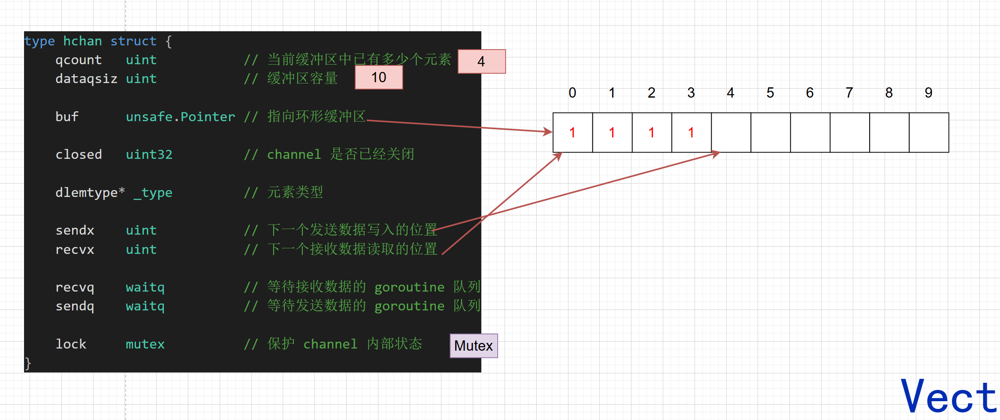
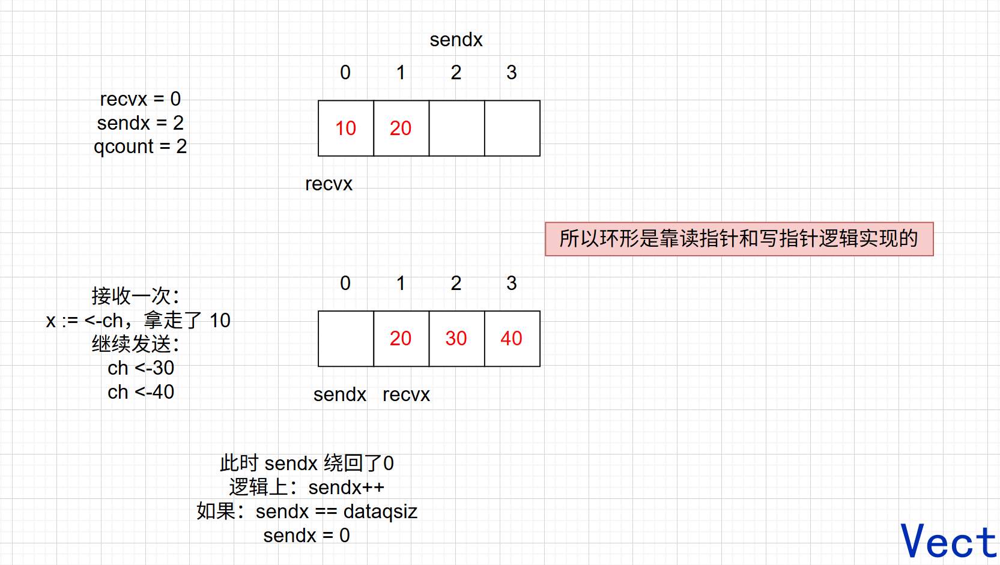

## Channel 是什么

一个通信管道，用于实现 goroutine 之间的通信，Go 的设计思想是**以通信来共享内存**

传统的共享内存：多个 G 围绕同一份数据进行竞争

而 Channel：G1 ---- data ---- G2，数据沿着通信链流动

**并发的核心问题是：谁可以改这份数据？什么时候可以修改？修改的时候别人在做什么？**

所以 Channel 就可以设计成：

```text
Producer
    ↓
 Channel
    ↓
 Worker
    ↓
 Channel
    ↓
 Aggregator
```

每个 goroutine 负责自己的工作，数据沿着 Channel 流动

所以 goroutine 天然适合**生产者消费者、Worker Pool、任务分发、结果收集、事件通知的场景**

但是：**引用计数、共享状态等场景**使用 Mutex 更合理


## Channel 的数据结构

这是 Channel 的基本结构定义：

```go
type hchan struct {
    qcount   uint           // 当前缓冲区中已有多少个元素
    dataqsiz uint           // 缓冲区容量

    buf      unsafe.Pointer // 指向环形缓冲区的指针

    closed   uint32         // Channel 是否已经关闭
    
    elemtype *_type 		// 元素类型

    sendx    uint           // 下一个发送数据写入的位置
    recvx    uint           // 下一个接收数据读取的位置

    recvq    waitq          // 等待接收数据的 goroutine 队列
    sendq    waitq          // 等待发送数据的 goroutine 队列

    lock     mutex          // 保护 Channel 内部状态
}
```



整个 Channel 解决五件事：

- 数据放哪？buf
- 现在有多少数据？qcount / dataqsiz
- 下一次去哪里读写？recvx / sendx
- 条件不满足，goroutine 去哪里等？recvq / sendq
- 多个 goroutine 同时操作怎么办？lock

这就是 hchan 的核心设计

**明明看着像一个数组，怎么实现环形？**

> 假设容量为 4：
>
> 


## Channel 的操作

### 初始化

通过 `make` 函数来初始化一个 Channel，例如：

```go
ch := make(chan int, 3)
```

编译后会进入：

```go
func makechan(t *chantype, size int) *hchan {
    // 元素类型
	elem := t.Elem

	mem, overflow := math.MulUintptr(elem.Size_, uintptr(size))
    
	var c *hchan
	switch {
	case mem == 0:
		// Channel 缓冲 or 元素个数为 0，只用分配一个 hchan
		c = (*hchan)(mallocgc(hchanSize, nil, true))
		c.buf = c.raceaddr()
	case !elem.Pointers():
		// Channel 元素不包含指针，hcahn 和 buf 一起分配
		c = (*hchan)(mallocgc(hchanSize+mem, nil, true))
		c.buf = add(unsafe.Pointer(c), hchanSize)
	default:
		// Channel 包含指针，hcahn 和 buf 分开分配
		c = new(hchan)
        // 因为申请的 span 分为 scan 和 noscan，所以无法一起分配
		c.buf = mallocgc(mem, elem, true)
	}
	// Channel 的一些初始化
	c.elemsize = uint16(elem.Size_)
	c.elemtype = elem
	c.dataqsiz = uint(size)
	lockInit(&c.lock, lockRankHchan)
	return c
}
```

`makechan`函数的两个参数分别代表：要创建的 Channel 元素类型，第二个参数代表环形缓冲区的容量大小

Channel 开辟内存分为三种情况：

- **Channel 无缓冲 or 元素个数为 0：只分配 hchan 本身结构体大小的内存**
- **有缓冲区 buf，但元素不包含指针：hchan 和 buf 一起分配**
- **有缓冲区 buf，且元素包含指针类型，hchan 和 buf 分开分配**


## Channel 写入

```go
ch := make(chan int)
ch<- 1
```

编译最终会走 `chansend` 函数，源码压缩了很多：

```go
func chansend(c *hchan, ep unsafe.Pointer, block bool, callerpc uintptr) bool {

    // 1. nil Channel
    if c == nil {
        gopark(...)
    }

    lock(&c.lock)

    // 2. Channel 关闭
    if c.closed != 0 {
        unlock(&c.lock)
        panic("send on closed Channel")
    }

    // 3. 有 receiver 在等
    if sg := c.recvq.dequeue(); sg != nil {
        send(c, sg, ep, ...)
        return true
    }

    // 4. 没有 receiver，缓冲区还有空间
    if c.qcount < c.dataqsiz {
        qp := chanbuf(c, c.sendx)

        typedmemmove(c.elemtype, qp, ep)

        c.sendx++
        if c.sendx == c.dataqsiz {
            c.sendx = 0
        }

        c.qcount++

        unlock(&c.lock)
        return true
    }

    // 5. 没有 receiver，缓冲区已满
    gp := getg()
    mysg := acquireSudog()

    mysg.g = gp
    mysg.elem.set(ep)

    c.sendq.enqueue(mysg)

    gopark(...)
}
```


### case1：写入 nil Channel

```go
var ch chan int
ch<- 20
```

此时 `c == nil`，源码展开：

```go
if c == nil {
    gopark(
        nil,
        nil,
        waitReasonChanSendNilChan,
        traceBlockForever,
        2,
    )
}
```

**向 nil Channel 写入，会永久阻塞当前 goroutine**

不 panic 的原因是：有一种非阻塞操作：select + default

如果当前 goroutine 是 main goroutine的话，整个程序会退出

### case2：Channel 关闭了，还想写

```go
lock(&c.lock)

// 2. Channel 关闭
if c.closed != 0 {
    unlock(&c.lock)
    panic("send on closed Channel")
}
```

Channel 已经被关闭，再向 Channel 中写数据，会 panic


### case3：有读 goroutine 在等待

```go
func chansend(c *hchan, ep unsafe.Pointer, block bool, callerpc uintptr) bool {
	// ...

    lock(&c.lock)

    // 3. 尝试从读等待队列中取出一个 goroutine
    if sg := c.recvq.dequeue(); sg != nil {
        // 队列中有 goroutine，直接把数据交给对应 goroutine
        send(c, sg, ep, func() {unlock(&c.lock)}, 3)
        return true
    }
	
    // ...
}
func send(c *hchan, sg *sudog, ep unsafe.Pointer, unlockf func(), skip int) {
	// 将 ep 复制到 sg 对应的 elem 上
	if sg.elem.get() != nil {
		sendDirect(c.elemtype, sg, ep)
		sg.elem.set(nil)
	}
	gp := sg.g
    // 写操作结束，释放锁
	unlockf()
	gp.param = unsafe.Pointer(sg)
	sg.success = true
	if sg.releasetime != 0 {
		sg.releasetime = cputicks()
	}
    // 唤醒 goroutine
	goready(gp, skip+1)
}
```

具体步骤是：

- 先拿锁
- 从 recvq（读等待队列中）里弹出队头的 sudog，进入 send 流程
- 将要写入的数据拷贝到整个 sudog 对应的 elem 数据容器上
- 释放锁
- 唤醒 sudog 绑定的 goroutine -> 将这个 goroutine 重新放回 GMP 模型中，等待调度


### case4：没有读 goroutine 在等待，且缓冲区有剩余空间

```go
func chansend(c *hchan, ep unsafe.Pointer, block bool, callerpc uintptr) bool {
    // 加锁
    lock(&c.lock)
    // 4. 没有 receiver，缓冲区还有空间
    if c.qcount < c.dataqsiz {
        // 通过 sendx 找到写入位置地址
        qp := chanbuf(c, c.sendx)
		// 将 ep 中的数据写入到 qp
        typedmemmove(c.elemtype, qp, ep)
		
        c.sendx++
        // 如果这种情况，说明缓冲区写满了，把 sendx 置零
        if c.sendx == c.dataqsiz {
            c.sendx = 0
        }
		// 元素数量加一
        c.qcount++

        unlock(&c.lock)
        return true
    }
	// ...
}
```

- 先拿锁
- 将数据写入到 sendx 指向的位置
- sendx++，qcount++
- 释放锁


### case5：没有读 goroutine 在等待，且缓冲区已满

```go
func chansend(c *hchan, ep unsafe.Pointer, block bool, callerpc uintptr) bool {
	// ...
    // 加锁
    lock(&c.lock)
    
	gp := getg()
	// 取出一个 sudog 结构
    mysg := acquireSudog()
    // 将 ep 存到 elem中
	mysg.elem.set(ep)
	// 绑定 goroutine
	mysg.g = gp
	// 绑定 Channel
	mysg.c.set(c)
	// 进入写等待队列
	c.sendq.enqueue(mysg)
	// gopark 操作
    // chanparkcommit 释放锁
	gopark(chanparkcommit, unsafe.Pointer(&c.lock), reason, traceBlockChanSend, 2)
	
    // 处理状态
	gp.waiting = nil
	gp.activeStackChans = false
	closed := !mysg.success
	gp.param = nil
    mysg.c = nil
	
    // 回收 sudog
	releaseSudog(mysg)

	return true
}
```

- 获取锁
- 获取一个 sudog 结构绑定对应 Channel、goroutine、ep 指针
- 将 sudog 放入 Channel 的写等待队列 sendq
- gopark 操作：释放锁，挂起当前 goroutine，M 调度其它 G，当前 G 等待下一轮调度


## Channel 读取

```go
ch := make(chan, int)
v := <-ch			// 直接读
v,ok := <-ch		// ok 判断读取的 v 是否有效
```

底层调用了 `chanrecv` 函数

```go
func chanrecv(c *hchan, ep unsafe.Pointer, block bool) (selected, received bool) {
	// c：对应的 hchan 指针
    // ep：接收变量的地址，例如：v := <-ch，ep 就指向 v
    // block：无法立即接收时，是否允许阻塞
    
    // 返回值：
	// selected=true, received=true  ：成功收到数据
	// selected=true, received=false ：Channel 已关闭且无数据，返回零值
	// selected=false                ：非阻塞接收无法立即完成
    
    // ==================== 1. nil Channel ====================
	if c == nil {
        // 非阻塞接收：直接失败
		if !block {
			return
		}
        // 阻塞接收 nil Channel，永久挂起
		gopark(nil, nil, waitReasonChanReceiveNilChan, traceBlockForever, 2)
		throw("unreachable")
	}

    // ==================== 2. 非阻塞快速路径 ====================
	// 如果是非阻塞接收，并且当前 Channel 为空，
	// 尽量不加锁直接判断能否返回。
	if !block && empty(c) {
        // Channel 还没关闭，并且当前又没有数据：
		// 非阻塞接收直接失败。
		if atomic.Load(&c.closed) == 0 {
			return
		}
        // Channel 已关闭，再确认一次 Channel 仍然为空。
		if empty(c) {
			// closed + empty：
			// 接收变量被设置成元素类型零值。
			if ep != nil {
				typedmemclr(c.elemtype, ep)
			}
            // selected=true：接收操作完成
			// received=false：没有真正收到发送的数据
			return true, false
		}
	}

    // ==================== 3. 进入正常接收流程 ====================
	// 后面需要操作 qcount、sendq、recvx 等共享状态，
	// 因此获取 Channel 锁。
	lock(&c.lock)
    
	// ==================== 4. Channel 已关闭 ====================
	if c.closed != 0 {
        // 已关闭，并且 buffer 已经没有数据。
		if c.qcount == 0 {
			if raceenabled {
				raceacquire(c.raceaddr())
			}
            
			unlock(&c.lock)
            
            // 返回元素类型零值。
			if ep != nil {
				typedmemclr(c.elemtype, ep)
			}
            
            // 对应：
			//
			// v, ok := <-ch
			//
			// v  = 零值
			// ok = false
			return true, false
		}
        // 注意：
		// closed != 0 但 qcount > 0 时不能直接返回。
		// Channel 虽然关闭了，但 buffer 中剩余的数据仍然需要继续读取。
	} else {
        // ==================== 5. 有 Sender 正在等待 ====================
		//
		// Channel 没关闭时，优先检查 sendq。
		//
		// 如果存在等待 Sender：
		//   无缓冲 Channel → Sender 和 Receiver 直接交接数据
		//   有缓冲且已满 → Receiver 取 buffer 队头，
		//                   Sender 的数据补入 buffer 队尾
		if sg := c.sendq.dequeue(); sg != nil {
            
            // recv 内部完成：
			// 1. 数据传递
			// 2. 唤醒等待 Sender
			// 3. 调用回调释放 c.lock
			recv(c, sg, ep, func() { unlock(&c.lock) }, 3)
			return true, true
		}
	}
	// ==================== 6. buffer 中有数据 ====================
	if c.qcount > 0 {
        // recvx 指向当前最老的数据，即下一次应该读取的位置。
		qp := chanbuf(c, c.recvx)
		// buf[recvx] → 接收变量 ep
		if ep != nil {
			typedmemmove(c.elemtype, ep, qp)
		}
        // 清空已经消费的 buffer slot。
		typedmemclr(c.elemtype, qp)
		c.recvx++
        // 到达 buffer 末尾后回到开头：
		// Channel buffer 是环形队列。
		if c.recvx == c.dataqsiz {
			c.recvx = 0
		}
        // buffer 中元素数量 -1。
		c.qcount--
		unlock(&c.lock)
		return true, true
	}
    
	// ==================== 7. 无数据 + 非阻塞接收 ====================
	if !block {
		unlock(&c.lock)
        // 当前没有数据可以接收，但调用方又不允许阻塞。
		return false, false
	}

	// ==================== 8. 无 Sender + buffer 为空 ====================
	//
	// 到这里说明：
	//
	// sendq 没有等待 Sender
	// +
	// buffer 没有数据
	// +
	// 当前是阻塞接收
	//
	// 所以 Receiver 自己必须进入 recvq 等待。

	// 获取当前 goroutine。
	gp := getg()
    // 获取一个 sudog，用于描述：
	// “当前 G 正在这个 Channel 上等待接收”。
	mysg := acquireSudog()
	mysg.releasetime = 0
    // ep 是未来 Sender 要把数据写入的位置。
	mysg.elem.set(ep)
	mysg.waitlink = nil
    // 当前 G 记录自己的等待 sudog。
	gp.waiting = mysg
	// sudog 绑定当前 G。
	mysg.g = gp
	mysg.isSelect = false
    // sudog 绑定当前 Channel。
	mysg.c.set(c)
	gp.param = nil
    
    // ==================== 9. Receiver 加入 recvq ====================
	c.recvq.enqueue(mysg)
    
	// 此时关系大致是：
	//
	// hchan.recvq
	//      ↓
	//    sudog
	//    /    \
	//   G     ep
	//
	// 表示：
	// 当前 G 正在等待有人向这个 Channel 发送数据。
	
    // ==================== 10. park 当前 G ====================
	gp.parkingOnChan.Store(true)
	reason := waitReasonChanReceive
    // 这里非常关键：
	//
	// chanparkcommit 会在 park 提交过程中释放 c.lock，
	// 然后当前 G 进入 waiting 状态。
	//
	// M 不需要陪着这个 G 等，可以继续执行其他 runnable G。
	gopark(chanparkcommit, unsafe.Pointer(&c.lock), reason, traceBlockChanRecv, 2)
	
    // ==================== 11. 被 Sender 唤醒后继续执行 ====================
	//
	// 能执行到这里说明：
	// 当前 G 已经被其他 goroutine 唤醒，
	// 并重新获得了运行机会。
	gp.waiting = nil
	gp.activeStackChans = false
	
    // success 表示这次唤醒是否真的成功收到了数据。
	//
	// true：
	//   Sender 完成了数据发送
	//
	// false：
	//   Channel 被关闭，Receiver 因 close 被唤醒
	success := mysg.success
	gp.param = nil
    // sudog 不再绑定这个 Channel。
	mysg.c.set(nil)
    // sudog 使用结束，回收。
	releaseSudog(mysg)
	return true, success
}
```

### case1：读取 nil Channel

当前 goroutine **永久阻塞**。

### case2：Channel 已关闭，并且 buf 里没有元素

**立即返回元素类型零值**；如果使用 `v, ok := <-ch`，则 `ok = false`。不会 panic。

### case3：Channel 中有写等待 goroutine

从 `sendq` 取出一个等待 Sender，完成数据接收，并**唤醒对应 Sender goroutine**。

### case4：Channel 中没有写等待 goroutine，且缓冲区有剩余元素

直接从 `buf` 中读取一个元素，`recvx` 后移，`qcount--`。

### case5：Channel 中没有写等待 goroutine，且缓冲区为空

当前 Receiver 被加入 `recvq`，随后 **gopark 挂起**；等之后有 Sender 写入或 Channel 被关闭时再被唤醒。


## Channel 关闭

Channel关闭非常简单，封装了`close`：

```go
ch := make(chan, int)
close(ch)
```

底层调用了 `closechan` 函数：

```go
func closechan(c *hchan) {
	// 1. close(nil Channel) -> panic
	if c == nil {
		panic(plainError("close of nil Channel"))
	}

	// 2. 获取 Channel 锁
	lock(&c.lock)

	// 3. 重复 close -> panic
	if c.closed != 0 {
		unlock(&c.lock)
		panic(plainError("close of closed Channel"))
	}

	// 4. 标记 Channel 已关闭
	c.closed = 1

	var glist gList

	// 5. 释放所有等待接收的 goroutine
	for {
		sg := c.recvq.dequeue()
		if sg == nil {
			break
		}

		// Receiver 没有收到正常发送的数据
		if sg.elem.get() != nil {
			typedmemclr(c.elemtype, sg.elem.get())
			sg.elem.set(nil)
		}

		gp := sg.g
		gp.param = unsafe.Pointer(sg)
		sg.success = false

		// 将 sudog 对应的 G 放入 glist
		glist.push(gp)
	}

	// 6. 释放所有等待发送的 goroutine
	//    这些 Sender 被唤醒后会 panic
	for {
		sg := c.sendq.dequeue()
		if sg == nil {
			break
		}

		sg.elem.set(nil)

		gp := sg.g
		gp.param = unsafe.Pointer(sg)
		sg.success = false

		// 将 sudog 对应的 G 放入 glist
		glist.push(gp)
	}

	// 7. 先释放 Channel 锁
	unlock(&c.lock)

	// 8. 再统一唤醒所有等待的 G
	for !glist.empty() {
		gp := glist.pop()
		gp.schedlink = 0
		goready(gp, 3)
	}
}

```

具体步骤为：

- 对一个 nil Channel 执行 close 操作，会 panic
- 加锁
- 如果重复 close Channel，会 panic
- c.closed 设为 1：关闭 Channel
- 将 sendq 和 recvq 里所有的等待者加入到 glist 中
- 唤醒 glist 中所有等待着（唤醒 sudog 对应的 goroutine）


## select

select：一个 goroutine 可以服务多个 Channel 的读写操作

select 分为两种：非阻塞型（包含 default 分支）、阻塞型（不包含 default 分支）

阻塞型：

```go 
package main

func main() {
    ch := make(chan int)
    
    select {
        case <-ch:
        
        case <- 1:
    }
}
```

非阻塞型：

```go
package main

func main() {
    ch := make(chan int)
    select {
        case <-ch1:
        
        case <-ch2:
        
        default:
        
    }
}
```

select 的核心原理是：

按照随机的顺序执行 case，直到某个 case 完成操作，如果所有 case 都没有完成操作（**不是其它 case 出问题就执行**）则看有没有 default 分支，如果有 default 分支，直接走 default，防止阻塞。

如果没有 default 分支，需要将当前 goroutine 加入到所有 case 对应 Channel 的等待队中，并挂起当前 goroutine，等待唤醒

如果当前 goroutine 被某个 case 上的 Channel 操作唤醒后，还需要将当前 goroutine 从所有 case 对应 Channel 的等待队列中剔除


## 全文总结

Channel 的核心可以归结为一句话：

> **看清数据流向：谁发送、谁接收、数据现在在哪、谁在等待。**

底层 `hchan` 主要维护三类东西：`buf` 保存数据，`sendq / recvq` 保存等待中的 goroutine，`lock` 保护内部状态；`sendx / recvx` 则负责环形缓冲区中的读写位置。

发送时：

```text
有 Receiver 等待
→ 直接完成数据交接

否则 buffer 有空间
→ 写入 buffer

否则
→ Sender 进入 sendq，gopark 挂起
```

接收时正好相反：

```text
有 Sender 等待
→ 完成数据交接

否则 buffer 有数据
→ 从 buffer 读取

否则
→ Receiver 进入 recvq，gopark 挂起
```

因此看到关于 Channel 的代码，先判断 Channel 状态：

| 状态     | 读                             | 写                       | close |
| -------- | ------------------------------ | ------------------------ | ----- |
| `nil`    | 永久阻塞                       | 永久阻塞                 | panic |
| 正常     | 根据等待者和 buffer 判断       | 根据等待者和 buffer 判断 | 正常  |
| `closed` | 继续读剩余数据，耗尽后返回零值 | panic                    | panic |

关闭 Channel 时，会标记 `closed`，并唤醒 `recvq` 和 `sendq` 中等待的 goroutine；Receiver 最终得到零值，Sender 被唤醒后发送失败并 panic。

`select` 则是在多个 Channel 操作之间做选择：

```text
一个 case ready
→ 执行它

多个 case ready
→ 随机选择一个

全部不 ready + 有 default
→ 执行 default

全部不 ready + 无 default
→ 当前 goroutine 阻塞
```

注意：**`default` 不是异常处理分支，而是所有通信 case 当前都无法立即执行时才会进入。**

最终可以用这一套顺序快速判断所有 Channel 问题：

> **先看 `nil / normal / closed` → 再看 send / recv → 再看对端是否等待、buffer 是否为空或已满 → 最后如果有 `select`，判断哪些 case ready。**

这就是 Channel 最核心的模型。

