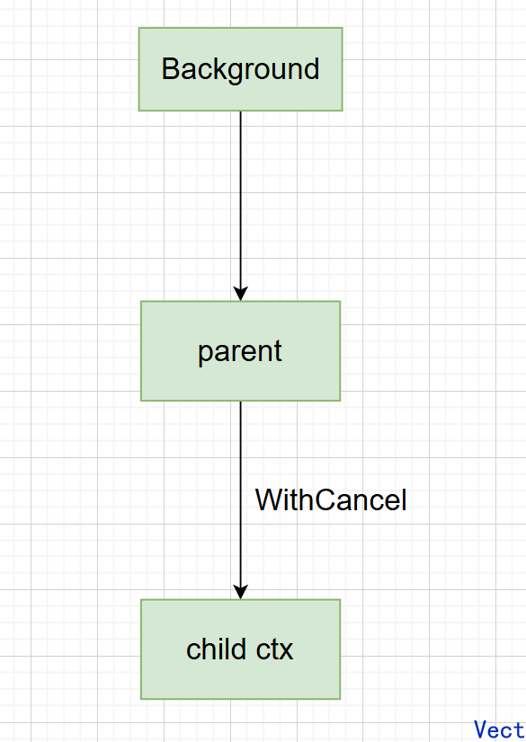
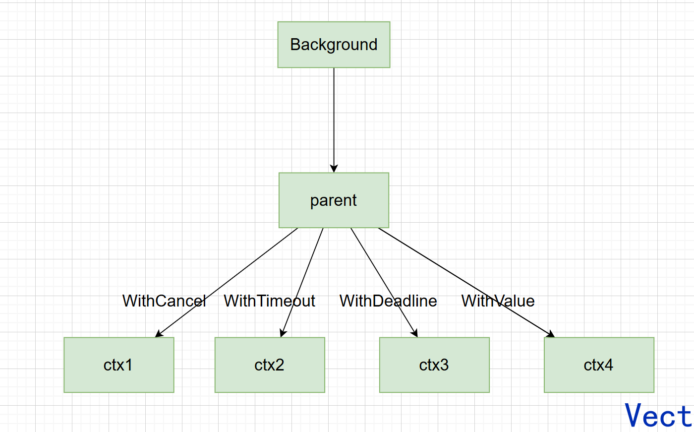

## Context 是什么

> Package context defines the Context type, which carries deadlines, cancellation signals, and other request-scoped values across API boundaries and between processes.

https://pkg.go.dev/context

翻译一下：

> **Context 是一个在调用链中传递的对象，用来携带截止时间、取消信号，以及请求级数据。**

注意：一定是在一个**调用链**中传递，假设一个 HTTP 请求进来：

```text
客户端 -> Handler 层 -> Service 层 -> MySQL
		   				          -> Redis
								  ....
```

这些操作都是属于**同一个请求产生的工作**，那么假设客户端取消了请求或者这个请求最多存活 3s，那么下层的 MySQL Redis 可能都到达不了，对应的 goroutine 就没有执行的意义了

所以希望存在**一个对象带着业务信号一路向下传递**，告诉整个调用链：

- 这个任务还有效吗？
- 有没有被取消？
- 什么时候超时？
- 有没有请求级元数据？

## Context 如何被创建

`Context`是一个 interface：

```go
type Context interface {
    Deadline() (deadline time.Time,ok bool)			// 被取消的时间
	Done() <-chan struct{}							// 当Context被取消或者超时，这个channel会被关闭，表示Context链路结束
    Err() error										// 返回Context结束的原因
    Value(key interface{}) interface{}				// 从Context中获取键对应的值
}
```

### 根 Context 的创建

```go
ctx := context.Background()
```

`Background()` 返回一个非 nil 的空 Context，它不会被取消、没有 value，也没有 deadline，通常用于 `main`、初始化、测试，以及作为请求 Context 的顶层 Context。

可以简单理解成：

```text
context.Background()
        ↓
    根 Context
```

还有一个函数同样返回一个非 nil 的空 Context

```go
context.TODO()
```

二者主要区别是：

- Background()：我明确知道这里需要一个根 Context
- TODO()：我知道这个应该传 Context，但是暂时没有确定应该传哪个


### Context 的派生

主要靠这几个函数进行派生：

```go
context.WithCancel(parent)
context.WithTimeout(parent, timeout)
context.WithDeadline(parent, deadline)
context.WithValue(parent, key, value)
```

他们会**基于已有 Context 派生新的 Context**

例如：

```go
parent := context.Background()

ctx, cancel := context.WithCancel(parent)
```



之后慢慢形成树状结构：



**Context 是从 parent 不断派生 child，并且取消可以从 parent 向 child 传播**


### 四种创建方式分别解决什么问题

**WithCancel**

```go
ctx, cancel := context.WithCancel(parent)
```

只需要传递一个Context作为参数，就能得到基于这个Context衍生出一个新的`ctx`和取消函数`cancel`

之后`ctx`在整个调用链中传递，一旦执行了取消函数`cancel`，会从根 Context 到子 Context 取消

```go
func worker(ctx context.Context) {
	for {
		select {
		case <-ctx.Done():
			fmt.Println("worker exit")
			return
		default:
			fmt.Println("working...")
			time.Sleep(time.Second)
		}
	}
}

func main() {
	ctx, cancel := context.WithCancel(context.Background())
	go worker(ctx)
	time.Sleep(3 * time.Second)
	cancel()
	time.Sleep(time.Second)
}
```


**WithTimeout**

```go
ctx, cancel := context.WithTimeout(parent, 3*time.Second)
defer cancel()
```

表示这个创建的`ctx`最多存活 3s


**WithDeadline**

```go
ctx, cancel := context.WithDeadline(parent, deadline)
```

表示这个`ctx`**最晚运行到某个时间节点**

二者的区别是：

- Timeout 传的是一个时间区间，几秒
- Deadline 传的是一个时间节点，具体时刻

**WithValue**

```go
ctx := context.WithValue(parent, key, value)
```

给调用链增加一个请求级 value -> 用于**跨 API / 进程传递的请求级 value**，比如请求的唯一 id


## Context 如何使用

官方推荐的函数形式是：

```go
func DoSomething(ctx context.Context, arg Arg) error
```

Context 作为**第一个参数**显式传递，并且不要把 Context 存进结构体（因为结构体是一个长期存活的对象，而 context 描述一次请求/一次任务的生命周期，二者性质不一样），也不要传 nil Context

举个例子：

```go
func Handler(ctx context.Context) {
    Service(ctx)
}

func Service(ctx context.Context) {
    Repository(ctx)
}

func Repository(ctx context.Context) {
    // DB ...
}
```

整条链路是：ctx -> Handler -> Service -> Repository -> DB


问题又来了：**下游如何知道 Context 被取消了？**

核心就是：`ctx.Done()`

看这个形式：`Done() <-chan struct{}`，返回一个**只读channel，当 Context 应该取消的时候，这个 channel 会被关闭**

```go
// 我同时等：任务正常完成 or context 被取消
// 如果：
// 任务先完成，正常处理
// ctx.Done() 先发生，停止工作
select {
case <-ctx.Done():
    return ctx.Err()

case result := <-resultCh:
    // 正常处理
}
```

需要注意：

> CancelFunc tells an operation to abandon its work. A CancelFunc does not wait for the work to stop.
>
> **Context 不会直接杀死 goroutine，而是提供了一种协作式取消的机制**


## Context 的使用场景

- 用于在 goroutine 之间传递上下文信息，比如请求传递的 trace_id，便于追踪全局唯一请求，确定在哪个模块出错了
- 可以做取消控制，通过取消信号和超时时间来控制 goroutine 的退出


## Context 的核心结构

重复一遍：

```go
type Context interface {
    Deadline() (deadline time.Time, ok bool)
    Done() <-chan struct{}
    Err() error
    Value(key any) any
}
```

四个方法对应四个功能：

| 方法         | 回答的问题                   |
| ------------ | ---------------------------- |
| `Deadline()` | 这个任务最晚什么时候结束？   |
| `Done()`     | 这个任务是不是该停止了？     |
| `Err()`      | 为什么停止？                 |
| `Value()`    | 这个请求携带什么请求级数据？ |

再往下一层，谁来实现这个 interface？

- **`emptyCtx`**：提供一个**不可取消、没有 deadline、也不携带 value 的基础 Context**，主要作为 Context 派生链的根。

- **`cancelCtx`**：负责维护 **Context 的取消状态和取消信号，并把父 Context 的取消向子 Context 传播**。

- **`timerCtx`**：在可取消 Context 的基础上增加 **deadline 和定时器，使 Context 到达截止时间后自动取消**。

- **`valueCtx`**：负责保存一个 **key-value，并让请求级数据能够沿 Context 调用链向下传递和查询**。


## 全文总结

- Context 本质是一个在调用链里一路向下传递的对象。一次请求进来之后，Handler、Service、Repository、MySQL、Redis 这些操作其实都属于同一个请求产生的工作，所以它们应该共享同一份“任务状态”。这个状态包括：这个请求还要不要继续执行、有没有被取消、什么时候超时，以及有没有一些请求级的数据，比如 trace_id、request_id。所以 Context 负责“怎么通知整条调用链这个任务是否还有效”。它不会直接杀死 goroutine，而是通过 `Done()` 这个 channel 发出取消信号。下游代码需要自己监听 `ctx.Done()`，发现 Context 已经取消或者超时之后，就主动退出。

- Context 一般从 `context.Background()` 这个根 Context 开始创建，然后通过 `WithCancel`、`WithTimeout`、`WithDeadline`、`WithValue` 不断派生新的子 Context。派生出来之后，父 Context 的取消会向子 Context 传播，即上层请求结束了，下游相关工作也应该跟着停止。`WithCancel` 解决手动取消，`WithTimeout` 解决最多运行多久，`WithDeadline` 解决最晚运行到哪个时间点，`WithValue` 则是用来传递请求级元数据。
- Context 是一个 interface，真正实现它的主要有：
  - `emptyCtx` 作为根 Context，什么都不带；
  - `cancelCtx` 负责取消状态和取消传播
  - `timerCtx` 在取消能力上加了 deadline 和定时器
  - `valueCtx` 用来保存一组 key-value
