## 1. GMP 调度思想

### 1.1 传统多线程问题

多个线程创建、切换使用、销毁开销通常很大：

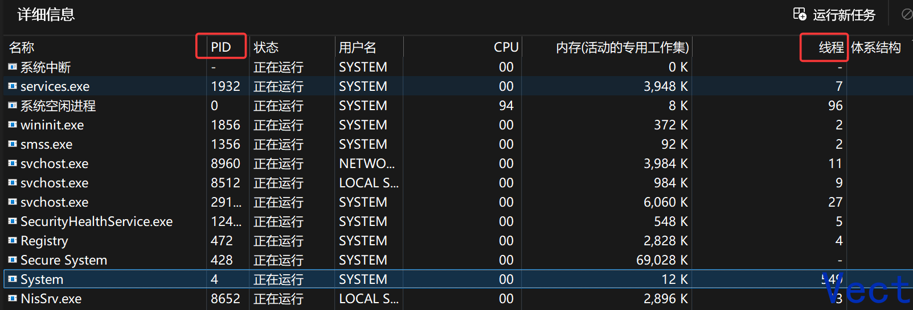

1. 每个 OS 线程都要分配独立的栈，多数 Linux 默认 8MB 大小，**固定分配、不会自动伸缩**。而 goroutine 初始栈只有 2KB，且可以按需扩缩
2. 一个线程执行系统调用不占用 CPU 时，需要让出 CPU，会发生**线程切换**
3. 线程切换时，内核需要保存当前线程的执行上下文，并恢复另一个线程的执行上下文，因此相比 goroutine 的用户态调度通常具有更高的切换成本。

高并发场景下，大量线程创建、切换、销毁会占用大量内存，浪费过多 CPU 时间处理切换工作，这并没有执行具体任务逻辑

### 1.2 GMP 是什么

Go runtime 使用 G、M、P 三类核心调度资源实现 goroutine 调度：G 表示 goroutine，M 表示 OS thread，P 表示执行用户 Go 代码所需的 runtime 资源：

- M：OS 线程在 Go runtime 中的**抽象/运行时表示（m 结构体）**，是 **G 实际执行的线程载体**。一个 M 关联一个 OS 线程，执行 Go 代码时还需要绑定 P。
- G 轻量级用户态协程 goroutine，每个 goroutine 有自己的独立栈存放程序运行状态，初始栈空间 2 KB，可以按需扩缩
- P（Processor）：表示执行 Go 代码所需要的 runtime 资源。P 维护本地可运行 G 队列以及内存分配等相关状态。M 要执行用户 Go 代码必须持有一个 P，因此 M 与 P 结合后才能执行 G

简洁一些：

**G 是要执行的任务、M 是真正执行任务的 OS 线程、P 是执行 Go 代码所需要的资源**

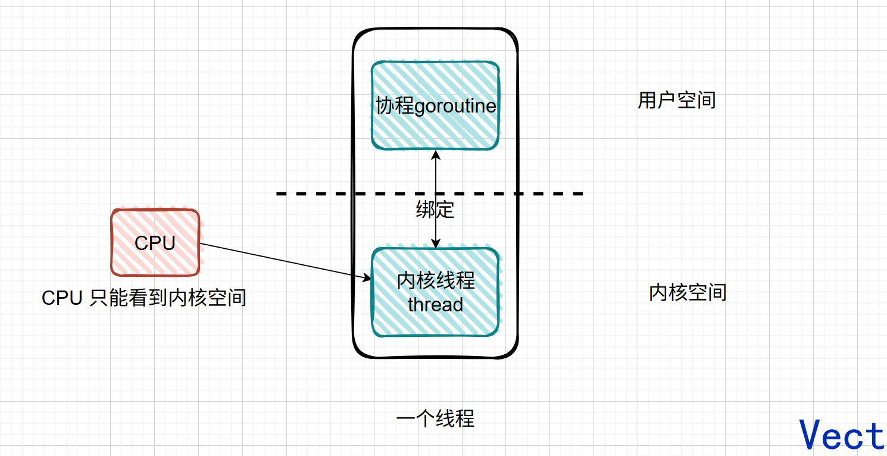

#### N : 1 和 1 : 1 设计

N个协程绑定1个线程，优点就是**协程在用户态线程即完成切换，不会陷入到内核态，这种切换非常的轻量快速**。但也有很大的缺点，1个进程的所有协程都绑定在1个线程上，**无法利用多个 CPU，可能会阻塞**

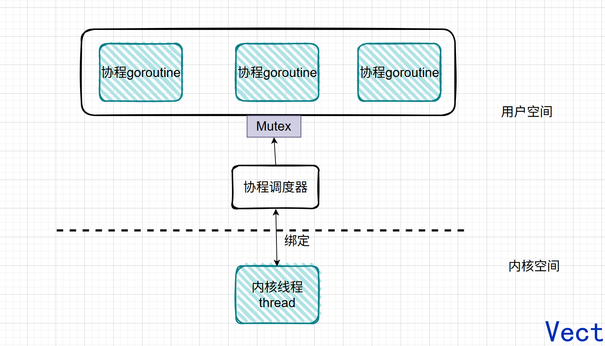

1：1的设计和多线程没有区别，切换代价大

#### M : N 设计

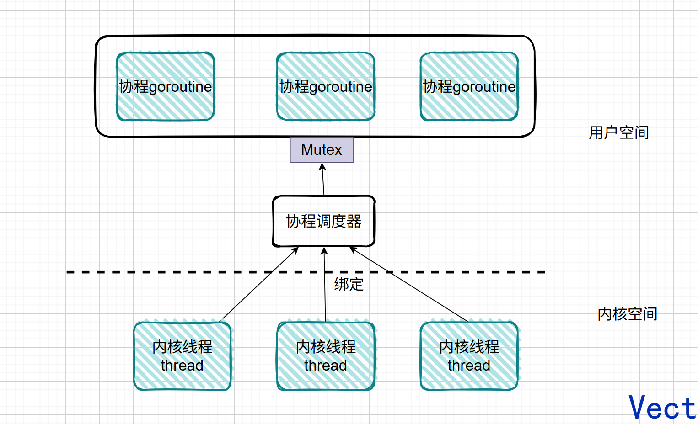

这种设计就依赖协程调度器的性能了

所以，最终的 GMP 模型图长这样：

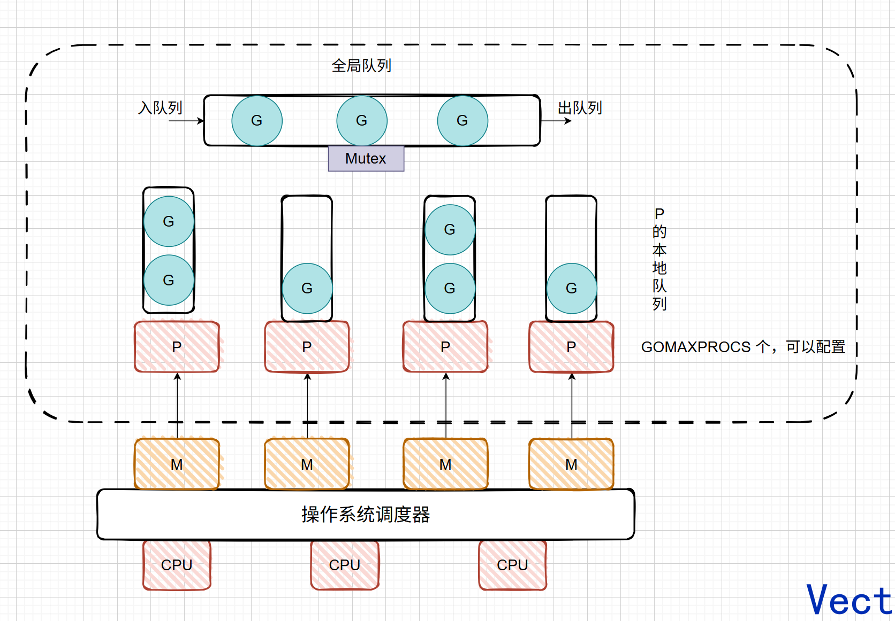

可运行的 G 通过 P 和线程 M 绑定起来，M 的执行由操作系统调度器将 M 分配到 CPU 上实现，Go 运行时调度器负责调度 G 到 M 上执行，主要是在用户态执行，和操作系统调度器在内核态运行相对应

- **全局队列：**存放等待运行的G
- **P 本地队列：**存放的也是等待运行的G，存的数量有限，不超过256个。新建G'时，G'优先加入到P的本地队列，如果队列满了，则会把本地队列中一半的G移动到全局队列。

GMP 模型的核心设计思想是：

- **尽可能多的复用线程 M 从而避免频繁的线程创建和销毁**
- **利用多核并行的能力：** M 的数量是动态变化的，当已有 M 因系统调用等原因无法继续执行 Go 代码时，runtime 会根据是否存在可运行工作、空闲 P 和空闲 M 等状态，唤醒已有 M 或按需创建新的 M；暂时没有工作的 M 可以休眠等待后续复用。
- **Work Stealing 机制：** M 优先执行绑定的 P 的本地队列中的 G，如果本地队列为空，可以从全局队列中获取 G，也可以从其它 P 队列偷取 G 来运行
- **Hand Off 交接机制：** M 阻塞，会将 M 上 P 的运行队列交给其它 M 执行，可以提升整体并发度


### 1.3 go func() 调度流程

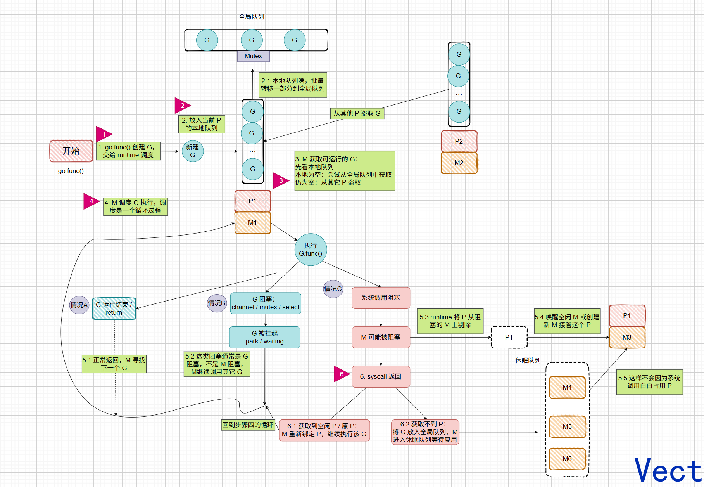

1. 通过 go func() 创建一个 goroutine

2. 有两个存储 G 的队列，一个是局部调度器 P 的本地队列，一个是全局队列。新创建的 G 先保存到 P 的本地队列，如果本地队列满了，再保存到全局

3. G 最终运行在 M 上，M 要执行用户 Go 代码时必须持有 P。运行期间 M 和 P 是临时 1:1 绑定，但 M 和 P 的总数量没有 1:1 关系。M 会从 P 的本地队列弹出一个可执行状态的 G 来执行，如果 P 的本地队列为空，就会向其他的 MP 组合偷取一个可执行的 G 来执行；

4. 一个 M 调度 G 执行的过程是一个循环机制

5. 当 G 发生 channel、sync.Mutex、select 等 Go 层阻塞时，G 被挂起并回到调度循环（M 不阻塞，继续调度其他 G）；唤醒时放回队列

   当 G 进入系统调用阻塞时，M 可能被 OS 阻塞。为了不浪费 P，runtime 把 P 直接交接给其他 M 继续执行可运行的 G。

6. syscall 返回后，原来的 M/G 会尝试重新获取一个可用的 P。

   - 如果拿到 P，就继续执行这个 G；
   - 如果拿不到 P，就把 G 放入全局队列，M 进入休眠，等待后续复用。

## 2. 常见的调度场景

### 2.1 创建 G

正在 M1 上运行的 P，有一个 G1，通过 `go func()` 创建 G2 后，由于局部性原理，G2 优先放到 P 的本地队列

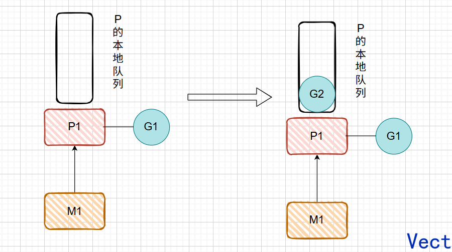

### 2.2 G 运行完成后

M1 上的 G1 运行完成后（调用 `goexit()`），M1 上运行的 goroutine 会切换成 g0，g0 负责调度协程的切换（运行`schedule()`函数），从 M1 上 P 的本地队列获取 G2 去执行（函数`execute()`）

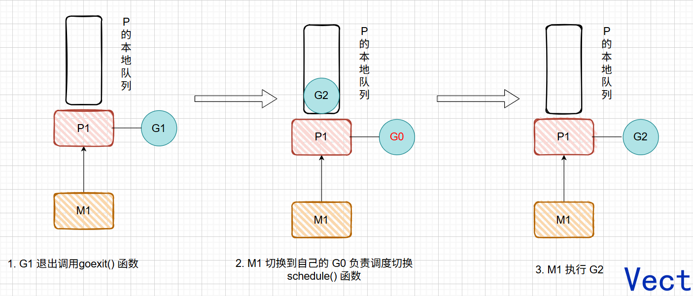


### 2.3 G2 创建的 G 个数多于 P 本地队列能存放的 G 个数

假设 P 本地队列最多能存 4 个（**真实最多256个**），正在 M1 上运行的 G2 要通过 `go func()`创建 6 个 G，前四个会放到本地队列，创建的第五个 G（G7）时，会把本地队列中前一半 G 连同 G7 一起放入全局队列，P 本地队列剩下的 G 往前移动，G2 创建的第 6 个 G（G8），放入本地队列，因为还有空间

> 细节：`runqputslow` 里对这批 G 的"打乱顺序"只发生在启用 `GOEXPERIMENT=randomizescheduler` 时；**默认配置下是按序整体搬移**，不随机。

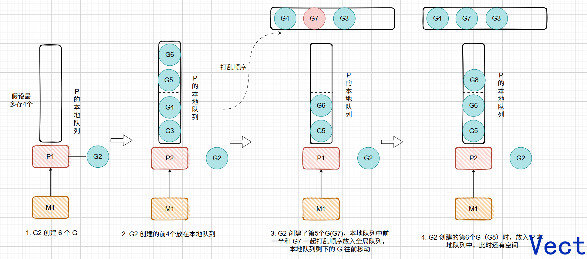

### 2.4 M 的自旋状态

创建新的 G 时，运行的 G 会尝试唤醒一个休眠的 M 绑定 P 去执行，M2 被唤醒后绑定一个 P2，会先运行 M2 的 g0，然后在 P2 的本地队列里寻找 G：**如果 P2 本地队列为空**，M2 会尝试从**全局队列** 批量取 G 放进本地队列，保证还能给其它 P 留一些 G

```go
// go1.26：n 取三者的最小值
// 调用点传 max = len(pp.runq) / 2（本地队列容量的一半，128 个）
n = min(n, sched.runq.size, sched.runq.size/gomaxprocs+1)
```

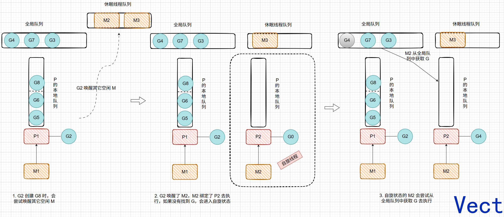


### 2.5 任务窃取机制

自旋状态的 M 会寻找可以运行的 G，如果本地和全局队列都为空，就会从其它 P 的本地队列偷取 G 来执行，数量是其它 P 队列的一半。

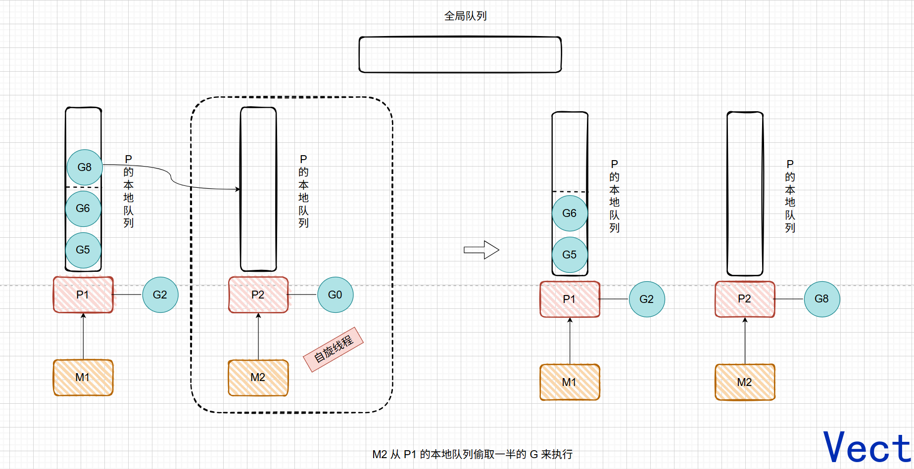

### 2.6 G 发生系统调用时

如果 G 发生系统调用进入阻塞，所在的 M 也会阻塞，需要进入内核态等待系统资源，和 M 绑定的 P 会寻找空闲的 M 执行

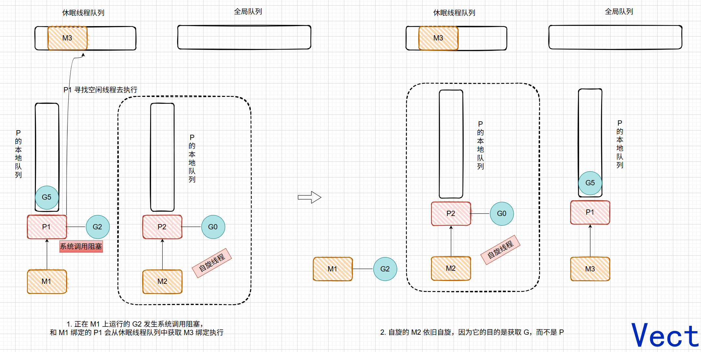


### 2.7 G 退出系统调用

如果刚才进入系统调用的 G2 解除了阻塞，其所在的 M1 会寻找原来的 P 去执行，发现没有找到，那么 G2 就会进入全局队列，等待其它 M 获取执行，M1 进入空间队列

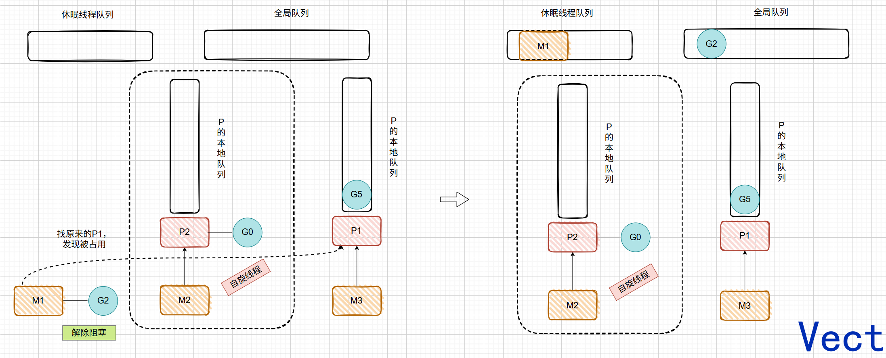


## 3. GMP 的数据结构和各种状态

### 3.1 G：goroutine 源码结构

`g`结构体是 goroutine 的实体

```go
type g struct {
    stack       stack			// goroutine 自己的栈空间，函数调用、返回地址和局部变量都在这里
    // 栈保护边界，检测栈是否需要增长，用于抢占检查
    stackguard0 uintptr			
    stackguard1 uintptr			

    m     *m					// 当前正在执行这个 G 的 M，如果 G 正在运行，m 指向对应 OS 线程
    sched gobuf					// 调度现场，保存寄存器信息，G 被切走后，恢复靠他

    // G 进入 syscall 时保存的栈指针 / 程序计数器
    // syscall 返回后 runtime 要靠这些信息恢复现场
    syscallsp uintptr
    syscallpc uintptr
    syscallbp uintptr

    param        unsafe.Pointer		// 通用参数槽，比如 channel 唤醒阻塞 goroutine 时，会用 param 传递 sudog 等信息
    atomicstatus atomic.Uint32		// G 当前状态

    goid      uint64				// goroutine id
    schedlink guintptr				// G 挂到队列中使用的 next 指针

    waitsince  int64				// G 什么时候开始等待
    waitreason waitReason			// G 阻塞的原因

    preempt       bool				// 是否请求抢占
    preemptStop   bool				// 抢占时是否直接停止
    preemptShrink bool				// 抢占时是否顺便收缩栈
   
 	// ...
}
```

G 的主要字段有：

- stack：描述当前 goroutine 的栈内存范围
- m：记录当前 G 占用的线程 M，可能为空
- defer 和 panic：分别记录这个 G 最内侧的 panic 和 _defer 结构体
- sched：存储 G 的调度相关数据

需要展开 sched 字段的 gobuf 结构体：

```go
type gobuf struct {
    // 栈指针
    sp uintptr

    // 程序计数器，表示下次从哪里继续执行
    pc uintptr

    // 对应的 goroutine
    g guintptr
	
     // 上下文，一般和闭包 / 函数调用有关
    ctxt unsafe.Pointer

    // 返回地址寄存器
    lr uintptr

    // frame pointer
    bp uintptr
}
```

可以把`g.sched`理解成，G 被切走了，需要记住：

- 执行到哪一行了？
- 栈顶在哪里？
- 下次恢复从哪里继续？

`g` 的`atomicstatus`字段存储了当前 G 的状态，核心的六种如下：

- _Gidle：G 被创建但没有完全被初始化
- _Grunnable：当前 G 为可运行的，正在等待被运行
- _Grunning：当前 G 正在被运行
- _Gsyscall：当前 G 正在被系统调用
- _Gwaiting：当前 G 正在因某个原因而等待
- _Gdead：当前 G 执行完成（可复用）

相当于是一个状态机控制了整个 goroutine 的生命周期：

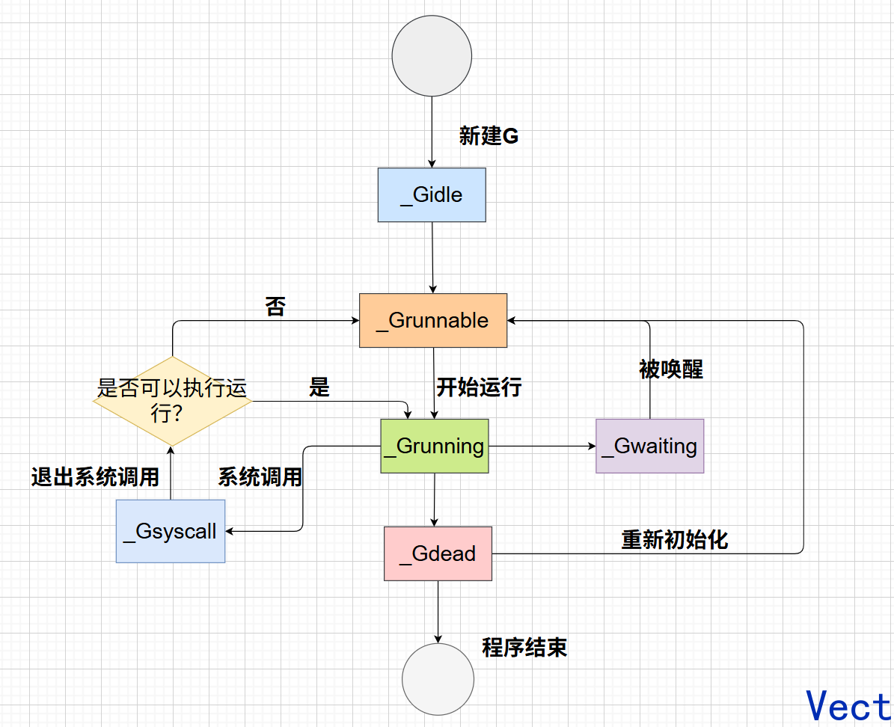


具体有三大类状态：

- 等待中：G 正在等待某些条件满足，例如：系统调用 _Gsyscall，在等待队列中 Gwaiting
- 可运行：G 已经准备就绪，可以在 M 上运行，如果当前程序有很多 G，每个 G 可能会等待更多时间。_Grunnable
- 运行中：G 正在某个 M 上运行。_Grunning


### 3.2 M：真正执行代码的 OS 线程

```go
// src/runtime/runtime2.go

type m struct {
    g0 *g				// 调度专用 goroutine，M 执行 runtime 调度逻辑时，不在用户 G 的栈上跑，而是在 g0 栈上跑
    curg *g				// 当前正在这个 M 上执行的用户 goroutine
    gsignal *g			// 信号处理用的 G

    // 当前 M 绑定的 P，M 想执行 Go 用户代码，必须有 P，如果 p == nil，说明这个 M 当前不能执行 Go 用户代码
    p puintptr
    oldp puintptr		// syscall 前绑定的 P，syscall 返回时，M 会尝试重新拿回这个 P
    nextp puintptr		// 下一个准备绑定的 P

    id int64			// M 的唯一 id
    spinning bool		// 是否处于自旋状态
    lockedg guintptr	// 与当前 M 锁定的那个 G
	// ...
}
```

M 的核心字段有：

- g0：Go 运行时系统在启动之初创建的，用来调度其它 G 到 M 上
- curg：在当前线程上运行的 goroutine 指针
- nextp：下一个准备绑定的 P 
- spinning：是否处于自旋状态
- lockedg：和当前 M 锁定的那个 G 

虽然 M 没有像 G 那样用状态机控制，但也会有以下的状态：

- **自旋中：** M 正在寻找可运行的 G，这时候 M 会拥有一个 P
- **执行go代码中：** M 正在执行 go 代码，这时候 M 会拥有一个 P
- **执行原生代码中：** M 正在执行原生代码或者被阻塞的系统调用，这时候 M 没有 P
- **休眠中：** M 发现没有需要运行的 G 会进入休眠，并添加到空闲 M 链表中，这时候 M 没有 P


### 3.3 P：调度资源，本地队列

```go
type p struct {
    id int32						// P 的编号
    status uint32		    		// P 的状态：_Pidle、_Prunning、_Psyscall_unused、_Pgcstop、_Pdead

    schedtick uint32				// 每次调度递增
    syscalltick uint32			    // 每次系统调用递增

    m muintptr						// 当前绑定的 M，如果 P 空闲，m == nil

    mcache *mcache					// 每个 P 自己的内存分配缓存，这就是为什么 P 不只是“队列”，还是一包运行资源

    // goroutine id 缓存
    // 避免每创建一个 G 都去全局 goidgen 上竞争
    goidcache    uint64
    goidcacheend uint64

    // 本地运行队列，无锁访问，runq 是一个长度 256 的环形队列
    runqhead uint32
    runqtail uint32
    runq     [256]guintptr

    runnext guintptr				// 下一个需要执行的 G

    // 空闲的 G 队列，G 状态为 _Gdead，可以重新初始化使用
    // go1.26：就是 gList（历史版本曾为 struct{ gList; n int32 }）
    gFree gList

    // ...
```

P 结构体中的 status 有五种状态：

- _Pidle：P 没有运行用户代码或者调度器，被空闲队列持有，运行队列为空
- _Prunning：被线程 M 持有，正在执行用户代码或调度器
- _Psyscall：当前线程陷入内核，进行系统调用
- _Pgcstop：被线程 M 持有，当前处理器由于垃圾回收被停止
- _Pdead：当前 P 已经不被使用

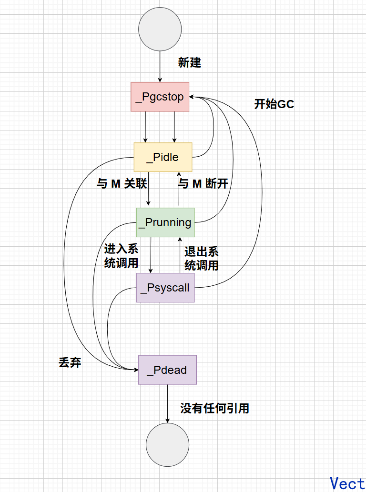

P 的设计目标不是代表 CPU，而是把调度相关的高频状态和资源进行分片。它通过本地队列保存任务，通过本地缓存保存资源，通过减少全局共享访问降低锁竞争，让调度器在高并发 goroutine 场景下仍然保持较高效率。


### 3.4 schedt：全局调度器

```go
type schedt struct {
    lock mutex						// schedt 的锁
    midle  listHeadManual			// 空闲 M 列表
    nmidle int32					// 空闲 M 列表的数量
    mnext int64						// 下一个被创建的 M 的 ID
    maxmcount int32					// M 的最大数量（默认 10000）

    pidle  puintptr					    // 空闲 P 链表		
    nmspinning atomic.Int32			    // 正在自旋找任务的 M 数量

    runq gQueue						    // 全局可运行队列（go1.25 起为 gQueue，size 内嵌，无独立 runqsize 字段）
    // 全局 _Gdead 状态的空闲 G 列表
    // G 退出后可以复用，减少频繁分配
    gFree struct {
        lock    mutex
        stack   gList
        noStack gList
    }

    // sudog 全局缓存
    sudoglock  mutex
    sudogcache *sudog

    // 注：defer 缓存 go1.26 已从 schedt 移除，改由每个 P 持有（p.deferpool）
	// ...
}
```

schedt 是一个总调度室：

- P 本地队列能解决的，尽量本地解决
- 本地解决不了的，再找 schedt
- schedt 负责全局队列、空闲 M、空闲 P、全局缓存、GC 协调的工作

所以说：P 是分布式本地调度，而 schedt 是作为全局兜底


## 4. Go 调度器：从程序启动到 G 被执行

先有个整体的认知：

```text
操作系统启动 Go 程序
        ↓
建立最初的 m0、g0
        ↓
初始化 runtime
        ↓
初始化 P 等调度资源
        ↓
创建 main goroutine
        ↓
m0 进入调度循环
        ↓
找到 main goroutine
        ↓
执行 runtime.main
        ↓
执行 main.main
        ↓
main 中继续创建更多 G
        ↓
G 不断被调度执行
```

**`main()`函数也是一个 goroutine，它是 runtime 帮我创建的第一个普通 goroutine**

注意：**g0 不是 main goroutine，g0 是每个 M 都有的特殊 G，用于执行 runtime 的调度、栈管理的系统工作；main goroutine 是一个普通的 G，回合其它 goroutine 一样被调度执行**

### 4.1 程序启动流程：先建立 runtime，再运行 main()

对于这个简单代码：

```go
func main() {
    fmt.Println("hello")
}
```

Go 程序启动以后，首先进入的是 **runtime 的启动代码**。因为此时连 Go 自己的调度器、内存管理、GC 等运行环境都还没有准备好。

因此 runtime 首先需要建立一个最基本的执行环境，其中最重要的是：**m0 和 g0**

m0 是程序启动时使用的初始 M

g0 是每个 M 都有的特殊 G，用于执行 runtime 的调度、栈管理的系统工作

所以整个流程可以理解为：

```text
创建 m0 + g0
   ↓
runtime 初始化
```


### 4.2 调度器启动流程：搭建 GMP 的骨架

有了 m0 和 g0，还不能执行普通的 Go 代码，M 还需要绑定一个 P，所以 runtime 初始化最重要的工作就是 创建 P

可以把这个流程理解为：

```text
刚启动：m0 —— g0

runtime 初始化：
P0    P1    P2    P3 ...
│
m0
│
g0
```

P 的数量由 `GOMAXPROCS` 控制，没有被 M 使用的 P 可以处于 idle 状态，以后需要再被其它 M 获取

当前的状态：

- G 有了 main goroutine
- M 有了 m0
- P 有了 P0、P1...

GMP 的基本骨架就搭建起来了

接下来 m0 才会进入调度流程，此时 main goroutine 虽然创建了，但是 **创建 G ≠ G 已经执行**，现在的 main goroutine 只是有执行能力，但是没有被执行

所以调度器要找到 main goroutine，之后：

```text
m0 + P0
    ↓
main goroutine
    ↓
runtime.main
    ↓
main.main
```

程序才真正进入 Go 业务代码，整个调度器启动可以归纳为：

**runtime 先建立 M 和 g0，初始化 P 等调度资源，再创建 main G；随后让 m0 持有 P 进入调度循环，由调度器找到 main G 并开始执行。**

### 4.3 一个 G 是如何创建的？

现在程序已经运行起来了，假设 main goroutine 执行了 `go task()`

这里需要注意：**`go task()` 并不是“马上执行 task”，而是创建一个新的可执行的 goroutine，把它交给 runtime 调度。**

整个流程可以归纳为：

```text
当前 G 执行

go task()
    ↓
runtime 创建新的 G
    ↓
准备这个 G 的运行环境，优先复用已有资源
    ↓
状态变成 runnable
    ↓
加入当前 P 的 runnable 工作
    ↓
等待调度
    ↓
某个 M + P 获得这个 G
    ↓
执行 task()
```


### 4.4 调度循环：M 怎么不断执行不同的 G？

现在最后一个问题：

> main G 有了，后来又创建了成千上万个 G，runtime 到底怎么让它们运行？

核心就是**调度循环**，一个 M 持有 P 之后，会不断寻找 runnable G：

```text
M + P
  ↓
寻找 runnable G
  ↓
执行 G
  ↓
G 结束 / 阻塞 / 被调度
  ↓
回到 runtime
  ↓
继续寻找 runnable G
```

不断重复这个循环

而在寻找这个 runnable G 的过程中，会到很多地方：当前 P 的本地队列、全局 G 队列、其它 P 的本地队列

核心是思想是：

- **优先利用本地工作**，避免去竞争全局队列
- **全局队列保证全局工作能够被调度**，某些进入全局队列的 G 也会适时被 runtime 调度，避免长期得不到执行
- **Work Stealing 提高利用率**，如果某个 P 没有 G，而其它 P 还有很多 G，会从其它 P 的本地队列获取 G 来执行

### 4.5 总结一个完整链路

- 程序启动阶段
  - OS 启动程序
  - runtime 启动
  - 创建 m0 和 g0
- 调度器启动
  - 初始化 runtime
  - 创建 P 
  - 创建 main G
  - m0 + P 进入调度循环
  - 执行 main G
- 创建普通 G
  - main / 其它 G `go func()` 意味着创建新的 G
  - 新的 G 成为 runnable 状态
  - 新的 G 进入 P 的本地队列等待执行
    - 若本地队列满，抽取队列中前一半的 G 和新建的 G 一块进入全局队列
- 调度循环
  - M + P 组合寻找 runnable G，可以在本地队列、全局队列、其它 MP 组合的队列中偷
  - 执行 G
  - G 结束、阻塞或者被调度
  - 重新寻找 G
  - 不断循环

一段话总结：

> Go 程序启动后会先进入 runtime，建立初始的 m0 和 g0，并初始化 P 等调度资源。runtime 随后创建 main goroutine，让 m0 持有 P 进入调度循环，最终调度 main G 执行用户的 Go 代码。
>
> 程序执行 `go func()` 时，runtime 会创建一个新的 G，将它置为 runnable，并优先加入当前 P 的本地调度体系等待执行。之后 M 在持有 P 的情况下不断寻找 runnable G，工作来源包括 P 本地队列、全局队列、其他 P 的本地队列，找到 G 就执行，G 结束、阻塞或被调度后再回到调度循环继续寻找工作。
