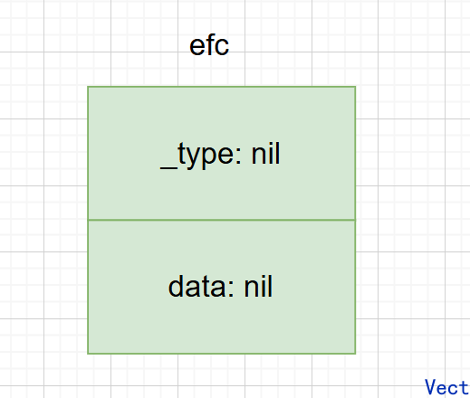
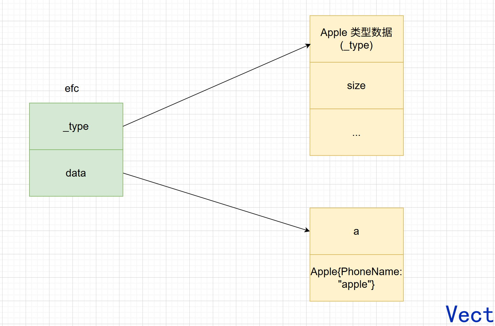

## method 和 interface 的使用

现在用一个**订单支付**的业务场景来理解，假设后端支持两种支付方式：支付宝和微信

用最朴素的写法，定义两个 struct：

```go
type Alipay struct{}
type WeChatPay struct{}
```

分别写支付函数：

```go
func payByAlipay(a Alipay, amount int) {
    // ...
}

fun payByWeChat(w WeChat, amount int) {
    // ...
}
```

这就存在一个问题：**支付行为和对象分开了**，而 method 就是解决这个问题的

### method：让行为属于某个类型

把代码改成：

```go
type Alipay struct{}

func (a Alipay) Pay(amount int) {
    // ...
}
```

这里的 `func (a Alipay) Pay(amount int)` 和普通函数最大的区别是多了：`(a Alipay)`，**receiver**

可以理解成：**Pay 是绑定在 Alipay 类型上的函数**

可以理解成 C++ 的代码：

```cpp
class Alipay {
public:
    void Pay(int amount);
}
```

Go 并没有实现 class，而是采用：

- struct 保存数据
- method 描述这个类型能做什么

例如：

```go
type Account struct {
    Balance int
}

func (a *Account) Pay(amount int) {
    a.Balance -= amount
}
```

所以，**struct 描述“它有什么数据”，method 描述“它能做什么”。**

又有一个问题，现在有了支付宝：

```go
type Alipay struct{}

func (Alipay) Pay(amount int) {
    // ...
}
```

有了微信：

```go
type Alipay struct{}

func (Alipay) Pay(amount int) {
    // ...
}
```

订单要发起支付操作，难道要用 if-else 连接吗？

```go
func Checkout(payType string, amount int) {
    if payType == "alipay" {
        Alipay{}.Pay(amount)
    } else if payType == "wechat" {
        WeChatPay{}.Pay(amount)
    }
}
```

之后加一种支付方式，就要加一个 else if，业务代码会越来越依赖具体支付实现

所以引入了 interface

### interface：调用者只关心“你会不会做这件事，不关心你是谁”

订单系统其实并不关心你是支付宝？微信？银行卡？它真正关心的是：**你有没有Pay的能力？**

所以 interface 定义为：

```go
type Payment interface {
    Pay(amount int)
}
```

意思是：**任何拥有 `Pay(int)` 方法的类型，都可以被我当成 Payment 使用**

那么就可以定义：

```go
func Checkout(p Payment, amount int) {
    p.Pay(amount)
}
```

现在就可以：

```go
Checkout(Alipay{}, 100)
Checkout(WeChatPay{}, 200)
```

Alipay 并没有继承 Payment，但是 Alipay 拥有 Pay 这个方法，就自动满足了：

```go
type Payment interface {
    Pay(amount int)
}
```

这就是 interface 的核心思想：**不关心你是谁，我只关心你有什么能力**

所以：

```text
Checkout
   │
   │ 我只需要 Pay()
   ↓
Payment interface
   ↑
   ├── Alipay 有 Pay()
   ├── WeChatPay 有 Pay()
   └── BankPay 有 Pay()
```

以后来了银行卡，只需要加：

```go
type BankPay struct{}

func (BankPay) Pay(amount int) {
    // ...
}
```

`Checkout` 一行都不用修改，这下就实现了：**让业务逻辑依赖能力，而不是依赖具体对象实现**

总结一下：

- struct 描述我有什么数据
- method 描述我能做什么
- interface 描述我需要什么能力

完整的业务代码：

```go
// interface 定义需要支付的能力
type Payment interface {
    Pay(amount int)
}

// AliPay struct 描述 AliPay 有什么具体数据
type AliPay strcut{}
// 这个方法描述了 AliPay 有 Pay 的能力
func (AliPay) Pay(amount int) {
    // ...
}

// 同理
type WeChatPay strcut{} 

func (WeChatPay) Pay(amount int) {
    //...
} 

// 具体的支付函数
func Checkout(p Payment, amount int) {
    p.Pay(amount)
}
```

Alipay 和 WeChatPay 都通过 method 提供了 Pay 能力，而 Checkout 不依赖具体支付方式，只要求传进来的对象满足 Payment 所定义的能力。

### 值接收和指针接收

假设：

```go
type Alipay struct {
    Balance int
}

func (a Alipay) Pay(amount int) {
    fmt.Println("pay")
}
```

这里的 recevier 是 `Alipay`，那么：

```go
var p Payment

p = Alipay{}   // OK
p = &Alipay{}  // OK
```

**值和指针都实现了`Payment`**

但是如果改成：

```go
func (a *Alipay) Pay(amount int) {
    a.Balance -= amount
}
```

现在的 receiver 是 `*Alipay`，这时候：

```go
p = Alipay{}   // 编译错误
p = &Alipay{}  // OK
```

go 有一个 method set 的概念，记住结论：

**值 receiver 的方法，`T` 和 `*T`(编译器做了优化) 都能满足对应 interface；指针 receiver 的方法，只有 `*T` 能满足。**

### interface 变量中装了什么

```go
var p Payment

a := &Alipay{Balance: 1000}

p = a
```

可以先把 interface 变量理解成里面保存了两部分信息：

```text
p
|---动态类型：*Alipay
|---动态值：指向这个 Alipay 对象
```

也就是说：

```go
var p Payment = &Alipay{Balance: 1000}
```

虽然变量 `p` 的静态类型是 `Payment`，但是运行时装的是：

- dynamic type  = *Alipay
- dynamic value = &Alipay{Balance: 1000}

执行 `p.Pay(100)` 时，runtime 知道里面实际是 `*Alipay`，所以调用`(*Alipay).Pay()`

### nil interface

```go
var p Payment

fmt.Println(p == nil) 
```

输出 `true`，因为动态类型和动态值都是 nil，所以整个 interface 是 nil

这里补充一下：

> - 静态类型：代码写出来，编译阶段就已经确定的变量类型，不会因为运行时赋了什么值而改变
> - 动态类型：interface 当前装的是什么类型
> - 动态值：interface 当前装的具体值是什么

但是，看这段代码：

```go
var a *Alipay = nil

var p Payment = a

fmt.Println(p == nil) // false
```

现在，`p`里面装的动态类型是 `*Alipay`，动态值是 nil，它知道：

**我是一个 *Alipay，只不过里面的指针值是 nil**

所以，整个 interface 并不是 nil，真正的 nil interface 必须要求**动态类型和动态值同时为 nil**

所以，这两组条件才互为充要条件：

```text
interface == nil ⇔ type == nil && value == nil
```

### interface 的嵌入

interface 还可以通过嵌入组合多个能力，例如：

```go
type Reader interface {
    Read([]byte) (int, error)
}

type Writer interface {
    Write([]byte) (int, error)
}

type ReadWriter interface {
    Reader
    Writer
}
```

那么一个类型如果想满足 `ReadWriter`，就需要同时拥有：

```text
Read()
+
Write()
```

也就是说 interface 嵌入的本质仍然没有变化：

> **interface 描述调用者需要哪些能力，嵌入只是把多个能力组合起来。**

### 任意类型 any 和类型断言

```go
type any = interface{}
```

而 `interface{}` 是**没有任何方法要求的 interface**，所以任何类型都满足它

因此，以下情况全部合法：

```go
var x any

x = 100
x = "1111"
x = Alipay{}
x = User{}
```

any 本质就是：**我对传进来的类型没有任何能力要求**

问题又来了：装进 interface 后，怎么拿回具体的类型？

比如：`var p Payment = &Alipay{}`，现在只知道 `p` 是 `Payment`，某个特殊场景下，像判断里面是不是 `*Alipay`，就可以使用类型断言：

```go
a, ok := p.(*Alipay)
```

意思是：尝试把 `p` 里面的具体值当成 `*Alipay` 取出来。

如果确实是，`a` 装着具体的 `*Alipay` 对象，`ok = true`

所以推荐这样写：

```go
a, ok := p.(type)
if ok {
    // 使用 a
}
```

**不要随便写 `a := p.(type)`，如果类型不匹配会直接 panic**

如果要判断多个类型，可以用 switch：

```go
func Handle(p Payment) {
    switch v := p.(type) {
    case *Alipay:
        fmt.Println("支付宝", v)

    case *WeChatPay:
        fmt.Println("微信", v)

    default:
        fmt.Println("未知支付方式")
    }
}
```

不过需要注意，不要大量使用这种代码，因为：

interface 设计初衷是：**不关心具体类型，只关心能力**

结果你拿到 interface 后又疯狂判断具体类型，很可能说明 interface 设计得不好。

最后做个总结：

> - Interface 是一组 method 的集合，描述一种能力。
>   Go 使用隐式实现，只要 method set 满足 interface，就自动实现。
> - 值 receiver 的方法属于 T 和 *T 的 method set；指针 receiver 的方法只属于 *T。
> - Interface 变量可以粗略理解为保存动态类型和动态值。
>   只有动态类型和动态值都为 nil 时，interface 才 == nil；typed nil 放进去后可能不等于 nil。
> - Type assertion / type switch 用来获取或判断 interface 中实际保存的具体类型。


## interface 剖析

### interface{}

没有定义任何方法的接口就是空接口，可以接收任意数据类型，即可以将任意类型数据赋值给一个空接口

空接口的定义如下：

```go
type eface struct {
    _type *_type
    data  unsafe.Pointer
}
```

- _type：指向接口当前保存的具体值的类型元数据，也就是动态类型信息

- data：指向接口动态值数据的指针

_type 是 Go 里面所有类型的一个抽象，在新版本中，`_type` 已经是 `internal/abi.Type` 的别名了

以下是具体代码：

```go
type Type struct {
    Size_       uintptr
    PtrBytes    uintptr // number of (prefix) bytes in the type that can contain pointers
    Hash        uint32  // hash of type; avoids computation in hash tables
    TFlag       TFlag   // extra type information flags
    Align_      uint8   // alignment of variable with this type
    FieldAlign_ uint8   // alignment of struct field with this type
    Kind_       Kind    // what kind of type this is (string, int, ...)
    Equal func(unsafe.Pointer, unsafe.Pointer) bool
    GCData    *byte
    Str       NameOff // string form
    PtrToThis TypeOff // type for pointer to this type, may be zero
}

```

现在再来详细讲一下动态值和动态类型：

```go
package main

import "fmt"

type Apple struct {
    PhoneName string
}

func main() {
    a := Apple{PhoneName: "apple"}
    var efc interface{}
    efc = a
    fmt.Println(efc)
}
```

定义了一个接口类型实例 `efc`，此时还没有给 `efc` 赋值，结构如下图：



接着给 `efc` 赋了一个 Apple 类型的变量之后，底层结构变为：




### 非空接口

包含方法的接口就是非空接口，底层定义为：

```go
type iface struct {
    tab  *itab
    data unsafe.Pointer
}
```

- data：指向接口的动态值

- tab：指向一个 itab 结构，itab 结构中存储接口要求的方法列表和 data 对应动态类型信息

新版本 itab 是 abi.ITab 的别名

```go
type ITab struct {
    Inter *InterfaceType
    Type  *Type
    Hash  uint32     // copy of Type.Hash. Used for type switches.
    Fun   [1]uintptr // variable sized. fun[0]==0 means Type does not implement Inter.
}
```

Inter → 我实现的是哪个 interface？

Type  → 谁实现了这个 interface？

Hash  → 具体类型的 hash

Fun   → 怎么调用 interface 要求的方法？

这里的 `Fun [1]uintptr` 是变长数组的设计，`[1]` 是数组的起始位置，并不意味着只能存一个方法

而 `Fun[0] == 0` 表示这个具体 `Type` 不实现 `Inter` 这个接口。


### interface 方法是如何调用的

现在已经知道非空 interface 的底层结构：

```go
type iface struct {
    tab  *itab
    data unsafe.Pointer
}
```

其中：

* `tab`：记录接口类型、具体动态类型以及对应的方法实现
* `data`：指向具体的动态值

那么之前的代码：

```go
type Payment interface {
    Pay(amount int)
}

type Alipay struct {
    Balance int
}

func (a *Alipay) Pay(amount int) {
    a.Balance -= amount
}

var p Payment = &Alipay{Balance: 1000}
```

此时可以把 `p` 的底层结构理解成：

```text
p
│
├── tab
│    ↓
│   ITab
│    ├── Inter → Payment
│    ├── Type  → *Alipay
│    └── Fun   → (*Alipay).Pay 对应的方法入口
│
└── data
     ↓
   &Alipay{Balance: 1000}
```

那么执行：`p.Pay(100)`

本质上需要解决两个问题：

**我要调用哪个方法？**通过 `p.tab` 找到 `ITab`，再通过 `ITab.Fun` 找到 `*Alipay` 对 `Payment.Pay` 的具体实现。

**这个方法操作的是哪个对象？**通过 `p.data` 找到实际的 `Alipay` 数据。

所以整个调用过程可以粗略理解为：

```text
p.Pay(100)
    ↓
通过 tab 找到 ITab
    ↓
通过 Fun 找到 (*Alipay).Pay 的方法入口
    ↓
通过 data 获得具体对象
    ↓
调用对应的 Pay 实现
```

这也就解释了 interface 为什么可以实现多态：

```go
var p Payment

p = &Alipay{}
p.Pay(100)

p = &WeChatPay{}
p.Pay(100)
```

虽然两次调用写的都是：`p.Pay(100)`

但是两次 `p` 中保存的动态类型不同，对应的 `ITab` 也不同，因此最终通过 `Fun` 找到的具体方法实现也不同。

所以，**interface 实现多态的核心就是：调用方统一通过 interface 调用方法，而运行时根据 interface 中保存的具体动态类型，找到对应的方法实现。**

### 为什么空接口是 eface，非空接口是 iface

现在再回头看两个结构：

空接口：

```go
type eface struct {
    _type *_type
    data  unsafe.Pointer
}
```

非空接口：

```go
type iface struct {
    tab  *itab
    data unsafe.Pointer
}
```

为什么 Go 要设计两套结构？**空接口没有任何方法要求。**

例如：

```go
var x interface{} = Apple{}
```

`interface{}` 不要求 `Apple` 实现任何方法，因此 runtime 只需要知道两件事：

```text
里面是什么类型？
→ _type

里面的数据是什么？
→ data
```

所以使用 `_type + data` 就足够了。

但是非空接口不同：

```go
type Payment interface {
    Pay(amount int)
}

var p Payment = &Alipay{}
```

runtime 除了需要知道：

```text
里面的具体类型是 *Alipay
```

还必须知道：

```text
*Alipay 是如何实现 Payment.Pay 的？
```

因此需要额外维护：

```text
Payment
+
*Alipay
+
对应的方法实现
```

这就是 `ITab` 存在的意义。

所以可以理解成：

```text
空接口 interface{}

eface
├── _type → 动态类型
└── data  → 动态值
```

而：

```text
非空接口 Payment

iface
├── tab
│    └── ITab
│         ├── Inter → interface 类型
│         ├── Type  → 动态类型
│         └── Fun   → 方法实现
│
└── data → 动态值
```

本质区别就是：

> **空接口只需要描述“我里面装了什么”，非空接口还需要描述“这个具体类型如何实现我要求的方法”。**

现在从底层重新理解一下 nil interface

前面已经知道：

```go
var p Payment
```

此时：

```go
p == nil // true
```

从底层来看，此时 `iface` 可以粗略理解为：

```text
tab  = nil
data = nil
```

既没有动态类型，也没有动态值，所以整个 interface 就是 nil。

但是：

```go
var a *Alipay = nil

var p Payment = a

fmt.Println(p == nil) // false
```

虽然 `a` 是 nil，但是把它赋值给 `Payment` 时，interface 已经获得了明确的动态类型：

```text
动态类型 = *Alipay
动态值   = nil
```

从底层结构理解，就是 `p` 已经具有描述 `Payment` 与 `*Alipay` 关系的类型信息，而它保存的具体指针值是 nil。

因此：`interface == nil`

要求 interface 本身没有动态类型，也没有动态值。

这就是为什么：

```go
var a *Alipay = nil
var p Payment = a
```

会出现：

```go
a == nil // true
p == nil // false
```

## 总结

method 和 interface 本质上解决的是“数据、能力和依赖关系”三个问题：

- struct 描述一个类型拥有什么数据
- method 描述这个类型具有什么能力
- interface 描述调用方需要什么能力。

Go 不要求类型显式声明实现某个 interface，只要它的 method set 满足接口要求，就自动实现该接口，因此业务代码可以依赖能力而不是具体类型。

运行时：

- 空接口主要通过动态类型信息和 `data` 描述“装了什么”
- 非空接口则通过 `ITab + data` 进一步建立“接口、具体类型、方法实现”之间的关系，使同一个接口方法能够根据不同动态类型调用不同的具体实现，这也是 interface 实现多态的基础。


