## 1. map 到底想解决什么问题

假设我要保存一组有映射关系的数据：

```text
Tom: 18    Alice: 20    Bob: 22
```

最暴力的结构就是数组：

```text
0  Tom    18
1  Alice  20
2  Bob    22
```

查询 "Bob"，复杂度是 $O(n)$。

所以 map 想解决的核心问题不是"怎么存 key/value"，而是：

**能不能根据 key，快速定位到 value？**

数组按下标访问很快，但它要求你提前知道下标。

而 map 的 key 可以是 string、int、struct，这些 key 本身不是数组下标。

所以 map 做的第一件事是：**把 key 通过 hash 函数变成一个数字。**

假设：

```text
hash("Tom")   = 10110110
hash("Alice") = 01001101
hash("Bob")   = 11100011
```

然后根据哈希值映射到数组位置，流程就是：

```text
key -> hash(key) -> 计算桶下标 -> bucket[index] -> 找到 value
```

理论上几乎不需要全量遍历，只需要：

```text
计算 hash
↓
定位 bucket
↓
在很小范围内查找
↓
平均 O(1)
```

引用源码中的一段注释 [Go map 底层](https://raw.githubusercontent.com/golang/go/go1.23.0/src/runtime/map.go)：

```go
// A map is just a hash table. The data is arranged
// into an array of buckets. Each bucket contains up to
// 8 key/elem pairs. The low-order bits of the hash are
// used to select a bucket. Each bucket contains a few
// high-order bits of each hash to distinguish the entries
// within a single bucket.
```

这段话就是 Go map 经典实现的核心：

**数据被组织成 bucket 数组，每个 bucket 最多存放 8 个 key/value，hash 的低位用于选 bucket，高位的一部分用于 bucket 内快速筛选。**

先把这个模型记住：

```text
key
 ↓ hash
hash value
 ├─ 低 B 位：决定 bucket index
 └─ 高 8 位：形成 tophash
        ↓
bucket 里的 8 个槽位
        ↓
完整 key 比较
        ↓
value
```

## 2. 哈希冲突：为什么需要 bucket 和 overflow

哈希冲突要分两层看：

- 完整 hash 值相同：真正意义上的 hash collision，概率相对低
- bucket 下标相同：hash 低 B 位相同，落入同一个 bucket，这是 map 更常见要处理的冲突

Go map 主要处理的是第二种：**多个 key 经过 hash 后落入同一个 bucket。**

### 2.1 开放寻址法

假设 `hash(A) -> 2`，`hash(B) -> 2`，而 A 已经占用了索引为 2 的位置。

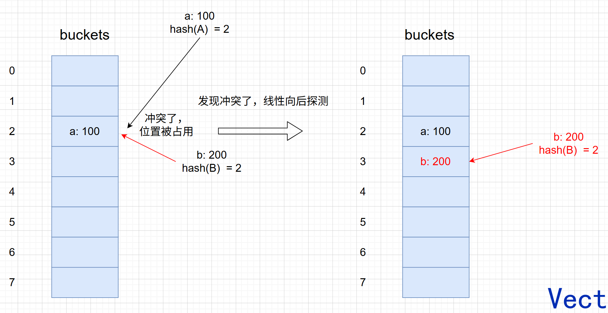

B 只能向后找最近的空位填充，发现索引 3 的位置为空，则填充到这个位置。

### 2.2 链地址法

链地址法主要实现是底层不直接使用连续数组存储所有数据，而是通过数组和链表组合的方式处理冲突。

数组里存一个指针，指向一条链。

如果出现两个 key，比如 key1 和 key2 落到了同一个位置，就把数据链接到链表上。

如果没有冲突，那么链表就只有一个节点。

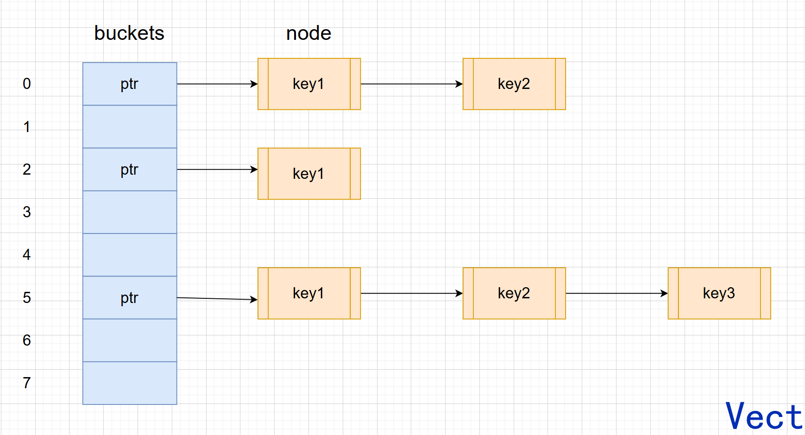

Go 经典 map 不是单纯的开放寻址，也不是普通链表。

它的做法更像是：

```text
bucket 数组
↓
每个 bucket 内部有 8 个槽位
↓
8 个槽位放不下，再挂 overflow bucket
```

也就是：**bucket 内部先小范围连续查找，冲突太多时再用 overflow 兜底。**

## 3. Go map 的底层结构

在 Go 1.23 版本，map 变量本质上持有一个指向 runtime `hmap` 的指针。

在 64 位机器上，这个指针大小通常是 8 字节。

真正的数据不在 map 变量本身里，而在 `hmap` 指向的 buckets 里。

来看一下 `hmap` 的核心结构：

```go
type hmap struct {
    count     int            // map 中元素个数，对应 len(map)
    flags     uint8          // 标记 map 的一些状态，比如是否正在写、是否有迭代器
    B         uint8          // 桶数量是 2^B
    noverflow uint16         // 溢出桶数量的近似值
    hash0     uint32         // 哈希随机种子

    buckets    unsafe.Pointer // 指向当前 buckets 数组
    oldbuckets unsafe.Pointer // 扩容时指向旧 buckets；翻倍扩容时旧 buckets 数量是新 buckets 的一半，等量扩容时新旧 buckets 数量相同
    nevacuate  uintptr        // 扩容迁移进度，小于 nevacuate 的旧 bucket 已经迁移完成

    extra *mapextra           // 保存 overflow 相关信息，避免某些 overflow 被 GC 提前回收
}
```

### 3.1 B：bucket 数量为什么是 2 的幂

`B` 是非常重要的字段。

bucket 数量不是随便取的，而是：$bucket 数量 = 2^B$

> 为什么要搞成 2 的幂？

因为这样 `hash % 2^B` 可以优化成位运算：

```text
hash & (2^B - 1)
```

比如：

```text
B = 3
桶数 = 2^3 = 8 个
mask = 2^3 - 1 = 7 = 0000 0111
```

假设 hash：

```text
1011 0101
```

计算过程：

```text
1011 0101
&
0000 0111
-------------
0000 0101
```

结果是 5，所以进入 `bucket[5]`。

源码中 bucket mask 是这样的过程：

```go
// bucketShift returns 1<<b, optimized for code generation.
func bucketShift(b uint8) uintptr {
    // Masking the shift amount allows overflow checks to be elided.
    return uintptr(1) << (b & (goarch.PtrSize*8 - 1))
}

// bucketMask returns 1<<b - 1, optimized for code generation.
func bucketMask(b uint8) uintptr {
    return bucketShift(b) - 1
}
```

而定位 bucket：

```go
bucket := hash & bucketMask(h.B)
```

所以：

```text
B 决定 bucket 数量
bucketMask 决定取 hash 的低几位
hash 低 B 位决定 key 去哪个 bucket
```

### 3.2 bmap：真正存 key/value 的地方

一个 bucket 在源码里对应 `bmap`。

经典结构可以简化理解成：

```go
type bmap struct {
    tophash  [8]uint8
    keys     [8]keytype
    values   [8]valuetype
    overflow uintptr
}
```

下图是 bmap 的真实内存布局：

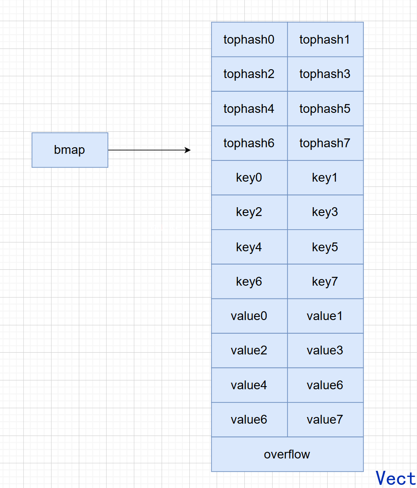

注意这里不是：

```text
key1/value1, key2/value2, key3/value3 ...
```

而是：

```text
tophash[8]
keys[8]
values[8]
overflow pointer
```

源码中特意把 8 个 key 连续放、8 个 value 连续放，而不是 key/value 配对放置。

原因是：**可以减少某些 key/value 类型组合的 padding 浪费。**

比如 key 很小，value 很大，如果交错存储，可能因为内存对齐浪费更多空间。

### 3.3 tophash：为什么找到 bucket 后还要再过滤

假设：

```text
hash("hello") = 10110110 01100100 11010110 00000101
```

这个 hash 不是一次性只拿来定位 bucket，而是分开使用：

- 低 B 位：决定去哪个 bucket
- 高 8 位：作为 tophash 存储在 bucket 里

所以一个 hash 可以这么理解：

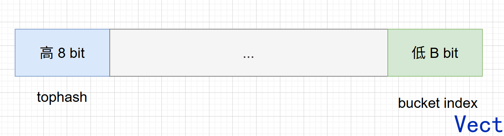

现在问题来了：

> Go 已经根据 hash 低位找到 bucket 了，为什么还要保存 tophash？

**一个 bucket 里最多有 8 个 key，需要进一步快速过滤。**

举个例子：

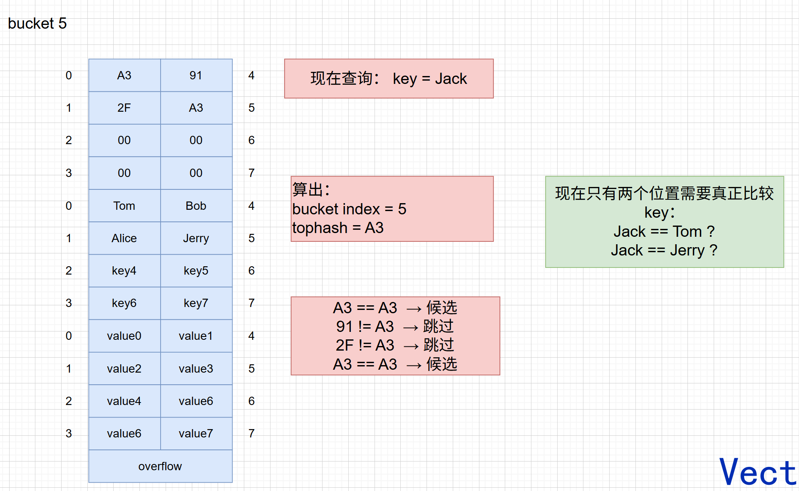

如果没有 tophash，查找时进入 bucket 后，需要对每个槽位都做完整 key 比较。

但完整 key 比较可能代价较大，比如 string 要比较长度和内容，struct 可能要比较多个字段。

有了 tophash 后，流程变成：

```text
先比 1 字节 tophash
↓
tophash 不同，直接跳过
↓
tophash 相同，再比较完整 key
```

所以：**bucket index 是一级定位，tophash 是二级过滤，完整 key 比较是最终确认。**

### 3.4 overflow bucket：冲突太多时怎么办

假设很多 key 都落入了 bucket 3，把 8 个位置全部占满了，I 来了：

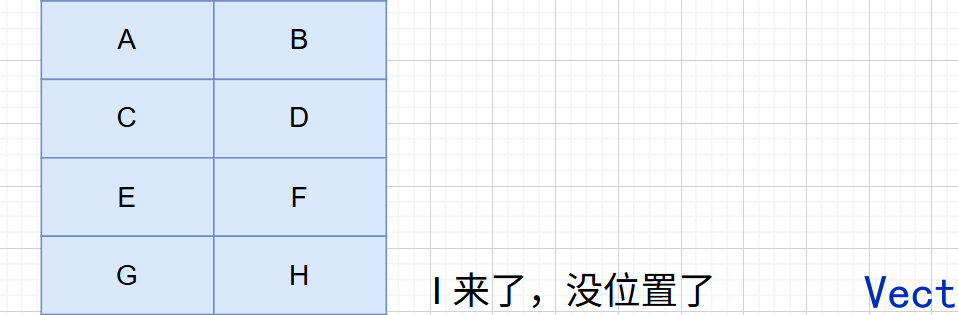

现在需要创建 overflow bucket：

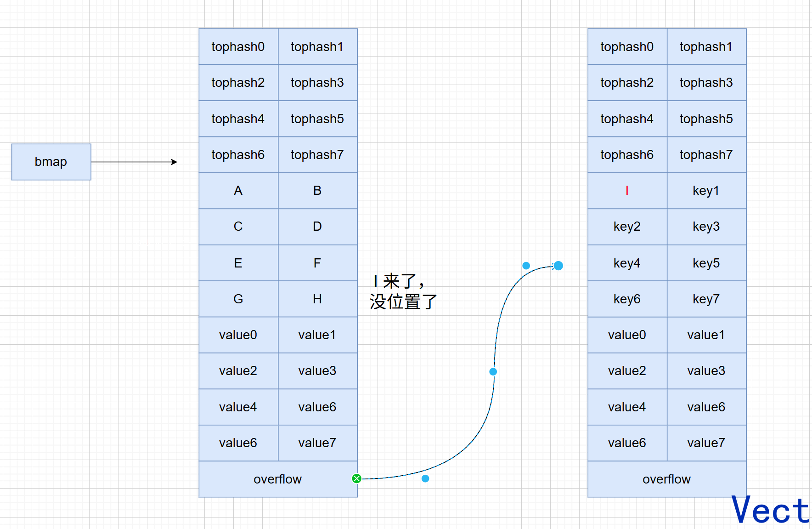

如果再来很多 key，结构就会变成：

```text
bucket
   ↓
overflow1
   ↓
overflow2
   ↓
overflow3
```

当前 bucket 和 overflow 都满的时候，会调用 `newoverflow` 创建新的 overflow bucket。

这样持续下去，会出现一个问题：

```text
overflow 很多
↓
lookup 需要不断跳 bucket
↓
比较次数增加
↓
cache locality 变差
↓
map 访问变慢
```

所以 overflow 多了以后，map 访问会变慢。

但不是每创建一个 overflow 就立刻扩容，而是在负载因子过高，或者 overflow 数量过多时，才触发扩容。

### 3.5 串起来整个 map 底层

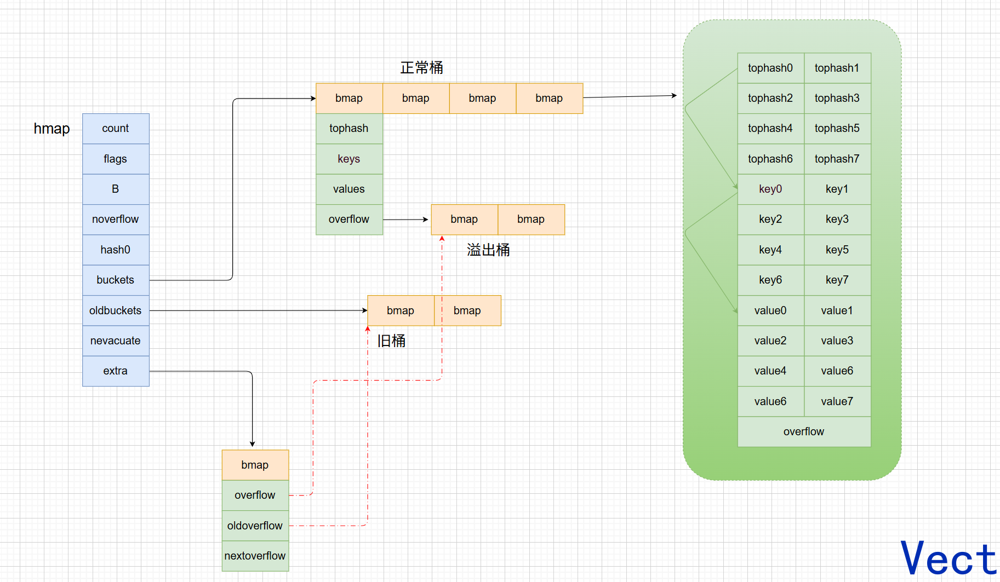

整体结构思路：

```text
map 变量
↓
hmap
↓
buckets 数组
↓
bucket(bmap)
↓
8 个 tophash + 8 个 key + 8 个 value
↓
overflow bucket
```

### 3.6 map 的四个核心不变量

1. key 的位置由 hash 决定，不由插入顺序决定
2. bucket index 是一级定位，tophash 是二级过滤，完整 key 比较是最终确认
3. overflow 是冲突的兜底方案，但 overflow 多了会拖慢访问
4. 扩容时不能一次性搬完，所以 Go 用 `oldbuckets + nevacuate` 做渐进式迁移

后面所有读、写、删、遍历，本质都绕不开这四句话。

## 4. map 访问原理

读取 map 有两种写法：

```go
v := m[key]       // 若没有对应的 key，返回 value 类型的零值
v, ok := m[key]   // ok 表示 key 是否存在
```

读取过程可以简化成：

```text
key
↓
计算 hash
↓
低 B 位定位 bucket
↓
高 8 位得到 tophash
↓
遍历 bucket 和 overflow
↓
先比 tophash
↓
再比完整 key
↓
找到返回 value，找不到返回零值
```

具体流程是：

1. 判断 map 是否为空或者元素数量为 0
   - 如果是，返回 value 类型零值
2. 检查是否存在并发写
   - 如果其它 goroutine 正在写，可能 fatal error
3. 根据 key 算出 hash
4. 用 hash 低 B 位定位 bucket
5. 如果当前 map 正在扩容：
   - 先判断目标旧 bucket 是否已经迁移
   - 如果迁移完成，去新 bucket 找
   - 如果还没迁移，去 oldbucket 找
6. 依次遍历目标 bucket 和 overflow bucket
7. 对每个槽位先比较 tophash
   - tophash 不相等，继续看下一个槽位
   - tophash 相等，再比较完整 key
8. 如果完整 key 相等，返回 value
9. 如果遇到 `emptyRest`，说明后面不可能再有目标 key，直接返回零值
10. 当前 bucket 没找到，就继续遍历 overflow，用同样方式查找

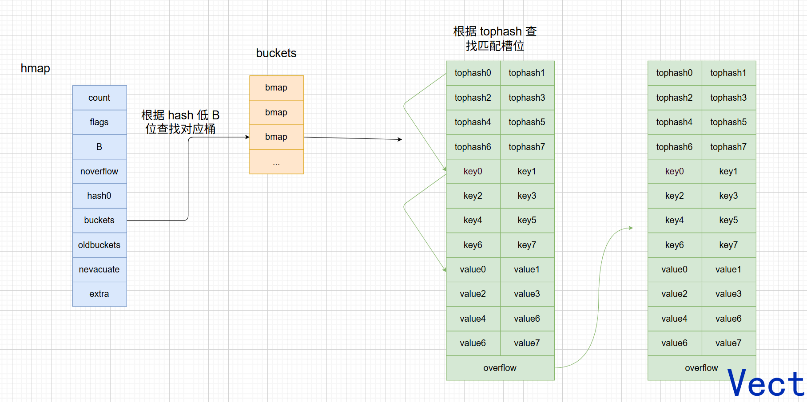

这里要注意一个点：

**只用 `m[key]` 不能判断 key 是否存在。**

比如：

```go
m := map[string]int{"Tom": 0}

fmt.Println(m["Tom"])   // 0
fmt.Println(m["Jerry"]) // 0
```

这两个结果都是 0。

所以如果要判断 key 是否存在，必须用：

```go
v, ok := m[key]
```

## 5. map 赋值原理

赋值写法：

```go
m[key] = value
```

赋值和读取的前半段几乎一样：

```text
算 hash
↓
找 bucket
↓
扫 bucket 和 overflow
↓
先比 tophash
↓
再比完整 key
```

区别在后半段：

- 读取：找到就返回 value，找不到返回零值
- 赋值：找到就覆盖 value，找不到就找空槽插入

注意：

1. 对 nil map 赋值会 panic
2. 普通 map 不是并发安全的，多个 goroutine 并发读写、并发写写都是数据竞争
3. runtime 可能报 `fatal error: concurrent map read and map write` 或 `fatal error: concurrent map writes`，但不能把它当成完整的并发保护机制
4. 业务上需要并发访问 map 时，要加 `sync.RWMutex`，或者在适合场景下使用 `sync.Map`

具体流程是：

1. 判断 map 是否为 nil
   - 如果是 nil map，赋值 panic
2. 检查是否已经处于写状态
   - 如果已经有 goroutine 正在写，fatal error
3. 计算 key 的 hash
4. 设置 `hashWriting` 标志
   - 源码安排这个顺序是因为 hash 计算可能 panic
   - 只有 hash 成功后，才标记为正在写
5. 如果 buckets 还没有初始化，先初始化 buckets
6. 根据 hash 低 B 位定位 bucket
7. 如果 map 正在扩容：
   - 先迁移当前 key 对应的旧 bucket
   - 再继续执行写入
8. 遍历 bucket 和 overflow，查找 key
9. 如果找到相同 key：
   - 直接覆盖 value
   - 清除 `hashWriting`
   - 结束
10. 如果没找到 key：
    - 记录第一个可用空槽
    - 插入前判断是否需要扩容
    - 如果需要扩容，先触发扩容，再重新定位 bucket
    - 如果不需要扩容，就把 key/value 写入空槽
11. 插入完成后 `count++`
12. 清除 `hashWriting`

这里有一个细节：

> 为什么遇到空槽时不一定立刻插入？

因为空槽后面可能还有目标 key。

举个例子：

```text
slot:  0   1     2   3
key:   A   空    C   D
```

如果现在插入 D，遍历到 slot 1 时发现空槽，不能直接插入。

因为后面的 slot 3 已经有 D 了。

如果直接插入，就会出现两个 D。

所以 runtime 会先记录这个空槽作为候选位置，继续往后找。

只有确认后面没有相同 key，才会真的插入。

## 6. map 扩容原理

map 扩容不是因为"数组满了"这么简单，而是为了解决两个性能问题：

1. bucket 平均装得太满，查找成本上升
2. overflow 太多，查找要不断跳 overflow，cache locality 变差

### 6.1 触发扩容的两种情况

这两种情况会触发扩容：

- 负载因子超过阈值，触发翻倍扩容
- 溢出桶数量过多，触发等量扩容

#### 情况一：负载因子过高

负载因子可以简单理解成：

```text
负载因子 = 元素数量 / bucket 数量 = count / 2^B
```

Go 1.23 经典实现里，负载因子超过约 6.5 时，会触发翻倍扩容。

一个 bucket 最多有 8 个槽位，如果平均每个 bucket 已经接近 6.5 个元素，说明 bucket 快被填满了，冲突概率和 overflow 概率都会上升。

所以这时候要增加 bucket 数量：

```text
B = 3，bucket 数量 = 8
↓
B = 4，bucket 数量 = 16
```

这就是翻倍扩容。

#### 情况二：overflow 过多

还有一种情况，count 可能不算特别高，但 overflow 很多。

比如：

```text
插入很多元素
↓
产生很多 overflow
↓
删除很多元素
↓
count 下降，但 overflow 结构还在
↓
再插入一些元素
↓
查找仍然要走很多 overflow
```

这时候负载因子可能没超过阈值，但访问性能已经变差了。

所以 Go 会触发等量扩容：

```text
bucket 数量不变
↓
新建一组同样数量的 buckets
↓
把旧数据重新排布进去
↓
减少 overflow，让数据更紧凑
```

等量扩容的目的不是增加容量，而是整理结构。

### 6.2 扩容为什么要渐进式

扩容开始时，`hashGrow()` 不会立刻把旧数据搬完，而是：

1. 分配新的 buckets
2. 把原来的 buckets 放到 `oldbuckets`
3. 新 buckets 放到 `buckets`
4. 把迁移进度 `nevacuate` 置零

核心逻辑可以简化成：

```go
oldbuckets := h.buckets
newbuckets := makeBucketArray(...)

h.B += bigger
h.oldbuckets = oldbuckets
h.buckets = newbuckets
h.nevacuate = 0
h.noverflow = 0
```

所以，`hashGrow()` 的核心不是立刻搬完数据，而是切换扩容状态。

真正的数据搬迁由后续写操作里的 `growWork()` 和 `evacuate()` 渐进完成。

> 为什么不一次性把数据搬完？

如果 map 里有 100 万个元素，触发扩容时一次性全搬，一次 `m[key] = value` 可能会卡很久，对服务端很不友好。

所以 Go 设计成：**把一次大搬迁，拆成很多次小搬迁，摊到后续写操作里。**

写入时，会先算出当前 key 要去哪个 bucket：

```go
bucket := hash & bucketMask(h.B)

if h.growing() {
    growWork(t, h, bucket)
}
```

`growWork()` 大致做两件事：

```go
func growWork(t *maptype, h *hmap, bucket uintptr) {
    evacuate(t, h, bucket&h.oldbucketmask())

    if h.growing() {
        evacuate(t, h, h.nevacuate)
    }
}
```

1. 先迁移当前要访问的新 bucket 对应的旧 bucket
2. 再额外迁移一个 `h.nevacuate` 指向的旧 bucket，推进整体进度

### 6.3 旧 bucket 会搬到哪里

**情况一：翻倍扩容**

旧 bucket 里的元素，可能会去两个位置：

- 新 buckets 的 `i`
- 新 buckets 的 `i + 旧 bucket 数量`

为什么是这两个位置？因为翻倍扩容后，`B` 多了 1 位。

原来用低 B 位决定 bucket，现在用低 B+1 位决定 bucket。

多出来的那一位如果是 0，留在原来的位置；如果是 1，就去 `i + oldBucketCount`。

```text
旧 bucket i
↓
新 bucket i
或
新 bucket i + oldBucketCount
```

**情况二：等量扩容**

等量扩容时，`B` 不变，bucket 数量不变。

所以旧 bucket `i` 里的元素，仍然迁移到新 bucket `i`。

它的核心是重新整理数据，减少 overflow，使数据排列更加紧凑。

### 6.4 怎么判断扩容是否结束

> 怎么判断某个旧 bucket 是否迁移完成？

看旧 bucket 的 `tophash[0]` 是否是 evacuated 状态。

> 扩容什么时候结束？

每迁移一个旧 bucket，会推进 `h.nevacuate`。

当 `h.nevacuate == old bucket 数量` 时，说明旧 buckets 全部迁移完成。

然后完成收尾工作：

- 清空 `oldbuckets`
- 释放旧 overflow
- 清除 `sameSizeGrow` 标志

## 7. map 删除原理

slice 删除可以把后面的元素往前挪，但 map 不行。

因为 map 的 key 位置由 hash、bucket、overflow、扩容状态共同决定。

如果删除一个 key 后随便移动其它 key，查找和遍历都可能出问题。

所以 Go 经典 map 删除 key，并不是像链表那样摘掉节点，也不是像 slice 那样移动元素，而是：

**在 bucket 里找到对应 slot，清理 key/value，然后把这个 slot 的 `tophash` 标记为空。**

举个例子：

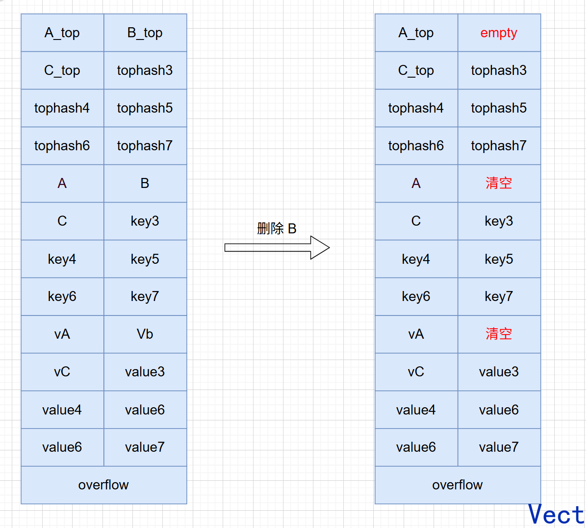

删除流程可以简化成：

```text
delete(m, key)
↓
判断 map 是否为空
↓
算 hash
↓
定位 bucket
↓
扩容中先迁移对应 bucket
↓
bucket + overflow 里找 slot
↓
清理 key/value
↓
修改 tophash
↓
count--
```

具体流程是：

1. 判断 map 是否为 nil 或元素数量为 0
   - 是，直接返回
   - 所以 `delete(nilMap, key)` 是安全的，不会 panic
2. 检查是否为写状态
   - 如果正在写，直接 fatal error
3. 计算 key 的 hash
   - 这里和赋值一样，先算 hash，再设置写状态
   - 因为 hash 计算可能会 panic，只有 hash 成功之后，才算真正进入写操作
4. 根据低 B 位定位 bucket：

```go
bucket := hash & bucketMask(h.B)
```

5. 如果 map 正在扩容：
   - 调用 `growWork(t, h, bucket)`
   - 先迁移当前 key 对应的旧 bucket
   - 再去新 bucket 里删除
   - 原因是扩容期间数据可能还在旧桶，必须先保证这个 bucket 被搬到新表，否则可能删不到
6. 根据高 8 位计算 tophash
7. 从目标 bucket 开始，依次遍历：
   - 当前 bucket 的 8 个槽位
   - 当前 bucket 的 overflow bucket
   - overflow 的 overflow
8. 每个槽位先比较 tophash
   - 不相等，继续看下一个槽位
   - 如果遇到 `emptyRest`，说明这里往后都不可能再有目标 key，结束查找
   - 相等，继续比较完整 key
9. 如果完整 key 也相等，说明找到了
   - 清理 key
   - 清理 value
   - 把 `tophash[i]` 先标记为 `emptyOne`
   - `count--`
10. 如果删除后 map 为空
    - 重新生成哈希种子
    - 这样可以降低攻击者反复构造哈希冲突的风险
11. 清除写标志，结束删除操作

### 7.1 emptyOne 和 emptyRest

```text
emptyOne  = 这个槽位空了，但后面可能还有元素，查找不能停
emptyRest = 这个槽位空了，并且后面也没有有效元素，查找可以停
```

举个例子：

```text
删除前：

slot:     0   1   2   3   4   5
value:    A   B   C   D   空  空
tophash:  x   x   x   x   ER  ER
```

如果删除 B：

```text
slot:     0   1        2   3   4   5
value:    A   空       C   D   空  空
tophash:  x   emptyOne x   x   ER  ER
```

这里不能把 slot 1 标成 `emptyRest`。

因为后面还有 C、D。

如果查找某个 key 时走到 slot 1 就停了，后面的 C、D 就永远找不到了。

但如果删除的是 D：

```text
slot:     0   1   2   3        4   5
value:    A   B   C   空       空  空
tophash:  x   x   x   emptyOne ER  ER
```

这时 D 后面本来就没有有效元素，所以 runtime 会尝试把末尾连续的 `emptyOne` 往回改成 `emptyRest`：

```text
slot:     0   1   2   3   4   5
value:    A   B   C   空  空  空
tophash:  x   x   x   ER  ER  ER
```

这样后续查找可以提前停止，减少无意义遍历。

所以删除原理可以总结成：

```text
delete 不是搬家
delete 是打标记

中间删除：emptyOne，保证后面的 key 还能被找到
尾部删除：emptyRest，保证后续查找能提前结束
```

### 7.2 delete 会不会缩容

不会。`delete` 会减少 `count`，会清理 key/value，避免引用对象继续被 GC 认为存活，但不会主动缩小 buckets，也不会立刻回收 overflow。

一个 map 曾经很大，后来删掉很多元素，它的底层 buckets 通常仍然保留。

如果 overflow 太多，后续可能通过等量扩容重新整理结构，但这不是 `delete` 直接完成的。

## 8. map 遍历原理

map 遍历对应的是：

```go
for k, v := range m {
    // ...
}
```

先记住结论：**map 遍历顺序是不确定的，Go 语言规范不保证顺序，也不保证两次遍历顺序相同。**

实际运行时，两次遍历结果可能刚好一样。但代码不能依赖这个顺序。

### 8.1 hiter：遍历不是普通 for 循环

map 的遍历是借助迭代器完成的。经典实现里，迭代器结构可以简化理解成：

```go
type hiter struct {
    key         unsafe.Pointer
    elem        unsafe.Pointer
    h           *hmap
    buckets     unsafe.Pointer
    startBucket uintptr
    offset      uint8
    bucket      uintptr
    wrapped     bool
}
```

可以把 `hiter` 看作一个游标：

- 我从哪个 bucket 开始？
- 我从 bucket 内哪个 slot 开始？
- 我当前走到哪个 bucket？
- 我是否已经绕回起点？
- 当前返回的是哪个 key/value？

初始化遍历时，runtime 会做几件事：

1. 如果 map 为 nil 或元素数量为 0，直接结束
2. 保存当前 bucket 状态：
   - 记录 `B`
   - 记录 `buckets`
   - 记录 overflow，防止遍历时 overflow 被 GC 回收
3. 随机选择一个起始 bucket：
   - `startBucket = rand & bucketMask(h.B)`
4. 随机选择一个 bucket 内起始槽位：
   - `offset = rand >> h.B & 7`
5. 设置 iterator 标志：
   - 告诉 map：现在可能有迭代器正在遍历
6. 调用 `mapiternext` 找到第一个 key/value

所以遍历不是永远从 `bucket[0]` 的 `slot[0]` 开始，而是：

```text
随机 bucket
↓
随机 slot
↓
向后遍历 bucket
↓
走完 bucket 数组后回到 0
↓
再次走到起点，结束
```

举个例子：

```text
bucket 数组：

bucket0  bucket1  bucket2  bucket3  bucket4
```

如果这次随机到 `startBucket = 2`：

```text
bucket2 -> bucket3 -> bucket4 -> bucket0 -> bucket1 -> 回到 bucket2，结束
```

如果 bucket 内随机到 `offset = 3`：

```text
slot 顺序：

3 -> 4 -> 5 -> 6 -> 7 -> 0 -> 1 -> 2
```

### 8.2 为什么要随机起点

主要原因不是为了让你每次看到一个"随机结果"，而是为了让使用者不要依赖 map 的顺序。

map 是哈希表，key 的位置本来就和 hash、扩容、插入、删除有关。

如果 Go 每次都从 `bucket[0] slot[0]` 开始，很多人写代码时就会误以为 map 是稳定有序的。

所以 Go 干脆让遍历从随机位置开始，明确告诉你：

**map 不是有序容器。**

如果你需要稳定顺序，正确做法是：

```go
keys := make([]string, 0, len(m))
for k := range m {
    keys = append(keys, k)
}
sort.Strings(keys)

for _, k := range keys {
    fmt.Println(k, m[k])
}
```

### 8.3 遍历期间遇到扩容怎么办

Go map 扩容是渐进式的，也就是：

```text
旧 buckets 不会一次性搬完
↓
oldbuckets 还在
↓
新 buckets 也在
↓
一部分 bucket 已迁移，一部分 bucket 没迁移
```

所以遍历时可能遇到两种情况。

**情况一：当前 bucket 还没有迁移**

迭代器会去旧 bucket 中遍历。但是如果是翻倍扩容，一个旧 bucket 的元素可能会分裂到两个新 bucket 中：

```text
旧 bucket i
↓
新 bucket i
新 bucket i + oldBucketCount
```

这时候迭代器不能把旧 bucket 里的所有 key 都直接返回，否则可能破坏遍历语义。所以它会做一次判断：

```text
这个 key 扩容之后属于当前正在遍历的新 bucket？
↓
是，返回
↓
不是，跳过，等遍历到另一个 bucket 时再处理
```

**情况二：当前 bucket 已经迁移**

说明 key 的最新位置可能已经在新 bucket 中。这时 runtime 会以当前 key 再查一次 map，拿到最新数据。

这样可以处理这些情况：

- 遍历开始后，这个 key 被更新了，可能返回最新 value
- 遍历开始后，这个 key 被删除了，跳过
- 遍历开始后，这个 key 删除又插入了，重新查当前 map 状态

所以可以这样理解：**map range 会尽量保证每个 key 最多返回一次，但 value 不保证是遍历开始那一刻的快照。**

### 8.4 map range 是不是快照

不是。Go 语言规范对 map range 的语义大概可以这么记：

- 遍历顺序不确定
- 如果某个还没遍历到的 key 被删除了，那么它不会被遍历出来
- 如果遍历期间新增 key，这个 key 可能被遍历到，也可能不会
- nil map 遍历 0 次

所以：**map range 是一个带迭代器状态的过程，能保证基本遍历语义，但不保证一致性快照，也不保证顺序。**

### 8.5 遍历时能不能 delete

同一个 goroutine 里，遍历时删除当前 map 的 key 是允许的：

```go
for k := range m {
    delete(m, k)
}
```

但是不能多个 goroutine 并发遍历和写 map。

如果另一个 goroutine 同时写 map，可能报：

```text
fatal error: concurrent map iteration and map write
```

普通 map 本身不是并发安全容器。

需要并发读写时，用 `sync.RWMutex + map`，或者特定场景用 `sync.Map`。

## 9. map 常见疑问

### 9.1 为什么 map 的 key 必须可比较

因为 map 查找不是只靠 hash。hash 只能定位到 bucket 和候选槽位，最后还要比较完整 key 是否相等。

所以 key 类型必须支持 `==`。这也是为什么 slice、map、function 不能直接作为 map key。

### 9.2 为什么 map 的 value 不能直接取地址

下面这种写法是不允许的：

```go
_ = &m[key]
```

原因是 map 可能扩容。扩容后 key/value 的存储位置可能变化。如果允许长期持有 `&m[key]`，扩容后这个地址可能失效。

所以 Go 不允许对 map 元素直接取地址。

如果 value 是结构体，下面这种写法也不行：

```go
m[key].Name = "Tom"
```

因为 `m[key]` 取出来的是 value 的副本，不是一个稳定可寻址的位置。

常见解决方式有两个：

```go
v := m[key]
v.Name = "Tom"
m[key] = v
```

或者：

```go
m := map[string]*User{
    key: &User{},
}
m[key].Name = "Tom"
```

第二种方式能改，是因为 map 里存的是指针。`m[key]` 取出来的是指针副本，但这个指针仍然指向同一个 `User` 对象。

### 9.3 nil map 的行为

nil map 的几个行为要一次性记住：

```go
var m map[string]int
```

- 读 nil map：返回 value 类型零值
- `v, ok := m[k]`：`ok` 为 false
- `delete(m, k)`：安全，什么都不做
- `for range m`：循环 0 次
- `m[k] = v`：panic

### 9.4 map 会不会自动缩容

不会。map 扩容后，即使删除大量元素，底层 buckets 通常也不会主动缩小。

如果想释放内存，常见做法是新建一个 map，把还需要的数据重新放进去，让旧 map 等待 GC 回收。

### 9.5 map 是不是线程安全

不是。普通 map 适合单 goroutine 使用，或者外部自己加锁。

并发场景要分情况：

- 读多写少，且操作简单：可以考虑 `sync.Map`
- 需要维护复杂业务不变式：通常用 `map + sync.RWMutex`
- 只有单 goroutine 访问：普通 map 最简单

并发读写普通 map，本质就是数据竞争。

## 10. 总结

Go map 的底层是哈希表。

经典实现里，map 变量指向一个 `hmap`，`hmap` 里有 buckets 数组，每个 bucket 里面有 8 个槽位。

key 经过 hash 后，低 B 位决定落到哪个 bucket，高 8 位作为 tophash 做快速过滤，最后再比较完整 key。

如果多个 key 落到同一个 bucket，先放在这个 bucket 的 8 个槽位里，放不下就挂 overflow bucket。

overflow 多了以后访问会变慢，所以 Go 通过负载因子和 overflow 数量触发扩容。

扩容有两种：

- 负载因子过高，翻倍扩容
- overflow 过多，等量扩容

扩容不是一次搬完，而是用 `oldbuckets + nevacuate` 渐进迁移，避免一次写操作卡太久。

删除时不会移动其它 key，只是清理 key/value，并修改 tophash。

遍历时通过 `hiter` 迭代器，从随机 bucket 和随机 offset 开始，所以 map 不保证顺序，也不是一致性快照。

最后记住 map 的边界：

- nil map 可以读、删、遍历，但不能写
- map key 必须可比较
- map value 不能直接取地址
- 普通 map 不并发安全
- delete 不会主动缩容


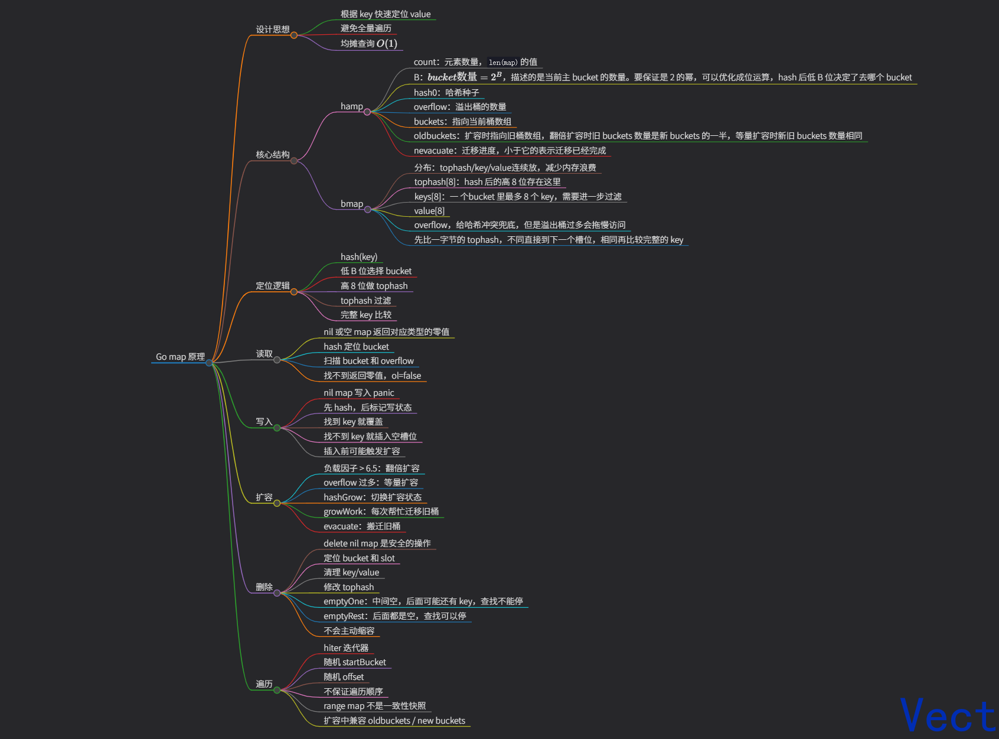

