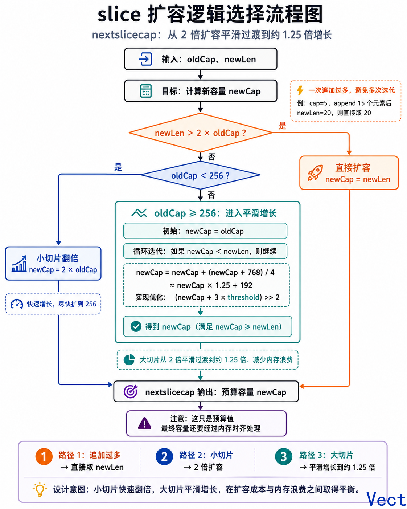
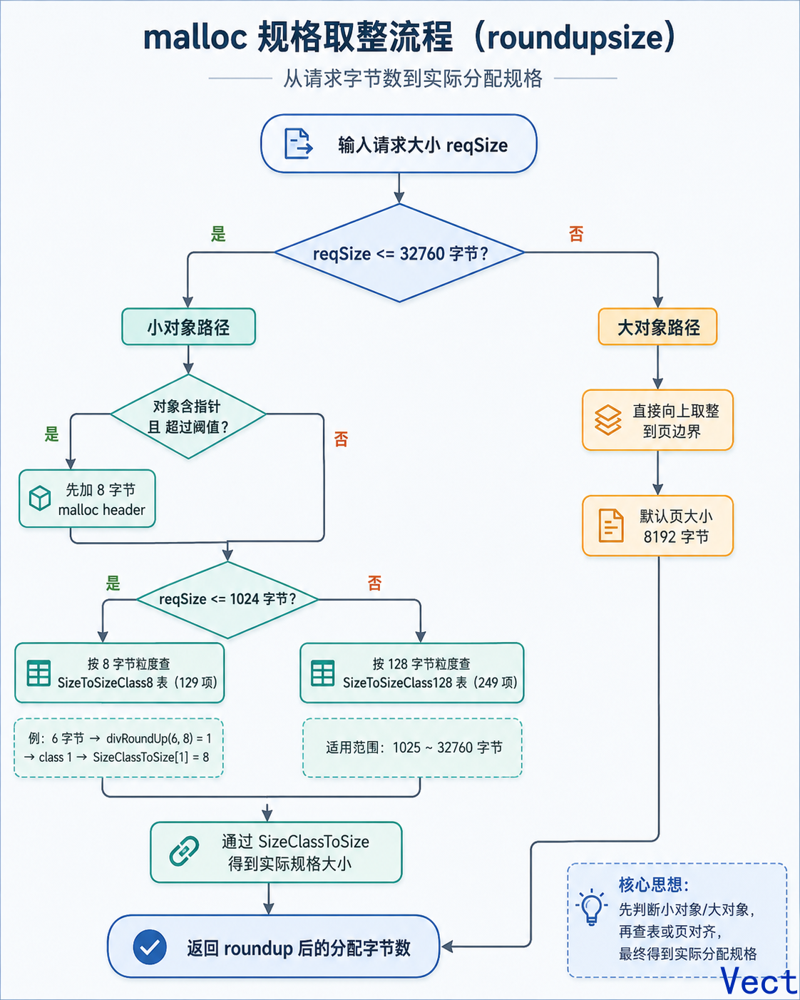

## 为什么需要切片：从数组的定长说起

Go 的数组是值类型，变量名代表整个数组，不是指向首元素的指针。

```go
func test(arr [3]int) {
    fmt.Printf("arr 内: %p\n", &arr)
}

func main() {
    arr := [3]int{1, 2, 3}
    test(arr)
    fmt.Printf("arr 外: %p\n", &arr)
}
```

```text
arr 内: 0xc0000a0018
arr 外: 0xc0000a0000
```

同一份数据，函数内外的地址不同——传参发生了完整拷贝。赋值也一样：

```go
arr1 := [3]int{1, 2, 3}
arr2 := arr1
arr1[0] = 100
fmt.Println(arr1) // [100 2 3]
fmt.Println(arr2) // [1 2 3]
```

数组的值语义保证了隔离性，但代价明显：传参拷贝全部数据，长度是类型的一部分（`[3]int` 和 `[5]int` 是不同的类型），无法在运行时动态调整大小。

切片通过引入一个间接层解决了这两个问题——不拷贝全部数据，只在需要增长时分配新空间。

> 数组的值语义保证了隔离性，代价是定长和传参拷贝。切片通过间接层解决了这两个问题，代价是共享带来的不确定性。

---

## 切片的底层结构：一个三元组

`runtime/slice.go:16`：

```go
type slice struct {
    array unsafe.Pointer
    len   int
    cap   int
}
```

64 位平台上占 24 字节（array 8 + len 8 + cap 8）。任何时候你拿到的切片变量，都是这个三元组的一份拷贝。

用一个工具函数把这三个字段暴露出来——后面的分析会反复用到：

```go
func PrintSlice(s *[]int) {
    ss := (*reflect.SliceHeader)(unsafe.Pointer(s))
    fmt.Printf("slice struct: %+v, slice is %v\n", ss, s)
}
```

`reflect.SliceHeader` 与 runtime 的 slice 结构对应：`Data uintptr`、`Len int`、`Cap int`。`PrintSlice` 通过 `unsafe.Pointer` 强制转换来读取这三个内部字段。

```go
s := make([]int, 5, 10)
PrintSlice(&s)
```

```text
slice struct: &{Data:824633884752 Len:5 Cap:10}, slice is &[0 0 0 0 0]
```

内存布局：

```text
+------------------+
| Data  ──────────────────┐
| Len:  5          |      |
| Cap:  10         |      |
+------------------+      |
                          v
               +---------------------------------------+
               | [0] [1] [2] [3] [4] [ ] [ ] [ ] [ ] [ ] |
               +---------------------------------------+
                 len = 5                 cap = 10
```

三个字段的约束：

- `len` — 当前可安全访问的元素数。`s[len]` panic。
- `cap` — 从 Data 开始的总容量。`cap - len` 是预留空位。
- `cap >= len`，编译器和运行时的硬约束。

作为对比：string 底层只有 `str unsafe.Pointer` + `len int`，没有 cap——不可变意味着不需要预留增长空间。切片多出的 cap 恰好对应"可变长"的职责。

> 切片在运行时是一个三元组 `{array, len, cap}`。理解这三个字段的各自含义和约束，是推理所有切片行为的基础。

---

## 扩容机制：从 append 到 mallocgc

**触发条件**

- `newLen <= oldCap` → 不扩容，原地追加。
- `newLen > oldCap` → 调用 `runtime.growslice`。

不扩容时，append 仍返回新的 header（len 变了），但 Data 指向同一块内存：

```go
s1 := make([]int, 3, 4)  // len=3, cap=4
s2 := append(s1, 1)       // newLen=4 <= cap=4

PrintSlice(&s1)  // Data:0x...7584 Len:3 Cap:4
PrintSlice(&s2)  // Data:0x...7584 Len:4 Cap:4  ← Data 相同
```

**nextslicecap：增长公式**

一旦扩容，`growslice` 首先调用 `nextslicecap`（`runtime/slice.go:326`）计算预估值：

```go
func nextslicecap(newLen, oldCap int) int {
    newcap := oldCap
    doublecap := newcap + newcap
    if newLen > doublecap {
        return newLen     // 一次追加了大量元素
    }

    const threshold = 256
    if oldCap < threshold {
        return doublecap  // 小于 256：直接翻倍
    }
    for {
        newcap += (newcap + 3*threshold) >> 2  // ≈ 1.25 倍
        if uint(newcap) >= uint(newLen) {
            break
        }
    }
    if newcap <= 0 {
        return newLen
    }
    return newcap
}
```

三条路径：

1. `newLen > 2*oldCap`：直接用 `newLen`。
2. `oldCap < 256`：翻倍，`newcap = 2*oldCap`。
3. `oldCap >= 256`：迭代增长，每次 $$newcap = newcap + \frac{newcap + 768}{4}$$，即约 1.25 倍，直到 >= newLen。

设计意图：小切片快速翻倍到达 256，大切片平滑过渡，避免 2 倍扩容的巨大浪费。

> nextslicecap 实现了从 2 倍到约 1.25 倍的平滑过渡。但这只是"预计算"——最终容量还要经过 malloc 规格取整。



**roundupsize：malloc 规格取整**

这里先区分两个容易混淆的概念。

**结构体字段对齐**（C++ 也有的那个）：编译器在结构体字段之间插入 padding，使每个字段落在自身大小的整数倍地址上。Go 和 C++ 规则一致，仅多了一个 GC 相关的零大小尾部填充特例。

**malloc 规格取整**（本节讨论的）：Go 的 malloc 不会你申请多少字节就恰好分配多少。它预定义了若干固定大小的 slot，分配时把你的请求量向上取整到最近的 slot 尺寸。这跟结构体内部字段排列无关——它只管"你要多少字节，我实际给你多少字节"。

`growslice` 计算出 nextslicecap 的预估元素数后，接下来的工作是：把元素数换算成字节数，交给 malloc，拿到对齐后的字节数，再反算回最终的 cap。

`growslice` 中处理这步的代码（`runtime/slice.go:210-243`），以最典型的 `int` 为例（`et.Size_ == goarch.PtrSize` 分支）：

```go
case et.Size_ == goarch.PtrSize:
    lenmem = uintptr(oldLen) * goarch.PtrSize
    newlenmem = uintptr(newLen) * goarch.PtrSize
    capmem = roundupsize(uintptr(newcap)*goarch.PtrSize, noscan)
    overflow = uintptr(newcap) > maxAlloc/goarch.PtrSize
    newcap = int(capmem / goarch.PtrSize)
```

三步：`newcap * 8` 得到字节数 → `roundupsize` 取整 → 除以 8 反算回最终 cap。

`roundupsize` 本身在 `runtime/msize.go:16`：

```go
func roundupsize(size uintptr, noscan bool) (reqSize uintptr) {
    reqSize = size
    if reqSize <= maxSmallSize-gc.MallocHeaderSize {
        // 小对象
        if !noscan && reqSize > gc.MinSizeForMallocHeader {
            reqSize += gc.MallocHeaderSize
        }
        if reqSize <= gc.SmallSizeMax-8 {
            return uintptr(gc.SizeClassToSize[gc.SizeToSizeClass8[divRoundUp(reqSize, gc.SmallSizeDiv)]]) - (reqSize - size)
        }
        return uintptr(gc.SizeClassToSize[gc.SizeToSizeClass128[divRoundUp(reqSize-gc.SmallSizeMax, gc.LargeSizeDiv)]]) - (reqSize - size)
    }
    // 大对象：向上取整到页边界
    reqSize += pageSize - 1
    if reqSize < size {
        return size
    }
    return reqSize &^ (pageSize - 1)
}
```

逻辑分三层：

1. 请求大小 `<= 32760` 字节：走小对象路径。如果对象含指针且超过阈值，先加 8 字节的 malloc header。
2. 请求大小 `<= 1024` 字节：以 8 字节粒度查 `SizeToSizeClass8` 表（129 项）。例如要 6 字节 → `divRoundUp(6, 8) = 1` → 查表得 class 1 → `SizeClassToSize[1] = 8` → 返回 8。
3. 请求大小 `1025 ~ 32760` 字节：以 128 字节粒度查 `SizeToSizeClass128` 表（249 项）。
4. 请求大小 `> 32760` 字节：直接向上取整到页边界（默认 8192 字节）。


`SizeClassToSize` 表定义了所有 68 个 size class 的字节数（`internal/runtime/gc/sizeclasses.go`），部分如下：

| class | bytes/obj | class | bytes/obj |
|-------|-----------|-------|-----------|
| 1     | 8         | 10    | 128       |
| 2     | 16        | 18    | 256       |
| 3     | 24        | 26    | 512       |
| 4     | 32        | 32    | 1024      |
| 5     | 48        | 44    | 4096      |
| 6     | 64        | 51    | 8192      |

看两个具体例子。

`[]int`（64 位平台，元素 8 字节）：

```
s := make([]int, 3, 3), append 1 个元素:
  nextslicecap: 3<256 → 6
  capmem = roundupsize(6 × 8)
         = roundupsize(48)
         → 48 落在 1024 以内, divRoundUp(48,8)=6, SizeToSizeClass8[6]=class 5
         → SizeClassToSize[5] = 48  ← 恰好匹配
  newcap = 48 / 8 = 6
```

`[]byte`（元素 1 字节）：

```
s := make([]byte, 3, 3), append 1 个元素:
  nextslicecap: 3<256 → 6
  capmem = roundupsize(6 × 1)
         = roundupsize(6)
         → divRoundUp(6,8)=1, SizeToSizeClass8[1]=class 1
         → SizeClassToSize[1] = 8  ← 6 被取整到 8
  newcap = 8 / 1 = 8
```

nextslicecap 说 6，最终 cap 是 8——多了 2 个元素。元素类型越小，这种"意外扩容"越显著。`[]byte` 是最极端的情况（1 字节元素），`[]int` 等大元素因为乘以 8 后更容易命中现有 size class，偏差通常较小。

这个机制不是设计缺陷。malloc 预先准备好 68 种固定尺寸的空闲链表，分配时直接从对应尺寸的链表里取——不需要切分、不需要合并，速度极快。代价是实际分配的量可能比你请求的多几个字节。

> 最终容量 = nextslicecap 预估值 × 元素大小，经 `roundupsize` 查 size class 表向上取整后再反算。这个"不精确"不是缺陷，而是用少量内存冗余换取零碎片的快速分配。

**mallocgc 与 memmove**

确定了最终 `capmem` 后，`growslice` 调用 `mallocgc` 分配，`memmove` 拷贝旧元素，返回新的 slice header（`runtime/slice.go:263-286`）。

两条路径：元素不含指针（`int`、`byte`），`mallocgc(capmem, nil, false)` 后只清零尾部未覆盖区域；元素含指针（`string`、`*T`），`mallocgc(capmem, et, true)` 时整块已清零，通过写屏障确保 GC 追踪。拷贝完成后，旧数组如果没有其他切片 header 引用则被 GC 回收——这是"大切片截取与内存滞留"的根源。

> 扩容实质是"分配新数组、拷贝旧数据、抛弃旧数组"三步。旧数组的生死取决于是否还有其他切片引用它。

**完整链路**

以 `s := make([]int, 3, 3); s = append(s, 1, 2)` 为例（一次追加 2 个元素）：

| 步骤 | 操作 | 输入 | 输出 |
|------|------|------|------|
| 触发 | `len=3, cap=3, num=2` | `newLen=5 > cap=3` | 调用 growslice |
| nextslicecap | `oldCap=3, newLen=5` | `3<256,dobulecap=6>=5` | return 6 |
| 字节换算 | `newcap × 8` | `6 × 8 = 48 bytes` | 传入 roundupsize |
| roundupsize | 查 SizeToSizeClass8[6] → class 5 | `SizeClassToSize[5]` | 返回 48 |
| 反算 cap | `capmem / 8` | `48 / 8` | `newcap = 6` |
| mallocgc | 分配 48 字节 | | 新数组 |
| memmove | 拷贝 3 个 int（24 字节） | | 返回 `slice{p, 5, 6}` |

预估值恰好等于最终值。对于 `[]byte`，roundupsize 的修正会更显著。

---

## 切片传参：拷贝的是 header，共享的是底层数组

Go 函数参数全是值拷贝。传入函数的 header 有独立的 Data/Len/Cap 字段，但 Data 值指向原底层数组：

```go
func demo() {
    s := make([]int, 5, 10)
    PrintSlice(&s)  // main 中的 header
    test(s)
}
func test(s []int) {
    PrintSlice(&s)  // 函数内部的 header
}
```

```text
slice struct: &{Data:824633884752 Len:5 Cap:10}, slice is &[0 0 0 0 0]
slice struct: &{Data:824633884752 Len:5 Cap:10}, slice is &[0 0 0 0 0]
```

两个 header 在各自的栈帧中，但 Data 字段完全相同。

```text
main 的 s:                  test 的 s (拷贝):
+------------------+       +------------------+
| Data: 0x...4752  |--+    | Data: 0x...4752  |--+
| Len:  5          |  |    | Len:  5          |  |
| Cap:  10         |  |    | Cap:  10         |  |
+------------------+  |    +------------------+  |
                      +----> 同一块底层数组  <-----+
```

基于此，分两种情况。

**索引修改**：直接作用在共享底层数组上，外部可见。

```go
func modify(s []int) {
    s[1] = 1000
}
s := make([]int, 5)
modify(s)
PrintSlice(&s)  // &[0 1000 0 0 0] — Data 不变，值变了
```

**先 append 扩容再修改**：函数内的 s 指向了新数组，外部还在旧数组。

```go
func modify(s []int) {
    s = append(s, 1000)  // len==cap==5 → 扩容！新数组
    s[1] = 1000          // 改的是新数组
}
s := make([]int, 5)      // len=5, cap=5，没有预留
modify(s)
PrintSlice(&s)  // &[0 0 0 0 0] — 外部完全不受影响
```

```text
函数内: &{Data:824633884832 Len:6 Cap:10}, slice is &[0 1000 0 0 0 1000]
外部:   &{Data:824633811472 Len:5 Cap:5},   slice is &[0 0 0 0 0]
```

Data 完全不同——append 扩容后，局部 header 换到了新数组。外部 header 指向旧数组，完全不知情。这就是为什么必须 `s = append(s, x)`。

> 切片传参时，header 是复制品，底层数组是共享的。能否通过函数影响外部，取决于操作的是共享内存（索引修改）还是扩容后的私有新内存。

---

## append 的两种路径：原地与扩容

把 append 的行为独立看：

```go
case1: s1 := make([]int, 3, 3); s1 = append(s1, 1)     // cap 已满 → 扩容
case2: s1 := make([]int, 3, 4); s2 := append(s1, 1)      // cap 有余 → 原地
case3: s1 := make([]int, 3, 3); s2 := append(s1, 1)      // cap 已满 → 扩容
```

```text
case1: &{Data:0x...1472 Len:4 Cap:6}, slice is &[0 0 0 1]
case2: &{Data:0x...7584 Len:3 Cap:4}, slice is &[0 0 0]
       &{Data:0x...7584 Len:4 Cap:4}, slice is &[0 0 0 1]  ← Data 相同！
case3: &{Data:0x...9424 Len:3 Cap:3}, slice is &[0 0 0]
       &{Data:0x...1520 Len:4 Cap:6}, slice is &[0 0 0 1]  ← Data 不同
```

| Case | 原始切片 | append 后 | 扩容 | Data 变 |
|------|----------|-----------|------|---------|
| case1 | `len=3, cap=3` | `len=4, cap=6` | 是 | 变 |
| case2 | `len=3, cap=4` | `len=4, cap=4` | 否 | 不变 |
| case3 | `len=3, cap=3` | `len=4, cap=6` | 是 | 变 |

case2 最值得关注：s1 和 s2 共享底层数组，但 s1 的 len=3 看不到 s2 写入的第 4 个元素。

```text
append 前: +---+---+---+---+
           | 0 | 0 | 0 |   |  len=3, cap=4
           +---+---+---+---+

append 后: +---+---+---+---+
           | 0 | 0 | 0 | 1 |  len=4, cap=4 (s2 能看到，s1 不能)
           +---+---+---+---+
```

> append 返回的切片是否和原切片共享底层数组，取决于 cap 是否还有余量。正是这种不确定性，让 `s = append(s, x)` 成为必须遵守的规则。

---

## 截取切片：新 header，不复制数据

`newSlice := oldSlice[low:high]` 只构造一个新 header：Data 指针偏移 low 个元素，Len 和 Cap 重新计算。不分配新内存。

```go
s := make([]int, 5)
```

```go
s1 := s[1:]    // Data + 8,  Len=4, Cap=4
s2 := s[1:3]   // Data + 8,  Len=2, Cap=4  ← Cap > Len！
s3 := s[4:]    // Data + 32, Len=1, Cap=1
s4 := s[2:]    // Data + 16, Len=3, Cap=3
```

```text
s[1:]:   &{Data:0x...1480 Len:4 Cap:4}, slice is &[0 0 0 0]
s[1:3]:  &{Data:0x...1480 Len:2 Cap:4}, slice is &[0 0]
s[4:]:   &{Data:0x...1504 Len:1 Cap:1}, slice is &[0]
s[2:]:   &{Data:0x...1488 Len:3 Cap:3}, slice is &[0 0 0]
原始 s:  &{Data:0x...1472 Len:5 Cap:5}, slice is &[0 0 0 0 0]
```

通用公式（约束 $0 \le low \le high \le cap(oldSlice)$）：

$$
newData = oldData + low \times sizeof(element)
$$
$$
newLen = high - low
$$
$$
newCap = oldCap - low
$$

```text
底层数组 (每格 8 字节):
地址:   0x1472  0x147A  0x1482  0x148A  0x1492
       +-------+-------+-------+-------+-------+
       |  [0]  |  [1]  |  [2]  |  [3]  |  [4]  |
       +-------+-------+-------+-------+-------+
         ^       ^       ^       ^       ^
       s.Data  s[1:].Data  s[2:].Data  s[4:].Data
```

注意 `s[1:3]`：Len=2 但 Cap=4。子切片的 cap 比 len 大，append 时如果不超过 cap=4，会直接在原底层数组上写入——这是"删除元素污染"的根源。

> 截取就是"换个角度看同一块内存"——Data 后移、Len 缩短、Cap 缩短，没有数据拷贝。所有截取得到的切片共享同一块底层数组。

---

## 删除元素：append 拼接的陷阱

Go 惯用的删除写法：

```go
s = append(s[:i], s[i+1:]...)
```

干净，但会在共享底层数组上留下痕迹：

```go
s := []int{0, 1, 2, 3, 4}
s1 := append(s[:1], s[2:]...)  // 删除索引 1（值 1）

PrintSlice(&s)   // &[0 2 3 4 4]  ← 原切片被污染！
PrintSlice(&s1)  // &[0 2 3 4]    ← 正确的逻辑结果
```

```text
slice struct: &{Data:824634392576 Len:5 Cap:5}, slice is &[0 1 2 3 4]
slice struct: &{Data:824634392576 Len:4 Cap:5}, slice is &[0 2 3 4]
slice struct: &{Data:824634392576 Len:5 Cap:5}, slice is &[0 2 3 4 4]
```

拆解过程：

```text
原始 s:  [0, 1, 2, 3, 4]  len=5  cap=5

s[:1]:   取 [0]           Data=s.Data, Len=1, Cap=5  ← 还有 4 个空位
s[2:]:   取 [2, 3, 4]     Data=s.Data+16, Len=3

append(s[:1], s[2:]...):
         s[:1] cap=5，能容纳 1+3=4 个元素 → 不扩容！
         直接在 s.Data 的位置 1、2、3 写入 2、3、4
```

底层数组的变化：

```text
操作前:   +---+---+---+---+---+
          | 0 | 1 | 2 | 3 | 4 |
          +---+---+---+---+---+

写入后:   +---+---+---+---+---+
          | 0 | 2 | 3 | 4 | 4 |  ← 位置 4 的旧值没被覆盖
          +---+---+---+---+---+
            ^~~~~~~~~~~~^
            s1 看到的 (len=4)
            ^~~~~~~~~~~~~~~~^
            s  看到的 (len=5)
```

两个后果：

1. **原切片 s 被污染**。`s` 从 `[0,1,2,3,4]` 变成 `[0,2,3,4,4]`——因为 append 没有扩容，直接在共享底层数组上写入。
2. **s1[4] panic**。`s1` 的 len=4，访问索引 4 越界——切片边界由 `len` 决定，不随底层数组的物理内容变化。

想避免污染：删除后立即 `s = s[:len(s)-1]` 收缩原切片；或使用 `slices.Delete`（Go 1.21+）。

> `append(s[:i], s[i+1:]...)` 本质是"把后面的元素往前覆盖"。不触发扩容时操作直接在共享底层数组上发生——所有引用同一数组的切片都会看到变化。这不是 bug，但共享的数据修改必须被意识到。

---

## 独立副本：make + copy

截取共享数据，那怎么得到完全独立的副本？

```go
s1 := []int{1, 2, 3}
s2 := make([]int, len(s1))  // 分配独立底层数组
copy(s2, s1)                 // 逐个拷贝元素
```

```text
s1: &{Data:0x...2576 Len:3 Cap:3}, slice is &[1 2 3]
s2: &{Data:0x...2600 Len:3 Cap:3}, slice is &[1 2 3]  ← Data 不同
```

```text
s1 → +---+---+---+                 s2 → +---+---+---+
     | 1 | 2 | 3 |                      | 1 | 2 | 3 |
     +---+---+---+                      +---+---+---+
     数组 A (独立)                       数组 B (独立)
```

`copy(dst, src)` 拷贝 `min(len(dst), len(src))` 个元素，不会自动扩容 dst。runtime 层走 `makeslicecopy`（`runtime/slice.go:39`），同样是 mallocgc + memmove，只为 tolen 分配刚好够用的空间。

对比 `s2 := s1[:]`：Data 相同，改 s2 影响 s1——这是浅拷贝。只有 `make + copy` 产生独立副本。

> 只有 `make + copy` 能产生完全独立的切片副本。截取只是创建新视图，所有"浅拷贝操作"都共享同一块底层数组。

---

## 三索引切片：精确控制容量

截取公式 `cap(child) = cap(parent) - low` 意味着子切片 append 可能污染父切片。三索引切片 `parent[low:high:max]` 限制 cap 来解决这个问题。

```go
parent := make([]int, 5, 5)

child1 := parent[:3]    // len=3, cap=5  → append 可能污染 parent
child2 := parent[:3:3]  // len=3, cap=3  → append 立即扩容，安全
child3 := parent[:3:5]  // len=3, cap=5  → 显式允许共享 2 个空位
```

$$
newLen = high - low
$$
$$
newCap = max - low
$$

约束：$0 \le low \le high \le max \le cap(parent)$。

- 子切片只读：两索引足够。
- 子切片后续可能 append：用三索引限制 cap，强制触发扩容。
- 并发场景：尤其重要——不加限制的话，两个 goroutine 可能同时写入同一块底层数组。

> 三索引切片 `s[low:high:max]` 让调用方明确限制子切片的 cap，防止 append 意外覆盖父切片。

---

## nil 切片与空切片

`var s []int` 和 `make([]int, 0)` 的 len/cap 都是 0，`fmt.Println` 都是 `[]`，但底层不同：

```text
nil slice (var s []int):      Data: 0        Len: 0    Cap: 0
空 slice (make([]int, 0)):    Data: zerobase    Len: 0    Cap: 0
```

`zerobase` 是 runtime 的一个全局零值基地址，所有零长度分配复用同一地址。

| 场景 | nil slice | 空 slice |
|------|-----------|----------|
| `s == nil` | `true` | `false` |
| `len(s)` / `cap(s)` | `0` / `0` | `0` / `0` |
| `append` / `for range` | 正常 | 正常 |
| `json.Marshal` | `"null"` | `"[]"` |

唯一需要区分的是 JSON 序列化。API 设计中：`var s []T` 表示"无数据"，`make([]T, 0)` 表示"空列表"——前端期望数组字段始终是 `[]` 时用后者。

> nil slice 和空 slice 的 len/cap 都是零，日常操作行为一致。仅有 `== nil` 和 JSON 序列化结果不同。

---

## for range 遍历：值拷贝与变量复用

```go
s := []int{1, 2, 3}
for _, v := range s {
    v = v * 2   // 没用！v 是元素的值拷贝
}
fmt.Println(s)  // [1 2 3]
```

`v` 是每个元素的拷贝。修改原切片用索引：

```go
for i := range s {
    s[i] = s[i] * 2  // 直接写底层数组
}
```

另一个细节：`&v` 每次迭代地址不变——v 是复用的同一个局部变量。取元素地址用 `&s[i]`。

> `for range` 的迭代变量是值拷贝，修改它不影响原切片。`&v` 指向复用的临时变量。要改元素或取地址，用 `s[i]`。

---

## 大切片截取与内存滞留

从大切片取一小段，底层大数组不会释放：

```go
big := make([]byte, 1<<30)  // 1GB
small := big[100:200]        // 100 字节
// big 不再被引用，但 1GB 底层数组不会被 GC——small.Data 还指向它
```

这是**内存滞留**（memory retention），不是严格意义上的内存泄漏——数据仍可达，只是实际需要的远小于被保留的。

修复：把数据拷出来断开引用。

```go
small := make([]byte, 100)
copy(small, big[100:200])
```

需要警惕的场景：子切片生命周期长（存在结构体字段、全局变量中）、父切片很大、父切片大部分数据不再需要。如果父切片同样长期被引用，截取不增加额外负担。

> 从大切片截取小切片后，小切片通过 Data 指针让整块底层数组保持可达，导致内存滞留。用 `make + copy` 把数据拷出来即可断开引用。

---

## 边界条件与设计取舍

**"切片是引用类型"？**

Go 官方说切片是值类型。从底层看：header 三个字段确实作为值拷贝传递，但 Data 指针指向共享的底层数组，表现出了引用语义。更准确的表述：**header 是值，Data 指针指向了共享内存**。这个区分直接影响到"函数内 append 扩容后外部是否可见"这类推理。

**cap 的不确定性**

append 可能共享也可能独立。换个角度看：程序员通过 make 的 cap 参数主动控制共享边界——`make([]int, len, len)` 让 append 必定扩容，`make([]int, len, len+extra)` 为共享留空间。不是不确定性，是可选的确定性。

**切片不能 `==` 比较**

原因：元素类型可能自身不支持 `==`；即使元素可比，语义也不唯一（值相等还是指针相等？）。Go 1.21+ 的 `slices.Equal` 做元素值比较，`reflect.DeepEqual` 可处理不可比较类型但性能差。

**并发安全性**

Go 规范不给任何切片操作提供并发安全保证。并发读安全，并发读写或并发写写都是数据竞争。即便是"共享底层但 len 不同"的两个切片也不例外——底层数组的写操作仍和读取构成竞争。

**malloc 规格取整 vs 容量确定性**

roundupsize 让扩容后的 cap 不可精确预测，但换来零碎片的快速分配。`cap >= newLen` 的保证从未打破——不精确不等于不可靠。

> 切片的设计处处体现"效率与安全的权衡"：header 值拷贝保留值语义，Data 指针共享提升性能，cap 机制让程序员决定何时共享。理解这些取舍，才能真正掌握切片的行为边界。

---

## 从现象到模型：三元组作为统一框架

回到开头的问题：**有了数组为什么还需要切片？**

不只是因为数组定长。更深层的原因是：切片提供了一层 **view 抽象**。数组是一整块内存，切片是一个打量这块内存的窗口。

窗口由 `{Data, Len, Cap}` 三个参数定义：Data 决定对准哪个位置，Len 决定当前看到几个元素，Cap 决定还能往右扩展到多远。

所有行为都可以从"窗口的创建、复用、扩大、替换"中推演出来：

| 现象 | 窗口操作 | 三元组变化 |
|------|---------|-----------|
| 索引修改，外部可见 | 通过窗口写入底层 | Data 不变，共享者可见 |
| append 不扩容 | 窗口右扩到 Cap 范围内 | Len 增大，Data 不变 |
| append 触发扩容 | 换一个新窗口 | Data/Len/Cap 全部替换 |
| 截取子切片 | 同一块内存上建更窄的窗口 | Data 偏移，Len/Cap 缩小 |
| 删除元素（原地覆盖） | 通过窗口改写底层部分区域 | 共享者的窗口看到改写数据 |
| 三索引限制 cap | 显式收缩窗口右边界 | Cap 被截断 |
| `make + copy` | 各建独立窗口 | Data 完全独立 |
| nil vs 空 slice | Data=0 无窗口，zerobase 是合法窗口 | Data 语义不同 |
| 大截小，内存滞留 | 小窗口套着大底层 | GC 看的是底层不是窗口 |

> 切片的本质是"带着长度信息的内存片段指针"。header 中的 {array, len, cap} 定义了窗口的位置、大小和扩展空间。理解了窗口如何被创建、复制和替换，也就理解了切片。
