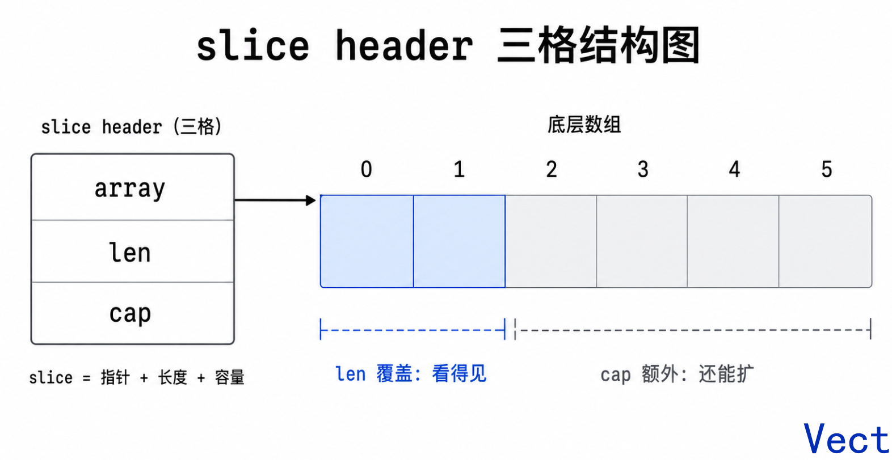
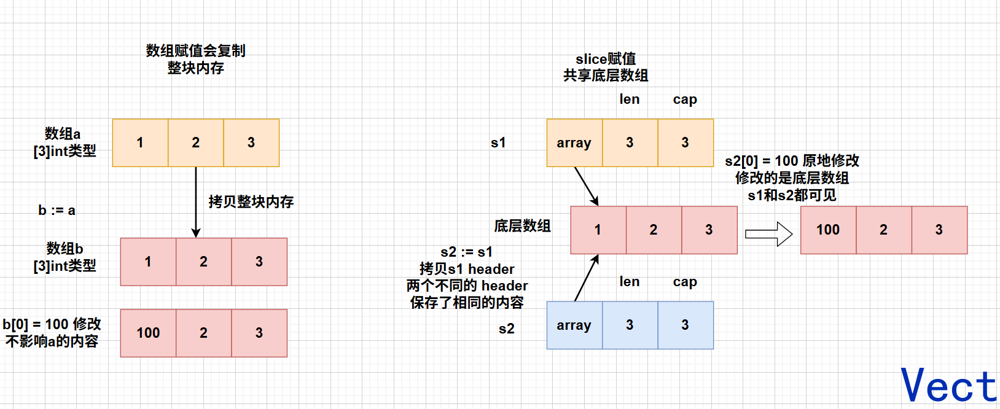
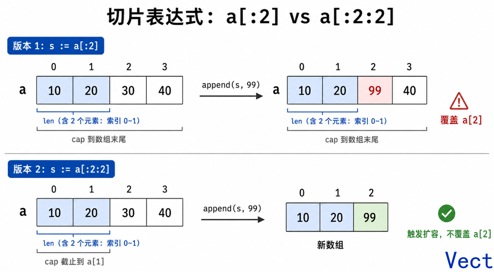
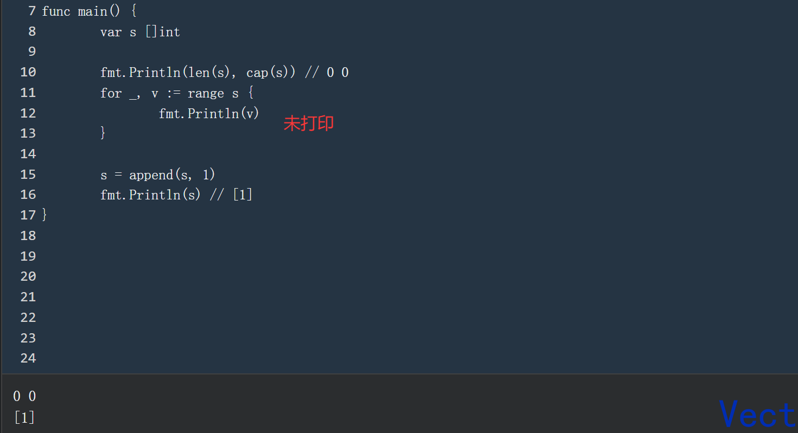
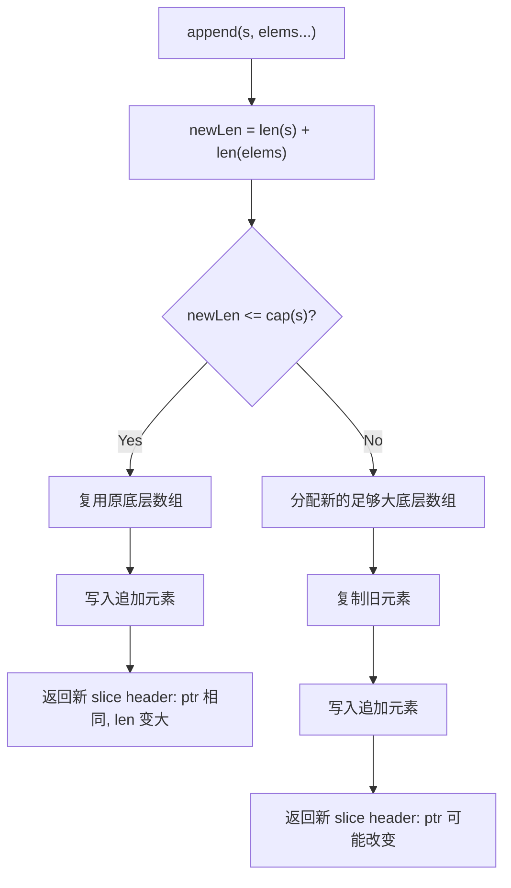
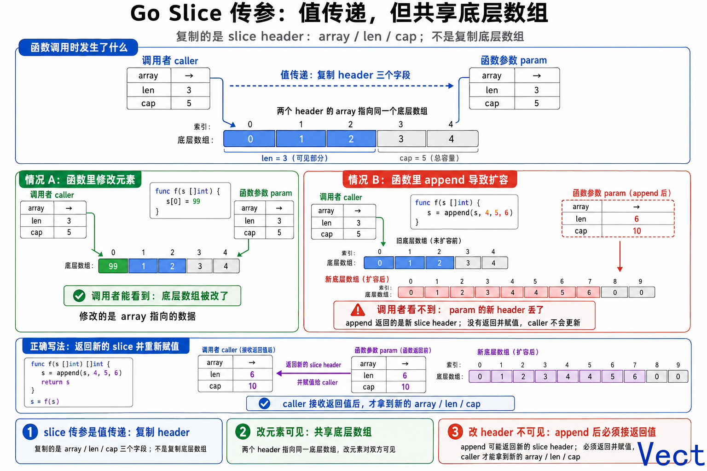
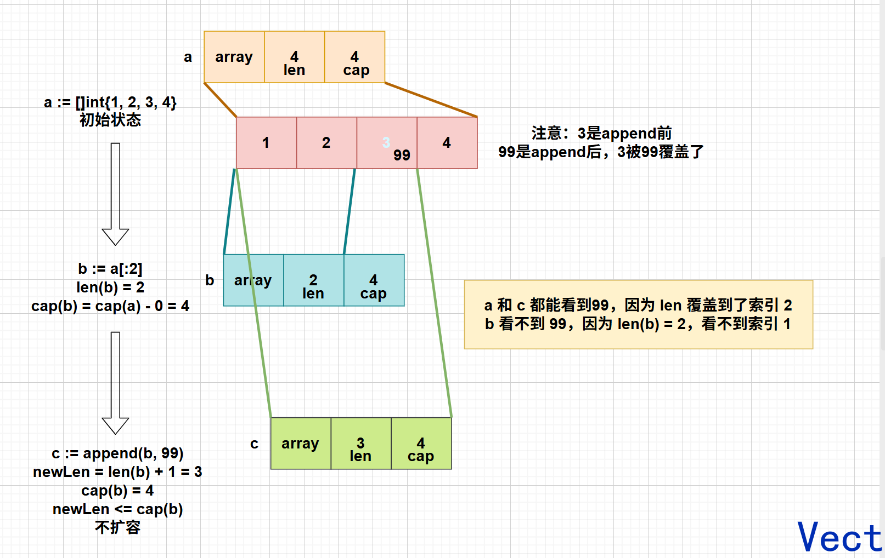

## 0. 先建立一个总模型

Go Spec 定义为：

> A slice is a descriptor for a contiguous segment of an underlying array and provides access to a numbered sequence of elements from that array.

切片是对底层数组连续段的描述符，提供了对数组元素编号序列的访问

Go Blog 进一步拆解内部结构：

> It consists of a pointer to the array, the length of the segment, and its capacity (the maximum length of the segment)

切片包含了一个指向数组的指针，段的长度和底层数组的容量

总结一下：**slice 是对底层数组一段连续区域的描述符。** 这里最关键的词是“描述符”，也就是说，slice 本身不是数组，它只是描述数组的一段。

slice 的真实结构就是三元组：

```go
// /usr/lib/go-1.26/src/runtime/slice.go
type slice struct {
    array unsafe.Pointer
    len   int
    cap   int
}
```

- `array`：指向底层数组中某个元素的地址。
- `len`：当前这个 slice 能直接访问几个元素。
- `cap`：从 `array` 指向的位置开始，最多还能扩展到几个元素。

如果用图表示，就是这样：




这一张图是整篇文章的地基。后面所有问题，都是围绕这三个字段变化：

- 切片表达式改变 `array`、`len`、`cap`。
- `append` 可能改变 `array`、`len`、`cap`。
- 函数传参复制的是这三个字段，不是复制底层数组。
- 内存泄漏和数据污染，通常来自多个 slice 共享同一个底层数组。

## 1. array 和 slice 到底差在哪

数组是值，长度属于类型的一部分：

```go
var a [3]int
var b [4]int

// a 和 b 类型不同，不能直接赋值
```

slice 是动态长度的描述符：

```go
var s []int
s = append(s, 1)
s = append(s, 2, 3)
```

数组复制会复制整个数组值：

```go
a := [3]int{1, 2, 3}
b := a
b[0] = 99

fmt.Println(a) // [1 2 3]
fmt.Println(b) // [99 2 3]
```

slice 复制只复制 header，底层数组仍然共享：

```go
a := []int{1, 2, 3}
b := a
b[0] = 99

fmt.Println(a) // [99 2 3]
fmt.Println(b) // [99 2 3]
```

提问：slice 是引用类型吗？

> 表面像是引用，但 slice 的值本身是一个 header，赋值和传参会复制 header；但 header 里的指针仍然指向同一个底层数组，所以元素修改会共享。



## 2. len 和 cap：一个管访问，一个管扩展

看这个例子：

```go
a := []int{10, 20, 30, 40, 50}
s := a[1:3]

fmt.Println(s)      // [20 30]
fmt.Println(len(s)) // 2
fmt.Println(cap(s)) // 4
```

为什么 `cap(s)` 是 4？因为 `s` 从 `a[1]` 开始，底层数组从这个位置到末尾还有 4 个元素：`20, 30, 40, 50`。

这时内存模型是：

```text
a = [10, 20, 30, 40, 50]
          ^
          s.array

s len = 2  -> 能看见 [20, 30]
s cap = 4  -> 最多扩到 [20, 30, 40, 50]
```

所以这行会 panic：

```go
fmt.Println(s[2]) // panic: index out of range
```

但这行可以：

```go
s = s[:4]
fmt.Println(s) // [20 30 40 50]
```

原因是 `s[2]` 受 `len` 限制，而 `s[:4]` 受 `cap` 限制。

### full slice expression：限制容量

Go 还有三下标切片：

```go
a := []int{10, 20, 30, 40, 50}
s := a[1:3:3]

fmt.Println(s)      // [20 30]
fmt.Println(len(s)) // 2
fmt.Println(cap(s)) // 2
```

`a[low:high:max]` 的长度是 $high-low$，容量是 $max-low$。这里 $low=1, high=3, max=3$，所以 $len=2, cap=2$。

它最常见的用途是防止 append 污染后面的元素：

```go
a := []int{1, 2, 3, 4}
s := a[:2:2]
s = append(s, 99)

fmt.Println(s) // [1 2 99]
fmt.Println(a) // [1 2 3 4]
```

因为 `s` 的容量被限制为 2，再 append 必须分配新数组。



## 3. make、字面量、nil slice、empty slice

创建 slice 常见有三种方式：

```go
var a []int         // nil slice
b := []int{}        // empty slice
c := make([]int, 0) // empty slice
d := make([]int, 3, 8)
```

区别如下：

| 写法                | 是否 nil |  len |  cap | 说明                   |
| ------------------- | -------- | ---: | ---: | ---------------------- |
| `var a []int`       | 是       |    0 |    0 | 未初始化 slice         |
| `[]int{}`           | 否       |    0 |    0 | 已初始化的空 slice     |
| `make([]int, 0)`    | 否       |    0 |    0 | 已初始化的空 slice     |
| `make([]int, 3, 8)` | 否       |    3 |    8 | 有 cap 为 8 的底层数组 |

它们大多数情况下都能正常使用：

```go
var s []int

fmt.Println(len(s), cap(s)) // 0 0
for _, v := range s {
    fmt.Println(v)
}

s = append(s, 1)
fmt.Println(s) // [1]
```



runtime 里 `make([]T, len, cap)` 走的是 `makeslice`。核心逻辑是检查长度、容量和内存溢出，然后分配内存：

```go
// /usr/lib/go-1.26/src/runtime/slice.go
func makeslice(et *_type, len, cap int) unsafe.Pointer {
    mem, overflow := math.MulUintptr(et.Size_, uintptr(cap))
    if overflow || mem > maxAlloc || len < 0 || len > cap {
        ...
    }

    return mallocgc(mem, et, true)
}
```

总结一下：

> `make([]T, len, cap)` 会创建一个 slice header，并为它分配一个隐藏的底层数组。`len` 决定当前可访问元素个数，`cap` 决定不重新分配时最多能扩到多长。`len` 不能大于 `cap`。

## 4. append 和扩容：容量够原地写，容量不够换数组

`append` 的官方语义很简单：

- 容量够：复用原底层数组。
- 容量不够：分配新底层数组，复制旧元素，再追加新元素。
- 返回新的 slice。

所以永远记住：

```go
s = append(s, x)
```

### 容量够：原地扩展

```go
a := make([]int, 2, 4)
a[0], a[1] = 1, 2

b := append(a, 3)

fmt.Println(a) // [1 2]
fmt.Println(b) // [1 2 3]

b[0] = 99
fmt.Println(a) // [99 2]
```

这里 `a` 和 `b` 共享底层数组，只是 `len` 不同。`a` 的长度还是 2，所以打印不出 `3`；但底层数组里已经写进去了。

### 容量不够：换新数组

```go
a := make([]int, 2, 2)
a[0], a[1] = 1, 2

b := append(a, 3)
b[0] = 99

fmt.Println(a) // [1 2]
fmt.Println(b) // [99 2 3]
```

因为 `a` 的容量只有 2，append 第三个元素时必须分配新数组。所以 `a` 和 `b` 不再共享。


```mermaid
flowchart TD
    A["append(s, elems...)"] --> B["newLen = len(s) + len(elems)"]
        B --> C{"newLen <= cap(s)?"}
            C -->|Yes| D["复用原底层数组"]
                D --> E["写入追加元素"]
                    E --> F["返回新 slice header: ptr 相同, len 变大"]
                        C -->|No| G["分配新的足够大底层数组"]
                            G --> H["复制旧元素"]
                                H --> I["写入追加元素"]
                                    I --> J["返回新 slice header: ptr 可能改变"]
```

### runtime 源码：append 扩容到底怎么长

当容量不够时，runtime 会调用 `growslice`。核心源码：

```go
// /usr/lib/go-1.26/src/runtime/slice.go
func growslice(oldPtr unsafe.Pointer, newLen, oldCap, num int, et *_type) slice {
    oldLen := newLen - num
    ...
    newcap := nextslicecap(newLen, oldCap)
    ...
    p = mallocgc(capmem, ...)
    memmove(p, oldPtr, lenmem)

    return slice{p, newLen, newcap}
}
```

- `oldPtr` 是旧底层数组地址。
- `newLen` 是 append 后的新长度。
- `oldCap` 是旧容量。
- `num` 是追加元素个数。
- `newcap` 由 `nextslicecap` 计算。
- `memmove` 把旧元素复制到新数组。
- 最后返回新的 slice header。

真正的扩容策略在 `nextslicecap`：

```go
// /usr/lib/go-1.26/src/runtime/slice.go
func nextslicecap(newLen, oldCap int) int {
    newcap := oldCap
    doublecap := newcap + newcap
    if newLen > doublecap {
        return newLen
    }

    const threshold = 256
    if oldCap < threshold {
        return doublecap
    }
    for {
        newcap += (newcap + 3*threshold) >> 2
        if uint(newcap) >= uint(newLen) {
            break
        }
    }

    if newcap <= 0 {
        return newLen
    }

    return newcap
}
```

这段源码对应的结论：

1. 如果一次 append 后的 `newLen` 比 `oldCap*2` 还大，直接用 `newLen`。
2. 如果旧容量小于 256，倾向翻倍。
3. 如果旧容量大于等于 256，使用平滑增长公式，逐步过渡到约 1.25 倍。
4. 最终容量还会经过内存分配器 size class 的取整，所以实际 `cap` 可能比公式更大。

基于 Go 1.26 源码总结扩容步骤：


> Go 1.26 中，slice 扩容由 `nextslicecap` 决定：小于 256 时倾向 2 倍，之后用平滑公式逐渐接近 1.25 倍。如果一次追加超过 2 倍容量，则直接满足新长度。最终容量还会受内存分配器 size class 影响。

总结一下：

> append 最重要的分岔点就是容量够不够。容量够，原地写，多个 slice 可能互相影响；容量不够，runtime 分配新数组，复制旧元素，返回新的 slice header。所以写代码时，append 的返回值一定要接住。

## 5. 函数传 slice：能改元素，改不了调用者 header

先看这个：

```go
func changeElem(s []int) {
    s[0] = 99
}

func main() {
    a := []int{1, 2, 3}
    changeElem(a)
    fmt.Println(a) // [99 2 3]
}
```

为什么能改？因为函数参数复制了 slice header，但新旧 header 指向同一个底层数组。

再看这个：

```go
func appendElem(s []int) {
    s = append(s, 4)
}

func main() {
    a := []int{1, 2, 3}
    appendElem(a)
    fmt.Println(a) // [1 2 3]
}
```

为什么看不到新元素？因为 `appendElem` 里面修改的是参数 `s` 这个 header 副本，调用者的 `a.len` 没变。

正确写法：

```go
func appendElem(s []int) []int {
    return append(s, 4)
}

func main() {
    a := []int{1, 2, 3}
    a = appendElem(a)
    fmt.Println(a) // [1 2 3 4]
}
```

总结：


> slice 传参是值传递，复制的是 `array,len,cap` 三个字段。因为 `array` 指向同一个底层数组，所以函数里修改元素，调用者能看到；但如果函数里 append 导致 len/cap/header 改变，调用者看不到，除非返回新的 slice 并重新赋值。

## 6. 截取、删除、新增：本质都是在操作同一个底层数组

这一章把几个常见操作放到一起讲，因为它们底层都是在处理同一件事：

> slice header 怎么变，底层数组有没有被复用。

### 6.1 截取切片：截的是 header，不是数组

看代码：

```go
a := []int{1, 2, 3, 4, 5}
b := a[1:4]

fmt.Println(b)      // [2 3 4]
fmt.Println(len(b)) // 3
fmt.Println(cap(b)) // 4
```

`b := a[1:4]` 并没有复制出一个新数组，它只是新建了一个 slice header：

```text
a = [1 2 3 4 5]
     0 1 2 3 4
           ^
          b.array

b len = 4 - 1 = 3
b cap = 从 a[1] 到数组末尾 = 4
```

所以修改 `b`，`a` 也会看到：

```go
a := []int{1, 2, 3, 4, 5}
b := a[1:4]
b[0] = 99

fmt.Println(a) // [1 99 3 4 5]
fmt.Println(b) // [99 3 4]
```

再看三下标切片：

```go
a := []int{1, 2, 3, 4, 5}
b := a[1:4:4]

fmt.Println(len(b)) // 3
fmt.Println(cap(b)) // 3
```

公式是：$len = high - low, cap = max - low$

也就是说，`a[1:4:4]` 把 `b` 的容量限制到了 `a[3]` 为止。后面如果对 `b` append，因为 cap 不够，就会分配新数组，不会继续覆盖 `a` 后面的元素。

### 6.2 append 污染：为什么截取后新增会改到原数组

看代码：

```go
a := []int{1, 2, 3, 4}
b := a[:2]
c := append(b, 99)

fmt.Println(a)
fmt.Println(b)
fmt.Println(c)
```

输出是：

```text
[1 2 99 4]
[1 2]
[1 2 99]
```

为什么 `a[2]` 被改了？因为：

```text
a = [1 2 3 4]
b = a[:2], len=2, cap=4
append(b, 99) 容量够，直接写到底层数组下标 2
```



这张图就能很清楚解释。

想让 `append(b, 99)` 不影响 `a`，解决方式有三种。

第一种：用 full slice expression 限制容量：

```go
a := []int{1, 2, 3, 4}
b := a[:2:2]
c := append(b, 99)

fmt.Println(a) // [1 2 3 4]
fmt.Println(c) // [1 2 99]
```

第二种：复制一份：

```go
b := append([]int(nil), a[:2]...)
```

第三种：用标准库：

```go
b := slices.Clone(a[:2])
```

### 6.3 删除元素：本质是把后面的元素往前挪

删除一个元素最常见的写法：

```go
s := []int{1, 2, 3, 4, 5}
i := 2

s = append(s[:i], s[i+1:]...)
fmt.Println(s) // [1 2 4 5]
```

删除一段区间：

```go
s := []int{1, 2, 3, 4, 5}
s = append(s[:1], s[3:]...)

fmt.Println(s) // [1 4 5]
```

这两个写法的本质都是：把后半段元素移动到前面，然后缩短 len。底层数组大概率还是原来的数组。

Go 标准库 `slices.Delete` 也是这个思路：

```go
// /usr/lib/go-1.26/src/slices/slices.go
func Delete[S ~[]E, E any](s S, i, j int) S {
    _ = s[i:j:len(s)] // bounds check

    if i == j {
        return s
    }

    oldlen := len(s)
    s = append(s[:i], s[j:]...)
    clear(s[len(s):oldlen]) // zero/nil out the obsolete elements, for GC
    return s
}
```

这里最值得看的是最后一行：

```go
clear(s[len(s):oldlen])
```

为什么要 `clear`？因为如果 slice 里放的是指针，删除后尾部位置虽然不在 len 范围里了，但底层数组里还可能残留旧指针。只要底层数组还活着，GC 就可能认为那些对象还被引用着。

总结一下：

> 删除不是把底层数组真的挖掉一块，而是把后面的元素往前搬，再把 len 变短。对于含指针元素，删除后还要把废弃尾部清零，避免旧引用拖住内存。

### 6.4 新增元素：尾部 append 简单，中间插入要移动

尾部新增就是 append：

```go
s := []int{1, 2, 3}
s = append(s, 4)

fmt.Println(s) // [1 2 3 4]
```

中间插入可以用标准库：

```go
s := []int{1, 2, 4, 5}
s = slices.Insert(s, 2, 3)

fmt.Println(s) // [1 2 3 4 5]
```

`slices.Insert` 的核心动作是：先给 slice 腾出位置，再把后面的元素往后挪，最后把新元素放进去。如果容量不够，中间也会触发扩容。

所以不管是 append 还是 Insert，都要接返回值：

```go
s = append(s, x)
s = slices.Insert(s, i, x)
```

总结一下：

> 截取、删除、新增这些操作看起来是上层语法，本质都绕不开底层数组。只要多个 slice 共享同一个底层数组，元素修改、append、delete、insert 都可能互相影响。想隔离，就限制 cap 或复制。

## 7. 拷贝和内存：什么时候必须切断底层数组

前面反复说“共享底层数组”，那什么时候必须切断？

先说结论：

> 只是读，可以共享；后面要改、要 append、要长期保存小片段、要跨模块传递可变数据，就应该复制。

### 7.1 浅拷贝：复制 slice header

```go
a := []int{1, 2, 3}
b := a
b[0] = 99

fmt.Println(a) // [99 2 3]
```

这不叫深拷贝，只是复制了一份 slice header。`a.array` 和 `b.array` 还是指向同一个底层数组。

### 7.2 一维 slice 深拷贝

常见有三种写法。

第一种：`make + copy`：

```go
a := []int{1, 2, 3}
b := make([]int, len(a))
copy(b, a)

b[0] = 99
fmt.Println(a) // [1 2 3]
fmt.Println(b) // [99 2 3]
```

第二种：`append` 到 nil slice：

```go
b := append([]int(nil), a...)
```

第三种：Go 1.21 以后直接用 `slices.Clone`：

```go
b := slices.Clone(a)
```

标准库源码里也说得很清楚：

```go
// /usr/lib/go-1.26/src/slices/slices.go
func Clone[S ~[]E, E any](s S) S {
    if s == nil {
        return nil
    }
    return append(S{}, s...)
}
```

注意：`Clone` 复制的是 slice 元素本身。如果元素本身又是 slice、map、指针，那里面指向的数据还是共享的。

### 7.3 二维 slice：只 Clone 外层不够

看代码：

```go
a := [][]int{{1, 2}, {3, 4}}
b := slices.Clone(a)

b[0][0] = 99
fmt.Println(a[0][0]) // 99
```

为什么还是影响了 `a`？因为 `b := slices.Clone(a)` 只复制了外层 `[][]int`，里面每个 `[]int` 的底层数组还是共享的。

真正的二维深拷贝要逐层复制：

```go
a := [][]int{{1, 2}, {3, 4}}
b := make([][]int, len(a))

for i := range a {
    b[i] = slices.Clone(a[i])
}

b[0][0] = 99
fmt.Println(a[0][0]) // 1
fmt.Println(b[0][0]) // 99
```

### 7.4 小切片拖住大数组

还有一种内存问题非常隐蔽：

```go
func firstTen(big []byte) []byte {
    return big[:10]
}
```

如果 `big` 是 100MB，返回值只有 10 字节，但这个小 slice 的 `array` 仍然指向原来的大数组。只要这个小 slice 活着，整个大数组就可能释放不了。

正确写法：

```go
func firstTen(big []byte) []byte {
    return slices.Clone(big[:10])
}
```


总结一下：

> 拷贝要看你到底想复制什么。`b := a` 只复制 header；`slices.Clone(a)` 能复制一维元素；二维 slice 要逐层复制。只要你想彻底切断和原底层数组的关系，就要真正分配新数组并 copy 数据。

## 8. 总结

可以把 slice 的所有行为都套进下面这条链路：

```text
slice header: ptr + len + cap
        |
        v
是否共享底层数组？
        |
        +-- 是：改元素互相可见，append 可能污染
        |
        +-- 否：互不影响

append 时：
        |
        +-- newLen <= cap：原地写，ptr 不变
        |
        +-- newLen > cap：分配新数组，copy 旧元素，ptr 改变
```

每次问自己四个问题：

1. 我现在拿到的是 header，还是底层数组？
2. 这个 slice 和谁共享底层数组？
3. 后面 append 会不会复用旧数组？
4. 是否有大数组或指针尾部被无意持有？

```go
package main

import (
    "fmt"
    "slices"
)

func appendInFunc(s []int) {
    s = append(s, 99)
}

func appendReturn(s []int) []int {
    return append(s, 99)
}

func main() {
    a := []int{1, 2, 3, 4}
    b := a[:2]
    c := append(b, 100)

    fmt.Println("case1 a:", a)
    fmt.Println("case1 b:", b)
    fmt.Println("case1 c:", c)

    x := []int{1, 2, 3}
    appendInFunc(x)
    fmt.Println("case2 x:", x)

    x = appendReturn(x)
    fmt.Println("case3 x:", x)

    y := []int{1, 2, 3, 4}
    z := y[:2:2]
    z = append(z, 100)
    fmt.Println("case4 y:", y)
    fmt.Println("case4 z:", z)

    p := []*int{}
    v1, v2, v3 := 1, 2, 3
    p = append(p, &v1, &v2, &v3)
    p = slices.Delete(p, 1, 2)
    fmt.Println("case5 len/cap:", len(p), cap(p))

    m := [][]int{{1, 2}, {3, 4}}
    n := make([][]int, len(m))
    for i := range m {
        n[i] = slices.Clone(m[i])
    }
    n[0][0] = 100
    fmt.Println("case6 deep copy:", m[0][0], n[0][0])
}
```

重点观察：

- `case1` 是否污染了 `a`。
- `case2` 为什么 append 后外面看不到。
- `case3` 为什么返回后看得到。
- `case4` 为什么 full slice expression 能隔离 append。
- `case5` 标准库删除后长度怎么变，尾部为什么要 clear。
- `case6` 为什么二维 slice 要逐层 Clone。

slice 的本质不只是动态数组，而是一个指向底层数组的描述符。它的核心是 `ptr + len + cap`。赋值和传参复制 header，元素修改共享底层数组；append 容量够就原地写，容量不够就分配新数组并复制旧元素；扩容策略由 runtime 决定，Go 1.26 中小容量倾向翻倍，大容量平滑接近 1.25 倍，并受 size class 影响。