## 内存对齐前置知识

### 1. CPU 如何访问内存

CPU 访问内存的过程可以简化成：

```text
CPU
  ↓ 地址总线：告诉内存“我要访问哪个地址”
内存
  ↓ 数据总线：把这个地址上的数据送回 CPU
CPU
```

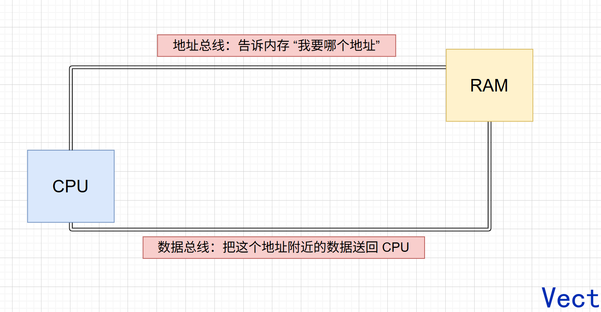

地址总线可以理解成 CPU 用来表示地址的一组二进制线路。

如果地址总线有 32 根，每根线只能表示 0 或 1，32 根一共可以表示 $2^{32}$ 种不同的地址

现代计算机按照字节编址，**一字节对应一个地址**，那么：

- 可表示地址数量： $2^{32}$ 
- 每个地址：1 字节
- 总寻址空间： $2^{32}$ 字节 -> 1 G =  $2^{30}$ 字节 -> $2^{32} / 2^{30} = 2^2 = 4 G$ 


### 2. 内存对齐规则

内存按照字节编址，但是 CPU 访问数据，更喜欢按照固定边界访问，比如访问一个 `int32` 类型，4字节的数据

把它起始位置放在不同位置，会有不同的读取效果：

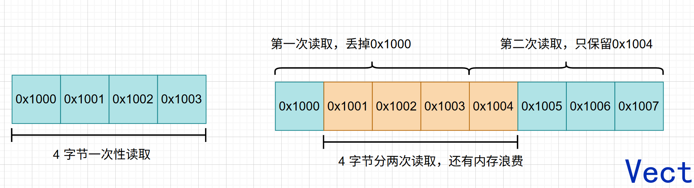

我总结了两句话：

前提：编译器都有默认的**对齐数**，64位默认为8

规则一：**成员自身对齐（决定字段偏移量）$min(自身类型大小，默认对齐数)$的整数倍**

规则二：**结构体整体对齐（决定结构体最终大小），结构体大小=$min(内部最大基础成员的大小，默认对齐数)$的整数倍**


## slice 原理剖析

### 1. slice 是什么？

**slice 是对底层数组的一段描述**

slice 本身不是数组，只是一个描述结构，**记录一段连续数据存在哪里，存了多少，还能存多少**

结构类似：

```go
type slice struct {
    array unsafe.Pointer		// 指向底层数组的某个地址
    len   int					// 当前能访问的元素个数
    cap   int					// 从 ptr 到底层数组末尾的数量
}
```

本文的指针采用 `data` 来描述


**slice 和 数组有什么区别？**

```go
arr := [3]int{1, 2, 3}
```

这是数组的描述，长度是类型的一部分，**[3]int 和 [4]int 是不同类型**

而 slice 更像是一个窗口：

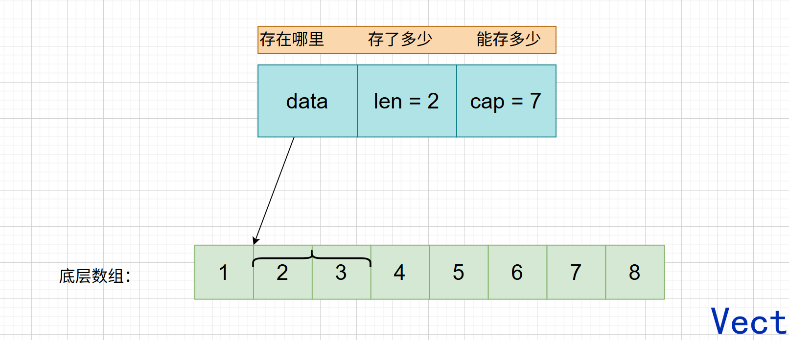


### 2. slice 的声明和定义

`	var ints []int` 只声明了一个 slice 结构，并没有分配底层数组

同样的，`ints = new([]int)`，`new([]int)` 会分配一个零值 slice header，并返回它的地址；但它不会分配底层数组。

他们的 `data = nil, len = 0, cap = 0`

真正分配底层数组的是 `make`

```go
var ints []int = make([]int, 2, 5)		// make(type, len, cap) 底层数组初始化全是 0，len = 2，cap = 5
var ints []int = make([]int, 5)			// make(type, len) 底层数组初始化全是 0，len = cap = 5
```

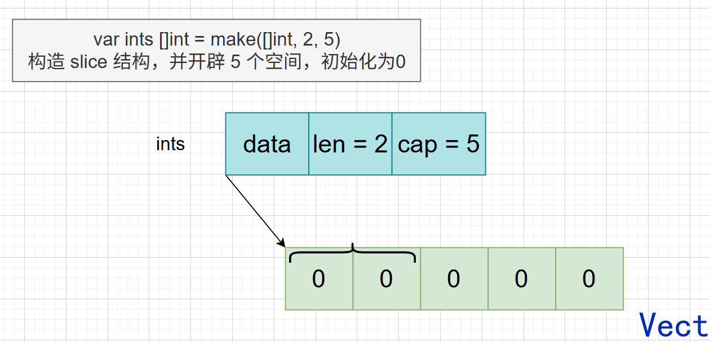

此时只能访问修改 len 覆盖的合法区域，超过 len 覆盖的合法区域会发生 panic

再举个例子：

```go
ps := new([]string)
```

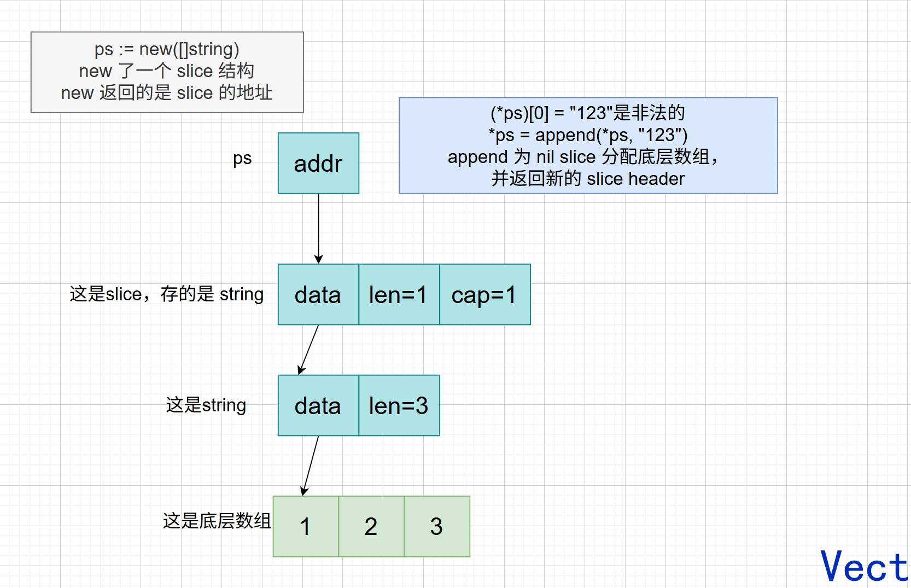

`new([]string)` 分配的是一个 **slice 变量本身**，返回它的地址，所以：

```go
ps  // 类型是 *[]string
*ps // 类型是 []string
```

此时 `*ps` 是零值 slice：

```text
data = nil
len = 0
cap = 0
```

所以：

```go
(*ps)[0] = "123"
```

非法，因为 `len=0`，访问下标 0 越界。

但是：

```go
*ps = append(*ps, "123")
```

合法。因为 nil slice 可以 append，append 会分配底层数组，并返回新的 slice header，再赋值给 `*ps`。

此时结构是：

```text
ps
 ↓
slice header: data, len=1, cap=1
 ↓
[]string 的底层数组：[ string("123") ]
                         ↓
                    string header: data, len=3
                         ↓
                    字节数据：1 2 3
```


### 3. slice 的扩容

构造一个底层数组：`arr := [10]int{1,2,3,4,5,6,7,8,9,10}`

构造两个切片：

```go
s1 := arr[1:4]
s2 := arr[7:]
```

对于`[low:high]`，有公式：$len = high - low, cap = len(arr) - low$

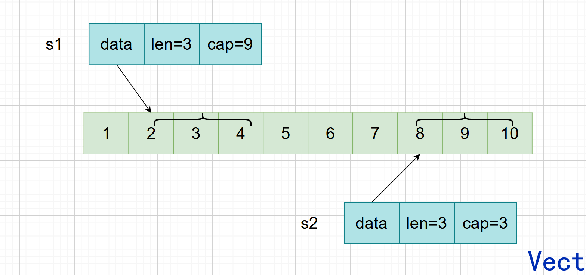

记住一句话：**slice 访问和修改的都是底层数组，多个 slice 变量可能共享同一个底层数组**

现在进行：

```go
s2 = append(s2, 100)
```

发现 `s2` 的容量只有 3 ，此时的空间用不了了，需要开辟一块新的内存，开辟多大呢？

原先的容量是 3，添加一个元素，所以容量至少为 4，我们把 4 当作 needCap，3 当作 oldCap

具体扩容逻辑如下：

1. **预估新空间的容量个数 newCap**

   a. 如果 2oldCap < needCap，newCap = needCap

   b. 反之，继续分叉判断

   ​	如果 oldCap < 256，直接两倍扩，newCap = 2oldCap

   ​	如果 oldCap >= 256，newCap = 1.25oldCap

2. **计算 newCap 个元素需要多大内存**

   $所需内存 = newCap \times 元素类型大小$，本例中是 $6 \times 8 = 48 字节$

3. 匹配到合适的内存规格

   64 位机器是 8 的整数倍作为规格，所以最后需要 48 字节空间

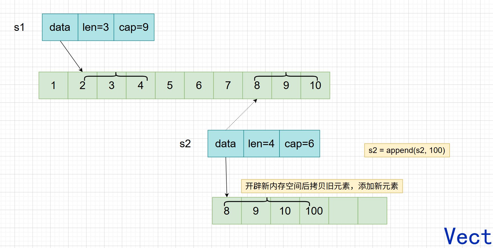


### 4. slice 行为分析

#### 4.1 slice 函数传参

**slice 传参，传递的是 slice header 的副本**

```text
原 slice header：data, len, cap
函数参数 slice header：data, len, cap 的拷贝
```

但是**两个 header 的 data 指针指向同一个底层数组**

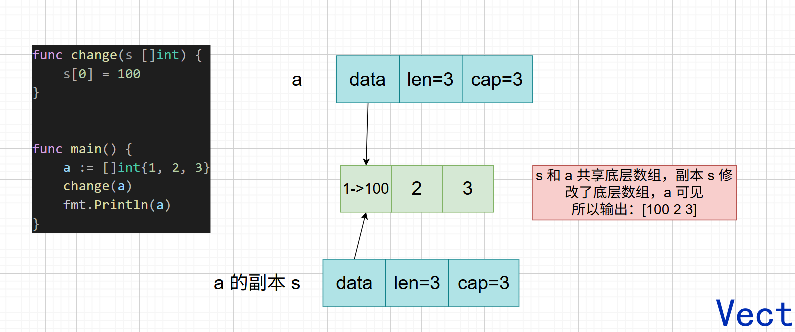

要小心 append 可能触发扩容逻辑，此时副本可能不和原始 header 共享底层数组了：

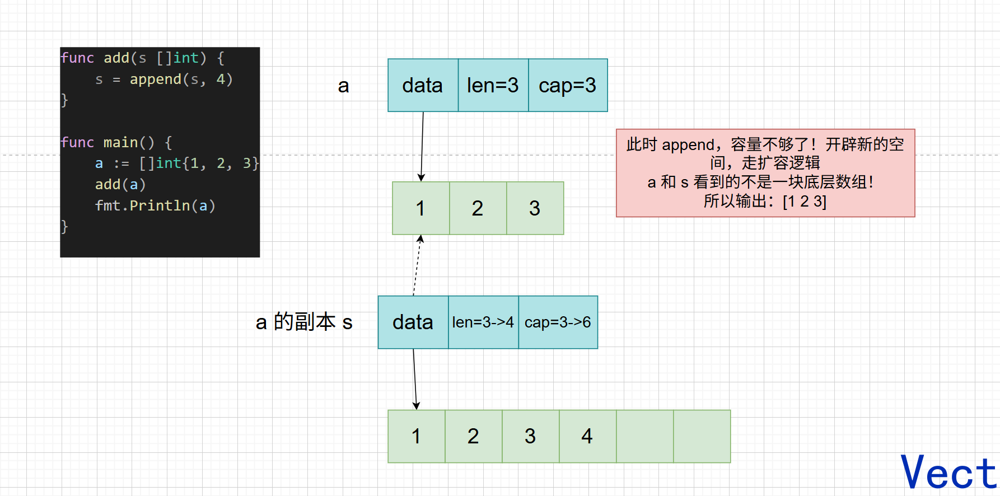

所以为了让 a 看到 append 扩容后的修改，需要接住 append 的返回值：

```go
func add(s []int) []int {
    s = append(s, 4)
    return s
}

func main() {
    a := []int{1, 2, 3}
    a = add(a)
    fmt.Println(a)
}
```

这样就会输出：`[1 2 3 4]`

#### 4.2 截取 slice

**截取 slice，是创建一个新的 slice header，底层数组还是同一个**

```go
a := []int{1, 2, 3, 4, 5}
b := a[1:3]
```

此时的 b：

```go
a := []int{1, 2, 3, 4, 5}
b := a[1:3]
```

a 和 b 共享底层数组

```go
b[0] = 100
fmt.Println(a)
```

a 看到了底层数组的修改，输出：

```go
[1 100 3 4 5]
```

**对于三下标 slice**

```go
b := a[1:3:3]
```

格式是：**s[low:high:max]**，有公式：$len = high - low, cap = max - low$

**三下标切片作用是限制 cap，防止 append 时污染底层数组**

例如：

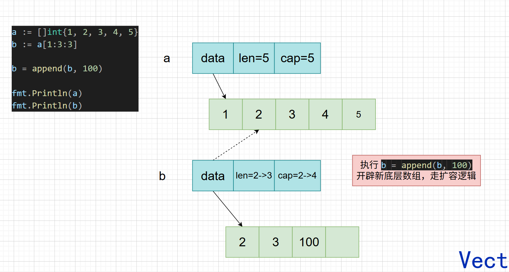

#### 4.3 append

经过上述案例讲解，对于 append 新增元素：

- 容量够，复用原底层数组
- 容量不够，开辟新的底层数组，走扩容逻辑，复制旧元素到新底层数组

#### 4.4 删除元素

Go 没有内置 slice 的删除函数，可以使用 append 完成

删除第 i 个元素：

```go
s = append(s[:i], s[i+1:]...)
```

例如：

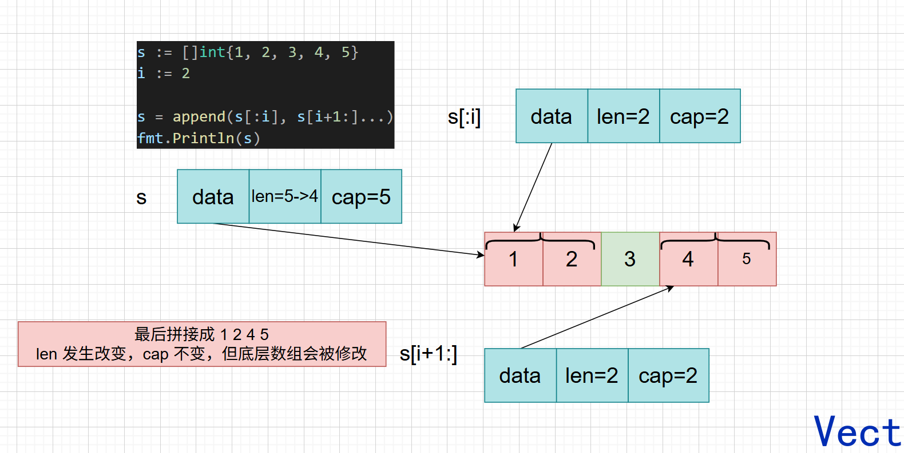

上图我没有画出底层数组被修改的图

对于删除 slice 元素，本质是把后面的元素向前移动，覆盖要删除的位置；底层数组最后残留的位置不会自动清零。


## 总结

slice 是一段连续数据的描述，描述这段数据的**起始地址在哪里、当前有多少有效元素、当前能容纳多少元素**

多个 slice 可能共享同一份底层数组，所以修改的时候要小心

slice 的扩容逻辑：

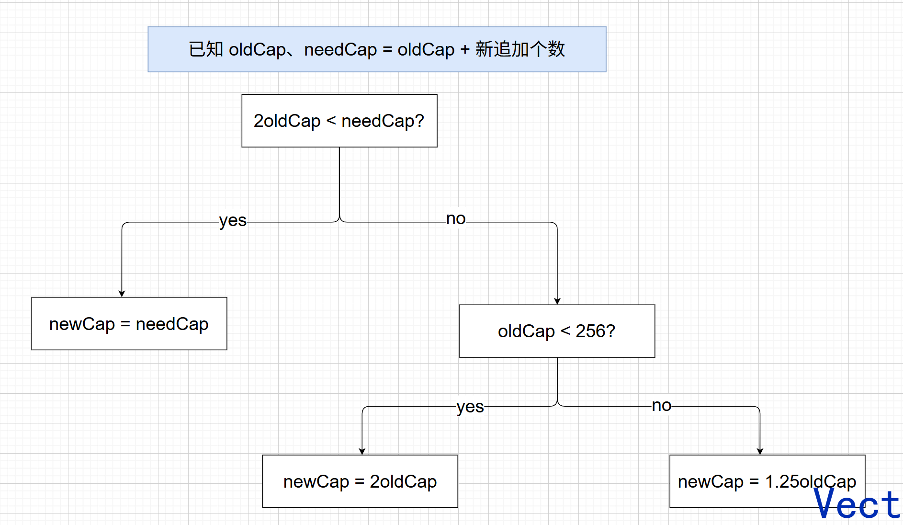

函数传参，传递的是原始 slice header 的一个副本，两个 slice header 共享底层数组，如果 append 触发扩容，想让外层 slice 看到新的结果，就必须接收返回值，需要接收 append 的返回值，并返回

截取切片，截取的是 slice header，原始 slice header 和 截取的共享底层数组

删除切片元素，使用 append 进行拼接，本质是截取需要的部分后拼接

