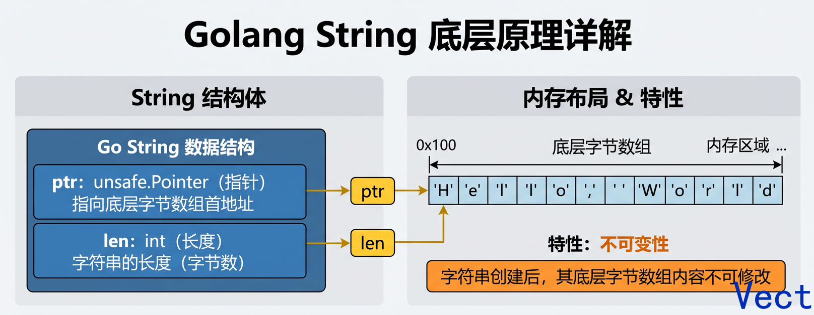
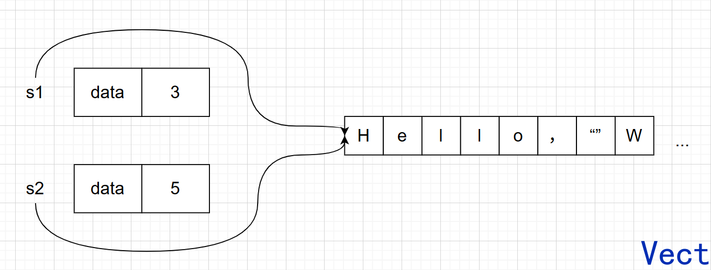
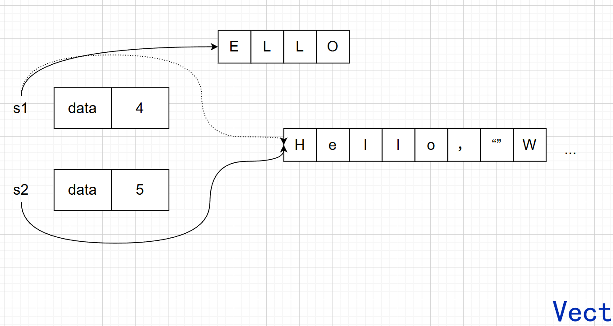
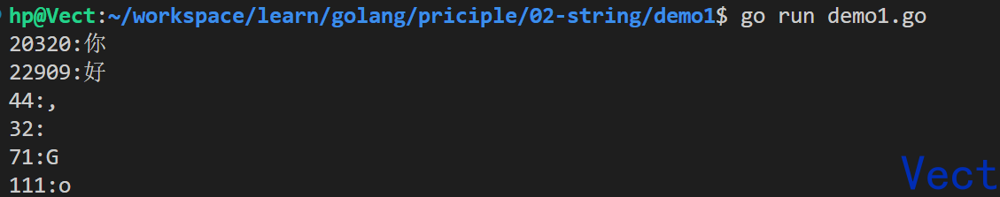
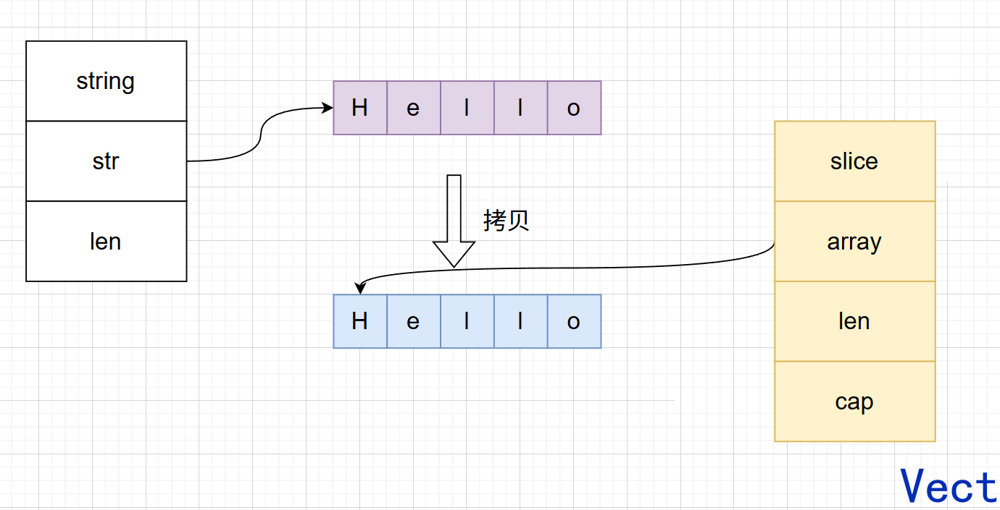
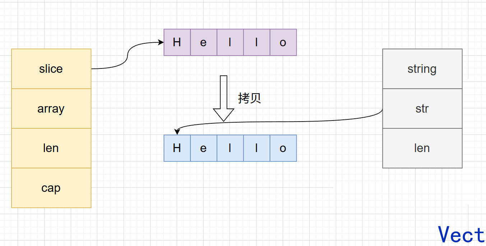

先看一段很简单的代码：

```go
package main

import "fmt"

func main() {
	s := "你好"

	fmt.Println(len(s)) // 6
	fmt.Println(s[0])   // 228
}
```

字符串中明明只有两个汉字，为什么 `len(s)` 返回的是 `6`？

通过下标访问字符串时，为什么得到的不是 `"你"`，而是整数 `228`？

继续向下追问，还会遇到更多看似矛盾的现象：

* 为什么字符串可以使用切片语法，却不能修改其中的元素？
* 为什么一个只有 100 字节的子字符串，可能让一块 1 GB 的内存迟迟无法回收？
* 为什么 `string` 和 `[]byte` 的转换通常需要复制？
* 为什么循环中反复使用 `+=`，可能让字符串拼接退化到 $O(n^2)$？
* `string` 表示的究竟是字符、Unicode 码点，还是原始字节？

这些现象背后，其实指向同一个底层模型：

> Go 的 `string` 不是字符数组，而是一个带有长度信息的不可变字节序列。

理解这个模型之后，字符串的长度、下标、遍历、切片、转换和拼接行为，就可以沿着同一条逻辑统一起来。

---

## 从 C 语言的 `\0` 说起

C 语言字符串通常使用 `\0` 标记结尾。

程序读取字符串时，会从首地址开始不断向后扫描，直到遇到 `\0`。

例如：

```c
char str[] = "hello";
```

它在内存中通常类似于：

```text
h e l l o \0
```

这种表示方式本质上是一种**终止符模型**：程序只知道字符串从哪里开始，却不能仅凭地址直接知道它有多长。

因此会带来两个典型问题：获取长度需要遍历，时间复杂度为 $O(n)$；字符串中间不能直接包含 `\0`，一旦出现，传统 C 字符串函数就会将它视为结束位置。

Go 采用了不同的表示方式。

Go 的字符串值会直接保存：

1. 字节数据所在的位置；
2. 字符串的字节长度。

也就是说，Go 使用的是一种**地址加长度模型**。

从运行时实现角度，可以将 `string` 理解为：

```go
type stringStruct struct {
	str unsafe.Pointer // 指向字符串第一个字节
	len int            // 字节长度，不是字符数量
}
```

> `stringStruct` 是运行时内部结构，这里只用于理解底层模型。语言规范定义的是 `string` 的行为，并不承诺业务代码可以直接依赖或修改该内存布局。

内存布局长这样：



在常见的 64 位平台上：

* 指针占 8 字节；
* `int` 占 8 字节；
* 因此字符串描述信息通常占 16 字节。

`string` 没有类似切片的 `cap` 字段。

这是因为字符串被设计为不可变值，不支持像切片一样在原有字符串后原地追加内容，也不存在对外暴露的扩容能力。

Go 对 `string` 的定义可以归纳为四点：

* `string` 是一个不可变的字节序列；
* `len(s)` 返回字节长度；
* `string` 通常用于保存 UTF-8 文本，但内容不要求一定是合法 UTF-8；
* `string` 的零值是空字符串 `""`，不存在 `nil string`。

由于 Go 不依赖 `\0` 判断字符串结束，因此字符串内部可以包含零字节：

```go
package main

import "fmt"

func main() {
	s := "Go\x00Lang"

	fmt.Println(len(s)) // 7
	fmt.Printf("%q\n", s)
}
```

输出：

```text
7
"Go\x00Lang"
```

这里的 `\x00` 就是数值为零的字节，但它不会导致 Go 字符串提前结束。

这也是地址加长度模型与终止符模型之间最直观的区别。

---

## 为什么 `len(s)` 是 $O(1)$？

在 Go 中，`len(s)` 返回字符串的**字节数**，而不是人类直觉中的字符数量。

例如：

```go
package main

import (
	"fmt"
	"unicode/utf8"
)

func main() {
	s := "你好"

	fmt.Println(len(s))                    // 6
	fmt.Println(utf8.RuneCountInString(s)) // 2
	fmt.Println(len([]rune(s)))            // 2
}
```

在 UTF-8 编码下：

* `"你"` 占 3 个字节；
* `"好"` 占 3 个字节；
* 因此 `"你好"` 一共占 6 个字节。

所以：

```go
len("你好") == 6
```

`len(s)` 的时间复杂度为 $O(1)$。

原因不是程序能够瞬间分析出字符串有多少内容，而是字符串的字节长度已经保存在字符串描述信息中。

调用 `len(s)` 时，只需要读取其中的长度字段，不需要重新扫描底层数据。

---

## 字节数、rune 数和视觉字符数不是一回事

讨论字符串长度时，需要区分三个不同概念。

| 概念          | 含义             | 常见获取方式                      |
| ----------- | -------------- | --------------------------- |
| 字节数         | 字符串底层一共占多少字节   | `len(s)`                    |
| Unicode 码点数 | 字符串中包含多少个 rune | `utf8.RuneCountInString(s)` |
| 用户感知字符数     | 人眼看到的完整字符数量    | 需要按照字素簇处理                   |

`rune` 是 `int32` 的别名，用于表示一个 Unicode 码点：

```go
type rune = int32
```

但一个 rune 不一定等于一个用户视觉上看到的完整字符。

例如下面两个字符串，视觉上可能都显示为 `é`：

```go
s1 := "é"
s2 := "e\u0301"
```

其中：

* `s1` 使用单个 Unicode 码点 `U+00E9`；
* `s2` 由字母 `e` 和组合重音符号两个码点组成。

例如：

```go
package main

import (
	"fmt"
	"unicode/utf8"
)

func main() {
	s1 := "é"
	s2 := "e\u0301"

	fmt.Println(len(s1))                    // 2
	fmt.Println(utf8.RuneCountInString(s1)) // 1

	fmt.Println(len(s2))                    // 3
	fmt.Println(utf8.RuneCountInString(s2)) // 2
}
```

它们视觉上可能相同，但字节数和 rune 数并不相同。

Emoji 也经常由多个 Unicode 码点组合而成。因此：

> `len(s)` 统计字节数，`RuneCountInString` 统计 Unicode 码点数，但二者都不一定等于用户视觉上的字符数量。

---

## `string` 为什么不可变？

Go 不允许直接修改字符串中的字节：

```go
s := "hello"
s[0] = 'H' // 编译错误
```

需要注意，`string` 不可变是 Go 语言层面的规则，并不是因为所有字符串数据都一定存储在只读内存区。

字符串常量通常可能位于程序的只读数据区域；运行时动态生成的字符串，也可能位于堆、栈或其他内存区域。

无论底层数据实际位于哪里，通过正常的 Go 语言操作，都不能修改一个字符串值内部的字节。

不可变并不是一个孤立限制，而是后续多种语义与优化能够成立的基础。

**多个读取者可以安全共享内容**

因为字符串内容不会变化，多个 goroutine 可以同时读取同一个字符串值，而不需要担心其中一个 goroutine 修改底层内容。

但是这里需要区分：

* 字符串内容不可变；
* 保存字符串的变量仍然可以被重新赋值。

如果多个 goroutine 同时读写同一个字符串变量，依然可能产生数据竞争：

```go
var s string
```

所以，字符串内容不可变，不等于对字符串变量的并发访问天然安全。

**作为 map key 时语义稳定**

字符串可以作为 `map` 的 key：

```go
m := map[string]int{
	"hello": 1,
}
```

因为字符串值本身不会被原地修改，同一个字符串内容对应的哈希语义保持稳定。

这里不能简单理解为“哈希只计算一次”。

真正重要的是：

> 字符串作为 key 存入 map 后，其值不会因为底层内容被修改而改变。

**可以共享底层字节数据**

因为字符串不可变，即使多个字符串值引用同一段底层字节，也不会出现一个字符串修改数据、另一个字符串被连带改变的问题。

下面的图展示了两个字符串变量指向同一块底层内存：



这种共享能力使子字符串截取可以避免不必要的复制，但也会带来后面将要讨论的内存滞留问题。

---

## 字符串不可变，但变量可以重新赋值

下面的代码是合法的：

```go
s := "hello"
s = "world"
```

这并不是将原来的 `"hello"` 原地修改成 `"world"`。

更准确地说，是变量 `s` 原来保存着一个字符串值，后来又被赋予了另一个字符串值。

可以将其理解为：字符串描述信息中的地址和长度发生了变化。



原来的 `"hello"` 并没有被修改。

如果旧字符串不再被任何变量引用，它所对应的动态内存才可能在后续被垃圾回收器处理。

因此需要区分两个概念：

```text
字符串内容不可变
```

和：

```text
字符串变量可以重新赋值
```

如果需要修改字符串内容，通常要先转换为 `[]byte` 或 `[]rune`。

例如修改 ASCII 字节：

```go
package main

import "fmt"

func main() {
	s := "Hello"

	b := []byte(s)
	b[0] = 'h'

	result := string(b)

	fmt.Println(result) // hello
	fmt.Println(s)      // Hello
}
```

这里修改的是新生成的字节切片，原字符串 `s` 没有变化。

---

## 下标访问得到的究竟是什么？

先明确两个类型：

```go
type byte = uint8
type rune = int32
```

* `byte` 表示一个字节；
* `rune` 表示一个 Unicode 码点。

对字符串使用下标：

```go
s[i]
```

得到的是第 `i` 个字节，类型为 `byte`，而不是第 `i` 个字符。

例如：

```go
package main

import "fmt"

func main() {
	s := "你好Go"

	fmt.Println(s[0])        // 228
	fmt.Printf("%x\n", s[0]) // e4
}
```

`"你"` 的 UTF-8 编码为：

```text
e4 bd a0
```

所以：

```go
s[0]
```

取到的是第一个字节 `0xe4`，对应十进制 `228`，而不是完整的 `"你"`。

---

## 按字节遍历字符串

最直接的遍历方式，是使用普通下标循环：

```go
package main

import "fmt"

func main() {
	s := "你好Go"

	for i := 0; i < len(s); i++ {
		fmt.Printf("%x ", s[i])
	}
}
```

输出：

```text
e4 bd a0 e5 a5 bd 47 6f
```

每次读取的都是一个 `byte`。

中文字符在 UTF-8 中由多个字节组成，因此会被拆开。

这段代码遍历到的是字符串的原始字节，而不是完整的 Unicode 码点。

设字符串的字节长度为 $B$，时间复杂度为 $O(B)$，额外空间复杂度为 $O(1)$。

---

## `for range` 遍历了什么？

使用 `for range` 遍历字符串时，Go 会按照 UTF-8 对底层字节序列进行解码。

```go
package main

import "fmt"

func main() {
	s := "你好Go"

	for _, r := range s {
		fmt.Printf("%c ", r)
	}
}
```

输出：

```text
你 好 G o
```

这里每次得到的是一个 `rune`，也就是一个 Unicode 码点。

例如：

```go
word := "你好, Go"

for _, v := range word {
	fmt.Printf("%d:%c\n", v, v)
}
```

输出如下图：



但是需要保持一个关键认识：

> `for range` 只是对字符串中的字节执行 UTF-8 解码，并没有改变 `string` 本身是字节序列这一事实。

---

## `for range` 中的索引为什么不连续？

使用带索引的 `for range`：

```go
package main

import "fmt"

func main() {
	s := "你好Go"

	for i, r := range s {
		fmt.Printf("s[%d]=%c ", i, r)
	}
}
```

输出：

```text
s[0]=你 s[3]=好 s[6]=G s[7]=o
```

索引依次为：

```text
0 3 6 7
```

原因是变量 `i` 表示当前 rune 在原字符串中的**字节偏移量**，而不是字符序号。

字符串 `"你好Go"` 的底层字节布局可以理解为：

```text
字节偏移:  0   1   2   3   4   5   6   7
内容:     e4  bd  a0  e5  a5  bd  47  6f
          \_______/ \_______/  G   o
              你         好
```

因此：

* `"你"` 从字节偏移 `0` 开始；
* `"好"` 从字节偏移 `3` 开始；
* `"G"` 从字节偏移 `6` 开始；
* `"o"` 从字节偏移 `7` 开始。

设字符串字节长度为 $B$，`for range` 的时间复杂度为 $O(B)$。

普通下标循环是逐字节读取，而 `for range` 还会执行 UTF-8 解码。

---

## 非法 UTF-8 会发生什么？

Go 的 `string` 可以保存任意字节，不要求内容一定是合法 UTF-8。

例如：

```go
package main

import (
	"fmt"
	"unicode/utf8"
)

func main() {
	s := string([]byte{0xff, 0xfe, 'A'})

	fmt.Println(utf8.ValidString(s)) // false

	for i, r := range s {
		fmt.Printf("i=%d r=%U\n", i, r)
	}
}
```

输出类似：

```text
false
i=0 r=U+FFFD
i=1 r=U+FFFD
i=2 r=U+0041
```

`U+FFFD` 是 Unicode replacement character，也就是替换字符。

当 `for range` 遇到非法 UTF-8 编码时，会按照 Go 的 UTF-8 解码规则返回 `utf8.RuneError`，并继续向后处理。

这个实验说明：

> `string` 本身只负责保存字节；UTF-8 解码行为发生在 `range`、`utf8` 包等更高层操作中。

---

## 什么时候需要转换为 `[]rune`？

当需要按照 Unicode 码点的位置进行访问、修改或截取时，可以将字符串转换为 `[]rune`：

```go
package main

import "fmt"

func main() {
	s := "你好世界"

	r := []rune(s)
	r[1] = '嗨'

	s = string(r)

	fmt.Println(s) // 你嗨世界
}
```

转换为 `[]rune` 时，需要：

1. 遍历原字符串；
2. 按照 UTF-8 解码；
3. 分配新的 rune 数组；
4. 将每个 Unicode 码点写入数组。

设原字符串的字节长度为 $B$，转换时间复杂度为 $O(B)$，额外空间复杂度通常也是 $O(B)$。

需要注意，即使转换为 `[]rune`，也只是获得了按 Unicode 码点处理的能力。

如果需求是按照用户视觉上的完整字符处理 Emoji 或组合字符，仍然需要字素簇级别的文本处理，而不能仅依赖 rune。

---

## 字符串切片究竟切的是什么？

Go 支持使用切片语法截取字符串：

```go
s := "hello, world"
sub := s[0:5]

fmt.Println(sub) // hello
```

但字符串切片操作始终按照**字节偏移量**进行，而不是按照字符序号进行。

也就是说：

```go
s[low:high]
```

表示截取字节区间 $[low, high)$。

下面的代码看起来像是要截取第一个中文字符，但实际上只取出了第一个字节：

```go
package main

import (
	"fmt"
	"unicode/utf8"
)

func main() {
	s := "你好"

	sub := s[:1]

	fmt.Printf("%x\n", sub)             // e4
	fmt.Println(utf8.ValidString(sub)) // false
}
```

`"你"` 需要 3 个 UTF-8 字节，而 `s[:1]` 只保留了第一个字节，因此得到的字符串虽然仍然是合法的 Go `string` 值，但内容不是合法 UTF-8。

因此：

> 字符串切片只认识字节边界，不认识 rune 边界。

如果需要按 Unicode 码点截取，可以先转换为 `[]rune`：

```go
s := "你好世界"

r := []rune(s)
sub := string(r[:2])

fmt.Println(sub) // 你好
```

但这会引入解码、分配和复制成本。

---

## 子字符串为什么通常是 $O(1)$？

继续看：

```go
s := "hello, world"
sub := s[0:5]
```

从常见运行时实现角度，字符串切片通常不会复制底层全部字节。

运行时只需要创建一个新的字符串描述信息：

* 数据指针指向原字符串底层数据的对应位置；
* 长度字段保存新的字节长度。

因此，字符串切片通常具有 $O(1)$ 的时间复杂度和 $O(1)$ 的额外空间复杂度。

```text
s:   +------------------+
     | str: 0x...100    |---+
     | len: 12          |   |
     +------------------+   |
                            v
sub: +------------------+   0x...100
     | str: 0x...100    |   +--------------------------------+
     | len: 5           |   | h | e | l | l | o | , |  | w | ...
     +------------------+   +--------------------------------+
```

这里 `"hello, world"` 的字节长度是 12：

```text
hello  -> 5
,      -> 1
空格   -> 1
world  -> 5
总计   -> 12
```

需要注意：

> 从语言语义上，程序只能依赖切片结果的值，不能依赖某个 Go 版本一定共享或一定复制底层数据。

但在理解常见运行时实现和分析内存问题时，共享底层数据是一个非常重要的模型。

---

**验证共享**

可以通过 `unsafe.StringData` 观察字符串首字节地址。

下面的代码仅用于实验，不应作为业务逻辑依赖：

```go
package main

import (
	"fmt"
	"unsafe"
)

func main() {
	s := "hello, world"
	sub := s[7:]

	fmt.Printf("s:   %p\n", unsafe.StringData(s))
	fmt.Printf("sub: %p\n", unsafe.StringData(sub))
}
```

`sub` 的值是：

```text
world
```

它从原字符串的第 7 个字节开始。

如果运行时采用共享底层数据的实现，那么 `sub` 的首字节地址通常会比 `s` 的首字节地址向后偏移 7 个字节。

这条实验链可以概括为：

```text
字符串切片不复制
→ 新字符串只调整地址和长度
→ 子字符串可能继续引用原字符串底层数据
```

而这也正是内存滞留问题产生的前提。

---

## 小字符串为什么可能拖住大块内存？

假设读取了一个非常大的文件：

```go
content := readHugeFile() // 假设返回一个 1 GB 字符串
firstLine := content[:100]
```

`firstLine` 只有 100 字节。

但如果它和 `content` 共享底层数据，并且 `firstLine` 长期存活，那么原来 1 GB 的底层字节数据仍然保持可达状态。

垃圾回收器不能回收仍然可达的内存，因此整块数据可能继续保留。

这更准确地说属于**内存滞留**，而不是严格意义上的内存泄漏。

因为：

* 内存仍然能够被某个对象访问；
* 实际需要的数据很小；
* 被保留的数据范围却很大。

典型风险场景是：

```text
大原字符串
+
小子字符串
+
子字符串进入缓存、全局变量或长生命周期对象
```

如果子字符串只在一个短生命周期函数中临时使用，通常没有必要额外处理。

真正需要关注的是：原字符串非常大，而小子字符串会长期存活。

---

**解除共享**

Go 1.18 及以上可以使用：

```go
firstLine := strings.Clone(content[:100])
```

`strings.Clone` 会创建独立字符串副本，使小字符串不再依赖原大字符串的底层数据。

完整示例：

```go
package main

import "strings"

func keepPrefix(content string) string {
	return strings.Clone(content[:100])
}
```

假设复制的子串长度为 $k$，时间复杂度和额外空间复杂度都是 $O(k)$。

这里需要避免另一个极端：不能因为字符串切片可能共享内存，就对所有子字符串都无脑执行 `Clone`。

合理的判断条件是：

* 原字符串是否足够大；
* 子字符串是否足够小；
* 子字符串是否会长期存活；
* 额外复制成本是否值得。

`strings.Clone` 不是常规必需操作，而是处理特定内存生命周期问题的工具。

---

## `string` 和 `[]byte` 为什么需要转换？

`string` 与 `[]byte` 的核心差异是：

```text
string  不可变
[]byte  可变
```

如果二者在标准转换后始终直接共享同一块可变内存，就可能破坏字符串不可变语义。

因此，转换后的可观察行为必须满足：

* 修改 `[]byte` 不能影响已经生成的 `string`；
* 修改原始 `[]byte` 也不能影响此前转换出的 `string`。

---

**`string` → `[]byte`**

```go
package main

import "fmt"

func main() {
	s := "Hello"

	b := []byte(s)
	b[0] = 'h'

	fmt.Println(s)         // Hello
	fmt.Println(string(b)) // hello
}
```

修改 `b` 不会影响原字符串 `s`。

下图展示了 `string` 转 `[]byte` 的过程：



从常见实现角度，转换过程通常需要：

1. 分配一块新的字节切片空间；
2. 将字符串字节复制到切片中；
3. 返回可修改的 `[]byte`。

设字符串长度为 $B$，时间复杂度通常为 $O(B)$，额外空间复杂度通常为 $O(B)$。

---

**`[]byte` → `string`**

```go
package main

import "fmt"

func main() {
	b := []byte("Hello")

	s := string(b)
	b[0] = 'h'

	fmt.Println(s)         // Hello
	fmt.Println(string(b)) // hello
}
```

修改原切片 `b` 不会影响已经生成的字符串 `s`。

下图展示了 `[]byte` 转 `string` 的过程：



从常见实现角度，转换通常需要：

1. 为字符串结果准备独立存储；
2. 复制切片中的字节；
3. 创建字符串描述信息。

设切片长度为 $B$，时间复杂度通常为 $O(B)$，额外空间复杂度通常为 $O(B)$。

---

## “通常复制”为什么不能写成“必然物理复制”？

从语言语义上，转换结果必须互不受后续修改影响。

但是语言语义并不等于某一次编译后一定发生了某一种具体内存操作。

编译器在能够证明安全时，可能进行：

* 逃逸分析；
* 栈上分配；
* 中间对象消除；
* 临时转换优化；
* 部分复制消除。

因此，更严谨的表述是：

> `string` 与 `[]byte` 的标准转换在语义上相互独立，运行时通常需要复制，但编译器可能在不改变可观察行为的前提下消除部分分配或复制。

需要特别区分：

```text
没有发生堆分配
```

和：

```text
没有发生任何数据复制
```

这两者不是同一个概念。

即使某个 benchmark 显示零次堆分配，也不能直接推出转换结果共享了一块可以被双方修改的内存。

业务代码只能依赖语言语义，不能依赖某个编译器版本中的临时优化。

---

## 字符串拼接的本质

由于字符串不可变，拼接两个字符串不能直接在原字符串尾部写入内容。

例如：

```go
result := a + b
```

最终需要得到一段新的连续字节序列，其内容依次为：

```text
a 的全部字节 + b 的全部字节
```

因此，字符串拼接的本质是：

> 重新组织并生成一段新的连续字节数据。

Go 中常见的字符串拼接方式包括：

* `+` 或 `+=`
* `strings.Builder`
* `strings.Join`
* `bytes.Buffer`
* `[]byte` 配合 `append`
* `fmt.Sprintf` 或 `fmt.Fprintf`

不同方式没有脱离这个本质，只是它们在分配策略、扩容方式、输入形态和 API 语义上有所不同。

---

**少量固定字符串：`+`**

对于少量、固定数量的字符串，直接使用 `+` 最清晰：

```go
result := a + b + c
```

同一个表达式中的多段拼接，编译器可能统一计算最终长度并进行优化。

因此，不应该因为字符串不可变，就机械地认为所有 `+` 都一定低效。

例如：

```go
fullName := firstName + " " + lastName
```

这种代码通常具有良好的可读性，也没有必要为了追求形式上的“高性能”改成更复杂的写法。

---

**循环 `+=` 的退化**

考虑下面的代码：

```go
var s string

for i := 0; i < 1000; i++ {
	s += "go"
}
```

每一次拼接都可能需要：

1. 为新字符串申请空间；
2. 复制旧字符串内容；
3. 复制本次追加的内容；
4. 让变量 `s` 指向新字符串。

假设一共拼接 $m$ 次，每次追加固定长度为 $k$ 的字符串。

第 1 次需要复制约 $k$ 个字节，第 2 次约 $2k$ 个字节，依次类推。

总复制量近似为：

$$
k + 2k + 3k + \cdots + mk
$$

提取 $k$：

$$
k(1 + 2 + 3 + \cdots + m)
$$

根据等差数列求和公式：

$$
1 + 2 + 3 + \cdots + m = \frac{m(m+1)}{2}
$$

因此总复制量约为：

$$
k \cdot \frac{m(m+1)}{2}
$$

忽略常数项后，复杂度可能达到 $O(m^2)$。

如果以最终字符串长度 $N$ 表示，在每次追加内容很小的情况下，也可以理解为出现了 $O(N^2)$ 级别的重复复制。

这里使用“可能”，是因为编译器可能对部分局部场景进行优化。

但在循环动态增长的场景中，不能依赖编译器自动消除所有重复分配与复制。

---

## 字符串拼接的工具

**`strings.Builder`**

对于循环或动态构建字符串，通常优先使用 `strings.Builder`：

```go
package main

import (
	"fmt"
	"strings"
)

func main() {
	var builder strings.Builder

	for i := 0; i < 1000; i++ {
		builder.WriteString("go")
	}

	result := builder.String()

	fmt.Println(len(result))
}
```

`strings.Builder` 内部维护一个可增长的字节缓冲区。

写入时，它会尽量复用已有容量；只有容量不足时，才需要扩容并迁移数据。

因此，相比每次重新创建完整字符串，它可以显著减少重复分配和复制。

设最终结果长度为 $N$，整体构建复杂度通常接近 $O(N)$。

---

**`Grow`：预分配容量**

如果能够预估最终字符串长度，可以调用 `Grow`：

```go
package main

import "strings"

func build() string {
	var builder strings.Builder
	builder.Grow(2000)

	for i := 0; i < 1000; i++ {
		builder.WriteString("go")
	}

	return builder.String()
}
```

这里最终结果正好为 $1000 \times 2 = 2000$ 字节。

提前预留容量可以减少扩容次数。

需要注意，`Grow(n)` 的含义不是将字符串长度直接变成 `n`，而是确保 Builder 额外拥有足够的容量用于后续写入。

---

**Builder 不能按值复制**

`strings.Builder` 有一个重要约束：

> Builder 在开始写入后，不应该按值复制。

例如不应这样写：

```go
var b strings.Builder
b.WriteString("hello")

b2 := b
b2.WriteString("world")
```

`strings.Builder` 的内部实现会检查非法复制行为，继续使用复制后的 Builder 可能触发 panic。

原因在于 `Builder` 为了高效生成字符串，会对内部缓冲区和自身状态做特定约束。

正确方式通常是：

* 始终使用同一个 Builder；
* 需要传递时传递 `*strings.Builder`；
* 不要在写入后按值复制。

例如：

```go
func writeName(b *strings.Builder, name string) {
	b.WriteString(name)
}
```

---

**`Builder.String()`**

`strings.Builder.String()` 会返回已经构建好的字符串：

```go
result := builder.String()
```

`Builder` 的设计目标之一，是在安全前提下尽量避免为了得到字符串结果而再次完整复制缓冲区。

因此，相比：

```go
string(byteSlice)
```

`Builder.String()` 在字符串构建场景中通常更有优势。

但业务代码不应该依赖某个具体 Go 版本“一定零复制”的实现细节。

能够依赖的是：

* 返回结果是字符串；
* 返回后的字符串内容不可变；
* 后续应继续通过 Builder 提供的方法写入；
* 不应通过 `unsafe` 修改 Builder 内部数据。

---

**`strings.Join`**

如果数据本身已经以字符串切片形式存在：

```go
parts := []string{"Go", "Java", "Rust"}
```

可以使用：

```go
result := strings.Join(parts, ",")
```

结果为：

```text
Go,Java,Rust
```

`strings.Join` 可以先计算：

* 所有元素的总长度；
* 分隔符需要出现的次数；
* 最终字符串需要的空间。

然后统一分配并复制数据。

因此，它非常适合“已经有一组字符串，需要使用固定分隔符连接”的场景。

---

**`bytes.Buffer`**

`bytes.Buffer` 适合字节流、文件、网络和 I/O 场景：

```go
package main

import (
	"bytes"
	"fmt"
)

func main() {
	var buf bytes.Buffer

	buf.WriteString("hello")
	buf.WriteByte(' ')
	buf.WriteString("world")

	result := buf.String()

	fmt.Println(result)
}
```

输出：

```text
hello world
```

`bytes.Buffer` 不仅可以写入字符串和字节，还实现了多个常用 I/O 接口。

因此，当代码本身需要和 `io.Reader`、`io.Writer` 或其他字节流 API 配合时，`bytes.Buffer` 通常更加自然。

如果目标只是构造一个字符串，通常优先使用 `strings.Builder`。

---

**`[]byte` + `append`**

如果处理过程本来就是围绕字节展开，可以直接使用 `[]byte`：

```go
package main

import "fmt"

func main() {
	buf := make([]byte, 0, 2000)

	for i := 0; i < 1000; i++ {
		buf = append(buf, "go"...)
	}

	result := string(buf)

	fmt.Println(len(result))
}
```

这里的优势是：

* 可以直接修改字节；
* 可以使用 `append`；
* 可以预分配容量；
* 适合协议解析、编码、序列化等场景。

但如果最终需要得到 `string`，最后的：

```go
string(buf)
```

通常还需要一次转换。

因此，若最终结果明确是字符串，并且中间不需要直接操作字节，`strings.Builder` 往往更合适。

---

**`fmt.Sprintf`**

当拼接内容包含多种类型和格式时，可以使用：

```go
result := fmt.Sprintf("name=%s age=%d", name, age)
```

这种方式的优势是表达清晰，尤其适合：

* 数字格式化；
* 浮点数精度；
* 多种类型混合输出；
* 调试信息；
* 日志文本。

但 `fmt` 需要进行格式解析和接口参数处理，通常会带来额外开销。

因此，对于高频、简单、固定的字符串拼接，不应该优先使用 `fmt.Sprintf`。

需要直接写入 `io.Writer` 时，可以使用：

```go
fmt.Fprintf(writer, "name=%s age=%d", name, age)
```

---

## 如何选择拼接方式

选型时真正需要判断的，不是“哪一个 API 永远最快”，而是：

1. 当前数据以什么形态存在；
2. 构建过程中需要操作字符串还是字节；
3. 最终结果要交付成什么类型；
4. 是否处于性能敏感路径。

可以按照下面的方式选择：

| 场景              | 推荐方式                          |
| --------------- | ----------------------------- |
| 少量固定字符串         | `+`                           |
| 循环或动态构建字符串      | `strings.Builder`             |
| 已经拥有 `[]string` | `strings.Join`                |
| 字节流、文件、网络和 I/O  | `bytes.Buffer`                |
| 本身就在处理字节数据      | `[]byte` + `append`           |
| 复杂格式化           | `fmt.Sprintf` / `fmt.Fprintf` |

不要根据某一次 benchmark 就断言某个方案永远最快。

具体性能会受到以下因素影响：

* Go 版本；
* 输入规模；
* 拼接次数；
* 是否预分配；
* 是否发生逃逸；
* 编译器能否优化；
* 最终结果是否需要转换。

工程中应该先根据语义选择合适的工具，再在性能敏感场景中使用 benchmark 和 profiling 验证。

---

## 从现象到模型：”带长度的不可变字节序列”

回到开头那两行代码引发的问题：

```go
s := “你好”
fmt.Println(len(s)) // 6 — 为什么不是 2？
fmt.Println(s[0])   // 228 — 为什么不是 “你”？
```

以及随着追问陆续浮现的更多现象——字符串能切片却不能修改、100 字节的子串可能拖住 1GB 内存、`string` 和 `[]byte` 互相转换通常需要复制、循环 `+=` 可能退化到 $O(n^2)$。

所有这些问题的答案，都收敛到同一个模型：

> Go 的 `string` 是一个不可变的字节序列。它通常承载 UTF-8 文本，但 UTF-8 只是内容的编码方式，不是 `string` 类型本身的结构。

沿着这个模型，可以统一解释文章中讨论过的所有现象：

| 现象 | 模型如何解释 |
|------|-------------|
| `len(s)` 是 $O(1)$，返回字节数 | 字节长度已保存在字符串描述信息中，不需要扫描 |
| `s[i]` 得到 `byte` 而不是字符 | 底层是字节序列，下标访问的是第 `i` 个字节 |
| `for range` 能得到 rune | `range` 在字节序列之上执行了 UTF-8 解码 |
| `for range` 的索引不连续 | 索引是 rune 在底层字节序列中的起始偏移量 |
| 字符串不可修改 | 不可变是语言语义，也是安全共享底层数据的前提 |
| 子字符串截取通常 $O(1)$ | 只需创建新的地址和长度描述，不复制全部字节 |
| 小子串可能拖住大内存 | 子串的地址指针仍然引用原字符串的底层字节块 |
| `string` ↔ `[]byte` 通常需要复制 | 一个不可变、一个可变，转换结果必须语义独立 |
| 循环 `+=` 可能退化 | 旧内容在每次拼接时被重复复制，总复制量二次增长 |
| `strings.Builder` 适合动态拼接 | 通过可增长缓冲区减少反复分配和复制 |

这个模型的边界同样值得记住：`string` 保存的是字节，不是字符，不是 rune，也不是用户视觉上的完整字形。UTF-8 解码发生在 `for range`、`utf8` 包等更高层操作中。当需要按字符位置处理时，需要显式地转换为 `[]rune` 或使用字素簇级别的工具。

> Go `string` 的所有行为，都可以从”带长度的不可变字节序列”这一模型中推导出来。理解了这一点，`len`、下标、遍历、切片、转换和拼接就不再是一堆需要分别记忆的规则，而是同一条底层逻辑在不同场景下的自然展开。
