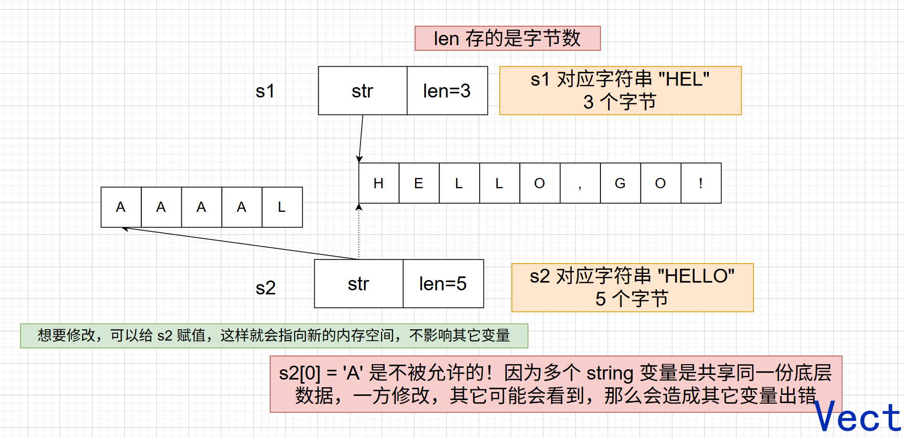
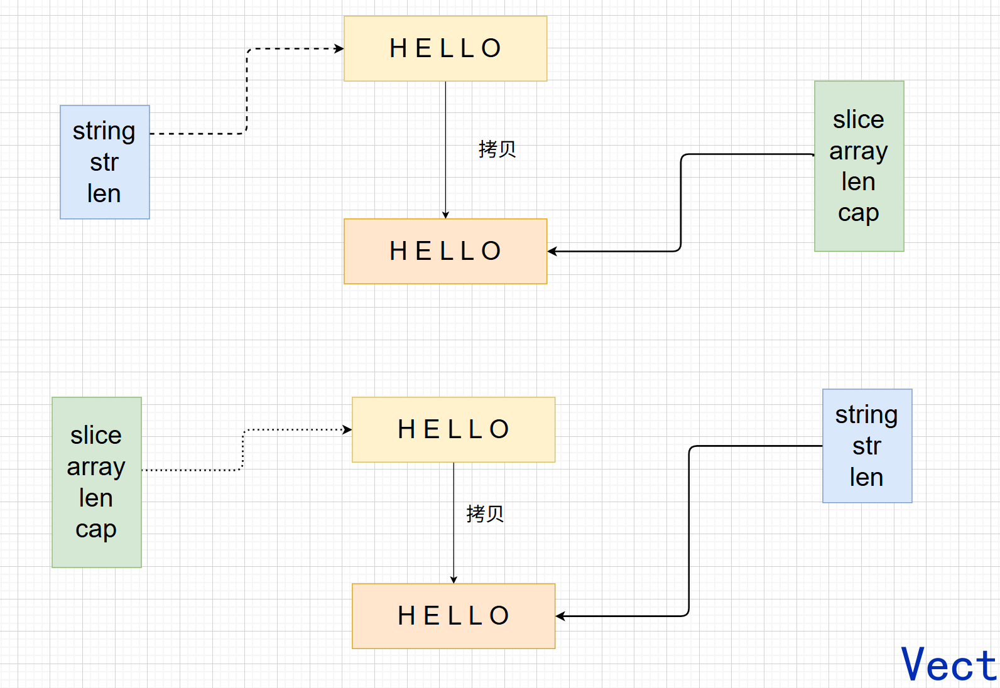

## string 是什么
定义一个 `string` 类型的变量，跳转到 `/usr/lib/go-1.26/src/builtin/builtin.go`路径下，可以看到这样的定义：
```go
// string is the set of all strings of 8-bit bytes, conventionally but not
// necessarily representing UTF-8-encoded text. A string may be empty, but
// not nil. Values of string type are immutable.
type string string
```
- string 所有 8bit 字节的集合，但不一定是 UTF-8 编码的文本 -> **文本有不同的编码，不同编码，一个字符可能占用不同的字节数，所以不保证是合法的 UTF-8 编码**。
- string 可以为 empty，但是不能为 `nil`，string 的值是不能修改的。-> **不能通过下标访问方式修改**

上述定义可以知道，下标取出来的是第 `i` 个字节，不是第 `i` 个字符:

```go
s := "你好"
fmt.Println(len(s)) // 6
fmt.Println(s[0])   // 228，一个 byte
```

## string 的底层结构

```go
type stringStruct struct {
    str unsafe.Pointer
    len int
}
```

- str 是指向字符串的首地址
- len 是字符串的长度




## string 和 []byte 相互转化原理

注意，string 和 []byte 使用场景不一样，所以需要转换：

> - string：适合文本、只读内容、map key、函数参数传递
> - []byte：适合网络 IO、文件 IO、缓冲区、需要修改内容

string 不能被修改，但是真的想修改这个 string 变量，可以通过赋值或者转成 `[]byte` 的方式完成，上一章节已画出赋值的原理，不再赘述。

```go
s := "hello"
sByte := []byte(s)
sByte[0] = 'H'
fmt.Println(string(sByte))
```

最后输出的是 `Hello`，注意这种转成切片的形式，本质是**`s`字符串的一个拷贝，源字符串并没有变化**

string 转成 []byte 切片大致分为两步：

1. 新申请底层数组内存空间
2. 将 string 中指针执行内存区域的内容拷贝到新的切片

必须发生拷贝！

> **string 不可变，[]byte 可变，假如不拷贝，让 []byte 直接指向 string 的底层数据，那么改 b[0] 相当于改了 string！**

[]byte 切片转成 string，同样是两步：

1. 新申请底层数组内存空间，假设地址为 `addr`，长度为 `len`，构建 string 对象，指针指向 `addr`，len 字段赋值为 len
2. 将原切片中数据拷贝到新申请的空间中




## 区分 []byte []rune string 三者

对于：

```go
s := "你好"
```

转成 []byte：

```go
b := []byte(s)
fmt.Println(len(b)) // 6
```

得到的是 UTF-8 的原始字节：

```text
你：3 bytes
好：3 bytes
```

转成 []rune（字符在 Unicode 里的编号，本质是 `int32` 类型，所以一个 rune 可能占用多个字节）：

```go
r := []rune(s)
fmt.Println(len(r)) // 2
```

得到的是 Unicode code point：

```text
你
好
```

所以要区分好两种遍历方式：

```go
s := "你好"

fmt.Println(len(s)) // 6
fmt.Println(s[0])   // 第 0 个 byte
```

**下标访问：按照 byte 读**

```go
s := "你好"

for i, r := range s {
    fmt.Println(i, r)
}
```

**range访问：按照 rune 解码**，输出里的 `i` 仍然是**字节下标**，`r` 是当前 UTF-8 解码出来的 Unicode code point

总结：

- len(s)        看 byte 数
- s[i]            取 byte
- range s      按 UTF-8 解码成 rune
- []rune(s)    真正按 Unicode code point 拆


## 字符串拼接原理分析

### 为什么字符串拼接可能很慢？

**string 不可变**

```go
s := "hello"
s = s + " world"
```

这段代码不是原地追加" world"，而是：

1. 计算新字符串长度
2. 分配一块新的内存
3. 把旧的 s 内容复制过去
4. 把 " world" 复制过去
5. s 指向新的字符串

如果放在循环中：

```go
s := ""

for i := 0; i < n; i++ {
    s += "a"
}
```

**每次都要重复复制旧的内容：**

```text
第 1 次：复制 0 + 1
第 2 次：复制 1 + 1
第 3 次：复制 2 + 1
第 4 次：复制 3 + 1
...
第 n 次：复制 n-1 + 1
```

$1 + 2 + 3 + 4 + ... + n = O(n^2)$

所以：**少量固定字符串拼接用 + 没有问题，但是循环大量拼接最好不要用 +=**

注意有种情况：**a + b + c  不一定慢**

```go
s := a + b + c + d
```

编译器会把同一个表达式里的多个字符串拼接交给 runtime，一次性算出总长度，然后分配一次、复制一次。


### 高性能拼接：strings.Builder

```go
item := []string{"Go", " ", "is", " ", "great"}
var b strings.Builder

for _, item := range item {
    b.WriteString(item)
}

fmt.Println(b.String())
```

`strings.Builder` 的核心是：内部维护了一个 `[]byte` 的缓冲区，`WriteString` 时往缓冲区里追加元素，最后转成 string，用于高效构造字符串、减少内存拷贝

如果已经有一个 `[]string`，可以使用 `strings.Join`

```go
parts := []string{"hello", " ", "world"}
s := strings.Join(parts, "")
```

源码会先计算最终总长度，然后使用 `strings.Builder`，性能接近于 `strings.Builder`，但是前提是**已知 []string 时使用，未知时构造切片也会有性能损耗**

还有一个 `bytes.Buffer`，底层存储使用的是 []byte，它更适合处理流式数据，最终可能需要 string，也可能需要 []byte 的场景


### 做个小结

**字符串拼接的核心问题是 string 不可变**

根据使用场景来选择，而不是依据性能选择：

> - 少量拼接用 `+`，可读性最好；同一个表达式里的 `a+b+c` 通常会被编译器优化，一次计算长度并分配。
> - 循环中大量使用 `s += part` 会反复创建新字符串并复制旧内容，复杂度可能退化为 $O(n²)$，应该使用 `strings.Builder`。
>   `strings.Builder` 内部维护 `[]byte` 缓冲区，`WriteString` 时追加内容，最后 `String()` 得到结果，适合最终目标是 `string` 的场景。
> - 如果已经有 `[]string`，优先使用 `strings.Join`，因为它会先计算总长度再拼接。
> - bytes.Buffer 也可以拼字符串，但它更适合字节流场景，比如文件、网络、HTTP body、需要 `[]byte` 的场景。


## 总结

string 是 8bit 字节的集合，底层结构是 **一个指向底层数据的指针 + 这个字符串变量的字节数**，每个 string 共享底层数据，所以不能修改，想要修改只能通过赋值指向新的底层数据，或者转成 []byte 类型，本质还是拷贝后指向新的底层数据进行“修改”，源字符串的底层数据是不会被修改的。

需要区分 []byte、[]rune、string 三者的关系：[]byte 是字节切片，本质是 `int8` 类型，对应一个字节，[]rune 是 Unicode code point，本质是 `int32`类型，使用索引遍历 string，`s[i]` 取到的是第 `i` 个字节，如果是汉字，可能是乱码；使用 range 遍历 string，取到的是一个 Unicode code point 点，是一个完整的字符，但可能不止一个字节

对于字符串拼接，核心矛盾是**string 不可修改**，按照使用场景来选择拼接方式：

- 固定字符串少量拼接：用`+`没问题，可读性高，`a + b + c` 这种会进行优化，先计算出总长度，最后只分配一次空间
- 大量循环字符串拼接：一定要避免使用`+=`，每次会加旧的内容，等差数列是$O(n^2)$级别，使用 `strings.Builder`，底层维护了一块 `[]byte` 的缓冲区，`WriteString` 时往缓冲区里追加，最后通过 `String` 返回最终字符串
- 如果已知了字符串切片，使用`strings.Join`，会先计算总长度，使用 `strings.Builder` 拼接
- 流式数据场景：比如字节流、文件、网络，适合使用 `bytes.Buffer`，最后可以根据需求返回 string 或者 []byte

