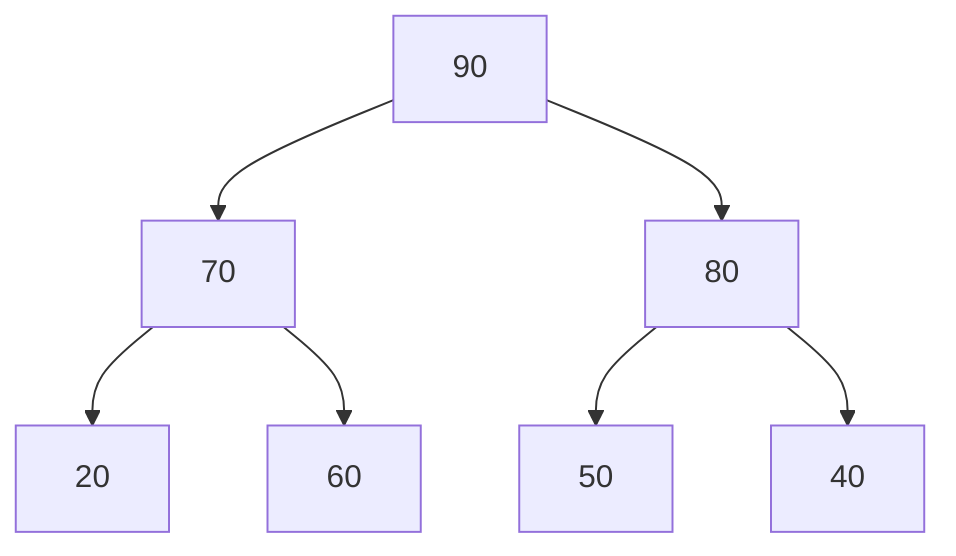
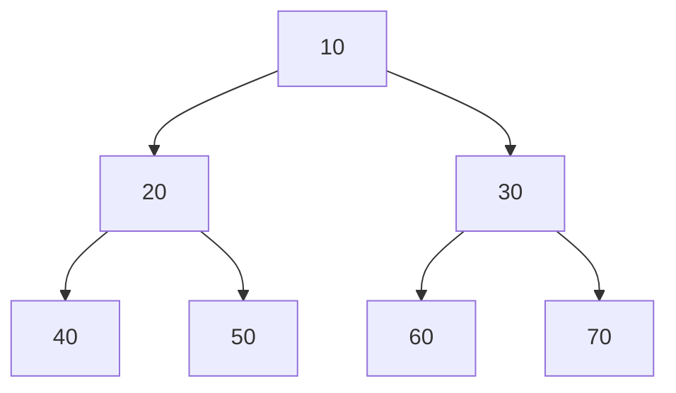

## 一、认识堆和常见操作

> **堆是用数组存储的完全二叉树，并且父节点和子节点始终满足固定大小关系**

### 1. 为什么需要堆？

假设有一组不断变化的数据，需要反复执行：

```
加入一个数
找到当前最大值
删除当前最大值
```

不同结构的复杂度：

| 数据结构     | 加入元素   | 找最大值 | 删除最大值 |
| ------------ | ---------- | -------- | ---------- |
| 普通无序数组 | `O(1)`     | `O(n)`   | `O(n)`     |
| 有序数组     | `O(n)`     | `O(1)`   | `O(1)`     |
| 大根堆       | `O(log n)` | `O(1)`   | `O(log n)` |

堆在“不断插入，同时反复获取最大值或最小值”的场景中非常高效。

### 2. 大根堆和小根堆

#### 大根堆

每个父节点都大于等于自己的孩子：

```
父节点 >= 左孩子
父节点 >= 右孩子
```

例如：



每个父节点都不小于孩子，所以根节点 `90` 一定是整个堆的最大值。

#### 小根堆

每个父节点都小于等于自己的孩子：

```
父节点 <= 左孩子
父节点 <= 右孩子
```

根节点 `10` 一定是整个堆的最小值。

例如：



因此：

```
大根堆：堆顶是最大值
小根堆：堆顶是最小值
```

需要注意：

> 堆只能保证堆顶是最大值或最小值，不能保证其余元素整体有序。

### 3. 为什么堆是一颗完全二叉树

完全二叉树要求：

* 除最后一层外，其他层全部填满；
* 最后一层从左向右连续填充。

因此不会出现中间空洞，可以紧凑地放进数组。

上面的大根堆对应数组：

```text
数组下标：	0	1	2	3	4	5	6         
元素：		 90	 70  80  20  60  50  40          
         
         
          90(0)
        /       \
     70(1)      80(2)
     /  \        /  \
 20(3) 60(4)  50(5) 40(6)
```

括号中是数组下标。

不需要指针，不需要定义树节点：

```go
type TreeNode struct {
	Val   int
	Left  *TreeNode
	Right *TreeNode
}
```

堆直接用切片：

```go
heap := []int{90, 70, 80, 20, 60, 50, 40}
```

这也是堆速度快、内存连续的原因。

### 4. 父子节点的下标公式

对于下标 `i`：

```go
parent := (i - 1) / 2
left := 2*i + 1
right := 2*i + 2
```

例如下标 `2`，对应元素 `80`：

```go
parent := (2 - 1) / 2 // 0
left := 2*2 + 1       // 5
right := 2*2 + 2      // 6
```

所以：

```text
80的父节点：下标0，元素90
80的左孩子：下标5，元素50
80的右孩子：下标6，元素40
```

访问孩子前必须判断是否存在：

```go
if left < len(heap) {
	// 左孩子存在
}

if right < len(heap) {
	// 右孩子存在
}
```

因为计算出的下标可能超出切片范围。

访问父节点时要保证：

```go
i > 0
```

根节点 `i=0` 没有父节点，不能继续向上寻找。

### 5. 堆的常用操作

#### 查看堆顶 `Top`

```go
top := heap[0]
```

* 大根堆：得到最大值
* 小根堆：得到最小值
* 时间复杂度：`O(1)`

注意：空堆不能访问 `heap[0]`

```go
if len(heap) > 0 {
	top := heap[0]
}
```

#### 获取元素数量 `Len`

```go
size := len(heap)
```

时间复杂度：`O(1)`。

#### 判断堆是否为空

```go
empty := len(heap) == 0
```

#### 元素入堆 `Push`

```txt
把新元素放到数组末尾
→ 新元素向上调整
→ 恢复堆结构
```

时间复杂度：`O(log n)`

#### 堆顶出堆 `Pop`

```txt
交换堆顶和末尾
→ 删除末尾
→ 新堆顶向下调整
→ 恢复堆结构
```

时间复杂度：`O(log n)`

#### 批量建堆 `Init`

```
把无序数组原地调整成堆
```

时间复杂度：`O(n)`

### 6. 为什么 `Push` 和 `Pop` 是 `O(log n)`

完全二叉树的节点数量每增加一层，大约翻一倍：

```
第0层：1个
第1层：2个
第2层：4个
第3层：8个
```

有 `n` 个节点时，树高约为：$log_{2} n$

`Push` 最坏从叶子一路交换到根：

```
向上走一棵树的高度
```

`Pop` 最坏从根一路交换到叶子：

```
向下走一棵树的高度
```

因此都是：$logn$


## 二、从零实现堆

以下是详细的代码：

```go
package main

// 手写一个大根堆
type MaxHeap struct {
	data []int
}

// 获取堆中元素数量
func (h *MaxHeap) Len() int {
	return len(h.data)
}

// 判空
func (h *MaxHeap) Empty() bool {
	return len(h.data) == 0
}

// 访问堆顶元素
func (h *MaxHeap) Top() int {
	if h.Empty() {
		panic("heap is empty")
	}
	return h.data[0]
}

// 元素入堆
func (h *MaxHeap) up(i int) {
	// 只要没到根节点，就有 up 的可能性
	for i > 0 {
		parent := (i - 1) / 2

		// 父节点已经不小于当前节点，堆结构就是合法
		if h.data[parent] >= h.data[i] {
			break
		}

		// 当前节点更大，与父节点交换
		h.data[parent], h.data[i] = h.data[i], h.data[parent]

		// 继续从新位置向上检索
		i = parent
	}
}

// Push 完整实现
func (h *MaxHeap) Push(x int) {
	// 先尾插，维持完全二叉树的结构
	h.data = append(h.data, x)

	// 从新元素位置开始 up
	h.up(len(h.data)-1)
}
```

有几点注意事项：

> - 访问堆顶元素时先要判空（这里我代码中已经实现了）
> - `Push`必须使用指针接收者，因为`append`会修改切片长度，必须要修改原来的堆结构

主要是`Push`的核心操作：

```text
Push：
1. 新元素追加到数组末尾
2. 与父节点比较
3. 比父节点大就交换
4. 不断向上，直到合法或到达根节点
```

时间复杂度：$O(logn)$，最坏的情况就是走一颗二叉树的高度


## 三、 建堆操作

拿到一个无序数组，如何画把它原地调整成一个堆？

例如：

```text
原数组：

[3, 5, 1, 2, 4, 6, 7]
```

对应的完全二叉树是：

```text
            3
         /     \
        5       1
       / \     / \
      2   4   6   7
```

很明显不是大根堆，目标是调整成：

```text
[7, 5, 6, 2, 4, 3, 1]
            7
         /     \
        5       6
       / \     / \
      2   4   3   1

```

### 方法一：一个元素一个元素插入

初始堆为空，每次取出一个元素执行`Push`：

```text
原数组：

[3, 5, 1, 2, 4, 6, 7]

Push(3)
Push(5)
Push(1)
Push(2)
Push(4)
Push(6)
Push(7)
```

每次插入后，都通过向上调整 `up` 恢复堆结构

插入$n$个元素是$O(n)$，单词插入的复杂度是$O(logn)$，所以总体复杂度：$O(nlogn)$

代码可以写成：

```go
func (h *MaxHeap) BuildHeapByPush(nums []int) []int {
	// 清空原先的堆
	h.data = make([]int, 0, len(nums))

	for _, v := range nums {
		h.Push(v)
	}
	return h.data
}
```


### 方法二：从下往上建堆

#### `down`步骤

**直接使用原数组，从最后一个非叶子节点开始，逐次向前执行`down`**

对于`up`，解决的是**某个节点可能比父节点大**的问题

建堆不一样，假设有局部结构：

```text
        1
       / \
      6   7
```

左右子树本身已经是合法的堆，但父节点 `1` 太小。

它应该向下调整：

```text
        7
       / \
      6   1
```

先写出`down`：

```go
// down 
// 从 i 开始向下调整，恢复大根堆
func (h *MaxHeap) down (i int, heapSize int) {
	// 先找左孩子
	child := 2*i + 1

	// 左孩子存在，说明当前节点至少有一个孩子 
	for child < heapSize {
		// 如果右孩子存在，并且右孩子更大
		// child指向右孩子
		if child+1 < heapSize && h.data[child+1] > h.data[child] {
			child++
		}

		// 现在 child 指向了大孩子
		// 当前节点已经 >= 大孩子，说明满足了大根堆结构
		if h.data[i] >= h.data[child] {
			break
		}

		// 当前节点更小，和更大的孩子交换
		h.data[i], h.data[child] = h.data[child], h.data[i]

		// 原来的父节点已经和child交换了位置
		// 现在的child指向的是原来的父节点
		// 继续向下检查
		i = child
		child = 2*i + 1
	}
}
```

#### 为什么建堆从 `n/2 - 1`开始

假设数组长度为`n`，最后一个元素下标为 `n - 1`

那么最后一个非叶子节点，就是最后一个元素的父节点：

`parent = (child - 1) / 2`

把最后一个元素下标代入：

`parent = ((n - 1) - 1) / 2 = (n - 2) / 2 = n/2 - 1`

#### BuildHeap

```go
// BuildHeap 将 h.data 原地调整成大根堆
func (h *MaxHeap) BuildHeap() {
	n := len(h.data)

	// 从最后一个非叶子节点开始，依次向前开始 down
	for i := n/2 - 1; i >= 0; i-- {
		h.down(i, n)
	}
}
```

为什么必须从后向前？

因为当我们处理节点 `i` 时，希望它的左右子树已经分别是合法的大根堆。

从后往前处理，正好可以保证这一点

分析一下时间复杂度：

完全二叉树中：

```text
大约 n/2 个节点是叶子节点：下沉 0 层
大约 n/4 个节点最多下沉 1 层
大约 n/8 个节点最多下沉 2 层
大约 n/16 个节点最多下沉 3 层
```

总工作量近似：

$n/4\times1 + n/8\times2 + n/16\times3 + ...$

最后是线性级别：$O(n)$

直观理解：

> 靠近底部的节点很多，但几乎不需要移动；靠近顶部的节点移动距离长，但数量非常少


## 四、堆的应用

### 1. Top K 问题

> 从 n 个元素中，找出最大的 K 个，或者最小的 K 个

例如：

```text
数组：[8, 1, 6, 2, 9, 4, 7]
K = 3

前三大：9 8 7
前三小：1 2 4
```

#### Top K使用什么堆

非常重要的结论：

> - 求前 K 大：维护一个大小为 K 的小根堆
> - 求前 K 小：维护一个大小为 K 的大根堆

这好像反直觉了，不要死记硬背，要理解**淘汰门槛**：

假设当前正在维护前最大的 3 个元素：

```text
7 8 9
```

这三个候选元素中，7是最小的，**只要来了一个比7大的数，7就应该被淘汰**

我们希望：

> **随时能够找到当前候选集合中最小的元素**
>
> 这正是小根堆的作用：
>
> 堆顶 = 当前 K 个候选元素中最小的元素
>
> **堆顶是进入前 K 大的最低门槛**

那么求前 K 小同理，不再赘述

总结：

> **堆中保存的是的当前答案的候选，堆顶放最应该被淘汰的元素怒**

#### 代码实现前 K 大

首先需要一个小根堆，和大根堆结构一致，只需要把比较方向反过来

```go
// ReplaceTop 替换堆顶元素，并向下调整
func (h *MinHeap) ReplaceTop(x int) {
	h.data[0] = x
	h.down(0, len(h.data))
}

// TopKLargest 返回 nums 中最大的 K 个元素
//
// 返回结果是一个合法的小根堆
// 但不保证整体从大到小或从小到大有序
func TopKLargest(nums []int, k int) []int {
	// 非法 K
	if k <= 0 || len(nums) == 0 {
		return nil
	}

	// K 大于数组长度时，返回全部元素
	if k > len(nums) {
		k = len(nums)
	}

	h := &MinHeap {
		data: make([]int, 0, k),
	}

	for _, x := range nums {
		// 堆没满，直接插入
		if len(h.data) < k {
			h.Push(x)
			continue
		}

		// 堆已满，堆顶是当前最小的元素，最低门槛
		if x > h.data[0] {
			// 新元素超过门槛：替换堆顶，恢复小根堆
			h.ReplaceTop(x)
		}
	}
	// 复制一份结果，避免调用者修改堆的内部数据
	return append([]int(nil), h.data...)
}
```

#### 代码实现第 K 大

维护完大小为 K 的小根堆以后：

```text
堆中保存前 K 大
堆顶是这 K 个元素中最小的
```

因此：**小根堆堆顶就是第 K 大元素**

```go
// KthLargest 返回数组中的第 K 大元素
func KthLargest(nums []int, k int) (int, bool) {
	if k <= 0 || k > len(nums) {
		return 0, false
	}

	h := &MinHeap{
		data: make([]int, 0, k),
	}

	for _, x := range nums {
		if len(h.data) < k {
			h.Push(x)
			continue
		}

		if x > h.data[0] {
			h.ReplaceTop(x)
		}
	}

	// 堆顶就是第 K 大
	return h.data[0], true
}
```

#### 复杂度分析

数组长度为 n， 堆大小为 K

扫描每个元素：$O(n)$，每次插入或替换堆顶：$O(log K)$

总体时间复杂度：$O(nlogK)$，空间复杂度：$O(K)$


### 2. 堆排序

####  步骤详解

升序使用大根堆，大根堆的特点是：**堆顶 h.data[0] 是当前堆中的最大值**

例如：

```text
数组形式：
[10, 5, 3, 4, 1]

树形结构：

        10
       /  \
      5    3
     / \
    4   1
```

已经找到了最大值`10`

升序排序，最大值应该放在**数组最后面**

所以把堆顶和数组末尾交换：

```text
交换前：
[10, 5, 3, 4, 1]

交换后：
[1, 5, 3, 4, 10]
```

下来不应该再动 `10`，只处理前面：

```text
[1, 5, 3, 4 | 10]
 └──堆区间──┘  已排序
```

然后对新的堆顶 `1` 执行 `down`：

```text
[5, 4, 3, 1 | 10]
```

又得到一个大根堆。

继续把堆顶最大值 `5` 放到堆区间末尾：

```text
[1, 4, 3, 5 | 10]
```

缩小堆区间，再继续。

最终数组就会升序排列。

总结步骤：

> 1. 先将整个数组建成大根堆
> 2. 把堆顶最大值和堆区间末尾交换
> 3. 堆的有效范围缩小 1
> 4. 对新堆顶执行 down，恢复大根堆


#### 代码

```go
// 升序使用大根堆
func (h *MaxHeap) HeapSortUp() {
	if len(h.data) <= 1 {
		return
	}

	// 1. 把整个数组建成大根堆
	// 则 h.data[0] 是整个数组最大值
	h.BuildHeap()

	// end 表示当前堆区间最后一个元素下标
	// 每轮把堆顶最大值放到 end 位置
	// 然后 end--，缩小堆的有效范围
	for end := len(h.data) - 1 ; end > 0; end-- {
		// 把当前堆中的最大值放到堆区间末尾
		h.data[0], h.data[end] = h.data[end], h.data[0]

		// 交换后，end 位置已经是正确的位置，不再属于堆了
		// 新堆有效区间是 [0,end)
		// 有效元素数量刚好是 end
		// 有鱼新的堆顶可能破坏大根堆结构
		// 所以从下标 0 开始调整
		h.down(0, end)
	}
} 
```

#### 复杂度和稳定性分析

- 建堆：$O(n)$
- 排序：执行$n-1$轮，每次执行一次`down`，最终$O(nlogn)$
- 总时间复杂度：因为建堆和排序是串行，所以$O(nlogn)$

- 空间复杂度：没有用到额外空间，$O(1)$
- 稳定性：不稳定->因为堆顶和末尾的大范围交换，可能改变相同元素原来的先后顺序


## 五、Go 标准库 `container/heap`

之前手写堆时，我们自己实现了：

```go
up()
down()
BuildHeap()
Push()
Pop()
```

其中：

* `up()`：元素入堆后向上调整
* `down()`：堆顶变化后向下调整
* `BuildHeap()`：从无序数组建堆
* `Push()`：完整入堆
* `Pop()`：完整出堆

但是在 Go 标准库 `container/heap` 中：

> `up()`、`down()`、`BuildHeap()` 这些底层调整逻辑，标准库已经帮我们写好了。

我们只需要告诉标准库两件事：

1. 数据存在哪里
2. 什么元素应该排在堆顶

为此，需要实现五个方法：

```text
Len()
Less(i, j int)
Swap(i, j int)
Push(x any)
Pop() any
```

这五个方法组成了 `heap.Interface`

### 1. 五个方法的职责

| 方法         | 作用                             |
| ------------ | -------------------------------- |
| `Len()`      | 告诉标准库当前有多少元素         |
| `Less(i, j)` | 告诉标准库下标 `i` 和 `j` 谁优先 |
| `Swap(i, j)` | 交换两个元素                     |
| `Push(x)`    | 把新元素追加到切片末尾           |
| `Pop()`      | 删除并返回切片最后一个元素       |

其中最重要的是：

```go
Less(i, j int) bool
```

它决定了：

```text
谁应该更靠近堆顶
```

如果写成：

```go
func (h IntHeap) Less(i, j int) bool {
	return h[i] < h[j]
}
```

表示：

```text
数值小的优先
```

所以这是小根堆

如果写成：

```go
func (h IntHeap) Less(i, j int) bool {
	return h[i] > h[j]
}
```

表示：

```text
数值大的优先
```

所以这是大根堆

### 2. 两组 `Push` 和 `Pop`

使用 `container/heap` 时，会同时出现两组 `Push` 和 `Pop`

第一组是我们自己实现的接口方法：

```go
func (h *IntHeap) Push(x any)
func (h *IntHeap) Pop() any
```

第二组是标准库提供的函数：

```go
heap.Push(h, x)
heap.Pop(h)
```

它们不是一回事

### 3. 自己实现的 `Push` 和 `Pop`

自己实现的接口方法：

```go
h.Push(x)
h.Pop()
```

只负责底层切片的增删。

具体来说：

```text
h.Push(x)：只负责尾插
h.Pop() ：只负责删除切片最后一个元素
```

注意：

> 自己实现的 `Push` 不负责 `up`。
> 自己实现的 `Pop` 不负责删除堆顶，也不负责 `down`。

也就是说，下面这种调用方式一般是错误的：

```go
h.Push(10)
h.Pop()
```

因为这样只是操作切片，没有完整维护堆结构。

### 4. 真正应该调用的是标准库函数

真正添加和删除堆元素时，应该调用：

```go
heap.Push(h, x)
heap.Pop(h)
```

标准库官方文档也特别说明：

> Note that Push and Pop in this interface are for package heap's implementation to call. To add and remove things from the heap, use heap.Push and heap.Pop.

意思是：

> 接口里的 `Push` 和 `Pop` 是给 `container/heap` 包内部调用的。
> 真正添加和删除堆元素时，应该使用 `heap.Push` 和 `heap.Pop`。

所以要记住：

```text
自己写的 Push / Pop：给标准库内部调用
heap.Push / heap.Pop：给我们外部使用
```

### 5. 标准库中的 `heap.Push` 和 `heap.Pop`行为

标准库源码逻辑可以简化为：

```go
func Push(h Interface, x any) {
	h.Push(x)        // 调用自己写的 Push，只负责尾插
	up(h, h.Len()-1) // 标准库负责向上调整
}

func Pop(h Interface) any {
	n := h.Len() - 1

	h.Swap(0, n)    // 堆顶和末尾交换
	down(h, 0, n)   // 标准库负责向下调整
	return h.Pop()  // 调用自己写的 Pop，删除末尾元素
}
```

也就是说：

```text
heap.Push = 尾插 + up
heap.Pop = 堆顶和末尾交换 + down + 删除末尾
```

注意：

```text
Push：
尾插：由自己实现的 Push 完成
up：由标准库内部完成

Pop：
堆顶和末尾交换：标准库调用 Swap 完成
down：标准库内部完成
删除末尾：调用自己实现的 Pop 完成
```

所以我们自己写时，只需要写：

```go
func (h *IntHeap) Push(x any) {
	*h = append(*h, x.(int))
}

func (h *IntHeap) Pop() any {
	old := *h
	n := len(old)

	x := old[n-1]
	*h = old[:n-1]

	return x
}
```

### 6. 和手写堆的区别

手写堆时，我们的 `Push` 是完整入堆：

```go
func (h *MaxHeap) Push(x int) {
	h.data = append(h.data, x)
	h.up(len(h.data) - 1)
}
```

它包含：尾插 + `up`

但是标准库中，我们自己实现的 `Push` 只包含：尾插

完整入堆由标准库函数完成：`heap.Push(h, x)`

手写堆时，我们的 `Pop` 是完整出堆：

```go
func (h *MaxHeap) Pop() (int, bool) {
	n := len(h.data)

	h.data[0], h.data[n-1] = h.data[n-1], h.data[0]

	top := h.data[n-1]
	h.data = h.data[:n-1]

	h.down(0, len(h.data))

	return top, true
}
```

它包含：堆顶和末尾交换 + 删除末尾 + `down`

但是标准库中，我们自己实现的 `Pop` 只包含：删除末尾

完整出堆由标准库函数完成：`heap.Pop(h)`	

### 7. 对照表

| 行为       | 手写堆                      | 标准库                  |
| ---------- | --------------------------- | ----------------------- |
| 建堆       | `BuildHeap()`               | `heap.Init(h)`          |
| 完整入堆   | `h.Push(x)`                 | `heap.Push(h, x)`       |
| 向上调整   | 自己写 `up()`               | 标准库内部完成          |
| 完整出堆   | `h.Pop()`                   | `heap.Pop(h)`           |
| 向下调整   | 自己写 `down()`             | 标准库内部完成          |
| 判断谁优先 | 写在 `up/down` 的比较逻辑里 | 写在 `Less(i, j)` 里    |
| 交换元素   | 自己手写交换                | 标准库调用 `Swap(i, j)` |
| 查看堆顶   | `h.data[0]`                 | `(*h)[0]` 或 `h[0]`     |

最重要的映射关系：

```text
手写堆的 Push ≈ 标准库的 heap.Push

手写堆的 Pop  ≈ 标准库的 heap.Pop
```

而不是：

```text
手写堆的 Push ≈ 自己实现的 Push
手写堆的 Pop  ≈ 自己实现的 Pop
```

### 8. 自己实现的小根堆代码

```go
package main

import (
	"container/heap"
	"fmt"
)

// IntHeap 是一个整数小根堆
// 底层还是切片
type IntHeap []int

// Len 返回堆中元素数量
// container/heap 需要通过它判断：
// 1. 当前堆有多大
// 2. 新元素的下标是多少
// 3. down 时边界在哪里
func (h IntHeap) Len() int {
	return len(h)
}

// Less 定义堆中元素的优先顺序
// 返回 true 表示：
// 下标 i 的元素应该比下标 j 的元素更靠近堆顶
//
// h[i] < h[j]：较小的元素优先，所以是小根堆
// h[i] > h[j]：较大的元素优先，所以是大根堆
func (h IntHeap) Less(i, j int) bool {
	return h[i] < h[j]
}

// Swap 交换下标 i 和 j 的元素
//
// 标准库内部执行 up、down、删除堆顶时，
// 都需要通过 Swap 来交换元素
func (h IntHeap) Swap(i, j int) {
	h[i], h[j] = h[j], h[i]
}

// Push 将新元素追加到切片末尾
//
// 注意：这个 Push 只负责尾插，不负责向上调整。
//
// 真正使用时不要直接调用 h.Push(x)，
// 而应该调用 heap.Push(h, x)。
// heap.Push 会在尾插后自动执行 up
func (h *IntHeap) Push(x any) {
	// x 的静态类型是 any，
	// 我们明确知道这里保存的是 int，
	// 所以需要通过类型断言取出 int
	value := x.(int)
	// h 是 *IntHeap。
	// *h 才是真正的切片
	*h = append(*h, value)
}

// Pop 删除并返回切片最后一个元素
//
// 注意：这个 Pop 不负责删除堆顶，也不负责 down
// 在调用这个方法之前，heap.Pop 已经完成：
// 1. 堆顶和末尾交换
// 2. 对新的堆顶执行 down
//
// 因此原堆顶已经移动到切片末尾，
// 我们只需要删除最后一个元素
func (h *IntHeap) Pop() any {
	// 取出真正的切片
	old := *h

	// 原切片长度
	n := len(old)

	// 最后一个元素
	// heap.Pop 已经把原堆顶交换到了这里
	value := old[n-1]

	// 删除最后一个元素
	*h = old[:n-1]

	return value
}

func main() {
	// 当前只是一个普通无序切片，
	// 还不能保证满足堆结构。
	h := &IntHeap{8, 3, 6, 1, 5}

	// 将现有无序切片原地调整成堆。
	heap.Init(h)

	fmt.Println("建堆后：", *h)
	fmt.Println("当前堆顶：", (*h)[0])

	// 正确入堆方式：
	// 不要直接调用 h.Push(2)。
	heap.Push(h, 2)

	fmt.Println("插入 2 后：", *h)
	fmt.Println("当前堆顶：", (*h)[0])

	// 正确出堆方式：
	// 返回类型是 any，需要断言成 int。
	top := heap.Pop(h).(int)

	fmt.Println("弹出的堆顶：", top)
	fmt.Println("弹出后：", *h)

	fmt.Println("依次弹出：")

	for h.Len() > 0 {
		value := heap.Pop(h).(int)
		fmt.Println(value)
	}
}

```

一句话总结：

> Go 标准库 `container/heap` 中，`Less` 决定谁在堆顶；`heap.Init` 负责建堆；`heap.Push` 是完整入堆；`heap.Pop` 是完整出堆；自己实现的 `Push` 只负责尾插，自己实现的 `Pop` 只负责删除末尾。

