## 1. HTTP 是什么？

**HTTP**，全称 **超文本传输协议**（HyperText Transfer Protocol）。

拆开来看，每个词都有明确的含义：

| 词         | 含义                                                         |
| ---------- | ------------------------------------------------------------ |
| **超文本** | 内容不局限于纯文本，包括图片、视频、音频、压缩包等任意格式。核心在于"超链接"——可以从一个文本跳转到另一个文本 |
| **传输**   | 两点之间的双向通信。注意：不限于"服务器→浏览器"，客户端也能向服务器传数据；中间允许代理、网关等中转 |
| **协议**   | 通信双方必须遵守的行为约定与格式规范，确保双方能正确"对话"                       |

### URL vs URI

| 概念    | 全称                        | 含义                                                         | 关系 |
| ------- | --------------------------- | ------------------------------------------------------------ | ---- |
| **URI** | Uniform Resource Identifier | 统一资源**标识符**，唯一标识一个资源                         | 超集 |
| **URL** | Uniform Resource Locator    | 统一资源**定位符**，不仅标识资源，还给出了资源的位置（地址） | 子集 |

> **URL 是 URI 的一种**（URL 不仅标识资源，还给出了资源的具体访问地址；URI 只是一个唯一标识，不一定包含定位信息）

```
URI ─── 包含 ───> URL（如 https://example.com/page）
              └──> URN（如 urn:isbn:0-486-27557-4，只命名不定位）
```

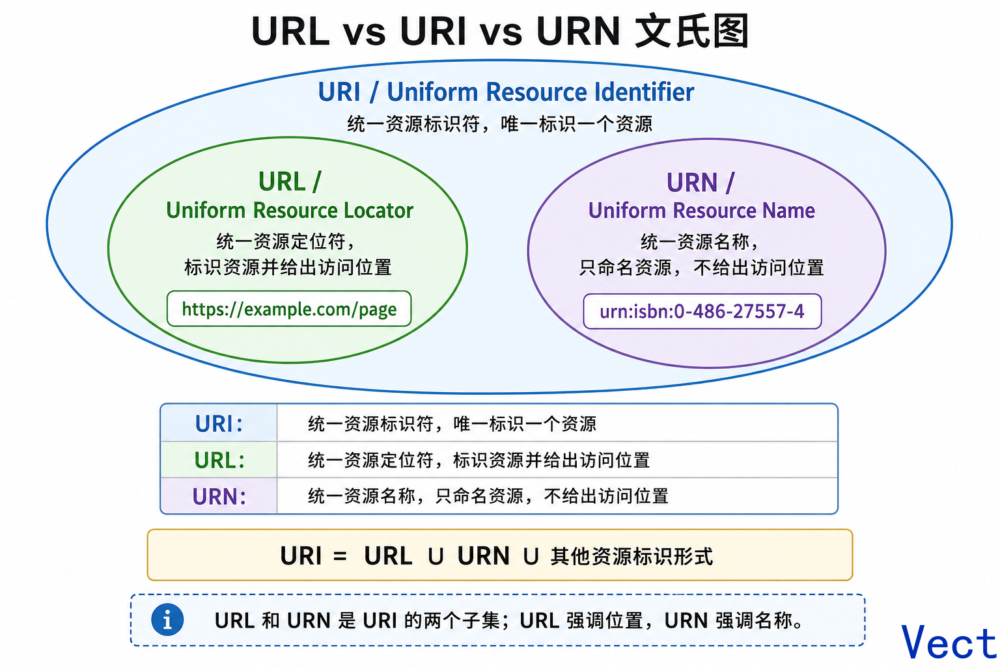

---

## 2. HTTP 报文结构

HTTP 报文分为 **请求报文** 和 **响应报文**，两者结构基本一致，都由以下三部分组成：

- **起始行**：描述请求或响应的基本信息
- **头部字段**：以 Key-Value 形式携带报文的元数据
- **消息正文**：实际传输的数据，通常为超文本（HTML、JSON、图片等）

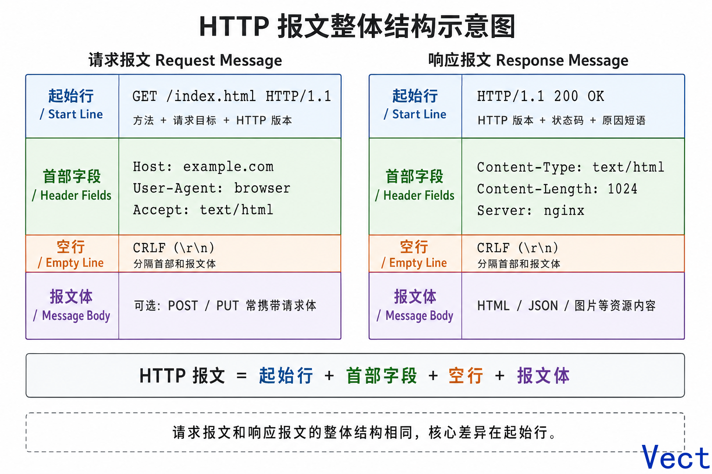


### 2.1 请求行

请求行由三部分组成：

- **请求方法**：一个动词，表示对资源的操作（如 GET、POST）
- **请求目标**：通常是一个 URI，标记了请求方法要操作的资源
- **版本号**：表示报文使用的 HTTP 协议版本

三部分用空格（SP）分隔，最后以 CRLF 换行结束。

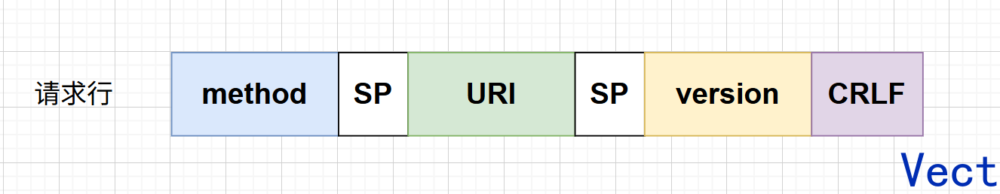

### 2.2 状态行

状态行同样由三部分组成：

- **版本号**：表示报文使用的 HTTP 协议版本
- **状态码**：一个三位数字，用代码形式表示请求的处理结果
- **原因短语**：状态码的补充描述文字，帮助人类理解含义

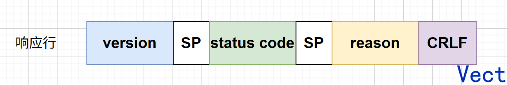

### 2.3  Header 字段

请求行（或状态行）再加上头部字段集合，就构成了 HTTP 报文中完整的请求头或响应头：

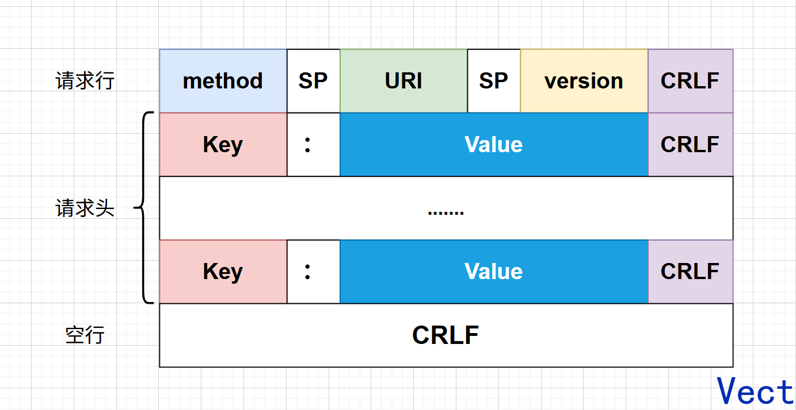

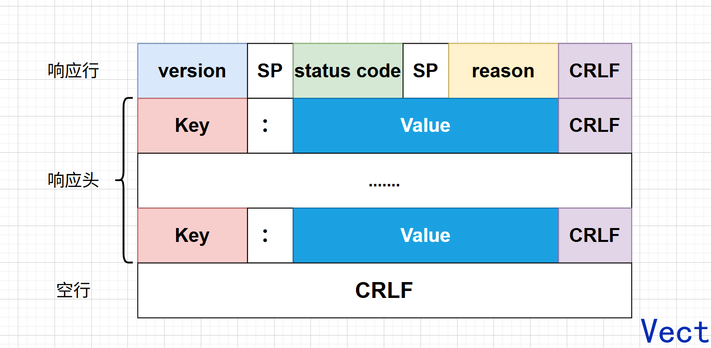

头部字段采用 Key-Value 形式，Key 和 Value 之间用 `:` 分隔，行末以 CRLF 换行表示字段结束。

需要注意：**Key 之后必须紧跟 `:`，中间不能有空格**；但 `:` 后面的 Value 前可以有多个空格。

用一段简单的代码演示：

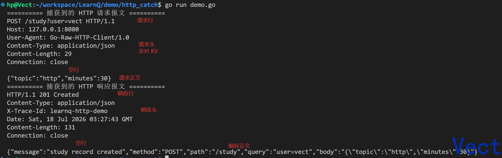

### 2.4 常见的头部字段

根据功能，头部字段可分为四大类：

| 分类       | 说明                                           |
| ---------- | ---------------------------------------------- |
| **通用字段** | 请求头和响应头里都可以出现                     |
| **请求字段** | 仅出现在请求头里，说明请求信息或附加条件       |
| **响应字段** | 仅出现在响应头里，补充说明响应报文的信息       |
| **实体字段** | 专门描述 Body 的额外信息（格式、长度、编码等） |

下面介绍几个最常见的头部字段：

**Host** 属于请求字段，只能出现在请求头里。它是 HTTP/1.1 规范中唯一**必须出现**的字段——如果请求头里没有 Host，这就是一个不合法的报文。Host 的作用是让请求被正确路由到同一台服务器上的不同网站（虚拟主机）。

**User-Agent** 是请求字段，只出现在请求头里。它用一个字符串来描述发起 HTTP 请求的客户端（浏览器类型、版本、操作系统等），服务器可以据此返回最适合该客户端的页面。

**Date** 是通用字段，但通常出现在响应头里，表示 HTTP 报文创建的时间。客户端可以结合这个时间与其他字段（如 Cache-Control）来决定缓存策略。

**Content-Length** 是实体字段，表明报文的正文长度（单位：字节）。接收方可以根据这个值判断 Body 是否接收完整。

**Content-Type** 是实体字段，请求头和响应头里都可以出现。它用来说明 Body 的数据格式，相当于告诉对方：”我这段正文是什么类型”（如 `text/html`、`application/json`、`image/png`）。

**Connection** 是通用字段，请求头和响应头里都可以出现。它用来控制当前 TCP 连接的管理方式。HTTP/1.1 默认使用长连接，即一次 TCP 连接可以复用多次 HTTP 请求。

- `Connection: keep-alive` — 表示希望保持连接，供后续请求复用
- `Connection: close` — 表示本次响应结束后关闭 TCP 连接

这个字段与网络底层关系密切，因为 HTTP 是应用层协议，真正传输数据依靠的是 TCP。

### 2.5 常见的请求方法

请求方法必须使用大写形式，常见的有以下几个：

1. **GET**：获取资源，可以理解为读取或下载数据；
2. **HEAD**：获取资源的元信息（仅响应头，无 Body）；
3. **POST**：向资源提交数据，相当于写入或上传数据；
4. **PUT**：替换资源，用请求体中的内容覆盖目标资源；
5. **DELETE**：删除资源。

这些方法很像数据库的 CRUD 操作（Create → POST，Read → GET，Update → PUT，Delete → DELETE）。不同之处在于，操作的不是本地资源，而是远端服务器的资源——所以必须先由客户端”请求”，由服务器决定如何响应。而”如何请求、如何响应”的规则，就是 HTTP 协议的核心。

#### GET / HEAD

**GET** 的含义是从服务器获取资源，这个资源通常是超文本形式（HTML、JSON 等）。

**HEAD** 与 GET 类似，服务器处理机制也相同，但服务器**不会返回请求的实体数据**，只会传回响应头，也就是资源的”元信息”。常用于检查资源是否存在、确认资源大小或最后修改时间。

#### POST / PUT

GET 和 HEAD 是从服务器获取数据，而 POST 和 PUT 则相反——向 URI 指定的资源提交数据，数据放在报文的 Body 里。

POST 的使用频率仅次于 GET，应用场景非常广泛，只要涉及向服务器发送数据，大多使用 POST。例如在 CSDN 发布文章，编辑好内容后点击”发帖”按钮，浏览器就会执行一次 POST 请求：把文章内容放入报文的 Body，拼好 POST 请求头，通过 TCP 协议发给服务器。

PUT 的作用类似 POST，但语义上有区别：**POST 通常表示”新建”（Create），PUT 表示”替换”（Update）**。POST 多次提交会创建多个资源，PUT 多次提交则每次都是把目标资源置为同一个状态。

#### 安全与幂等

这里涉及两个重要概念：**安全（Safe）**和**幂等（Idempotent）**。

在 HTTP 协议中，**安全**是指请求方法不会”破坏”服务器上的资源，即不会对资源造成实质性的修改。

按照这个定义，只有 GET 和 HEAD 是安全的方法——它们是只读操作。而 POST / PUT / DELETE 会修改服务器上的资源（增删改），因此是**不安全**的。

**幂等**是指：多次执行同一个操作，最终结果与执行一次相同。

GET 和 HEAD 既是安全的也是幂等的（读多少次都一样）。DELETE 可以多次删除同一个资源，每次的效果都是”资源不存在”，所以也是幂等的。

POST 是**新增或提交数据**，多次提交会创建多个资源，所以**不是幂等的**。

**但 PUT 是幂等的**。因为 PUT 的语义是”把目标资源替换成请求里给出的确定状态”。多次更新同一个资源，资源最终都会处于第一次更新后的状态，不会继续变化。

再强调一遍 PUT 的含义：

```text
PUT /users/1  意思是：把 /users/1 这个资源变成下面这个样子
```

而不是：

```text
帮我新增一次
帮我再操作一次
帮我追加一次
```

比如：

```http
PUT /users/1 HTTP/1.1
Content-Type: application/json

{
  "name": "Vect",
  "age": 100
}
```

无论你发送 1 次、2 次、10 次，最终服务器上的 `/users/1` 都应该是：

```json
{
  "name": "Vect",
  "age": 100
}
```

从”资源最终状态”来看，重复执行不会继续改变结果——这就是幂等。

### 2.6 常见状态码

状态码分为五类：

| 范围   | 类别       | 含义                                             |
| ------ | ---------- | ------------------------------------------------ |
| **1xx** | 提示信息   | 协议处理的中间状态，需要后续操作                 |
| **2xx** | 成功       | 报文已收到并被正确处理                           |
| **3xx** | 重定向     | 资源位置发生变动，需要客户端重新发送请求         |
| **4xx** | 客户端错误 | 请求报文有误，服务器无法处理                     |
| **5xx** | 服务器错误 | 服务器在处理请求时内部发生了错误                 |

#### 3xx 重定向

- **301 Moved Permanently**：永久重定向——请求的资源已经不在这个路径了，需要用新的 URI 再次访问。
- **302 Found**：临时重定向——资源还在原路径，但本次暂时需要用另一个 URI 来访问。

#### 4xx 客户端错误

- **400 Bad Request**：通用错误码，表示请求报文有误，但没有更具体的信息。
- **403 Forbidden**：服务器禁止访问该资源，拒绝了请求（通常是因为权限不足）。
- **404 Not Found**：资源在本服务器上未找到，无法提供给客户端。

#### 5xx 服务器错误

- **500 Internal Server Error**：与 400 类似，是一个笼统的错误码，表示服务器内部出错，具体原因不明。
- **501 Not Implemented**：客户端请求的功能服务器还未实现。
- **502 Bad Gateway**：网关或代理在尝试联系上游服务器时，收到了无效的响应。
- **503 Service Unavailable**：服务器暂时繁忙或正在维护，无法响应请求。


## 3. HTTP 连接管理

### 短连接

最早的 HTTP 协议非常简单，通信方式就是单纯的”请求-应答”。底层数据传输基于 TCP/IP 协议，每次发送请求前需要先与服务器建立连接，收到响应报文之后立刻关闭连接。

这种不保持长时间连接状态的方式，被称为**短连接**（又称为**无连接**）。这样设计的初衷是快速处理大量独立事务——处理完一个就断开，不占用服务器资源。

但是，短连接的缺点非常明显：每次请求都要经历**三次握手**建立 TCP 连接，响应完成后又要经历**四次挥手**断开连接。当请求频繁时，建立和断开连接的开销甚至超过了数据传输本身，反而违背了”快速处理”的初衷。

### 长连接

针对短连接的缺点，HTTP/1.1 引入了**长连接**的通信方式。

解决思路非常简单：在一个 TCP 连接中，可以进行多次”请求-应答”，直到双方都不再需要通信时，再断开连接。这大幅减少了 TCP 握手和挥手的开销。

下图是两种连接的对比：

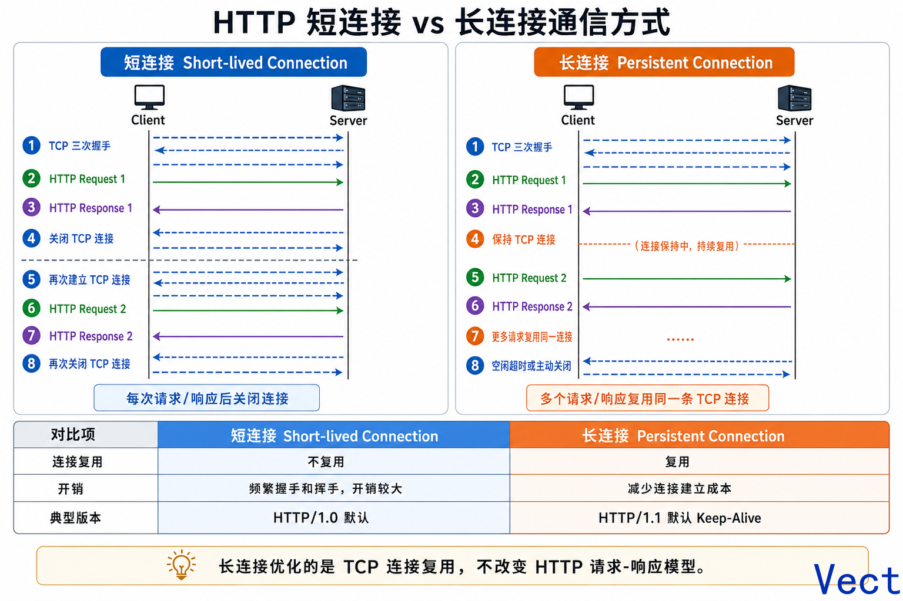


## 4. Cookie 机制

下面使用 Apifox 做一个小实验，通过实际操作来理解 Cookie 的工作机制。

先想象你要进入一家火爆的餐厅吃饭：

```text
Cookie：你手里的取号小票
Session：餐厅后台登记表
session_id：小票编号
```

### 第 1 步：模拟登录成功，服务器发 Cookie

在 Apifox 建第一个请求：

```http
GET https://postman-echo.com/cookies/set?session_id=abc123
```

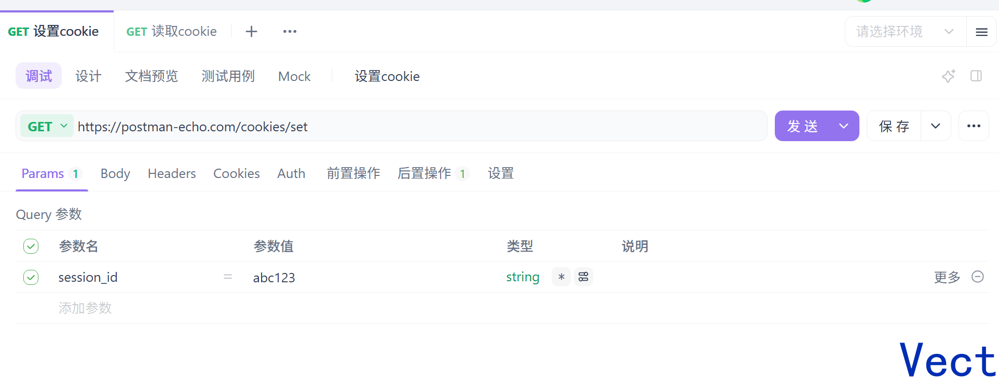

这个接口模拟了登录成功。

真实业务里，这一步通常是：

```http
POST /login HTTP/1.1
Host: example.com

username=vect&password=123456
```

服务器校验账号密码成功后，会做两件事：

第一，服务器自己保存 Session：

```text
sessions["abc123"] = {
  user_id: 1001,
  username: "vect",
  expire_time: "2小时后"
}
```

第二，服务器通过响应头告诉客户端保存 Cookie：

```http
HTTP/1.1 200 OK
Set-Cookie: session_id=abc123
```

点击发送得到：

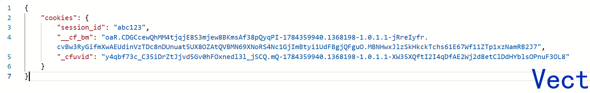

`Set-Cookie` 的作用：**服务器告知客户端把 session_id 保存起来，下次访问时带着它。**

### 第 2 步：模拟登录后再次访问网站

再新建一个接口：

```http
GET https://postman-echo.com/cookies
```

点击发送得到：

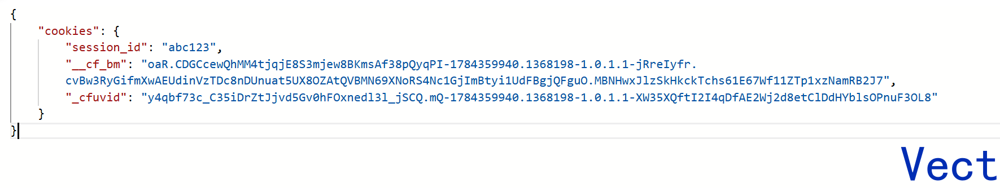

Apifox 自动带上了 Cookie，请求头里本质是：

```http
GET /cookies HTTP/1.1
Host: postman-echo.com
Cookie: session_id=abc123; __cf_bm=...; _cfuvid=...
```

`Cookie` 请求头的作用：**客户端说："这是你之前给我的 Cookie，我现在带回来了。"**

服务器收到后返回：

```json
{
  "cookies": {
    "session_id": "abc123"
  }
}
```

意思是：我确实收到了你带来的 Cookie。

### 真实的 Session 保存在哪里

刚才的实验只是 postman-echo.com 回显 Cookie，并不会真正校验登录状态。

在真实业务中，服务器收到 `Cookie: session_id=abc123` 后，会在内部查表：`sessions["abc123"]`。如果查到了 `abc123 → user_id=1001 → vect`，服务器就认为用户已登录；如果查不到，则返回 `401 Unauthorized`。

一句话总结：

> - **Cookie** 只是把 session_id 在客户端和服务器之间传来传去的载体
> - **Session** 是服务器根据 session_id 查到的用户登录状态

整个完整流程是：

1. 用户登录
2. 服务器校验账号密码
3. 服务器生成 session_id
4. 服务器保存 Session: session_id -> 记录了用户信息
5. 服务器响应 Set-Cookie: session_id=xxx
6. 客户端保存 Cookie
7. 客户端下次请求自动携带 Cookie: session_id=xxx
8. 服务器取出 session_id
9. 服务器查 Session
10. 查到：放行；查不到：401


## 参考资料
- 小林coding
- 图解 HTTP
- https://learn.lianglianglee.com/
