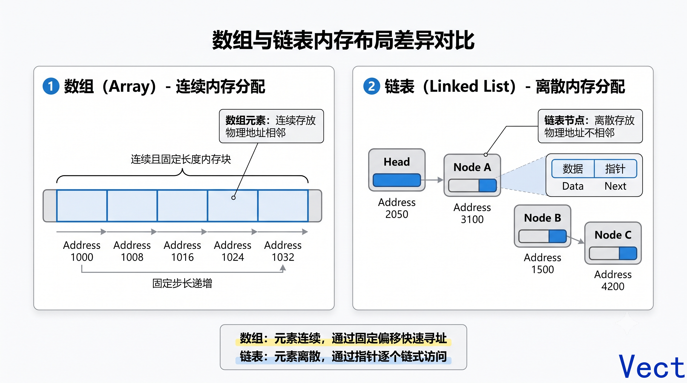
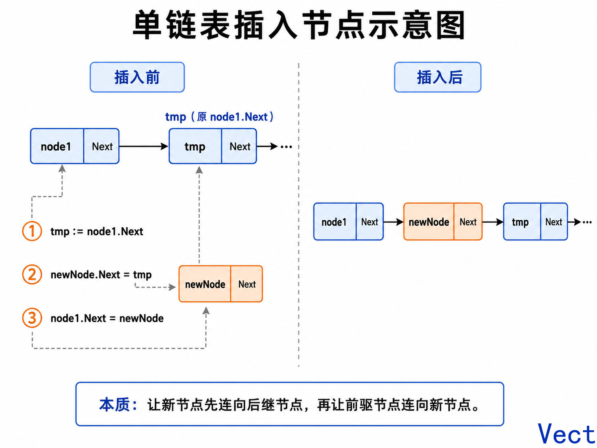
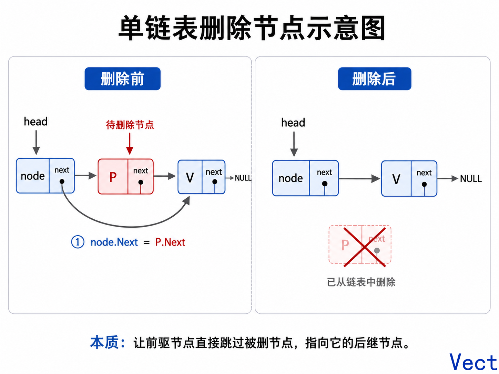
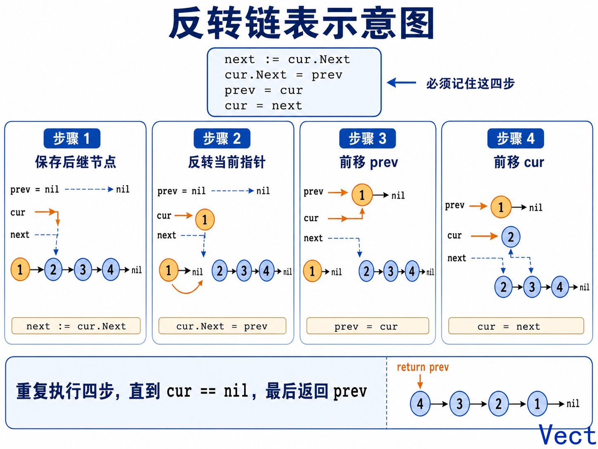
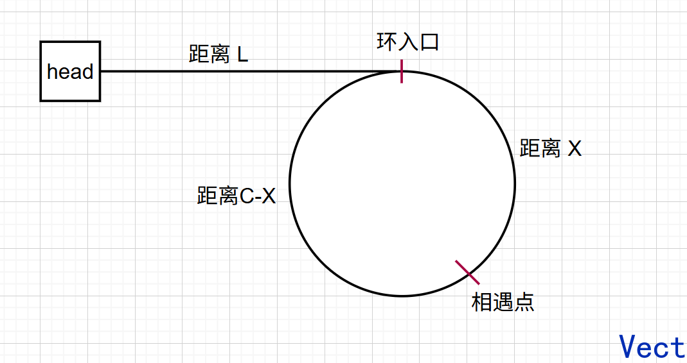
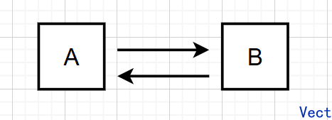
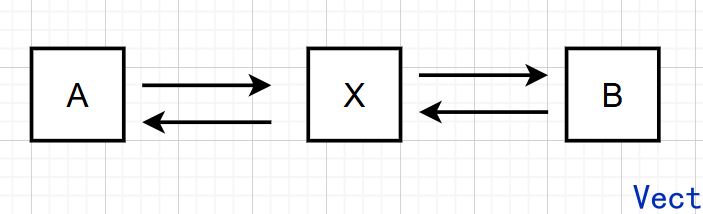

## 一、链表的本质
数组是一整块连续内存

链表由多个离散节点组成，每个节点除了保存数据，还保存下一个节点的位置：



Go 中最基础的单链表节点：

```go
type ListNode struct {
	Val  int
	Next *ListNode
}
```

`Next` 的类型是 `*ListNode`，表示它保存的是下一个节点的地址


## 二、链表中的核心概念

### 1. 头节点

```go
head := &ListNode{Val: 10}
```

`head` 保存第一个有效节点的地址

```text
head
 ↓
10 → 20 → 30 → nil
```

当：`head == nil`，说明链表为空


### 2. 当前节点与后继节点

```go
cur := head
```

`cur` 是当前正在访问的节点

```go
cur.Next
```

表示下一个节点

遍历链表的标准模板：

```go
for cur := head; cur != nil; cur = cur.Next {
	fmt.Println(cur.Val)
}
```

注意，判断条件是：`cur != nil`

而不是：`cur.Next != nil`

后者会漏掉最后一个节点


### 3. 虚拟头节点

很多链表题会增加一个不保存有效数据的节点：

```go
dummy := &ListNode{Next: head}
```

结构如下：

```text
dummy → 10 → 20 → 30 → nil
```

它的作用是统一处理**删除头节点**和**删除普通节点**

例如删除值为 `10` 的头节点，如果没有虚拟头节点：

```go
head = head.Next
```

删除中间节点：

```go
prev.Next = prev.Next.Next
```

二者逻辑不同

使用虚拟头节点后，删除任何节点都可以统一成：

```go
prev.Next = prev.Next.Next
```

最后返回：

```go
return dummy.Next
```

虚拟头节点是链表题最重要的技巧之一


## 三、单向链表的常用操作

---

### 1. 遍历链表

```go
func printList(head *ListNode) {
	for cur := head; cur != nil; cur = cur.Next {
		fmt.Print(cur.Val, " ")
	}
	fmt.Println()
}
```

时间复杂度为 $O(n)$

链表无法像数组一样通过下标直接访问：

```go
arr[100]
```

要访问第 `100` 个链表节点，只能从头开始向后走


### 2. 查找节点

```go
func find(head *ListNode, target int) *ListNode {
	for cur := head; cur != nil; cur = cur.Next {
		if cur.Val == target {
			return cur
		}
	}
	return nil
}
```

时间复杂度为 $O(n)$

### 3. 插入节点
在两个相邻节点之间插入一个新的节点，只需要改变两个节点的指针指向即可
```go
// 在节点 node1 之后插入 newNode
func insertNode(node1 *ListNode, newNode *ListNode) {
    tmp := node1.Next
    newNode.Next = tmp
    node1.Next = newNode
}
```


### 4. 删除节点
只需改变一个节点的指针即可，这个指针越过需要删除的节点位置，指向要删除的下一个节点即可
```go
// 删除 node 之后的第一个节点
func removeItem(node *ListNode) {
    if node.Next == nil {
        return
    }
    // node -> P -> V
    P := node.Next
    V := P.Next
    node.Next = V
}
```


## 四、手撕完整单向链表

下面实现一个真正可用的单链表，支持：

* 获取长度
* 头部插入
* 尾部插入
* 指定下标插入
* 指定下标删除
* 指定下标获取
* 查找
* 遍历输出

```go
package main

import "fmt"

// 单链表的一个节点
type Node struct {
	Val  int
	Next *Node
}

// 单链表结构
type LinkedList struct {
	dummy *Node // 哨兵节点，不存储有效数据，dummy.Next才是真正的头节点
	tail  *Node // 指向当前链表的最后一个有效节点，方便O(1)尾插
	size  int   // 链表中有效节点的数量，不包含dummy节点
}

// 构造函数
func NewLinkedList() *LinkedList {
	dummy := &Node{}

	return &LinkedList{
		dummy: dummy,
		tail:  dummy, // 空链表中没有有效节点，因此tail暂时指向dummy
	}
}

// 获取单链表长度
func (l *LinkedList) Len() int {
	return l.size
}

// 头插
// dummy -> 1 -> 2 -> 3
//
//	        ↑
//		   node
//
// dummy -> node -> 1 -> 2 -> 3
func (l *LinkedList) PushFront(val int) {
	// 构造插入的新节点
	node := &Node{
		Val:  val,
		Next: l.dummy.Next, // node是真正的头了
	}

	// 更新dummy的Next
	// dummy.Next原来指向旧头节点
	// 现在改为指向新节点node
	l.dummy.Next = node

	// 原链表为空时，插入的node既是头节点，也是尾节点
	// 因此需要更新tail
	if l.size == 0 {
		l.tail = node
	}

	l.size++
}

// 尾插
func (l *LinkedList) PushBack(val int) {
	node := &Node{Val: val}

	// 					 tail
	//					  ↓
	// dummy -> 1 -> 2 -> 3
	//					  	↑
	//					   node
	//
	// dummy -> 1 -> 2 -> 3 -> node
	//					  		 ↑
	// 					 		tail

	// 当前尾节点的Next指向新节点
	// 空链表中tail指向dummy，因此这里同样成立：
	// dummy.Next = node
	l.tail.Next = node

	// 新节点成为新的尾节点
	l.tail = node

	l.size++
}

// 插入到指定索引位置
func (l *LinkedList) Insert(index int, val int) bool {
	// index表示新节点插入后所在的位置
	//
	// 合法范围为[0, size]
	// index == 0：插入到头部
	// index == size：插入到尾部
	if index < 0 || index > l.size {
		return false
	}

	// 插入到size位置，本质上就是尾插
	// 使用tail可以避免遍历链表
	if index == l.size {
		l.PushBack(val)
		return true
	}

	// prev用于找到插入位置的前驱节点
	//
	// 可以把dummy理解为虚拟索引-1：
	//
	// 节点：     dummy -> 10 -> 20 -> 30
	// 虚拟索引：   -1      0     1     2
	prev := l.dummy

	// 新节点要插入到索引index，
	// 因此prev需要指向索引index-1的节点
	//
	// 从dummy开始向后走index步，
	// 正好到达索引index-1的节点
	//
	// 例如index == 2：
	//
	// dummy -> 10 -> 20 -> 30
	//                 ↑
	//                prev
	//
	// 新节点会插入到20和30之间，
	// 插入后新节点的索引为2
	for i := 0; i < index; i++ {
		prev = prev.Next
	}

	// 新节点先指向原来index位置的节点
	//
	// 插入前：
	// prev -> prev.Next
	//
	// 第一步：
	// node -> prev.Next
	node := &Node{
		Val:  val,
		Next: prev.Next,
	}

	// 前驱节点再指向新节点
	//
	// 插入后：
	// prev -> node -> 原来的prev.Next
	prev.Next = node

	l.size++

	return true
}

// 获取某位置具体值
func (l *LinkedList) Get(index int) (int, bool) {
	// 合法节点索引范围为[0, size-1]
	if index < 0 || index >= l.size {
		return 0, false
	}

	// cur从真正的头节点开始
	cur := l.dummy.Next

	// 向后移动index次
	// 最终cur指向索引为index的节点
	for i := 0; i < index; i++ {
		cur = cur.Next
	}

	return cur.Val, true
}

// 删除指定位置节点
func (l *LinkedList) Delete(index int) bool {
	// 合法节点索引范围为[0, size-1]
	if index < 0 || index >= l.size {
		return false
	}

	// 单链表不能从当前节点直接找到前一个节点
	// 因此删除index位置节点时，
	// 必须先找到该节点的前驱节点prev
	prev := l.dummy

	// 从dummy开始向后移动index次
	// 最终prev指向待删除节点的前一个节点
	//
	// 例如删除index == 1：
	//
	// dummy -> 10 -> 20 -> 30
	//          ↑     ↑
	//        prev  deleted
	//
	// prev从dummy移动一次后指向10
	for i := 0; i < index; i++ {
		prev = prev.Next
	}

	// prev.Next就是需要删除的节点
	deleted := prev.Next

	// 跨过 deleted 这个节点就好
	//
	// 删除前：
	// prev -> deleted -> deleted.Next
	//
	// 删除后：
	// prev ------------> deleted.Next
	prev.Next = deleted.Next

	// 如果删除尾节点
	//
	// 例如：
	// dummy -> 10 -> 20 -> 30
	//                ↑     ↑
	//              prev  deleted、tail
	//
	// 删除30后，20成为新的尾节点
	if deleted == l.tail {
		l.tail = prev
	}

	l.size--

	// 删除后链表为空
	//
	// 空链表应该恢复为：
	//
	// dummy
	//   ↑
	// tail
	//
	// dummy.Next此时已经是nil
	if l.size == 0 {
		l.tail = l.dummy
	}

	// deleted是局部变量
	// 函数结束后，如果没有其他引用指向它，
	// Go垃圾回收器会在合适的时机回收该节点
	return true
}

// 查找目标值所在节点索引
func (l *LinkedList) Find(target int) int {
	// index记录当前节点在链表中的索引
	// 第一个有效节点索引为0
	index := 0

	// 从真正的头节点开始遍历
	//
	// cur := l.dummy.Next：从第一个有效节点开始
	// cur != nil：还没有走到链表末尾
	// cur = cur.Next：移动到下一个节点
	for cur := l.dummy.Next; cur != nil; cur = cur.Next {
		// 找到第一个值等于target的节点
		// 返回该节点的索引
		if cur.Val == target {
			return index
		}

		// 当前节点不是目标节点，索引加1
		index++
	}

	// 遍历完整个链表仍然没有找到target
	return -1
}

// 打印链表
func (l *LinkedList) Print() {
	// 从真正的头节点开始遍历
	for cur := l.dummy.Next; cur != nil; cur = cur.Next {
		fmt.Print(cur.Val)

		// 当前节点不是尾节点时，打印箭头
		// 避免最后出现多余的" -> "
		if cur.Next != nil {
			fmt.Print(" -> ")
		}
	}

	fmt.Println()
}

func main() {
	list := NewLinkedList()

	list.PushBack(10)
	list.PushBack(100)
	list.PushBack(1000)
	list.PushFront(9)
	list.Insert(2, 55)

	list.Print()

	val, ok := list.Get(2)
	fmt.Println(val, ok)

	list.Delete(1)
	list.Print()

	fmt.Println("size:", list.Len())
	fmt.Println("20 index:", list.Find(20))
}
```

## 五、单链表最容易错的指针问题

### 1. 丢失后继节点

错误写法：

```go
cur.Next = prev
cur = cur.Next
```

执行完：

```go
cur.Next = prev
```

`cur.Next` 已经不再指向原来的后继节点

正确写法：

```go
next := cur.Next
cur.Next = prev
prev = cur
cur = next
```

---

### 2. 删除时拿当前节点而不是前驱节点

错误思路：

```go
cur := head

if cur.Val == target {
	cur = cur.Next
}
```

这里只修改了局部变量 `cur`，前一个节点仍然指向被删除节点。

链表删除本质是修改前驱节点的 `Next`：

```go
prev.Next = cur.Next
```

---

### 3. 忘记更新头节点

```go
func pushFront(head *ListNode, val int) {
	head = &ListNode{
		Val:  val,
		Next: head,
	}
}
```

这段代码不会修改调用者的 `head`，因为 Go 参数是值传递

应当返回新头节点：

```go
func pushFront(head *ListNode, val int) *ListNode {
	return &ListNode{
		Val:  val,
		Next: head,
	}
}
```

或者传入二级指针：

```go
func pushFront(head **ListNode, val int)
```


## 六、反转单链表

这是最基础、最高频的链表操作

```go
func reverseList(head *ListNode) *ListNode {
	var prev *ListNode
	cur := head

	for cur != nil {
		next := cur.Next
		cur.Next = prev
		prev = cur
		cur = next
	}

	return prev
}
```

必须记住四步：

```go
next := cur.Next
cur.Next = prev
prev = cur
cur = next
```


时间复杂度为 $O(n)$，额外空间复杂度为 $O(1)$


## 七、用两道力扣题目理解环形链表

### 1.LeetCode 141——判断链表是否有环
#### 题解
https://leetcode.cn/problems/linked-list-cycle/submissions/735461644/

思路：
使用快慢指针，追击相遇的思想
- `fast` 每次走两步
- `slow` 每次走一步

题解：
```go
func hasCycle(head *ListNode) bool {
    if head == nil {
        return false
    }
    fast, slow := head, head
    for fast != nil && fast.Next != nil {
        fast = fast.Next.Next
        slow = slow.Next

        if slow == fast {
            return true
        }
    }
    return false
}
```
`fast`走的快，所以要控制`fast.Next`和`fast.Next.Next`都不为空

#### 延申：为什么快慢指针一定能相遇？
当 `slow` 进入环以后，`fast` 一定已经在环中。

假设某一时刻，`fast` 在 `slow` 前面 $d$ 个节点：
```text
slow ─── 距离 d ─── fast
```
根据快慢关系，`fast` 相对 `slow` 每轮前进一步
二者在环上的距离会不断变化：
```text
d
d - 1
d - 2
...
0
```
由于所有距离都在模环长的意义下计算，所以最终一定会出现相对距离为 0，此时两个指针相遇

更严格地说，设环长为 $C$，初始相对距离为 $d$。经过 $t$ 轮后，相对距离满足：$d−t≡0(modC)$

总能取到某个 $t$，使得：$t≡d(modC)$

因此一定相遇

#### 快指针会跨过慢指针吗？
不可能，假设某轮开始前，`fast` 落后 `slow` 一个节点
`fast -> slow`
这一轮：
- `slow`走一步
- `fast`走两步
他们落在同一个位置了，链表节点是离散位置，不存在连续运动意义上的跨过而不相遇

### 2. LeetCode 142——找到环的入口
https://leetcode.cn/problems/linked-list-cycle-ii/

#### 双指针先第一次相遇
第一阶段还是快慢指针，先让两指针在环中第一次相遇：
```go
slow, fast := head, head

for fast != nil && fast.Next != nil {
	slow = slow.Next
	fast = fast.Next.Next

	if slow == fast {
		break
	}
}
```
真正的问题是：
> 第一次相遇为什么是环的入口？

#### 建立模型
定义：
- $L$：链表头到环入口的距离
- $X$：环入口到第一次相遇点的距离
- $C$：整个环的长度
- $k$：第一次相遇前，快指针比慢指针多走的完整环数


#### 快慢指针走过的距离
慢指针从 `head` 出发：
1. 先走 $L$ 到环入口
2. 再走 $X$ 到相遇点
总路程：$S_{slow}​=L+X$

快指针最终也到达同一个相遇点，相较于慢指针，快指针会在环中多走若干圈，所以：$S_{fast}​=L+X+kC$
由于快指针速度是两倍的慢指针，因此：$S_{fast}​=2S_{slow}​$
代入： $L+X+kC=2(L+X)$
化简： $kC=L+X$
继续整理： $kC=L+X$
拆出一个完整的环：$L=(k−1)C+(C−X)$
观察最后的式子：
- $L$ 是从链表头走到环入口的距离
- $C−X$ 是从相遇点继续走到环入口的距离
- $(k−1)C$ 是若干完整环
因此，从相遇点走 $L$ 步，相当于：
1. 先绕若干完整圈；
2. 再走 $C−X$；
3. 最终到达环入口
那么就能推出：
```text
从 head 出发走 L 步
        ↓
      环入口

从 meet 出发走 L 步
        ↓
      环入口
```

#### 完整代码
```go
/**
 * Definition for singly-linked list.
 * type ListNode struct {
 *     Val int
 *     Next *ListNode
 * }
 */
func detectCycle(head *ListNode) *ListNode {
    if head == nil {
        return nil
    }
    slow, fast := head, head

    for fast != nil && fast.Next != nil {
        fast = fast.Next.Next
        slow = slow.Next

        if slow == fast {
            break
        }
    }

    if fast == nil || fast.Next == nil {
        return nil
    }

    p := head
    for p != slow {
        // p 从起点走
        p = p.Next
        // slow 从相遇点走
        slow = slow.Next
    }

    return p
}
```

## 八、双向链表
双向链表节点同时保存前驱和后继：
```go
type Node struct {
    Val     int
    Prev    *Node
    Next    *Node
}
```
双向链表最大的优势是：已知某个节点地址时，可以在 $O(1)$ 时间内删除它，因为当前节点自己就保存了前驱，单链表删除当前节点通常需要先找到前驱

### 两个核心操作：插入和删除
#### 1. 插入节点
假设当前结构：


现在需要在 A 之后插入新节点 X：


现在需要建立四条关系：
```text
A.Next = X
X.Prev = A
X.Next = B
B.Prev = X
```
代码：
```go
// 假设 a := A, x := X
func insertAfer(a, x *DNode) {
    x.Prev = a
    x.Next = a.Next

    a.Next.Prev = x
    a.Next = x
}
```
核心是：**先让新节点连接左右邻居，再让左右邻居连接新节点**

#### 2. 删除节点
当前结构：


现在需要删除 X ：


代码：
```go
func remove(node *DNode) {
    node.Prev.Next = node.Next
    node.Next.Prev = node.Prev

    node.Prev = nil
    node.Next = nil
}
```

### 和单链表对比
因为双向链表会多保存一个指针，所以：
- 每个节点内存开销更大
- 插入时需要维护更多指针
- 出错概率更高
- 链表节点通常分散在堆内存中

选择双向链表，是因为场景需要：
- 已知节点快速删除
- 快速访问前驱节点
- 双向遍历
- 快速在头尾插入和删除
- 频繁调整节点顺序

## 九、内存和缓存
这一章节我们需要抓住一个主线：**数据离CPU有多远**展开
同一个数据：
- 在CPU寄存器中，访问很快
- 在CPU Cache中，访问也很快
- 在内存中，明显变慢
- 在磁盘中，和内存速度已经差了好几个量级了
所以计算机一直在做一件事：
**把近期可能使用的数据，放到更快、容量更小的存储设备中**
### 1. 存储为什么分层？
CPU 运算速度非常快，但大容量存储设备通常比较慢。

如果 CPU 每执行一条指令，都去磁盘读取数据，CPU 大部分时间都会处于等待状态。

因此现代计算机采用分层存储结构：


核心矛盾是：
- 越快的设备，越贵、容量越小
- 越慢的设备，越便宜、容量越大

所以不能把所有数据都放到最快的设备中，那么只能：
- 大量数据放在慢设备
- 常用数据复制到快设备

### 2. 缓存
程序需要从内存中读数据，CPU 每次都要访问内存，等待时间较长，于是在 CPU 和内存之间加一层 Cache：
```text
CPU ←→ Cache ←→ 内存
```

读取数据时：
1. 先检查 Cache
2. Cache 中存在，直接读取        -> 缓存命中
3. Cache 中不存在，再访问内存    ->  缓存未命中
4. 把读取的数据放进 Cache

为什么这样设计？
> 局部性原理：
> - 时间局部性：一个数据刚被访问过，近期可能再次被访问
>   ```go
>   sum += count
>   count++
>   if count > limit {
>	  ...
>   }
>   ```
>   变量`count`会被频繁访问
>
>- 空间局部性：一个数据被访问后，它附近的数据也可能很快被访问
>
>   例如遍历数组：
>   ```go
>   for i := 0; i < len(nums); i++ {
>       fmt.Prinln(nums[i])
>   }
>   ```
>   数组的内存地址是连续的，访问顺序也是连续的，当CPU读取`nums[0]`的时候，会把附近一整块数据一起加载到 Cache

### 3. 数据结构的内存效率
> 为了保存同样数量的有效数据，需要额外消耗多少内存？

以保存 4 个 `int64`为例
数组的内存结构：`nums := [4]int64{10, 20, 30, 40}`
逻辑结构：
```text
┌────────┬────────┬────────┬────────┐
│   10   │   20   │   30   │   40   │
└────────┴────────┴────────┴────────┘
```
假设一个`int64`占用8字节，那么有效数据就是32字节，不需要额外的空间了

再看单链表，每个节点除了保存`Val`，还需要保存`Next`：
```text
┌────────┬──────────┐
│ Val=10 │ Next地址  │
└────────┴──────────┘
```
在64位系统中，一个节点就需要16字节，那么总共需要64字节，但是真正的数据只有32字节

再看双向链表，每个节点存一个值和两个指针，共计24字节：
```text
┌──────────┬────────┬──────────┐
│ Prev地址 │ Val=10 │ Next地址  │
└──────────┴────────┴──────────┘
```
4个节点就需要96个字节了

从纯内存占用看：数组 < 单向链表 < 双向链表
并且，链表节点是一个个独立分配的对象，节点大概率不连续，那么内存管理器还需要记录：
- 对象大小
- 分配状态
- 垃圾回收信息
所以，管理链表的内存成本较高

### 4. 数据结构的缓存效率
> CPU 读取一个元素时，顺便加载进缓存的数据，有多少能被后续使用？

很显然，数组内存连续分布，缓存效率高，链表内存离散分布，缓存效率低

现在不计硬件成本，遍历数组和遍历链表的理论时间复杂度都是$O(n)$

但是，实际速度可能差异很大，数组遍历往往明显快于链表
是因为：
- 数组：内存连续，缓存命中率高
- 链表：内存分散，缓存未命中较多，每一步都依赖上一个节点的 `Next`

### 5. 软件缓存
前面讲的是硬件缓存，但是软件系统同样会遇到类似问题，例如后端服务经常从数据库读取用户信息：
```text
用户请求
   ↓
后端服务
   ↓
数据库查询
```
数据库访问相对较慢，就可以在应用内存中保存一部分常用数据：
```text
用户请求
   ↓
应用缓存
   ↓ 缓存未命中
数据库
```
这种设计思想和CPU 缓存思想一致

但是缓存数量有限，就必须淘汰数据，假设缓存只能保存3条数据：`A B C`，现在要加入`D`，容量不够，必须删除一个
问题变为：“删除谁，才能提高缓存命中率？”
常见的思路：
```text
FIFO：最早进入的先淘汰
LFU：使用次数最少的淘汰
LRU：最久没有使用的淘汰
```

### 6. LRU 缓存
LRU 基于时间局部性原理：
> 最近访问过的数据，未来更可能再次访问；很久没访问的数据，未来使用概率相对更低

假设缓存容量是 3，访问：`A → B → C`

按最近访问顺序排列：
```text
最近                     最久
 C          B             A
```

再次访问 A：
```text
最近                     最久
 A          C             B
```
加入 `D`：`D → A → C → B`

容量超限，淘汰最旧的 `B`：`D → A → C`

LRU 的规则可以压缩成两句话：
- 访问一个数据：移动到最前面
- 容量超限：删除最后一个数据

那么就需要快速查找数据->哈希表很适合，快速调整使用顺序->双向链表很适合

现在来看一道力扣题目：https://leetcode.cn/problems/lru-cache/

核心思路：
```text
Get：
查 map
不存在返回 -1
存在则移动到头部，返回 value

Put：
存在：
    更新 value
    移动到头部

不存在：
    创建节点
    写入 map
    插入头部
    size++

超容量：
    删除尾部节点
    删除 map 中对应 key
    size--
```
需要自己额外实现：删除节点、移动节点到头部、头插、删除并返回最久未使用的节点

代码：
```go
type Node struct {
    key     int
    value   int
    prev    *Node
    next    *Node
}
type LRUCache struct {
    capacity    int
    size        int
    cache       map[int]*Node
    head        *Node
    tail        *Node
}


func Constructor(capacity int) LRUCache {
    head := &Node{}
    tail := &Node{}

    head.next = tail
    tail.prev = head

    return LRUCache {
        capacity:   capacity,
        cache:      make(map[int]*Node),
        head:       head,
        tail:       tail,
    }
}

// 不仅仅是获取，还有挪动到head
func (this *LRUCache) Get(key int) int {
    node, ok := this.cache[key]
    if !ok {
        return -1
    }

    this.moveToFront(node)

    return node.value
}


func (this *LRUCache) Put(key int, value int)  {
    // key 已存在：更新值，引动到头部
    if node, ok := this.cache[key]; ok {
        node.value = value
        this.moveToFront(node)
        return
    }

    // key 不存在：创建新的节点
    node := &Node {
        key:    key,
        value:  value,
    }

    this.cache[key] = node
    this.addToFront(node)
    this.size++

    // 超过容量，淘汰最久未使用的
    if this.size > this.capacity {
        last := this.removeLast()
        delete(this.cache, last.key)
        this.size--
    }
}

// 删除节点
func (this *LRUCache) remove(node *Node) {
    node.prev.next = node.next
    node.next.prev = node.prev
}

// 头插
func (this *LRUCache) addToFront(node *Node) {
    node.prev = this.head
    node.next = this.head.next

    this.head.next.prev = node
    this.head.next = node
}

// 移动到头部
func (this *LRUCache) moveToFront(node *Node) {
    this.remove(node)
    this.addToFront(node)
}

// 删除并返回最久未使用的节点
func (this *LRUCache) removeLast() *Node {
    node := this.tail.prev
    this.remove(node)
    return node
}
```

LFU 后续会有~
