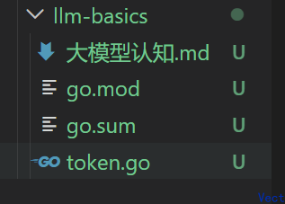
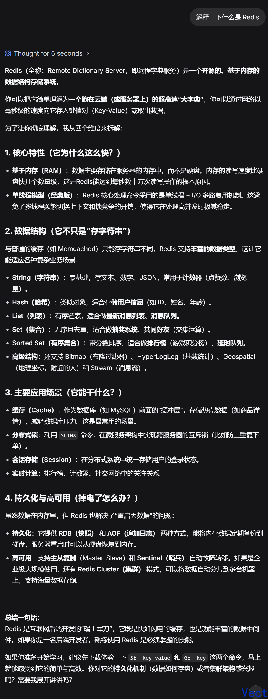
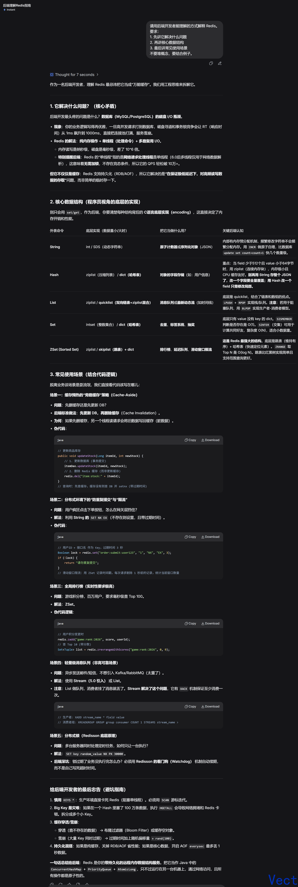
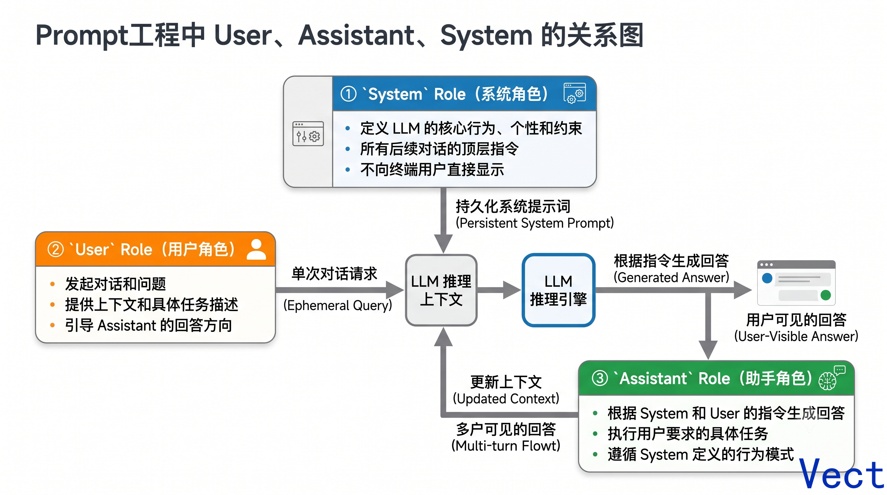
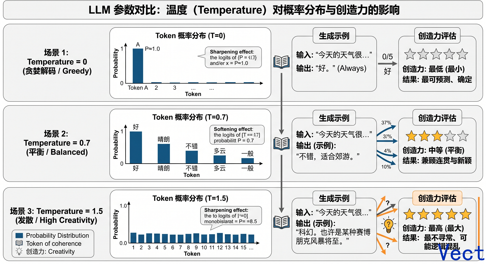
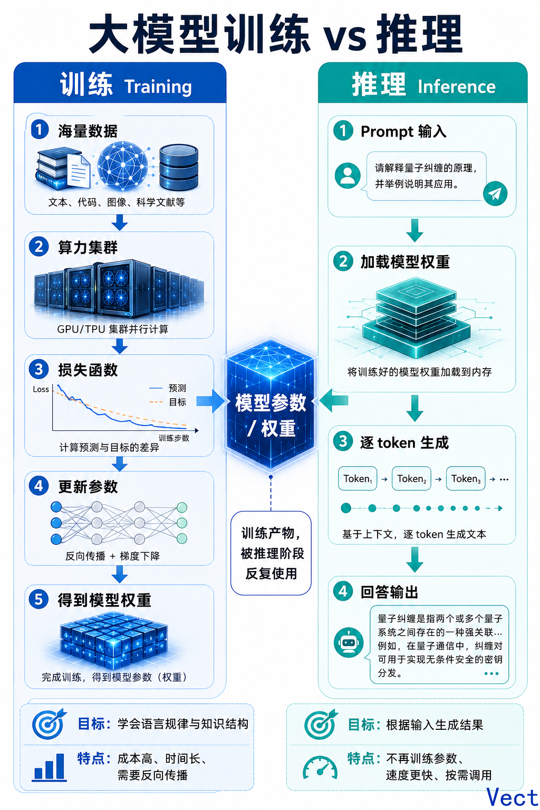
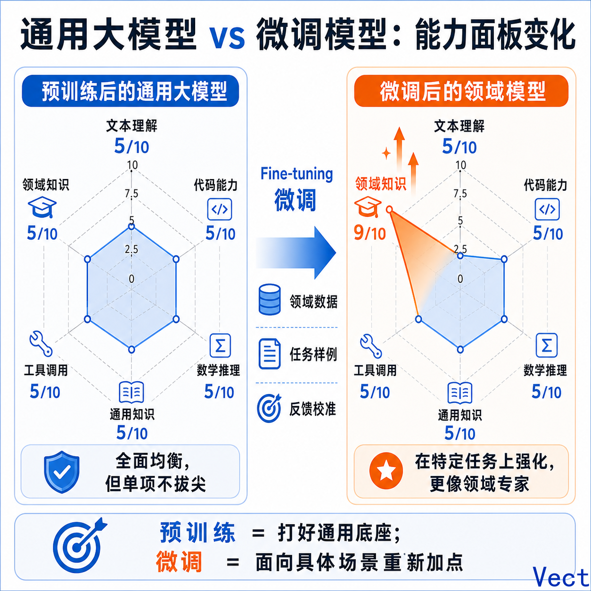
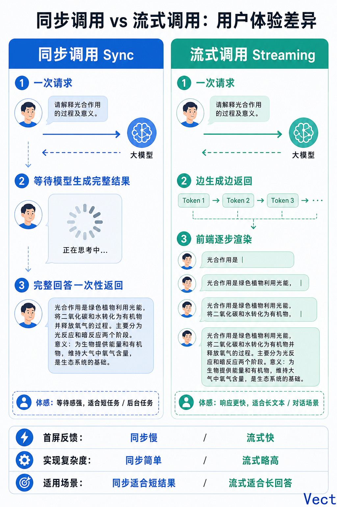

## 一、Token：模型真正看到的”文字单位“

模型不是直接按“字”或“词”理解文本，而是先把文本切成一个个 `token`，你输入：

```
我想学习 Go 后端开发
```

模型内部看到的不是完整句子，而是类似：

```
我 / 想 / 学习 / Go / 后端 / 开发
```

但真实切分不一定完全等于中文词语，有些英文、符号、空格、代码也会被拆成 token

比如：

```
Redis 是什么？
```

可能被切成：

```
Redis / 是 / 什么 / ？
```

再比如代码：

```
func main() {
    fmt.Println("hello")
}
```

会被拆成很多 token，包括：

```
func
main
(
)
{
fmt
.
Println
(
"hello"
)
}
```

所以，**token 是模型处理文本的基本单位**，一个 token 大概对应0.75个英文单词，1-2个汉字，具体尺度取决于模型使用的分词器

这件事很重要，因为大模型 API 通常按 token 计费：

```
费用 ≈ 输入 token 数 + 输出 token 数
```

同时，上下文窗口也是按 token 计算的。

比如一个模型支持 `128k tokens`，意思是：

> 输入内容 + 历史对话 + 工具结果 + 模型输出，总共不能超过大约 `128k tokens`

使用代码感受一下 token：

使用 OpenAI 的 tiktoken 来看看文本会被切成多少个 token：

> 首先需要安装依赖：`go get github.com/pkoukk/tiktokne-go`
>
> 这里需要注意：
>
> Go 1.18+ 之后，**`go get` 只能在 Go module 内部使用**（即目录中必须有 `go.mod` 文件）。之前我的 `llm-basics` 目录里没有 `go.mod`，所以 Go 拒绝执行并提示：
>
> > ```
> > go.mod file not found in current directory or any parent directory.
> > ```
>
> 简单说：**Go 不再支持在 module 外部用 `go get` 下载包**，这是从 Go 1.18 开始的安全和依赖管理改进
>
> 解决方式：
>
> 以后开始写 Go 代码前，**第一步就是初始化 module**：
>
> ```bash
> # 在代码所在目录执行
> go mod init <模块名>
> ```
>
> 模块名通常用项目路径，例如：
>
> * `go mod init go-agent/llm-basics`
> * `go mod init github.com/你的用户名/项目名`
>
> 初始化后会生成 `go.mod` 文件，有了它：
>
> * `go get` 正常工作
> * `go build` / `go run` 自动管理依赖
> * 依赖版本被锁定在 `go.mod` 和 `go.sum` 中
>
> 如图所示：
>
> 
>
> 注意：这不是规范的工程结构，我是为了简单演示代码

```go
package main

import (
	"fmt"

	"github.com/pkoukk/tiktoken-go"
)

func main() {
	// 使用 GPT-4 编码方式
	enc, err := tiktoken.EncodingForModel("gpt-4")
	if err != nil {
		panic(err)
	}

	texts := []string{
		"你好，今天天气怎么样？",
		"Hello, how are you?",
		"Go is an open-source programming language.",
		"大语言模型的核心概念包括Token、Prompt等概念。",
	}

	for _, text := range texts {
		tokens := enc.Encode(text, nil, nil)
		fmt.Printf("文本: %s\n", text)
		fmt.Printf("Token数: %d\n", len(tokens))
		fmt.Printf("Token IDs: %v\n\n", tokens)
	}
}

```

输出：

```bash
文本: 你好，今天天气怎么样？
Token数: 13
Token IDs: [57668 53901 3922 37271 36827 36827 30320 242 17486 236 82696 91985 11571]

文本: Hello, how are you?
Token数: 6
Token IDs: [9906 11 1268 527 499 30]

文本: Go is an open-source programming language.
Token数: 8
Token IDs: [11087 374 459 1825 31874 15840 4221 13]

文本: 大语言模型的核心概念包括Token、Prompt等概念。
Token数: 24
Token IDs: [27384 73981 78244 54872 25287 9554 72237 64209 162 25451 26203 113 68379 26955 105 3404 5486 55715 50667 162 25451 26203 113 1811]
```

很明显，相同长度的中文文本，Token 数量会比英文多，这意味用中文和LLM对话，成本会高一些


## 二、Prompt：给模型的任务说明

### 1. 传统的 prompt

Prompt 就是你给模型输入的指令

最简单的 prompt：`解释一下什么是 Redis`

更好的 prompt：

```text
请用后端开发者能理解的方式解释 Redis。
要求：
1. 先讲它解决什么问题
2. 再讲核心数据结构
3. 最后讲常见使用场景
不要堆概念，要结合例子。
```



新开一个对话，使用第二个 prompt：



很明显，第二种 prompt 更适合开发者，能得到更好的答案

因为大模型不是“自动知道你想要什么”，它是根据上下文预测输出。你给的信息越清楚，它越容易朝正确方向生成

可以把 prompt 理解成：

```text
任务目标 + 背景信息 + 输出格式 + 约束条件
```

| 组成 | 作用                   | 示例                        |
| ---- | ---------------------- | --------------------------- |
| 角色 | 让模型知道回答视角     | 你是一名 Go 后端面试官      |
| 任务 | 明确要做什么           | 帮我讲清楚 LRU 缓存         |
| 背景 | 告诉模型你的水平和场景 | 我刚学完双向链表            |
| 约束 | 限制回答方式           | 不要数学推导，直击本质      |
| 格式 | 控制输出结构           | 按“问题-本质-代码-易错点”讲 |

prompt 不是提问，而是给模型布置任务

### 2. 用简单的 Go 代码感知

> 首先需要一个 API Key，这个请读者自行创建，我使用的是 DeepSeek 官方的 API Key
>
> 安装依赖：`go get github.com/sashabaranov/go-openai`
>
> 设置全局环境变量：`echo 'export DEEPSEEK_API_KEY="你的key"' >> ~/.bashrc
> source ~/.bashrc`

```go
package main

import (
	"context"
	"fmt"
	"os"

	openai "github.com/sashabaranov/go-openai"
)

// PromptDemo 演示多轮对话 Prompt
func PromptDemo() {
	// 从环境变量读取 API Key
	token := os.Getenv("DEEPSEEK_API_KEY")
	if token == "" {
		fmt.Println("请先设置环境变量: export DEEPSEEK_API_KEY=你的key")
		return
	}

	// 配置 DeepSeek 客户端（OpenAI 兼容接口）
	config := openai.DefaultConfig(token)
	config.BaseURL = "https://api.deepseek.com"
	client := openai.NewClientWithConfig(config)

	ctx := context.Background()

	// ── 构建多轮对话 ─────────────────────────────────────
	messages := []openai.ChatCompletionMessage{
		{
			Role:    openai.ChatMessageRoleSystem,
			Content: "你是一个精通AI技术的中文技术导师，回答简洁、结构化，不超过200字。",
		},
		{
			Role:    openai.ChatMessageRoleUser,
			Content: "什么是大语言模型中的 Prompt？",
		},
	}
    
	resp1, err := client.CreateChatCompletion(ctx, openai.ChatCompletionRequest{
		Model:       "deepseek-chat",
		Messages:    messages,
		Temperature: 0.7,
	})
	if err != nil {
		fmt.Printf("❌ 第一轮请求失败: %v\n", err)
		return
	}

	assistant1 := resp1.Choices[0].Message
	fmt.Printf("👤 [user]      %s\n", messages[1].Content)
	fmt.Printf("🤖 [assistant] %s\n", assistant1.Content)
	fmt.Println()

	// ── 第二轮对话：把助手的回复追加到历史中 ────────────────
	messages = append(messages, assistant1)
	messages = append(messages, openai.ChatCompletionMessage{
		Role:    openai.ChatMessageRoleUser,
		Content: "System Prompt 和 User Prompt 有什么区别？",
	})

	resp2, err := client.CreateChatCompletion(ctx, openai.ChatCompletionRequest{
		Model:       "deepseek-chat",
		Messages:    messages,
		Temperature: 0.7,
	})
	if err != nil {
		fmt.Printf("❌ 第二轮请求失败: %v\n", err)
		return
	}

	assistant2 := resp2.Choices[0].Message
	fmt.Printf("👤 [user]      %s\n", messages[len(messages)-1].Content)
	fmt.Printf("🤖 [assistant] %s\n", assistant2.Content)
	fmt.Println()

	// ── 第三轮对话 ────────────────────────────────────────
	messages = append(messages, assistant2)
	messages = append(messages, openai.ChatCompletionMessage{
		Role:    openai.ChatMessageRoleUser,
		Content: "举一个实际的 Prompt 工程例子。",
	})

	resp3, err := client.CreateChatCompletion(ctx, openai.ChatCompletionRequest{
		Model:       "deepseek-chat",
		Messages:    messages,
		Temperature: 0.7,
	})
	if err != nil {
		fmt.Printf("❌ 第三轮请求失败: %v\n", err)
		return
	}

	assistant3 := resp3.Choices[0].Message
	fmt.Printf("👤 [user]      %s\n", messages[len(messages)-1].Content)
	fmt.Printf("🤖 [assistant] %s\n", assistant3.Content)
	fmt.Println()

	for i, msg := range messages {
		// 截断过长内容
		content := msg.Content
		if len(content) > 80 {
			content = content[:80] + "..."
		}
		fmt.Printf("  [%d] %-12s → %s\n", i+1, msg.Role, content)
	}
}

```


输出：

```bash
👤 [user]      什么是大语言模型中的 Prompt？
🤖 [assistant] **Prompt（提示词）** 是用户输入给大语言模型的指令或问题，用于引导模型生成特定输出。它可以是简单问题（如“解释量子计算”），也可以是复杂任务（如“写一封邮件，语气正式，包含3个要点”）。

**关键作用**：通过设计清晰、具体的Prompt，可以控制模型的行为、风格和准确性。例如：
- 明确角色：“你是一名历史老师，解释二战原因。”
- 设定格式：“用列表回答，每点不超过20字。”

**注意**：Prompt质量直接影响输出效果，需避免模糊或矛盾指令。

👤 [user]      System Prompt 和 User Prompt 有什么区别？
🤖 [assistant] **System Prompt（系统提示）** 和 **User Prompt（用户提示）** 的区别在于角色和权限：

- **System Prompt**：由开发者设定，定义模型的行为、角色、规则和约束（如“你是一名严谨的科学家，只回答基于事实的问题”）。它通常不可见，且优先级高于用户输入。
- **User Prompt**：由用户输入，是具体的指令或问题（如“解释黑洞的形成”）。模型在System Prompt的框架下响应用户输入。

**关键点**：System Prompt控制“如何回答”，User Prompt控制“回答什么”。系统提示用于安全、风格和边界控制，用户提示用于任务执行。

👤 [user]      举一个实际的 Prompt 工程例子。
🤖 [assistant] 好的，这是一个典型的 Prompt 工程例子：

**场景**：要求模型将一段技术文章总结为适合朋友圈的文案。

**低效 Prompt**：
> “总结这篇文章。”

**高效 Prompt（Prompt 工程）**：
> **角色**：你是一个擅长将技术内容转化为通俗易懂文案的科技博主。
> **任务**：将以下技术文章的核心观点总结为一条朋友圈文案。
> **要求**：
> 1. 字数不超过150字。
> 2. 语气亲切、有趣，使用1-2个emoji。
> 3. 结尾加上话题标签，例如 #AI科普。
> **输入**：[粘贴文章内容]

**效果**：通过明确角色、任务、格式和风格约束，模型能精准输出符合社交传播需求的文案，而非笼统的摘要。

  [1] system       → 你是一个精通AI技术的中文技术导师，回答简洁、结构化，不...
  [2] user         → 什么是大语言模型中的 Prompt？
  [3] assistant    → **Prompt（提示词）** 是用户输入给大语言模型的指令或问题，...
  [4] user         → System Prompt 和 User Prompt 有什么区别？
  [5] assistant    → **System Prompt（系统提示）** 和 **User Prompt（用户提示）** 的区...
  [6] user         → 举一个实际的 Prompt 工程例子。
```

下图展示了三者的关系：

- System 系统消息：用来设定模型的行为准则和角色定位，System只在对话开头设置一次，模型在后续对话中都会遵循这个设定
- Useer 用户消息：就是用户实际输入——你的问题、指令或者要处理的内容
- Assistant 助手消息：是模型生成的回复，在多轮对话中，之前的 Assistant 消息会作为历史上下文一起发给模型，这样模型才知道之前聊了什么




### 3. gpt5.6 更新后的新 prompt 策略

OpenAI 官方文档（https://learn.chatgpt.com/docs/prompting）已经更新了 prompt 新的范式

一个好的 prompt 拆成四块：**Goal、Context、Output、Boundaries**，也就是目标、上下文、输出要求、边界限制。文档明确说，提示词不需要技术语法或固定公式，短 Prompt 经常已经够用；更重要的是先用自己的话开始，然后通过追问不断修正结果

#### 这篇文档到底在讲什么

它不是传统意义上的“Prompt 工程秘籍”，而是一份面向真实使用的任务说明方法。

可以理解为：

```
普通提问：
帮我写个总结。

更好的提问：
把这份会议记录整理成给项目组看的简短更新。
先写决策和下一步，再写背景。
不要改动已确认的日期和预算。
如果信息缺失，标出来，不要猜。
```

这里面的关键不是“用了什么高级词”，而是把任务的信息结构说清楚了。

文档推荐关注这几件事：

| 组成       | 作用               | 例子                                       |
| ---------- | ------------------ | ------------------------------------------ |
| Goal       | 你要模型做什么     | 总结、比较、改写、生成计划、解释代码       |
| Context    | 哪些信息会影响答案 | 文件、截图、网页、项目背景、受众           |
| Output     | 要什么形式         | 表格、清单、短文、代码、一步步讲解         |
| Boundaries | 不能做什么         | 不要猜、不要发送、不要改预算、只用给定资料 |

这套结构其实很适合我现在学大模型、后端、算法的路径。比如我问算法题时，最有效的 Prompt 不是“讲讲这题”，而是：

```
用 Go ACM 模式带我吃透这道题。
我已经懂滑动窗口了，但大输入处理薄弱。
先讲核心思路，再给最精简可 AC 代码。
代码必须有关键注释，避免使用 any。
```

这就是 Goal + Context + Output + Boundaries

#### 和传统 prompt 工程最大的区别

传统 Prompt 工程更像是在研究“怎么控制模型”；这篇文档更像是在教“怎么和模型协作”

| 对比点   | 常规 Prompt 工程                                     | 这篇文档的思路                             |
| -------- | ---------------------------------------------------- | ------------------------------------------ |
| 核心目标 | 提高单次输出质量                                     | 让任务持续推进、可检查、可迭代             |
| 常见做法 | 模板、角色扮演、Few-shot、Chain of Thought、格式约束 | 说明目标、上下文、输出、边界，然后追问修正 |
| 用户角色 | 写一个完美指令的人                                   | 和模型一起推进任务的人                     |
| 重点     | Prompt 本身                                          | 任务结果是否可用                           |
| 适用场景 | API、批量任务、稳定产出                              | ChatGPT、Work、Codex、文件处理、真实工作流 |
| 风险控制 | 靠规则压模型                                         | 靠边界、验证、最终检查                     |

传统 Prompt 工程经常会强调：

```text
你是一个资深专家……
请一步一步思考……
请严格按照以下格式……
如果你做不到会受到惩罚……
```

这类写法不是完全没用，但很多时候会变成“包装感很重的咒语”。而这篇文档的态度更克制：**不要先堆步骤，先说你要的结果；只有当过程重要时，才描述过程。** 文档还提醒，不需要控制模型的每一步，只要给出真正重要的边界

#### 大模型的使用方式已经变了

早期 Prompt 工程的潜台词是：

> 模型不稳定，所以我要用复杂提示词把它框住

现在这篇文档要表达的是：

> 模型已经更强了，关键不是写复杂提示词，而是提供足够清楚的任务信息，并让它在过程中被校正

所以重点从“提示词技巧”变成了“任务表达能力”

你可以把它理解成三层变化：

```
第一层：问答
我问一句，模型答一句。

第二层：指令
我给格式、角色、要求，模型按要求输出。

第三层：协作
我给目标、材料、边界、检查标准，模型帮我推进任务。
```

所以，今后使用 OpenAI 产品的时候，核心思路是**清晰表达任务、提供上下文、设定边界、迭代得到可用结果**，真正有用的不是背诵 prompt 模板，而是**理解清楚自己的需求，把自己的需求转换成一个清晰的任务：**

```text
我要你做什么：_____
我的背景/当下困难点：________
你输出的方式:_______
必须遵守的边界:_______
```


## 三、Temperature 和 Top-P

### 1. Temperature：控制回答的随机性

大模型生成文本的底层逻辑是：在生成每一个 token 时，并不是直接选择一个”最佳答案“，而是先计算出所有候选 token 的概率分布，然后根据概率来抽样选择下一个 token，temperature 就是控制这个抽样过程中的”锐度“

temperature 可以理解成模型回答时的”发散程度“

- 值越低，模型越稳定、保守、确定
- 值越高，模型越开放、有创造性，但也容易跑偏

| temperature    | 特点                                                         | 适合场景                             |
| -------------- | ------------------------------------------------------------ | ------------------------------------ |
| `0` 或接近 `0` | 最稳定，重复性强，每次选概率最高的那个 token                 | 代码生成、分类、信息抽取、结构化输出 |
| `0.3`          | 稳定但不死板                                                 | 技术解释、问题答案、总结             |
| `0.7`          | 更自然，有变化，概率搞的 token 依旧容易被选中，概率低的也有机会 | 写作、头脑风暴、产品文案             |
| `1.0+`         | 发散明显，小概率的 token 被选中的机会大大增加                | 创意生成、故事、风格化内容           |

举个例子，你让模型回答：`解释一下什么是缓存`

低 temperature 可能回答：

```
缓存是一种将热点数据临时存储在访问速度更快的位置，以减少重复计算或数据库访问的技术。
```

高 temperature 可能回答：

```
缓存就像你把常用资料放在桌面上，而不是每次都跑去档案室翻箱倒柜。
```

两个都对，但风格不同。

做 AI 应用时，一般建议：

```
严肃任务：temperature 低一点
创意任务：temperature 高一点
```

比如：

```
代码生成：0 ~ 0.3
简历润色：0.3 ~ 0.6
内容创作：0.6 ~ 0.9
```

继续举个简单的例子：想象你去一家餐厅吃饭。temperature = 0 就是每次都点最爱吃的菜，稳定不出错；temperature = 0.7 就是大部分时候还是点熟悉的菜，偶尔会尝试新品；temperature = 1.5，就是闭眼睛在菜单上随机选择，结果不可预测——可能惊喜，也可能踩雷

下图是对于不同 temperature 的值，对应不同概率分布和创造力的图示：



### 2. Top-P：控制模型从多大范围里选词

top-p 也叫 **nucleus sampling，核心采样**

它和 temperature 一样，都是控制模型生成结果随机性的参数，但角度不一样

先给结论：

| 参数        | 控制什么               | 通俗理解                               |
| ----------- | ---------------------- | -------------------------------------- |
| temperature | 调整概率分布的“平不平” | 让模型更保守或更发散                   |
| top-p       | 限制候选词范围         | 只允许模型从“累计概率最高的一批词”里选 |

top-p 的核心是：**只保留累计概率达到 p 的那部分 token**

如果 top-p = 0.9，意思是：**只从概率最高、累计概率达到 90% 的那批 token 里选择**

例如：

| 候选 token | 概率 | 累计概率 |
| ---------- | ---- | -------- |
| 缓存       | 40%  | 40%      |
| 是         | 25%  | 65%      |
| 可以       | 15%  | 80%      |
| 类似       | 10%  | 90%      |
| 本质上     | 5%   | 95%      |
| 香蕉       | 1%   | 96%      |

当累计概率到 `90%` 时，模型就只保留：

```
缓存、是、可以、类似
```

后面的就不参与选择了：

```
本质上、香蕉、火箭、其他
```

所以 top-p 控制的是：**模型可以从多大的候选范围里挑词**

那么 top-p 越低，模型越保守：

| top-p       | 效果         | 特点                         |
| ----------- | ------------ | ---------------------------- |
| `0.1 ~ 0.3` | 候选范围很小 | 非常保守，容易重复、死板     |
| `0.5 ~ 0.8` | 候选范围适中 | 稳定，有一定变化             |
| `0.9 ~ 1.0` | 候选范围较大 | 更自然，更开放，也更可能跑偏 |

举个直观例子，你让模型续写：

```
缓存就像
```

如果 top-p很低，模型可能只会选最高概率表达：

```
缓存就像一个临时存储区。
```

如果 top-p较高，模型可能会从更多表达里选择：

```
缓存就像你把常用资料放在桌面上，而不是每次都去仓库里翻。
```

如果 top-p太高，再配合高 temperature，可能就开始放飞：

```
缓存就像城市里的秘密捷径，让数据在系统中穿梭得更轻盈。
```

这句话可能有文采，但技术解释里就有点飘了

### 3. 二者对比

这两个参数都影响随机性，但它们不是一回事。

**temperature 是调整概率差距**

低 temperature 会让高概率 token 更容易被选中，低概率 token 更难被选中

可以理解为：

> 原本第一名和第二名差距不大，低 temperature 会把第一名优势放大

比如：

| token | 原始概率 | 低 temperature 后 |
| ----- | -------- | ----------------- |
| 缓存  | 40%      | 70%               |
| 是    | 25%      | 20%               |
| 可以  | 15%      | 7%                |
| 类似  | 10%      | 2%                |
| 其他  | 10%      | 1%                |

模型会明显更倾向于选最稳的词

**top-p 是直接砍掉低概率候选**

它不主要改变概率分布，而是限制候选池

比如 top-p = 0.9：

```
只保留累计概率前 90% 的 token。
```

低概率的奇怪 token 直接不让进候选名单

所以：

| 参数        | 作用方式                      |
| ----------- | ----------------------------- |
| temperature | 改变候选 token 之间的概率差距 |
| top-p       | 决定哪些 token 有资格参与选择 |

### 4. 二者配合使用

可以这样理解二者：

```text
temperature 像油门，越高，车开得越猛
top-p 像道路宽度，越高，可选方向越多

如果油门很大，路也很宽，模型就容易跑远
如果油门很小，路也很窄，模型就会很稳，但可能无聊、重复、缺少变化
```

这是 LLM 给我的配合方案：

| 使用场景            | temperature  | top-p        | 效果                           |
| ------------------- | ------------ | ------------ | ------------------------------ |
| 代码生成 / 信息抽取 | `0 ~ 0.3`    | `0.9 ~ 1.0`  | 稳定、确定，减少乱编           |
| 技术解释 / 总结     | `0.3 ~ 0.5`  | `0.9 ~ 1.0`  | 清晰自然，不太死板             |
| 面试答案 / 简历润色 | `0.4 ~ 0.6`  | `0.9`        | 表达更顺，但仍然可控           |
| 文案 / 头脑风暴     | `0.7 ~ 0.9`  | `0.9 ~ 0.95` | 更有变化，更有创意             |
| 小说 / 风格化创作   | `0.8 ~ 1.0+` | `0.95 ~ 1.0` | 发散明显，适合创意但更容易跑偏 |

现在用代码来感受一下：

```go
package main

import (
	"context"
	"fmt"
	"log"
	"os"

	openai "github.com/sashabaranov/go-openai"
)

// TemTopDemo 演示 Temperature 和 Top-P 参数对 LLM 输出的影响
func TemTopDemo() {
	token := os.Getenv("DEEPSEEK_API_KEY")
	if token == "" {
		fmt.Println("请先设置环境变量: export DEEPSEEK_API_KEY=你的key")
		return
	}

	config := openai.DefaultConfig(token)
	config.BaseURL = "https://api.deepseek.com"
	client := openai.NewClientWithConfig(config)

	prompt := "用一句话描述Go语言的特点。"

	for _, temp := range []float32{0.0, 0.5, 1.0, 1.5} {
		fmt.Printf("--- Temperature = %.1f ---\n", temp)
		for i := 1; i <= 3; i++ {
			resp, err := client.CreateChatCompletion(
				context.Background(),
				openai.ChatCompletionRequest{
					Model:       "deepseek-chat",
					Temperature: temp,
					MaxTokens:   100,
					Messages: []openai.ChatCompletionMessage{
						{Role: openai.ChatMessageRoleUser, Content: prompt},
					},
				},
			)
			if err != nil {
				log.Printf("第%d次生成失败: %v", i, err)
				continue
			}
			fmt.Printf("  第%d次: %s\n", i, resp.Choices[0].Message.Content)
		}
		fmt.Println()
	}

	for _, topP := range []float32{0.1, 0.5, 1.0} {
		fmt.Printf("--- Top-P = %.1f ---\n", topP)
		for i := 1; i <= 3; i++ {
			resp, err := client.CreateChatCompletion(
				context.Background(),
				openai.ChatCompletionRequest{
					Model:     "deepseek-chat",
					TopP:      topP,
					MaxTokens: 100,
					Messages: []openai.ChatCompletionMessage{
						{Role: openai.ChatMessageRoleUser, Content: prompt},
					},
				},
			)
			if err != nil {
				log.Printf("第%d次生成失败: %v", i, err)
				continue
			}
			fmt.Printf("  第%d次: %s\n", i, resp.Choices[0].Message.Content)
		}
		fmt.Println()
	}
}

```


## 四、 上下文窗口：LLM 一次能看见的内容范围

大模型没有真正的记忆，每次回答时，只要依赖当前传进去的上下文，包括：

```text
系统指令
历史对话
用户当前问题
上传文件内容
检索到的资料
工具调用结果
模型准备输出的内容
```

这些加起来不能超过模型的上下文窗口。可以把上下文窗口理解成模型的“工作台”。工作台越大，一次能摊开的资料越多。

但是上下文窗口大，不等于模型一定能完美使用所有内容。

有两个现实问题：

1. 内容太多时，模型可能抓不到重点。
2. 长上下文成本更高、速度更慢。

所以实际开发里，经常会做：

```
先检索相关内容 -> 再把最相关内容塞进 prompt -> 让模型回答
```

这就是 RAG 的基本思路

用一段代码感受

```go
package main

import (
	"fmt"

	"github.com/pkoukk/tiktoken-go"
)

type ContextManager struct {
	maxTokens    int
	encoder      *tiktoken.Tiktoken
	systemPrompt string
	messages     []Message
}

type Message struct {
	Role    string
	Content string
}

func NewContextManager(maxTokens int, systemPrompt string) *ContextManager {
	enc, _ := tiktoken.EncodingForModel("gpt-4")
	return &ContextManager{
		maxTokens:    maxTokens,
		encoder:      enc,
		systemPrompt: systemPrompt,
		messages:     []Message{},
	}
}

// 计算文本的 token 数量
func (cm *ContextManager) CountTokens(text string) int {
	tokens := cm.encoder.Encode(text, nil, nil)
	return len(tokens)
}

// 计算当前上下文的总 token 数量
func (cm *ContextManager) TotalTokens() int {
	total := cm.CountTokens(cm.systemPrompt)
	for _, msg := range cm.messages {
		total += cm.CountTokens(msg.Content)
	}
	return total
}

// 添加消息到上下文中，如果超出限制就会自动裁剪历史
func (cm *ContextManager) AddMessage(role, content string) {
	cm.messages = append(cm.messages, Message{Role: role, Content: content})

	// 保留系统提示的 token 数量
	limit := int(float64(cm.maxTokens) * 0.8) // 保留 80% 的 token 给系统提示
	for cm.TotalTokens() > limit && len(cm.messages) > 2 {
		// 移除最早的用户消息，保留系统提示和最新的两条消息
		cm.messages = cm.messages[2:]
	}
}

// 输出上下文使用情况
func (cm *ContextManager) Status() {
	used := cm.TotalTokens()
	pct := float64(used) / float64(cm.maxTokens) * 100
	fmt.Printf("当前使用的 Token 数量: %d / %d (%.2f%%)\n", used, cm.maxTokens, pct)
	fmt.Printf("对话历史消息数量: %d\n", len(cm.messages))
}

// ContextDemo 演示多轮对话上下文管理
func ContextDemo() {

	// ── 场景 1: 正常多轮对话 ─────────────────────────
	fmt.Println("【场景 1】正常多轮对话（不会触发裁剪）")
	cm := NewContextManager(4096, "你是一个有帮助的AI助手，请用中文回答。")

	cm.AddMessage("user", "你好，请问 Go 语言有什么特点？")
	cm.AddMessage("assistant", "Go 语言的主要特点包括：静态类型、编译型、内置并发支持（goroutine 和 channel）、垃圾回收、简洁的语法和丰富的标准库。")
	cm.AddMessage("user", "能详细说说 goroutine 吗？")
	cm.AddMessage("assistant", "goroutine 是 Go 语言中的轻量级线程，由 Go 运行时管理。它比操作系统线程更轻量，启动成本很低，可以在一个程序中同时运行成千上万个 goroutine。")
	cm.AddMessage("user", "那 channel 呢？怎么和 goroutine 配合？")
	cm.AddMessage("assistant", "channel 是 Go 中用于 goroutine 之间通信的管道，遵循\"通过通信来共享内存\"的设计理念。配合 select 语句可以实现多路复用。")
	cm.AddMessage("user", "谢谢，我明白了！")
	cm.AddMessage("assistant", "不客气！如果还有其他问题，随时问我。")

	cm.Status()
	fmt.Printf("当前消息列表:\n")
	for i, msg := range cm.messages {
		fmt.Printf("  [%d] %s: %s\n", i+1, msg.Role, msg.Content)
	}
	fmt.Println()

	// ── 场景 2: 超长对话触发裁剪 ─────────────────────
	fmt.Println("【场景 2】超长对话（触发自动裁剪）")
	cm2 := NewContextManager(500, "简短的系统提示。")
	base := "这是一段用于消耗token的文本内容。"

	for i := 0; i < 20; i++ {
		cm2.AddMessage("user", fmt.Sprintf("第%d次提问: %s", i+1, base))
		cm2.AddMessage("assistant", fmt.Sprintf("第%d次回答: %s", i+1, base))
	}

	cm2.Status()
	fmt.Printf("\n历史已被裁剪，仅保留最近消息:\n")
	for i, msg := range cm2.messages {
		fmt.Printf("  [%d] %s: %s\n", i+1, msg.Role, msg.Content)
	}
}

```

## 五、训练和推理的区别

### 1. 训练：模型的能力从哪里来？

训练是打造模型，把海量文本数据喂给大模型，让他从中学习语言的规律和知识，这个过程需要投入巨大的算力。

训练过程对我们使用者来说是黑盒，我们也不需要关心模型是怎么训练出来的。

需要知道一个事实：**模型的知识范围截止于训练数据的最新日期**，如果截止到2026年6月的数据，那么就不知道2026年6月之后发生的事情了，这也就是 agent 需要工具调用能力的原因——通过搜索引擎等工具获取实时信息


### 2. 推理

推理就是用模型的过程：你给模型输入一段 prompt，模型根据训练学到的知识生成输出，我们每次调用 API 做的就是推理

推理的过程是 **逐 token 生成的**，并不是一次想好，然后整个回答输出，而是一个 token 一个 token 地生成，每生成一个 token，都会基于前面的所有内容继续判断下一个 token。这样也能增强用户地体验感，明确知道模型是真的在干活，而不是卡了



### 3. 微调

介于训练和推理之间，还有一个概念——微调，微调是在已经训练好的模型基础上，用少量特定领域地数据继续训练，让模型在某个吃u之领域表现得更好。

比如：训练好的大模型的面板很全面，但是不拔尖，五五开的水平，微调后的模型就在某个具体面板属性疯狂加点了，对某个特定领域有了更深入的理解



## 六、 API 调用

### 1. 同步调用

同步调用是最基础的 API 调用方式——发送请求，等待模型生成所有内容，一次性返回完整结果。

```go
package main

import (
	"context"
	"fmt"
	"log"
	"os"
	"time"

	openai "github.com/sashabaranov/go-openai"
)

// 同步调用演示
func CompleteDemo() {
	cfg := openai.DefaultConfig(os.Getenv("DEEPSEEK_API_KEY"))
	cfg.BaseURL = "https://api.deepseek.com"
	client := openai.NewClientWithConfig(cfg)

	prompt := "请用Go语言写一个简单的HTTP服务器示例代码。"

	start := time.Now()

	resp, err := client.CreateChatCompletion(
		context.Background(),
		openai.ChatCompletionRequest{
			Model: "deepseek-chat",
			Messages: []openai.ChatCompletionMessage{
				{Role: openai.ChatMessageRoleUser, Content: prompt},
			},
		},
	)

	if err != nil {
		log.Fatalf("❌ 创建同步请求失败: %v\n", err)
	}

	fmt.Printf("🤖 [assistant] %s\n", resp.Choices[0].Message.Content)
	fmt.Printf("✅ 同步输出完成，耗时: %v\n", time.Since(start))
}

```


优点是简单直观，处理逻辑不复杂，缺点就是用户体验不好：我不清楚到底是超时了还是在工作

### 2. 流式调用

流式调用就是让模型**一边生成一边返回**——每生成一小段内容就立刻推送给客户端，极大提升了用户体验，还给用户一种“我正在努力干活”的及时反馈

```go
package main

import (
	"context"
	"fmt"
	"log"
	"os"
	"time"

	openai "github.com/sashabaranov/go-openai"
)

// StreamDemo 演示流式输出
func StreamDemo() {
	cfg := openai.DefaultConfig(os.Getenv("DEEPSEEK_API_KEY"))
	cfg.BaseURL = "https://api.deepseek.com"
	client := openai.NewClientWithConfig(cfg)

	prompt := "请用Go语言写一个简单的HTTP服务器示例代码。"

	start := time.Now()
	firstToken := true

	stream, err := client.CreateChatCompletionStream(
		context.Background(),
		openai.ChatCompletionRequest{
			Model: "deepseek-chat",
			Messages: []openai.ChatCompletionMessage{
				{Role: openai.ChatMessageRoleUser, Content: prompt},
			},
			Stream: true,
		},
	)

	if err != nil {
		log.Fatalf("❌ 创建流式请求失败: %v\n", err)
	}
	defer stream.Close()

	for {
		resp, err := stream.Recv()
		if err != nil {
			if err != nil {
				break
			}
			log.Fatalf("❌ 接收流式响应失败: %v\n", err)
		}

		if firstToken {
			fmt.Println("🤖 [assistant] 开始接收流式输出:")
			firstToken = false
		}

		if len(resp.Choices) > 0 {
			fmt.Print(resp.Choices[0].Delta.Content)
		}
	}

	fmt.Printf("\n\n✅ 流式输出完成，耗时: %v\n", time.Since(start))
}

```





## 七、总结

**从输入到输出，模型经历的过程是这样的：**

```text
你的 Prompt（任务说明）
    ↓
切成 Token（模型能处理的单位）
    ↓
塞进上下文窗口（模型的工作台）
    ↓
模型逐 token 推理生成（Temperature / Top-P 控制随机性）
    ↓
通过 API 返回给你（同步 or 流式）
```

### 重新串一遍

**Token** 是模型理解文本的最小单位。你跟模型说的每一句话、模型回复的每一个字，底层都是 token。中英文的 token 效率不同，API 费用按 token 算，上下文窗口大小也按 token 算——所以理解 token 是理解一切的基础。

**Prompt** 是你给模型的任务说明。它不是"提问"，而是布置任务。好的 prompt 不需要复杂的咒语，而是把四件事说清楚：目标、背景、输出要求、边界限制。系统消息定规则，用户消息提需求，助手消息存历史——三轮对话下来，模型就知道你是谁、要什么、怎么回答。

**Temperature 和 Top-P** 控制模型的"创造力开关"。Temperature 调节概率分布的锐度，Top-P 限制候选词的范围。代码生成要稳，创意写作要放——工程上最常见的做法是两者配合使用，而不是只调一个。

**上下文窗口** 是模型的"工作台"。工作台越大，一次能摊开的资料越多。但窗口大不等于模型能用好——内容太多反而抓不住重点。实际开发里，RAG（先检索再喂入）是更务实的做法。上下文管理还有一个现实问题：多轮对话越来越长，token 会超出窗口限制，所以需要自动裁剪历史消息。

**训练 vs 推理** 要分清楚。训练是打造模型，推理是使用模型。我们日常调 API 做的是推理，模型的知识截止于训练数据日期——这也是为什么 agent 需要工具调用去获取实时信息。微调介于两者之间，是在已有模型上用特定领域数据继续训练，让模型在某个方向"偏科"。

**同步 vs 流式** 是两种调用姿势。同步简单但体验差——用户盯着白屏不知道模型在干嘛。流式一边生成一边返回，体验好得多，也是现在 chat 产品的标配。

### 把它们串起来，就是一句话

当你用 Claude Code 问一个问题时，底层发生的事情是：

```text
1. 你的提问 + 系统指令 + 历史对话 + 工具结果 → 全部切成 token
2. 所有 token 塞进上下文窗口
3. 模型根据 Temperature/Top-P 的设定，逐 token 推理生成
4. 以流式方式把生成的 token 拼成文字，逐段推送到你面前
```

不需要每次都去想这些底层细节，但理解这条链路之后，很多问题就能自己想明白了：

- 为什么对话太长模型会"忘事"？→ 上下文窗口不够，历史被裁剪了
- 为什么同样的 prompt 每次结果不一样？→ Temperature 在起作用
- 为什么模型不知道昨天发生的事？→ 推理用的是训练时的知识，不是实时信息
- 为什么 AI 回答是一个字一个字蹦出来的？→ 推理是逐 token 生成的，流式把它即时推送过来

这些会在后面的文章中继续展开。

总结一下：

> **LLM 不是一个黑盒。理解 token、prompt、上下文窗口和推理过程，你就能从"用模型"变成"驾驭模型"。**
>
> **而驾驭模型的第一步，不是背参数，是清楚你到底想让它做什么。**
