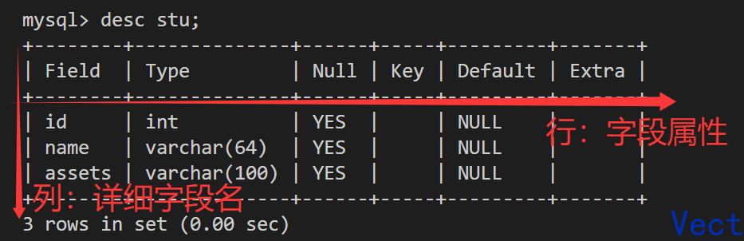
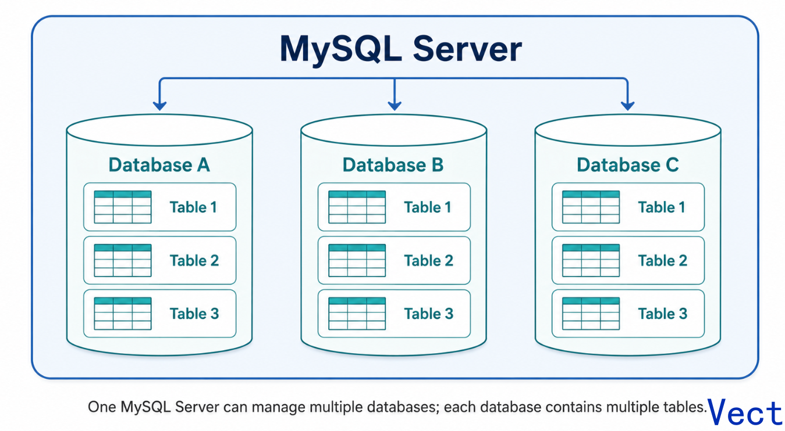
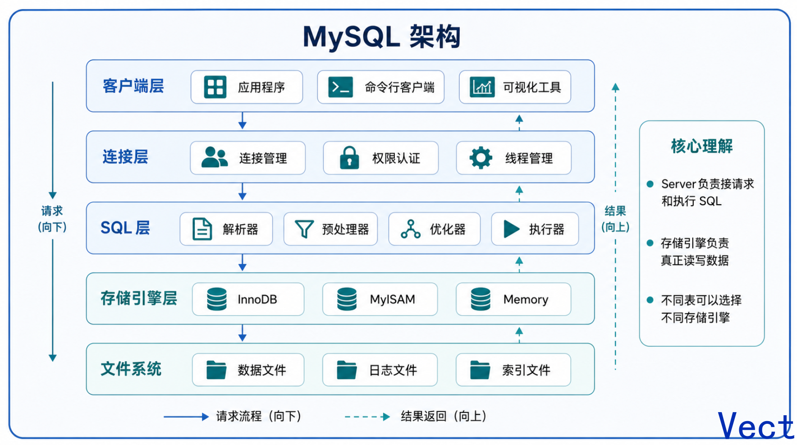

学习 MySQL 时，最先需要建立的不是某一条 SQL 的记忆，而是对 MySQL 基础模型的理解：客户端如何连接 MySQL Server，数据库和表之间是什么关系，SQL 语句分别在操作哪一层对象。

本文从数据库的基本概念出发，介绍 MySQL 中服务器、数据库、表之间的关系，并通过常见 DDL 语句完成数据库和表的基础操作。

## 1. 数据库基础

### 1.1 什么是数据库

在程序开发中，数据可以直接保存到普通文件中，但这种方式通常存在以下问题：

- 安全性较弱，数据访问、权限控制和备份恢复都需要应用程序自行处理。
- 查询和管理不方便，复杂条件检索、排序、聚合等操作实现成本较高。
- 不适合管理海量数据，文件读写、并发访问和数据一致性都容易成为问题。
- 程序需要直接控制数据组织方式，业务代码和数据存储细节容易耦合。

数据库可以理解为**按照一定结构组织、存储和管理数据的集合**。MySQL 则是一个关系型数据库管理系统，负责提供数据存储、查询、更新、权限控制、事务处理等能力。

在 MySQL 中，数据通常以二维表的形式组织：

- 表中的一行表示一条记录。
- 表中的一列表示一个字段。
- 字段有明确的数据类型，例如整数、字符串、日期时间等。

### 1.2 MySQL Server、数据库和表的关系

安装 MySQL，本质上是在机器上安装一个数据库管理系统。应用程序并不直接操作磁盘文件，而是通过客户端连接 MySQL Server，再由 MySQL Server 管理具体的数据库和表。

而server、DB、table三者之间的关系可以表示为：



可以这样理解：

- 一个 MySQL Server 可以管理多个数据库。
- 一个数据库可以包含多张表。
- 一张表用于保存某一类实体或业务对象的数据。
- 表由字段和记录组成，字段描述数据结构，记录保存具体数据。

### 1.3 MySQL 的简单使用流程

第一次使用 MySQL 时，通常会经历以下步骤：

1. 创建数据库。
2. 选择当前要使用的数据库。
3. 在数据库中创建表。
4. 向表中写入或查询数据。

示例：

```sql
create database db_name;

use db_name;

create table table_name (
    id int,
    name varchar(20)
);
```

其中，`create database` 用于创建数据库，`use` 用于切换当前数据库，`create table` 用于创建表结构。

### 1.4 MySQL 架构的基本认知

从使用者视角看，MySQL 可以分为几个主要层次：



其中，SQL 层负责理解和执行 SQL 语句，存储引擎层负责真正的数据读写。MySQL 支持多种存储引擎，日常开发中最常见的是 `innodb`。

现阶段，先建立一个基本认识即可：我们写的 SQL 会提交给 MySQL Server，由 MySQL Server 解析、优化，并通过存储引擎访问底层数据。

### 1.5 SQL 分类

SQL 是操作关系型数据库的标准语言。按照用途，常见 SQL 可以分为以下几类：

| 分类 | 全称 | 作用 | 常见语句 |
| --- | --- | --- | --- |
| DDL | Data Definition Language | 定义和维护数据库对象结构 | `create`、`alter`、`drop` |
| DML | Data Manipulation Language | 操作表中的数据 | `insert`、`update`、`delete` |
| DQL | Data Query Language | 查询表中的数据 | `select` |
| DCL | Data Control Language | 控制权限 | `grant`、`revoke` |
| TCL | Transaction Control Language | 控制事务 | `commit`、`rollback` |

本文重点介绍 DDL，也就是数据库和表结构的创建、修改与删除。

## 2. 数据库的操作

### 2.1 创建数据库

创建数据库的基本语法如下：

```sql
create database [if not exists] db_name
    [create_option] ...;

create_option:
    [default] character set charset_name
  | [default] collate collation_name
```

常用写法：

```sql
create database if not exists school
    default character set utf8mb4
    default collate utf8mb4_0900_ai_ci;
```

说明：

- `if not exists` 表示当数据库不存在时才创建，可以避免重复创建时报错。
- `character set` 用于指定数据库默认字符集。
- `collate` 用于指定数据库默认排序规则。

### 2.2 字符集和排序规则

字符集和排序规则是创建数据库时经常被忽略，但实际开发中很重要的配置。

`character set` 决定字符如何编码和存储。例如，`utf8mb4` 可以完整支持 Unicode 字符，包括中文、Emoji 和一些特殊符号。

`collate` 决定字符串如何比较和排序。例如，在进行 `order by`、唯一索引比较、字符串等值判断时，排序规则会影响比较结果。

日常开发建议：

- 优先使用 `utf8mb4`，不要使用 MySQL 中旧语义的 `utf8`。
- 同一个业务系统尽量保持数据库、表、字段的字符集和排序规则一致。
- 如果没有特殊需求，可以使用 MySQL 8.0 默认的 `utf8mb4_0900_ai_ci`。
- 如果需要兼容旧版本 MySQL，常见选择是 `utf8mb4_general_ci` 或 `utf8mb4_unicode_ci`。

其中，`ci` 表示 case-insensitive，即大小写不敏感。不同排序规则在大小写、重音字符、语言比较规则等方面可能存在差异。

### 2.3 查看数据库

查看当前 MySQL Server 中的数据库：

```sql
show databases;
```

查看某个数据库的创建语句：

```sql
show create database school;
```

`show create database` 可以看到数据库当前使用的字符集和排序规则，排查环境差异时非常有用。

### 2.4 修改数据库

修改数据库的基本语法如下：

```sql
alter database db_name
    [alter_option] ...;

alter_option:
    [default] character set charset_name
  | [default] collate collation_name
```

示例：

```sql
alter database school
    default character set utf8mb4
    default collate utf8mb4_0900_ai_ci;
```

需要注意的是，修改数据库默认字符集和排序规则，主要影响后续新建的表和字段。已经存在的表或字段不会自动全部转换，需要单独处理。

### 2.5 删除数据库

删除数据库的语法如下：

```sql
drop database [if exists] db_name;
```

示例：

```sql
drop database if exists school;
```

`drop database` 会删除整个数据库，包括数据库中的所有表和数据。这个操作不可轻易执行，尤其是在生产环境中，执行前必须确认数据库名称、备份状态和影响范围。

## 3. 表的操作

### 3.1 创建表

创建表的基本语法如下：

```sql
create table table_name (
    column_name data_type [column_option],
    column_name data_type [column_option],
    ...
) [table_option];
```

常见表选项包括字符集、排序规则和存储引擎：

```sql
create table student (
    id int,
    name varchar(20),
    gender varchar(10),
    age int
) character set utf8mb4
  collate utf8mb4_0900_ai_ci
  engine = innodb;
```

说明：

- `student` 是表名。
- `id`、`name`、`gender`、`age` 是字段名。
- `int`、`varchar(20)` 是字段的数据类型。
- `character set` 和 `collate` 用于指定表的默认字符集和排序规则。
- `engine = innodb` 指定表使用 `innodb` 存储引擎。

实际开发中，表结构通常还会包含主键、非空约束、默认值和字段注释。例如：

```sql
create table student (
    id bigint primary key auto_increment comment '学生ID',
    name varchar(64) not null comment '学生姓名',
    gender varchar(10) default null comment '性别',
    age int default null comment '年龄',
    created_at datetime not null default current_timestamp comment '创建时间'
) engine = innodb
  default character set utf8mb4
  default collate utf8mb4_0900_ai_ci
  comment = '学生表';
```

这个示例更接近日常业务表的写法：

- `primary key` 表示主键。
- `auto_increment` 表示自增。
- `not null` 表示字段不能为空。
- `default` 表示默认值。
- `comment` 用于添加注释，方便后续维护。

### 3.2 查看表

查看当前数据库中的所有表：

```sql
show tables;
```

查看表结构：

```sql
desc student;
```

查看表的完整创建语句：

```sql
show create table student;
```

### 3.3 修改表

表创建后，如果业务需求发生变化，可以使用 `alter table` 修改表结构。

#### 添加字段

语法示例：

```sql
alter table table_name
    add column_name data_type [column_option];
```

例如，在 `student` 表中添加一个字段，用于保存图片路径：

```sql
alter table student
    add assets varchar(100) comment '图片路径' after gender;
```

`after gender` 表示将新字段添加到 `gender` 字段后面。如果不指定位置，MySQL 通常会把字段添加到表的最后。

#### 修改字段类型

语法示例：

```sql
alter table table_name
    modify column_name data_type [column_option];
```

例如，将 `name` 字段长度修改为 64：

```sql
alter table student
    modify name varchar(64) not null comment '学生姓名';
```

使用 `modify` 时要注意，字段原有的约束和注释可能需要在语句中重新声明，否则可能出现定义变化。

#### 修改字段名

如果需要修改字段名称，可以使用 `change`：

```sql
alter table student
    change assets avatar_path varchar(100) comment '头像路径';
```

`change` 同时包含旧字段名、新字段名和字段定义。

#### 删除字段

删除字段的语法如下：

```sql
alter table table_name
    drop column_name;
```

例如：

```sql
alter table student
    drop gender;
```

删除字段会同时删除该字段下保存的所有数据。执行前应确认字段是否还被业务代码、查询语句、索引或报表使用。

#### 重命名表

可以使用 `rename to` 修改表名：

```sql
alter table student
    rename to stu;
```

表重命名后，所有依赖旧表名的 SQL、程序代码和运维脚本都需要同步调整。

### 3.4 删除表

删除表的语法如下：

```sql
drop table [if exists] table_name;
```

也可以一次删除多张表：

```sql
drop table if exists student, course;
```

`drop table` 会删除表结构以及表中的全部数据。与删除数据库类似，这也是高风险操作。生产环境执行前，应先确认备份、依赖关系和执行环境。

## 4. 小结

MySQL 的基础模型可以概括为：

- 客户端通过 SQL 连接并操作 MySQL Server。
- 一个 MySQL Server 可以管理多个数据库。
- 一个数据库可以包含多张表。
- 表由字段和记录组成，字段定义结构，记录保存数据。
- DDL 语句用于管理数据库对象结构，常见操作包括 `create`、`alter` 和 `drop`。

