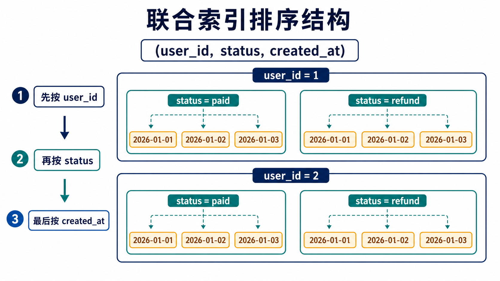
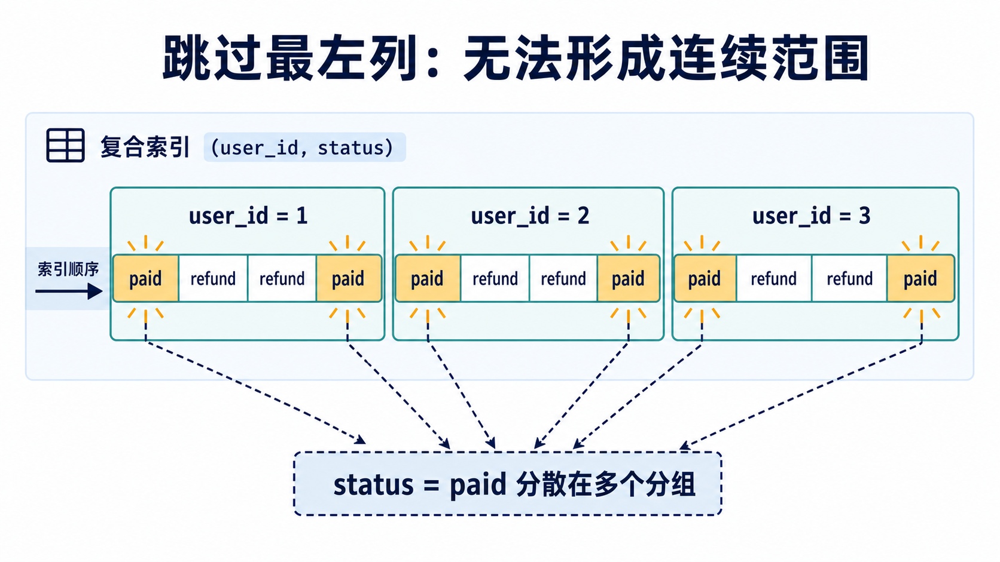
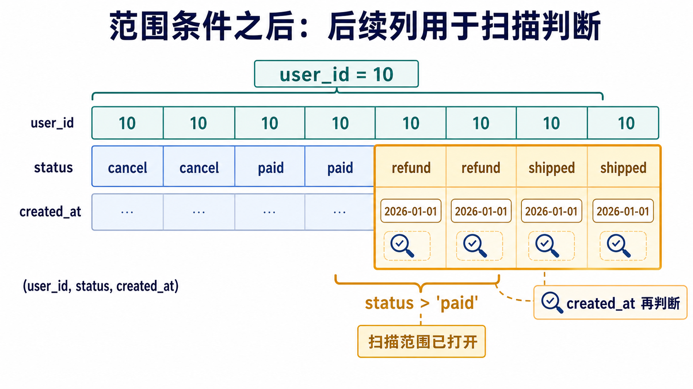
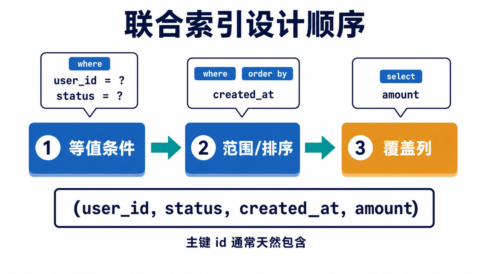

## 1. 联合索引基础认知

### 1.1 什么是联合索引

> A multiple-column index can be considered a sorted array, the rows of which contain values that are created by concatenating the values of the indexed columns.

MySQL 官方文档把多列索引描述成一个排序数组。数组中的值，是由多个索引列的值拼接而成的。

所以，联合索引不是多个单列索引简单放在一起，而是一棵按照多个列依次排序的索引树。

假设有这个索引：

```sql
index idx_user_status_created (user_id, status, created_at)
```

它不是三棵树：

```text
user_id 一棵树
status 一棵树
created_at 一棵树
```

而是一棵树，按照这个顺序排列：

```text
先按 user_id 排
user_id 相同，再按 status 排
user_id 和 status 都相同，再按 created_at 排
```

这很像排名规则：先按总分排，总分相同再按语文排，语文也相同再按数学排。

举个简化例子：

```text
(1, 'paid',   '2026-01-01')
(1, 'paid',   '2026-01-02')
(1, 'refund', '2026-01-01')
(2, 'paid',   '2026-01-01')
(2, 'refund', '2026-01-03')
```

所以，使用联合索引时真正要判断的是：

```text
where 条件能不能从联合索引最左边开始，形成一个连续、可定位的范围。
```

这也是最左前缀的本质：使用联合索引时，查询条件要尽量从最左列开始连续匹配，不能跳过前面的列直接使用后面的列。



### 1.2 可以完整使用联合索引的情况

```sql
select *
from orders
where user_id = 10
  and status = 'paid'
  and created_at >= '2026-01-01';
```

索引是：

```sql
index idx_user_status_created (user_id, status, created_at)
```

流程是：

```text
先定位 user_id = 10
再在 user_id = 10 里面定位 status = 'paid'
再在 user_id = 10 且 status = 'paid' 的范围里扫描 created_at >= '2026-01-01'
```

这条查询从左到右连续使用了 `user_id -> status -> created_at`，符合联合索引的排序顺序。

### 1.3 只用到左边一部分的情况

```sql
select *
from orders
where user_id = 10;
```

这条查询可以使用联合索引，因为 `user_id` 是最左列。

```text
用到：(user_id)
没有继续用到：status, created_at
```

MySQL 官方文档也说明，如果有一个 `(col1, col2, col3)` 的多列索引，可以使用它的左前缀，例如 `(col1)`、`(col1, col2)`、`(col1, col2, col3)`。

### 1.4 跳过最左列，通常不能用于精确查找

```sql
select *
from orders
where status = 'paid';
```

索引是：

```sql
index idx_user_status_created (user_id, status, created_at)
```

这个查询跳过了最左列 `user_id`。问题在于：这棵索引整体先按 `user_id` 排，不是先按 `status` 排。

所以 `status = 'paid'` 在整棵索引里不是连续的一段，而是分散在不同的 `user_id` 分组里：

```text
user_id = 1 里面有 paid
user_id = 2 里面也有 paid
user_id = 3 里面也有 paid
...
```

因此，跳过最左列后，通常无法直接定位出一个连续范围。



### 1.5 中间断开，后面列通常不能继续用于定位

```sql
select *
from orders
where user_id = 10
  and created_at >= '2026-01-01';
```

索引是：

```sql
index idx_user_status_created (user_id, status, created_at)
```

这里有 `user_id`，所以可以先用 `user_id = 10` 定位一段范围。但是中间跳过了 `status`，`created_at` 就很难继续用于精确定位。

原因是，在 `user_id = 10` 这个范围里，数据先按 `status` 分组，再按 `created_at` 排序。`created_at` 不是在整个 `user_id = 10` 范围内全局连续排序，而是在每个 `status` 小组内部有序。

大致结构是：

```text
user_id = 10, status = 'cancel', created_at ...
user_id = 10, status = 'paid',   created_at ...
user_id = 10, status = 'refund', created_at ...
```

跳过 `status`，就无法直接用 `created_at` 切出一个干净的连续区间。

### 1.6 范围条件之后，后面的列通常不再继续用于缩小索引范围

```sql
select *
from orders
where user_id = 10
  and status > 'paid'
  and created_at = '2026-01-01';
```

这里的条件可以拆成：

```text
user_id = 10        等值条件
status > 'paid'     范围条件
created_at = ...    后续列
```

> If the operator is >, <, >=, <=, !=, <>, BETWEEN, or LIKE, the optimizer uses it but considers no more key parts.

官方这句话的意思是：对于多列 `b-tree` 索引，优化器遇到 `=`、`<=>`、`is null` 这类条件时，可以继续尝试使用后面的索引列；如果遇到 `>`、`<`、`>=`、`<=`、`between`、`like` 等范围类条件，会使用当前这个条件，但通常不再继续使用后面的 key part 来构造更窄的索引区间。

通俗理解就是：

```text
等值条件可以继续往右精确定位；
范围条件会打开一个区间；
区间打开后，后面的列通常不能继续把索引扫描范围切得更窄。
```



### 1.7 可以直接记住这版

- 联合索引是一棵按多个列依次排序的索引树。
- 索引 `(a, b, c)` 的排序规则是：先按 `a` 排，`a` 相同再按 `b` 排，`a` 和 `b` 都相同再按 `c` 排。
- MySQL 可以使用联合索引的左前缀，例如 `(a)`、`(a, b)`、`(a, b, c)`。
- 跳过最左列，通常不能用这个联合索引做精确查找，因为无法形成连续可定位范围。
- 等值条件可以继续向右使用索引；遇到范围条件后，后面的列通常不能继续用于缩小索引扫描范围。

### 1.8 练习

索引固定为：

```sql
index idx_user_status_created (user_id, status, created_at)
```

判断每个查询主要能用到联合索引的哪几列：

```sql
-- a
where user_id = 10

-- b
where user_id = 10 and status = 'paid'

-- c
where status = 'paid'

-- d
where user_id = 10 and created_at >= '2026-01-01'

-- e
where user_id = 10
  and status = 'paid'
  and created_at >= '2026-01-01'

-- f
where user_id = 10
  and status >= 'paid'
  and created_at = '2026-01-01'
```

答案：

```text
a：用到 user_id。
原因：user_id 是联合索引 (user_id, status, created_at) 的最左列，可以直接用于定位。

b：用到 user_id、status。
原因：where 条件从联合索引最左列开始连续匹配，先匹配 user_id，再匹配 status。

c：主要用不到这个联合索引做精确定位。
原因：条件跳过了最左列 user_id，而索引整体不是按 status 单独排序的。

d：用于定位范围的主要是 user_id。
原因：虽然有 user_id 和 created_at，但中间跳过了 status，created_at 不能在这个联合索引中继续形成连续可定位范围。

e：用到 user_id、status、created_at。
原因：条件从左到右连续匹配，user_id 和 status 是等值条件，created_at 是范围条件，可以用于缩小扫描范围。

f：用于定位范围的是 user_id、status。
原因：user_id 是等值条件，可以继续向右；status 是范围条件，遇到范围条件后，后面的 created_at 通常不能继续用于缩小索引扫描范围。
```

## 2. 如何设计合理的联合索引顺序

先记住三个基础能力：

- 多列索引按照多个列拼接之后的值排序，可以使用左前缀。
- 索引可以用于快速查找，减少无关数据扫描，也可以让查询直接从索引中取值。
- `order by` 在某些情况下可以利用索引顺序，减少额外排序。

所以，设计联合索引顺序时，不能只看字段本身，要先看真实高频 sql。

### 2.1 先看高频 sql

假设高频查询是：

```sql
select id, amount
from orders
where user_id = ?
  and status = ?
  and created_at >= ?
order by created_at desc;
```

先拆解这条 sql：

```text
where 等值：user_id、status
where 范围：created_at
order by：created_at
select 返回：id、amount
```

一个合理的索引是：

```sql
index idx_user_status_created_amount (user_id, status, created_at, amount)
```

原因是：

- `user_id`、`status` 是等值条件，放在前面，先缩小范围。
- `created_at` 是范围条件，也可以继续缩小扫描范围，同时还能服务 `order by`。
- `amount` 不是过滤条件，但可以用于覆盖索引，减少回表。

这里还要注意：`id` 是主键，InnoDB 二级索引叶子记录会包含主键值，通常不需要额外把 `id` 放进二级索引。

### 2.2 等值条件通常放在范围条件前面

```sql
where user_id = ?
  and status = ?
  and created_at >= ?
```

索引更适合设计成：

```sql
index idx_user_status_created (user_id, status, created_at)
```

不适合把范围列放在最前面：

```sql
index idx_created_user_status (created_at, user_id, status)
```

原因是：`created_at` 是范围条件。范围条件一旦放在前面，后面的 `user_id`、`status` 通常不能继续用于缩小索引扫描范围。

所以可以先记住这个顺序：

```text
等值在前，范围在后。
```

### 2.3 “区分度高放前面”不是第一原则

要明确：**一个联合索引通常不只服务一条 sql。**

假设只有这一条 sql：

```sql
select *
from orders
where user_id = ?
  and status = ?;
```

这时候有两个候选索引：

```sql
index idx_user_status (user_id, status)
index idx_status_user (status, user_id)
```

对于这条 sql 来说，两者都能用到两列，因为两个条件都是等值条件。

无论是：

```text
先按 user_id 定位，再在里面找 status
```

还是：

```text
先按 status 定位，再在里面找 user_id
```

都能缩小扫描范围。

但是实际系统里通常不止一条 sql。

场景 1：

```sql
-- 高频 sql 1
where user_id = ? and status = ?

-- 高频 sql 2
where user_id = ?
```

这时候更适合选择：

```sql
index idx_user_status (user_id, status)
```

因为它能同时服务两条查询：

```text
where user_id = ? and status = ?
可以用 user_id, status

where user_id = ?
可以用 user_id
```

如果选择：

```sql
index idx_status_user (status, user_id)
```

第二条 `where user_id = ?` 就跳过了最左列 `status`，不能很好利用这个联合索引定位。

所以这里可以记住：如果 `user_id` 经常单独出现在 `where` 条件里，就应该把 `user_id` 放在联合索引更左边。

场景 2：

```sql
-- 高频 sql 1
where user_id = ? and status = ?

-- 高频 sql 2
where status = ?
```

这时候更适合选择：

```sql
index idx_status_user (status, user_id)
```

因为它能同时服务：

```text
where user_id = ? and status = ?
可以用 status, user_id

where status = ?
可以用 status
```

如果选择 `(user_id, status)`，第二条 `where status = ?` 就跳过了最左列 `user_id`。

所以，联合索引列顺序不是简单看“哪个字段区分度更高”，而是要看哪些高频查询能从最左列开始用上索引。

可以直接记住：**联合索引的顺序，是为了让尽可能多的高频查询从最左列开始用上索引。**

### 2.4 排序字段要接在可固定的前缀后面

```sql
where user_id = ?
  and status = ?
order by created_at desc;
```

索引 `(user_id, status, created_at)` 是有意义的，因为：

```text
user_id 固定
status 固定
剩下的数据天然按 created_at 有序
```

但如果索引是：

```sql
index idx_created_user_status (created_at, user_id, status)
```

虽然 `created_at` 在最左边，但它不能先有效缩小 `user_id`、`status` 的范围，可能会扫描很多无关记录。

所以排序索引设计可以记住：**先把 where 等值条件固定住，再让 order by 字段接在后面。**

### 2.5 覆盖索引是最后考虑，而不是最先考虑

```sql
select id, user_id, status, amount
from orders
where user_id = ?
  and status = ?;
```

索引设计成：

```sql
index idx_user_status (user_id, status)
```

它能过滤，但是需要回表，因为二级索引里没有保存 `amount` 字段。

如果这个查询非常高频，可以设计成：

```sql
index idx_user_status_amount (user_id, status, amount)
```

这样二级索引里就有：

```text
user_id + status + amount + 主键 id
```

就可以覆盖下面这条查询需要的列：

```sql
select id, user_id, status, amount
from orders
where user_id = ?
  and status = ?;
```

但是要注意：不要无脑把所有返回列都塞进索引。索引越宽，维护成本和存储成本就越高，写入、更新、删除时都需要维护索引。



### 2.6 可以直接记住这版

- 设计联合索引，先看真实高频 sql，而不是孤立看字段。
- 联合索引左边应该放最常作为查询入口的列，尤其是高频 `where` 或 `join` 条件。
- 等值条件通常放在范围条件前面，因为等值可以继续向右匹配，范围条件之后的列通常不能继续缩小扫描范围。
- 如果查询有 `order by` 或 `group by`，排序、分组字段要尽量接在已经被等值条件固定的前缀后面。
- 如果查询非常高频，可以把返回列追加到索引后面形成覆盖索引，但不能无脑加宽索引。

### 2.7 练习

以下四个高频 sql，判断应该建立哪个联合索引：

```sql
-- a
select *
from orders
where user_id = ?
  and status = ?;

-- b
select id, amount
from orders
where user_id = ?
  and status = ?
order by created_at desc;

-- c
select id, user_id, status
from orders
where status = ?;

-- d
select id, amount
from orders
where user_id = ?
  and created_at >= ?
  and created_at < ?;
```

答案：

```text
a：可以考虑建立索引：(user_id, status) 或者 (status, user_id)。
原因：这个查询里 user_id 和 status 都是等值条件。如果只考虑这一条 sql，没有其他高频查询影响，那么 (user_id, status) 和 (status, user_id) 都可以连续使用联合索引的两列，都能缩小扫描范围。
但因为 select * 需要返回整行数据，如果索引不能覆盖所有返回列，最终仍然可能需要回表。

b：可以考虑建立索引：(user_id, status, created_at, amount)。
原因：user_id 和 status 是等值条件，放在联合索引前面，可以先缩小查询范围。
created_at 是排序字段，接在已经被 user_id 和 status 固定的前缀后面，可以利用索引顺序服务 order by，减少额外排序成本。
amount 是返回列，不参与筛选，放在索引最后用于覆盖查询，减少回表。
id 是主键，在 InnoDB 二级索引中天然包含，所以通常不需要额外把 id 加入索引。

c：可以考虑建立索引：(status, user_id)。
原因：这个查询的筛选条件只有 status，所以 status 必须放在联合索引最左列，才能从最左前缀开始使用索引进行定位。
user_id 是返回列，不参与筛选，可以放在 status 后面，用于覆盖查询。
id 是主键，在 InnoDB 二级索引中天然包含，所以不需要额外加入索引。
因此这个索引可以同时支持 where status = ? 的定位，并覆盖 id、user_id、status 这些返回列，减少回表。

d：可以考虑建立索引：(user_id, created_at, amount)。
原因：user_id 是等值条件，放在联合索引前面，用于先定位某个用户的数据范围。
created_at 是范围条件，放在 user_id 后面，可以在 user_id 已经固定的前提下，继续按时间范围缩小扫描区间。
amount 是返回列，不参与筛选，放在索引最后用于覆盖查询，减少回表。
id 是主键，在 InnoDB 二级索引中天然包含，所以通常不需要额外加入索引。
```

最后一句话总结：**设计联合索引时，先看 `where` 中能作为查询入口的等值条件，再看范围条件和排序字段，最后根据返回列考虑是否做覆盖索引；InnoDB 二级索引天然包含主键值，所以主键通常不用额外加入。**

## 3. 索引不能有效定位的常见场景

先明确一个概念：MySQL 官方文档并没有把这些情况统一叫做“索引失效”。更准确地说，是索引不能用于有效定位，或者只能部分使用，或者优化器认为使用索引的成本更高。

### 3.1 联合索引跳过最左列

索引：

```sql
index idx_user_status_created (user_id, status, created_at)
```

查询：

```sql
where status = 'paid'
```

问题是：

- 联合索引先按 `user_id` 排，不是先按 `status` 排。
- 跳过 `user_id` 后，`status = 'paid'` 在整棵索引里不是连续的一段。

所以，这个查询通常不能用这个联合索引做精确定位。

### 3.2 联合索引中间断开

索引：

```sql
index idx_user_status_created (user_id, status, created_at)
```

查询：

```sql
where user_id = 10
  and created_at >= '2026-01-01'
```

问题是：

- 可以用 `user_id` 定位。
- 但中间跳过了 `status`，`created_at` 不能继续形成连续可定位范围。

所以，这个查询只能部分利用联合索引。

### 3.3 范围条件之后的列通常不能继续缩小范围

索引：

```sql
index idx_user_status_created (user_id, status, created_at)
```

查询：

```sql
where user_id = 10
  and status >= 'paid'
  and created_at = '2026-01-01'
```

问题是：

- `user_id` 是等值条件，可以继续向右。
- `status >= 'paid'` 是范围条件，可以参与构造索引扫描范围。
- 范围条件之后的 `created_at`，通常不能继续用于缩小索引扫描范围。

所以，这条查询可以用 `user_id` 和 `status` 构造索引范围，但 `created_at` 通常不能继续把这个范围切得更窄。

### 3.4 like 前面有通配符

有索引：

```sql
index idx_name (name)
```

可以较好利用索引：

```sql
where name like 'z%'
```

通常不能用于范围定位：

```sql
where name like '%z'
where name like '%z%'
```

原因是：

- `b-tree` 索引按字符串从左到右排序。
- `like 'z%'` 有固定前缀，可以定位到 `z` 开头的一段。
- `like '%z'` 和 `like '%z%'` 没有固定开头，无法从索引左侧确定扫描起点。

### 3.5 对索引列做表达式或者函数

索引：

```sql
index idx_created_at (created_at)
```

不推荐这样：

```sql
where date(created_at) = '2026-01-01'
```

更推荐这样：

```sql
where created_at >= '2026-01-01'
  and created_at < '2026-01-02'
```

原因是：

- 索引里保存的是 `created_at` 原始值的有序结构。
- 对列做 `date()` 后，查询条件变成表达式结果，不再是直接按 `created_at` 原值定位。

### 3.6 类型或字符集不一致导致类型转换

MySQL 官方文档说明，在连接比较中，如果列类型和大小一致，索引使用更高效；非二进制字符串列比较时，也应该使用相同字符集。不同类型之间比较，例如字符串列和数字列、时间列之间比较，可能因为需要转换而阻止索引使用。

比如 `phone` 是 `varchar` 类型：

```sql
where phone = 13800138000
```

更稳妥的写法是：

```sql
where phone = '13800138000'
```

原因是：查询条件的类型应尽量和索引列类型一致，避免隐式转换影响索引使用。

### 3.7 可以直接记住这版

所谓索引不能有效定位，通常不是索引真的“坏了”，而是查询条件无法在索引的有序结构上形成连续、可定位、足够小的扫描范围。

常见情况有：

- 联合索引跳过最左列。
- 联合索引中间断开。
- 范围条件之后的列通常不能继续缩小扫描范围。
- `like` 以通配符开头。
- 在索引列上使用函数或表达式。
- 查询条件和索引列类型、字符集不一致，导致隐式转换。

判断一个条件能不能用好索引，本质上要看它能不能在索引的有序结构上形成连续、可定位、足够小的扫描范围。
