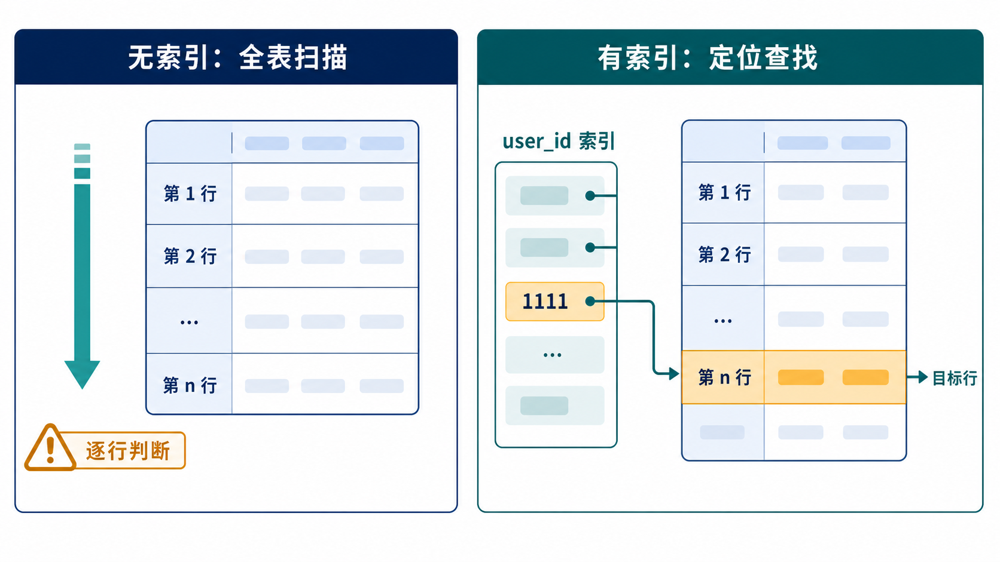
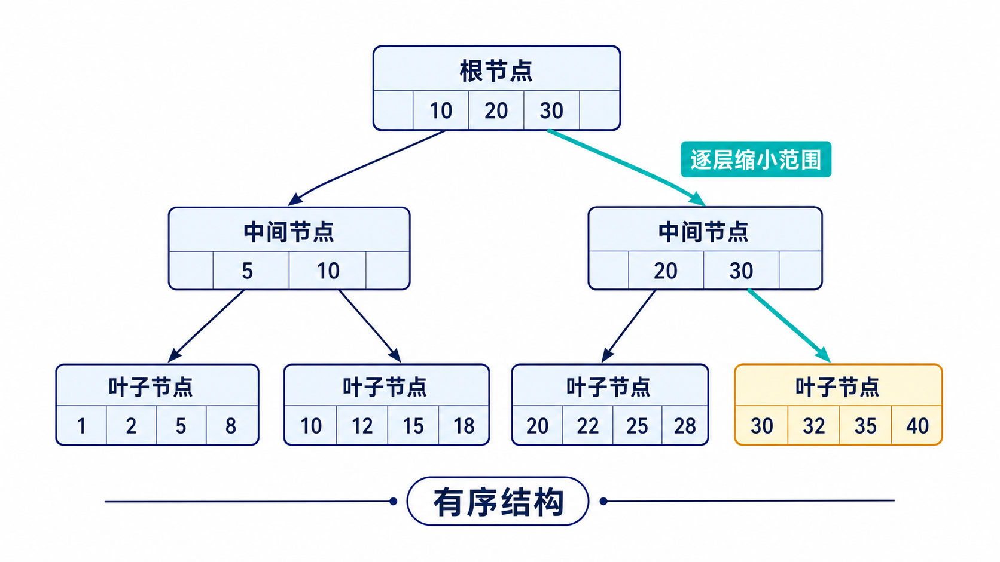
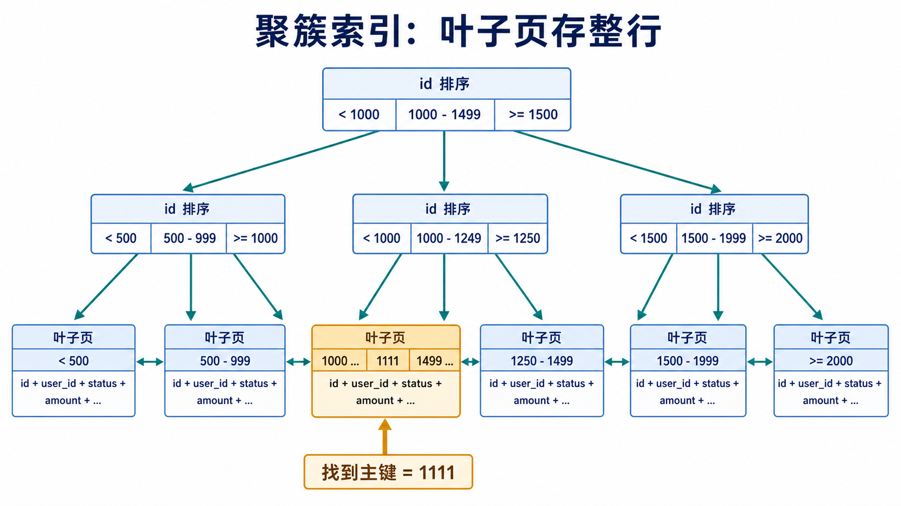
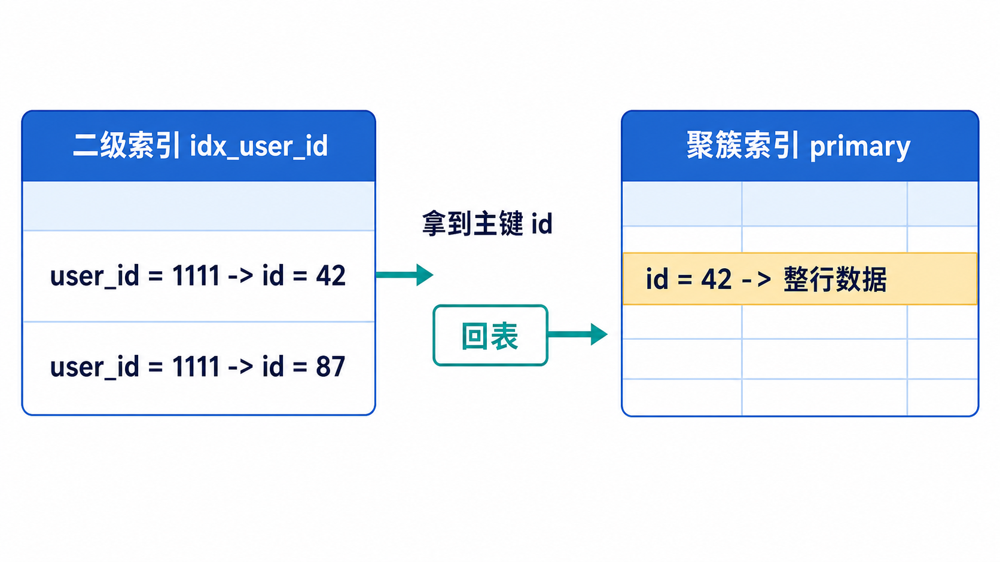
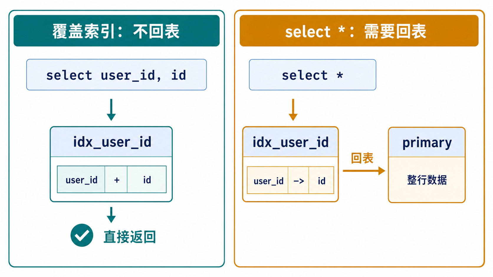

## 1. 什么是索引

> Indexes are used to find rows with specific column values quickly. Without an index, MySQL must begin with the first row and then read through the entire table to find the relevant rows.

MySQL 官方文档这句话的意思很直接：索引用来快速找到具有特定列值的行。没有索引时，MySQL 只能从第一行开始读，一直读完整张表，才能判断哪些行符合条件。

所以可以先记住这两个结论：

- 索引 = 按某些列提前组织好的查找结构。
- 目的 = 让查询不用从头扫到尾，而是先定位到可能匹配的位置。

比如表里有 100 万个订单，现在要查 `user_id = 1111` 的订单：

```sql
select * from orders where user_id = 1111;
```

如果 `user_id` 没有索引，MySQL 的查找过程接近这样：

```text
第 1 行是不是 user_id = 1111？
第 2 行是不是 user_id = 1111？
...
第 1000000 行是不是 user_id = 1111？
```

如果 `user_id` 有索引，MySQL 可以先到 `user_id` 这份有序结构里找到 `1111` 附近的位置，再拿到对应的行。

所以第一层本质是：**索引把“全表找”变成“定位找”。**



## 2. 索引为什么快？

> Most MySQL indexes (PRIMARY KEY, UNIQUE, INDEX, and FULLTEXT) are stored in B-trees.

MySQL 官方文档说，大多数 MySQL 索引存储在 `b-tree` 中。这里先按照官方说法记住 `b-tree`，不要把所有场景都绝对说成一种结构。

`b-tree` 类索引能让查询变快，关键不在于“树”这个名字，而在于：**索引里的数据是有序组织的。**

数据有序，就能快速缩小范围，不需要逐行判断。

这很像查字典：

- 没有目录：只能从第一页翻到最后一页找一个字。
- 有目录：先查部首、拼音或页码，再跳到接近的位置。

索引也是一样，它提前维护了一份有序结构。查询时，MySQL 可以先在这份结构里定位，再去读取真正需要的数据。

所以可以直接记住：

```text
索引快，不是因为它省略了查找；
索引快，是因为它减少了需要扫描的数据范围。
```



## 3. InnoDB 的主键索引

> Each InnoDB table has a special index called the clustered index that stores row data.
> When you define a PRIMARY KEY on a table, InnoDB uses it as the clustered index.

InnoDB 表里有一种特殊索引，叫 `clustered index`，也就是聚簇索引。官方文档明确说，聚簇索引会存储行数据；如果定义了主键，InnoDB 就使用主键作为聚簇索引。

可以这样理解：**InnoDB 表的数据，本身就组织在聚簇索引里。**

聚簇索引的选择规则可以按这个顺序记：

- 如果定义了主键，InnoDB 使用主键作为聚簇索引。
- 如果没有主键，InnoDB 会选择第一个所有列都声明为 `not null` 的 `unique` 索引作为聚簇索引。
- 如果以上都没有，InnoDB 会生成一个隐藏的行 id，并基于它创建名为 `gen_clust_index` 的聚簇索引。

例如：

```sql
create table user (
    id bigint,
    email varchar(100) unique not null,
    phone varchar(20) unique
);
```

这张表没有主键，`email` 是 `unique not null`，因此它可以被 InnoDB 选为聚簇索引。

再看一张没有主键、也没有唯一非空索引的表：

```sql
create table notes (
    title varchar(100),
    content text
);
```

InnoDB 会在内部生成一个隐藏行 id，并基于这个隐藏列组织聚簇索引。这个隐藏列在普通查询里看不到，可以把它理解成下面这样的内部结构：

```sql
create table notes (
    hidden_row_id bigint auto_increment,
    title varchar(100),
    content text,
    clustered index (hidden_row_id)
);
```

为什么聚簇索引查询很快？

因为聚簇索引的叶子页里存放的是整行数据。通过主键查到叶子页时，就已经拿到了这一行的完整内容。

```text
聚簇索引树 -> 找到 id = 1111 的叶子页 -> 叶子页里就是整行数据
```

所以，通过主键查找时，不需要再从其他结构里取整行。



## 4. InnoDB 的二级索引

> All indexes other than the clustered index are known as secondary indexes. In InnoDB, each record in a secondary index contains the primary key columns for the row.

除了聚簇索引，其他索引都叫二级索引。InnoDB 的二级索引记录里，除了保存二级索引列，还会保存这一行对应的主键值。

比如给 `orders` 表的 `user_id` 建一个二级索引：

```sql
create index idx_user_id on orders(user_id);
```

它的结构可以先这样理解：

```text
二级索引 idx_user_id：user_id -> id
聚簇索引 primary：id -> 整行数据
```

执行下面这条查询：

```sql
select * from orders where user_id = 1111;
```

大致流程是：

```text
1. 先查 idx_user_id，找到 user_id = 1111 的索引记录。
2. 从二级索引记录中拿到对应的主键 id。
3. 再用这个 id 去聚簇索引里查整行数据。
```

这个“从二级索引拿到主键值，再回到聚簇索引查整行”的过程，通常叫回表。



## 5. 三种查询对比

先看这张表：

```sql
create table orders (
    id bigint primary key,
    user_id bigint not null,
    status varchar(20) not null,
    amount decimal(10, 2) not null,
    note varchar(500),
    index idx_user_id (user_id)
);
```

这张表可以先简化成两棵索引结构：

```text
聚簇索引 primary：
id -> 整行数据

二级索引 idx_user_id：
user_id -> id
```

### 5.1 为什么主键查询不需要回表？

```sql
select * from orders where id = 1111;
```

流程是：

```text
1. MySQL 看到 where id = 1111。
2. 确定 id 是 primary key。
3. 走聚簇索引树。
4. 在叶子页找到 id = 1111。
5. 叶子页保存的就是整行数据。
6. 直接返回。
```

聚簇索引可以理解为一本按照 `id` 排序的书。翻到 `id = 1111` 那一页，内容就在那一页。

### 5.2 为什么二级索引查询可能要回表？

```sql
select * from orders where user_id = 11;
```

流程是：

```text
1. MySQL 看到 where user_id = 11。
2. user_id 上有 idx_user_id。
3. 先走 idx_user_id 二级索引。
4. 在二级索引叶子页找到 user_id = 11 的记录。
5. 拿到对应的主键 id。
6. 再用这个 id 去 primary 聚簇索引里找整行数据。
7. 返回整行。
```

所以：

```text
回表 = 先从二级索引拿主键值，再用主键值去聚簇索引查整行。
```

二级索引像一本用户 id 目录：

```text
user_id = 10 -> id = 100
user_id = 10 -> id = 126
user_id = 10 -> id = 300
```

目录里没有完整订单内容。要 `select *`，还得拿着这些 `id` 回到聚簇索引里找整行。

### 5.3 为什么有的二级索引不用回表？

```sql
select user_id, id from orders where user_id = 11;
```

流程是：

```text
1. 走 idx_user_id。
2. 找到 user_id = 11。
3. 二级索引叶子页里已经有 user_id。
4. 二级索引叶子页里也有主键 id。
5. 查询只需要 user_id 和 id。
6. 不需要再去聚簇索引查整行。
```

这种情况通常叫覆盖索引。也就是：查询需要的列，索引本身已经全部包含，MySQL 可以直接从索引中取值，不必再读取整行数据。



## 6. 可以直接记住这版

### 6.1 主键索引为什么不需要回表？

InnoDB 的主键索引就是聚簇索引，表的整行数据存放在主键索引的叶子页中。所以通过主键查询时，找到主键索引的叶子页，就已经拿到了整行数据，不需要再去其他索引或数据结构中查找。

### 6.2 二级索引为什么通常需要回表？

InnoDB 的二级索引叶子记录中保存的是二级索引列和对应的主键值，而不是整行数据。所以使用二级索引查询时，会先通过二级索引找到主键值；如果查询还需要二级索引中没有的列，就要再根据这个主键值去聚簇索引中查找整行数据，这个过程叫回表。

### 6.3 什么情况下二级索引可以不回表？

当查询需要的列都已经包含在二级索引中时，就不需要回表。因为 MySQL 可以直接从二级索引中拿到所有需要的数据，不必再根据主键去聚簇索引中查整行。这种情况通常叫覆盖索引。

## 7. 为什么二级索引、回表、覆盖索引、select * 容易变慢

还是以这张表为准：

```sql
create table orders (
    id bigint primary key,
    user_id bigint not null,
    status varchar(20) not null,
    amount decimal(10, 2) not null,
    note varchar(500),
    index idx_user_id (user_id)
);
```

`idx_user_id` 这个二级索引里有：

```text
user_id + 主键 id
```

判断一条查询要不要回表，只需要问一句：**我要返回的列，`idx_user_id` 里有没有？**

### 7.1 不需要回表的情况

```sql
select id, user_id from orders where user_id = 10;
```

流程是：

```text
idx_user_id -> 找到 user_id = 10 -> 索引里已经有 user_id 和 id -> 直接返回
```

因为 `id` 是主键，二级索引记录里天然包含主键值，所以这条查询需要的列都能从 `idx_user_id` 中拿到。

### 7.2 需要回表的情况

```sql
select id, user_id, amount from orders where user_id = 10;
```

流程是：

```text
idx_user_id -> 找到 user_id = 10 -> 拿到 id -> primary -> 查整行 -> 取 amount -> 返回
```

原因是 `amount` 不在 `idx_user_id` 中，只能根据主键 id 回到聚簇索引查整行。

### 7.3 select * 为什么容易变慢？

```sql
select * from orders where user_id = 10;
```

流程是：

```text
idx_user_id -> 找到 user_id = 10 -> 拿到很多 id -> 一个个回聚簇索引查整行
```

所以，走二级索引也可能变慢。不是二级索引没用，而是：二级索引只负责找到候选主键；`select *` 需要整行数据；整行数据在聚簇索引里；如果匹配行很多，就可能出现大量回表。

比如 `user_id = 10` 匹配 10 万行，那么可能先扫描 10 万条二级索引记录，再根据 10 万个主键值回到聚簇索引查整行。

所以判断索引快不快，不能只看 `where` 条件有没有索引，还要看 `select` 返回的列能不能被索引覆盖。
