事务是 MySQL 里最容易“看起来简单、真并发时翻车”的能力。

一句话先说透：**事务解决的是：一组 SQL 到底要不要作为一个整体成功或失败。**

生活里也到处都是事务。

你点一杯奶茶：
- 扣钱成功，商家没收到订单，不行。
- 商家收到订单，钱没扣成功，也不行。
- 扣钱、生成订单、通知商家，这几件事必须作为一个整体。

你去银行转账：

- A 账户扣 100 元，B 账户加 100 元。
- 不能 A 扣了，B 没加。
- 也不能 B 加了，A 没扣。

放到业务系统里，我们使用 `tasks / outbox` 这个案例。

```text
tasks：任务主表，保存任务本体。
outbox：任务投递表，保存要投递到 Redis 队列的事件。
```

创建任务时，不只是插入一条 `tasks`，还要插入一条 `outbox`。

```text
tasks.id = outbox.task_id
```

如果只写入 `tasks`，没有写入 `outbox`，任务虽然存在，但 dispatcher 扫不到投递事件，任务可能永远不会被投递。

如果只写入 `outbox`，没有写入 `tasks`，worker 拿着 `task_id` 回查任务时可能查不到，业务上就出现了孤儿事件。

所以这两个写入必须放进同一个事务。

## 1. 案例和事务基础

本文主攻事务，不展开讲索引设计。但事务、锁、MVCC 最后都会落到具体表上，所以先保留两张业务表。

**tasks 表**

```sql
create table tasks (
    id bigint not null auto_increment comment '任务id',
    title varchar(100) not null comment '任务标题',
    status varchar(32) not null default 'pending' comment '任务状态',
    priority int not null default 0 comment '任务优先级',
    created_at datetime not null default current_timestamp comment '创建时间',
    updated_at datetime not null default current_timestamp on update current_timestamp comment '更新时间',
    primary key (id),
    index idx_tasks_status_id (status, id),
    index idx_tasks_status_priority_id (status, priority, id)
) engine = innodb
  default character set utf8mb4
  default collate utf8mb4_0900_ai_ci
  comment = '任务表';
```

**outbox 表**

```sql
create table outbox (
    id bigint not null auto_increment comment 'outbox记录id',
    task_id bigint not null comment '关联任务id',
    event_type varchar(64) not null default 'task_created' comment '事件类型',
    status varchar(32) not null default 'pending' comment '投递状态',
    retry_count int not null default 0 comment '重试次数',
    created_at datetime not null default current_timestamp comment '创建时间',
    updated_at datetime not null default current_timestamp on update current_timestamp comment '更新时间',
    primary key (id),
    index idx_outbox_status_id (status, id),
    index idx_outbox_task_id (task_id),
    index idx_outbox_status_created_id (status, created_at, id)
) engine = innodb
  default character set utf8mb4
  default collate utf8mb4_0900_ai_ci
  comment = '任务投递表';
```

这里使用 InnoDB。

这是一个很重要的前提：事务是存储引擎实现的能力，不是所有 MySQL 存储引擎都支持事务。InnoDB 支持事务，MyISAM 不支持事务。现在业务系统通常默认使用 InnoDB，就是因为它支持事务、行级锁、崩溃恢复和 MVCC。

**事务到底是什么**

事务（transaction）可以理解为：**一组代表单个工作单元的 SQL 语句**。

MySQL 中可以这样开启、提交、回滚事务：

```sql
start transaction;

-- 一组 SQL

commit;
```

或者：

```sql
begin;

-- 一组 SQL

rollback;
```

`commit` 表示确认这组修改，让它们永久生效。

`rollback` 表示撤销这组修改，回到事务开始前的状态。

把事务想成餐厅下单：
- 你点了汉堡、薯条、可乐。
- 如果支付失败，这一整单都不应该成立。
- 不能只给你生成汉堡订单，薯条和可乐没了。

数据库事务也是一样：

> 这几步操作必须一起成功。只成功一半，比全部失败更危险。

**为什么 tasks 和 outbox 必须放进同一个事务**

创建任务时，业务想表达的是：

```text
任务创建成功后，必须产生一条待投递事件。
```

SQL 看起来是两步：

```sql
insert into tasks (title, status, priority)
values ('learn mysql transaction', 'pending', 10);

insert into outbox (task_id, event_type, status)
values (last_insert_id(), 'task_created', 'pending');
```

但业务上它不是两件独立的事，而是一件完整的事。

正确写法应该是：

```sql
start transaction;

insert into tasks (title, status, priority)
values ('learn mysql transaction', 'pending', 10);

set @task_id = last_insert_id();

insert into outbox (task_id, event_type, status)
values (@task_id, 'task_created', 'pending');

commit;
```

如果第二条 `insert` 失败：

```sql
rollback;
```

这样就不会出现“任务创建了，但事件没创建”的半截状态。

这个案例后面会反复出现。因为事务不是只会 `begin` 和 `commit`，真正难的是并发读写时：

- 我读到的是谁的数据？
- 别人提交后我能不能看到？
- 我改数据时会不会挡住别人？
- 我明明查不到一行，为什么又能 update 到？
- 为什么 update 没走索引会拖死并发？
- 死锁是不是数据库出 bug？

下面一层层拆。

## 2. ACID：事务可靠性的四个维度

事务有四个经典特性：ACID。

- A：Atomicity，原子性
- C：Consistency，一致性
- I：Isolation，隔离性
- D：Durability，持久性

这四个词很抽象，先把结论放前面：

| 特性 | 解决什么问题 | InnoDB 主要靠什么 |
| --- | --- | --- |
| 原子性 | 要么全成功，要么全失败 | undo log |
| 一致性 | 不破坏业务规则和约束 | 约束 + A/I/D 共同保证 |
| 隔离性 | 并发事务之间怎么互相可见 | MVCC + 锁 |
| 持久性 | 提交后崩溃也尽量不丢 | redo log + 崩溃恢复 |

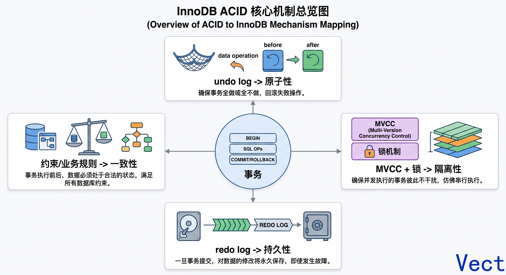
**原子性：不能半截成功**

原子性表示事务里的操作要么全部完成，要么全部不完成。

举个例子：
你在电商平台买手机。扣库存、扣余额、生成订单，这三步要么都成功，要么都失败。不能库存少了，订单没生成。

在 `tasks / outbox` 里：tasks 和 outbox 要么都创建。要么都不创建。不能只插入其中一张表。

而 InnoDB 主要通过 `undo log` 支撑回滚。可以简单理解：

- update 前，先把旧值记下来。
- insert 后，如果要回滚，就按 undo 信息删掉。
- delete 后，如果要回滚，就按 undo 信息恢复。

所以 `rollback` 不是魔法，它背后要有“后悔药”的记录。

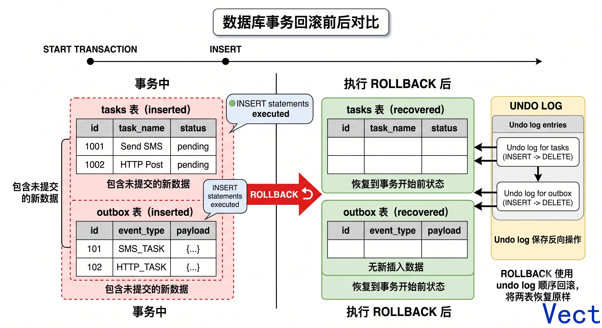

**一致性：不能破坏规则**

一致性表示事务执行前后，数据都应该处在合法状态。

不要把一致性简单理解成“数字总和不变”。银行转账可以这么理解，但业务系统里更准确的说法是：

**事务不能破坏业务规则、表约束、唯一约束、外键约束、状态流转规则。**

比如任务系统里可以有这些规则：

- 每条 outbox 记录都应该指向真实存在的 task。
- 创建任务时必须同时创建投递事件。
- 任务是 deleted 时，不能再投递 task_created。
- outbox 投递成功后不能随便回到 pending。

数据库可以帮你守住一部分规则：

```sql
primary key (id)
unique key uk_xxx (...)
foreign key (...)
not null
check (...)
```

但很多业务规则只能靠代码和事务边界保证。

一致性不是某一个单独机制保证的，而是原子性、隔离性、持久性，加上业务约束一起保证的。

**隔离性：并发时各看各的**

隔离性表示多个事务并发执行时，彼此看到的数据和互相影响的程度由隔离级别控制。

比如你和同事同时抢最后一张电影票：

- 你看到剩余 1 张。
- 同事也看到剩余 1 张。
- 你们都点购买。
- 最后不能卖出 2 张。

数据库要解决的不是“完全没人互相影响”，而是：

- 普通读能不能不挡写？
- 写写冲突谁等谁？
- 一个事务能不能看到另一个事务未提交的数据？
- 同一个事务里两次读取为什么可能不一样？

InnoDB 主要靠两类机制：

- MVCC：让普通 select 读快照，读写并发更好。
- 锁：写入和锁定读时控制冲突。

**持久性：提交了就不能轻易丢**

持久性表示事务一旦提交，修改就应该被持久保存。即使后面发生软件崩溃或硬件故障，InnoDB 也要通过日志和崩溃恢复尽量保证已提交数据不丢。

例如：你付款成功，平台给你显示订单已支付。结果平台机器重启后订单变回未支付，这就非常危险。

InnoDB 主要通过 `redo log` 保证崩溃恢复。可以粗略理解：

> 真正的数据页可能还没来得及刷回磁盘。但 redo log 已经记录了“提交事务做过哪些修改”。崩溃恢复时，InnoDB 可以根据 redo log 把已提交修改补回来。

`undo log` 更像后悔药，支持回滚和旧版本读取。

`redo log` 更像保险单，支持崩溃后重做已提交修改。

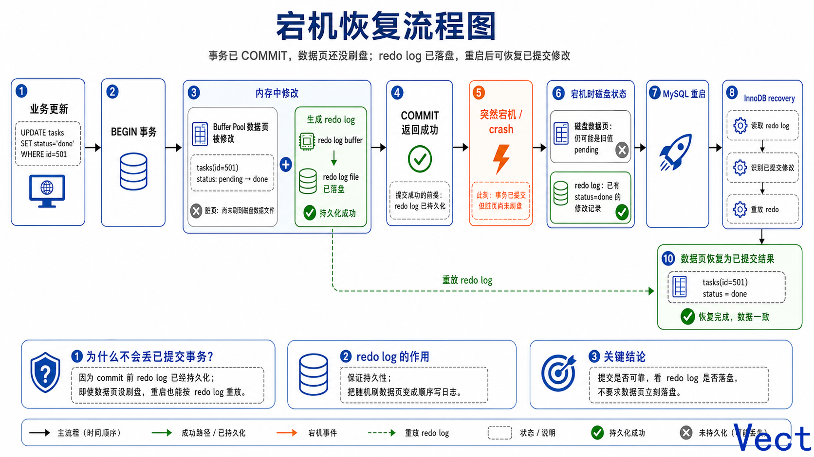

## 3. 事务控制语句

**autocommit：默认每条 SQL 自己提交**

查看当前会话是否自动提交：

```sql
select @@autocommit;
```

MySQL 默认开启 `autocommit`。

这意味着如果你不显式开启事务，每条 SQL 通常自己就是一个事务：

```sql
insert into tasks (title, status, priority)
values ('single sql transaction', 'pending', 1);
```

执行成功就自动提交。

如果你要让多条 SQL 成为一个整体，就要显式开启事务：

```sql
start transaction;

insert into tasks (title, status, priority)
values ('task with outbox', 'pending', 1);

set @task_id = last_insert_id();

insert into outbox (task_id, event_type, status)
values (@task_id, 'task_created', 'pending');

commit;
```
查询结果：
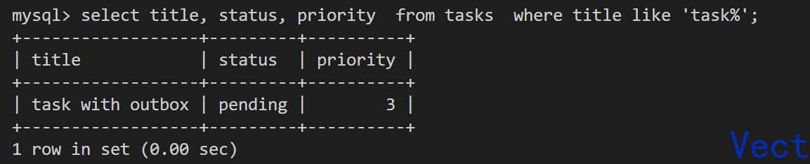

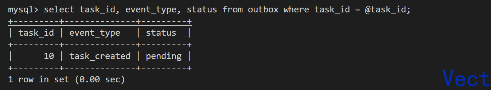
**rollback：回滚整个事务**

```sql
start transaction;

insert into tasks (title, status, priority)
values ('this task will be rolled back', 'pending', 1);

set @task_id = last_insert_id();

insert into outbox (task_id, event_type, status)
values (@task_id, 'task_created', 'pending');

rollback;
```

回滚后，这个任务和对应 outbox 都查不到:
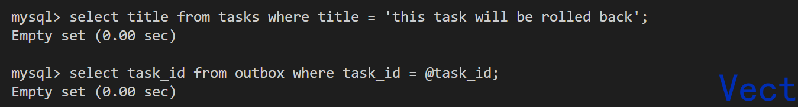

但注意：回滚不代表所有副作用都能撤销。

- 数据库里的 insert 可以回滚。
- 已经发出去的 HTTP 请求不能回滚。
- 已经推到 Redis 的消息不能自动收回。
- 已经发送给用户的短信不能当没发生。

这也是为什么事务里不要长时间调用外部系统。

**start transaction 的几个变体**

普通写事务：

```sql
start transaction read write;
```

只读事务：

```sql
start transaction read only;
```

只读事务适合报表、对账、导出这类场景。它告诉 MySQL：这个事务不打算修改数据，数据库可以做一些更合适的优化和限制。

创建一致性快照：

```sql
start transaction with consistent snapshot;
```

它的含义不是“马上锁全库”，而是让事务在开始阶段建立一致性读的快照。后面讲 MVCC 时会再说。

**savepoint：事务里的存档点**

`rollback` 是撤销整个事务。

但有时候你只想撤销事务里后半段。

例如：

```text
你在饭店点餐。
已经点了主食、饮料、甜品。
后来发现甜品点错了，你只想取消甜品，不想整单取消。
```

这就像 `savepoint`。

```sql
start transaction;

insert into tasks (title, status, priority)
values ('task with optional outbox', 'pending', 1);

set @task_id = last_insert_id();

savepoint after_task_created;

insert into outbox (task_id, event_type, status)
values (@task_id, 'task_created', 'pending');

-- 假设这里发现 outbox 参数不对，只回到存档点
rollback to savepoint after_task_created;

insert into outbox (task_id, event_type, status)
values (@task_id, 'task_created_v2', 'pending');

release savepoint after_task_created;

commit;
```
可以发现：
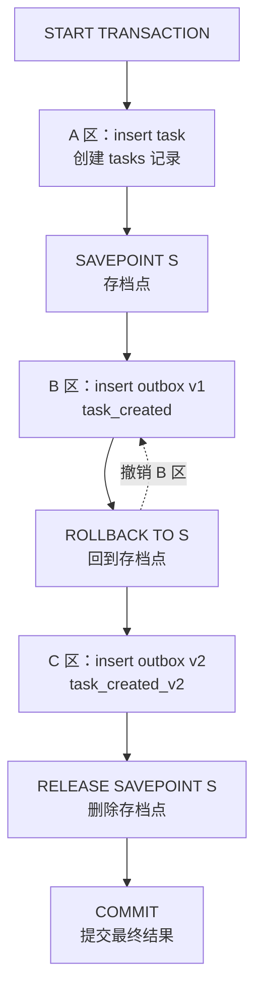
```mermaid
flowchart TD
    T["START TRANSACTION"]
    A["A 区：insert task<br>创建 tasks 记录"]
    S["SAVEPOINT S<br>存档点"]
    B["B 区：insert outbox v1<br>task_created"]
    R["ROLLBACK TO S<br>回到存档点"]
    C["C 区：insert outbox v2<br>task_created_v2"]
    X["RELEASE SAVEPOINT S<br>删除存档点"]
    M["COMMIT<br>提交最终结果"]

    T --> A --> S --> B --> R --> C --> X --> M
    R -. "撤销 B 区" .-> B
```
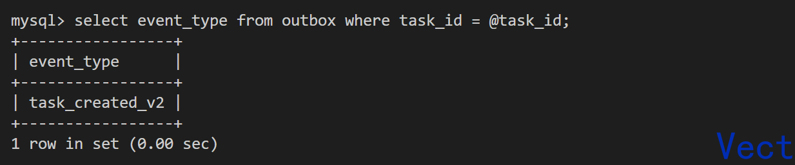
`savepoint` 适合复杂事务中的局部回滚，但别滥用。一个事务如果复杂到到处都是存档点，往往说明事务边界需要重新设计。

## 4. 并发问题和隔离级别

如果数据库永远只有一个连接、一个事务，那事务很简单。

但真实系统里是这样的：

- 用户 A 创建任务。
- 用户 B 修改任务。
- dispatcher 扫 outbox。
- 后台任务重试失败事件。
- 管理后台查询任务列表。

这些操作可能同时发生。

并发事务常见三个读现象：

| 现象 | 含义 | 生活例子 |
| --- | --- | --- |
| 脏读 | 读到别人还没提交的数据 | 别人购物车还没付款，你先把它当成已买 |
| 不可重复读 | 同一行前后读到不同值 | 你查两次余额，中间别人转了一笔钱 |
| 幻读 | 同一范围前后多出或少了行 | 老师点名两次，中间又进来一个学生 |

**read uncommitted：可能读到未提交数据**

事务 A：

```sql
start transaction;

update outbox
set status = 'sent'
where id = 1;

-- 暂时不 commit
```

事务 B：

```sql
set transaction isolation level read uncommitted;

select status from outbox where id = 1;
```

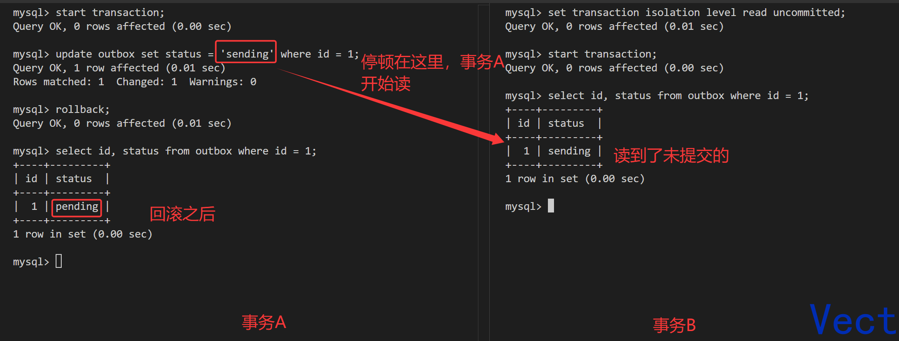

事务 B 刚才读到的就是一份从来没有真正提交过的数据———脏读

举个例子：

```text
朋友说“我准备给你转 1000 元”，你还没收到钱就把它记成收入。
结果朋友取消转账，你的账本就脏了。
```

业务系统里一般不使用这个隔离级别。

**read committed：每条查询读最新已提交快照**

`read committed` 避免了脏读。

含义是：

```text
别人提交之前，我看不到。
别人提交之后，我下一条查询可能看到。
```

事务 A：

```sql
set transaction isolation level read committed;
start transaction;

select count(*) from tasks where status = 'pending';

-- 事务 B 插入一条 pending 任务并提交

select count(*) from tasks where status = 'pending';

commit;
```

第二次 `select` 可能看到事务 B 已经提交的新任务。

这不是脏读，因为事务 B 已经提交了。
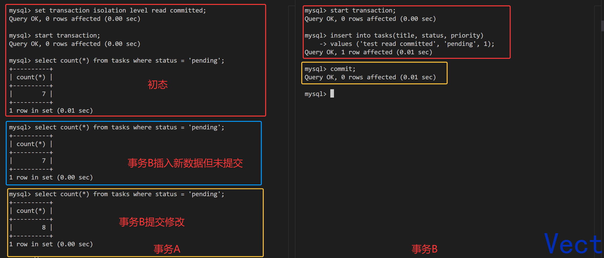

但这会带来不可重复读或幻读：

```text
同一事务里，前后两次普通 select 的结果可能不一样。
```

举个例子：

```text
你上午 10 点看群人数是 100。
10 点 05 分又看，别人已经邀请新人进群，变成 101。
你看到的都是真实已提交结果，但不是同一张快照。
```

**repeatable read：InnoDB 默认级别**

`repeatable read` 是 InnoDB 默认隔离级别。

它的核心是：

```text
同一个事务里的普通一致性读，通常读取第一次一致性读建立的快照。
```

事务 A：

```sql
set transaction isolation level repeatable read;
start transaction;

select count(*) from tasks where status = 'pending';

-- 事务 B 插入一条 pending 任务并提交

select count(*) from tasks where status = 'pending';

commit;
```

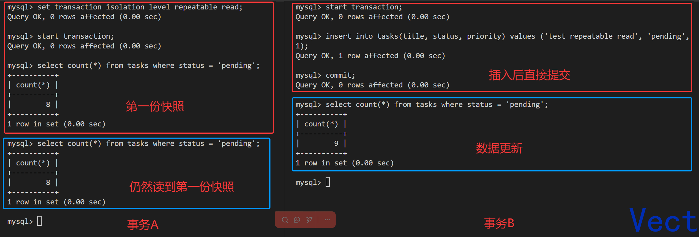

事务 A 第二次普通 `select` 通常仍然看到第一次读时的快照。

这里有两个词一定要分清：

```text
快照读：普通 select，一般不加锁，读历史快照。
当前读：update、delete、select ... for update、select ... for share，读当前最新数据，并可能加锁。
```

一句话：**快照读解决“我看到了什么”。当前读和锁解决“我能不能改，以及别人能不能插队改”。**

**serializable：最严格，但代价最高**

`serializable` 可以理解成让事务更接近排队执行。

举个例子：

```text
银行只有一个窗口。
每个人必须办完完整业务，下一个人才可以办理。
不会乱，但慢。
```

在这个级别下，并发读写冲突会更多地变成等待。它能避免脏读、不可重复读和幻读，但牺牲并发能力。

所以日常业务系统很少直接把全局隔离级别改成 `serializable`。

更常见的做法是：

```text
默认使用 repeatable read 或 read committed。
对真正需要保护的行或范围，用锁定读、唯一约束、状态机、幂等和重试来兜住。
```

## 5. MVCC 和 Read View

MVCC 是 multi-version concurrency control，多版本并发控制。

普通 `select` 如果每次都加锁，那读写会互相挡住：

```text
别人改任务标题时，管理后台不能查任务列表。
管理后台查任务列表时，dispatcher 不能更新 outbox。
```

这样并发性能会很差。

MVCC 的思路是：**一行数据可以有多个历史版本。** 普通 select 不一定读最新版本，而是读对当前事务可见的那个版本。

像图书馆借书：

```text
作者正在修改新版手稿。
读者不需要等作者改完，可以先看已经出版的旧版。
等新版正式发布后，新来的读者再看新版。
```

这就是普通读和写能并发的关键。

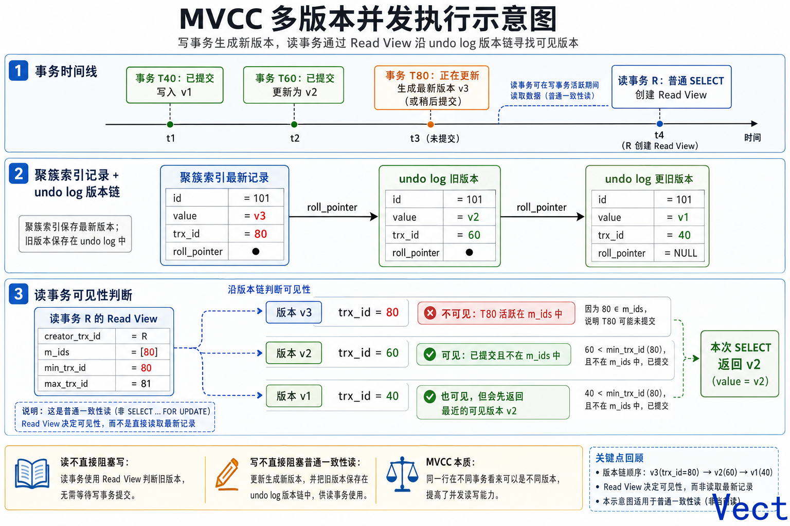

**undo log 和版本链**

当一行记录被更新时，InnoDB 不是简单覆盖完就完事。

为了支持回滚和 MVCC，它需要记录旧版本。

可以简单理解：

```text
旧版本记录放在 undo log 里。
聚簇索引记录里有指针能找到旧版本。
多个旧版本串起来，就形成版本链。
```

InnoDB 聚簇索引记录里有两个跟 MVCC 密切相关的隐藏信息：

| 隐藏信息 | 含义 |
| --- | --- |
| `trx_id` | 最近一次修改这行记录的事务 id |
| `roll_pointer` | 指向 undo log 中旧版本记录的指针 |

假设任务 `id = 10` 的标题被多次修改：

```text
最新版本：title = 'C'，trx_id = 80
    |
    v
旧版本：title = 'B'，trx_id = 60
    |
    v
更旧版本：title = 'A'，trx_id = 40
```

当某个事务读取这行时，不是直接无脑读最新版本，而是结合 Read View 判断：

1. trx_id = 80 这个版本，我能不能看？
2. 不能看，就沿着 roll_pointer 找 trx_id = 60。
3. 还不能看，就继续找 trx_id = 40。
4. 直到找到对我可见的版本。

这就是 MVCC 的核心。

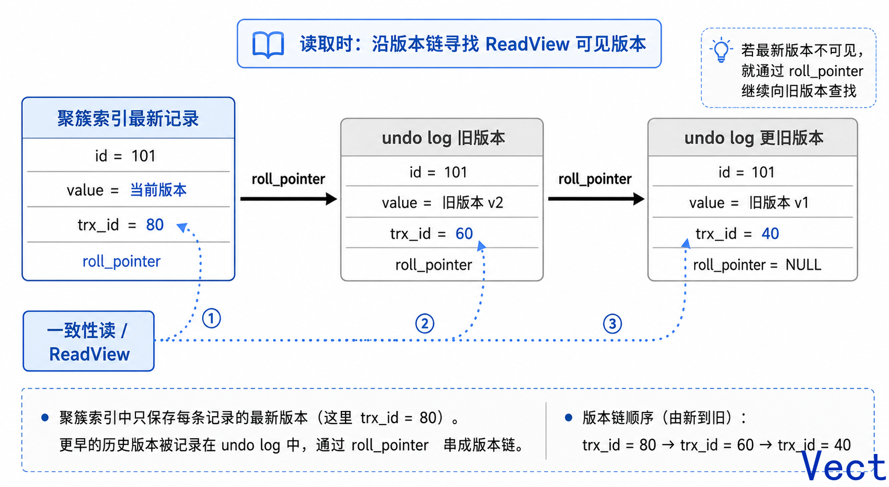

**Read View：快照到底记录了什么**

Read View 可以理解成一致性读生成的一张“可见性名单”。

它关心的是：

- 哪些事务在我创建快照时还活着？
- 哪些版本太新，不能看？
- 哪些版本已经提交，可以看？
- 我自己改的数据，当然要能看。

常见会讲到四个字段：

| 字段 | 含义 |
| --- | --- |
| `creator_trx_id` | 创建这个 Read View 的事务 id |
| `m_ids` | 创建 Read View 时仍然活跃的事务 id 列表，不包含自己 |
| `min_trx_id` | `m_ids` 里的最小事务 id |
| `max_trx_id` | 创建 Read View 时，下一个将要分配的事务 id |

判断一个记录版本是否可见，可以按这套规则理解：

```text
1. 如果 trx_id == creator_trx_id：
   这是我自己改的版本，可见。

2. 如果 trx_id < min_trx_id：
   说明这个版本在我创建快照前就已经提交，可见。

3. 如果 trx_id >= max_trx_id：
   说明这个版本对应的事务在我创建快照后才出现，不可见。

4. 如果 min_trx_id <= trx_id < max_trx_id：
   要看 trx_id 在不在 m_ids 里。
   在 m_ids 里：当时还没提交，不可见。
   不在 m_ids 里：当时已经提交，可见。
```

这套规则听起来绕，但可以用朋友圈理解。

```text
你上午 10 点打开朋友圈，系统给你生成一份时间线快照。
10 点之前已经发出来的动态，你能看到。
10 点之后才发的动态，你这份快照看不到。
10 点时还在编辑没发布的动态，你也看不到。
你自己刚发的动态，你当然能看到。
```
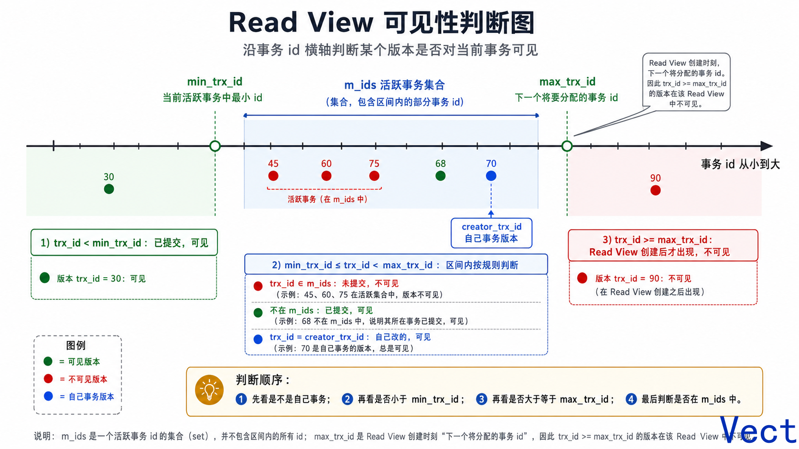

**read committed 和 repeatable read 的 MVCC 区别**

两个隔离级别都可以使用 MVCC，但生成 Read View 的时机不同。

**read committed：每条 select 一个新快照**

**事务里每执行一条普通 select，就创建一个新的 Read View。**

所以别人提交后，你下一条普通 `select` 可能就能看到。

时间线：

```text
T1：事务 A 第一次 select，创建 Read View 1，看到 pending = 10。
T2：事务 B 插入 pending 任务并 commit。
T3：事务 A 第二次 select，创建 Read View 2，看到 pending = 11。
```

这就是 `read committed` 的直觉：**每次查询都看“本次查询开始前已经提交”的数据。**

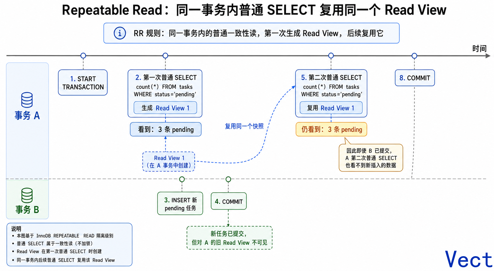

## 6. 快照读、当前读和幻读

普通 `select` 通常是一致性非锁定读，不是当前读。

例如：

```sql
start transaction;

select id, title, status
from tasks
where id = 5;

commit;
```

它像是在看一张照片。

照片拍下来的那一刻之后，别人又改了现场，你这张照片不会自动变。

但有一个重要例外：**同一个事务里，自己前面做出的修改，后续普通 select 可以看到。**

例如：

```sql
start transaction;

select status from tasks where id = 10;

update tasks
set status = 'running'
where id = 10;

select status from tasks where id = 10;

rollback;
```

第二次 `select` 能看到自己改成的 `running`。

这不是破坏快照，而是事务必须能看见自己的修改。否则你在同一个事务里刚插入一行，后面马上查不到，就没法写业务了。

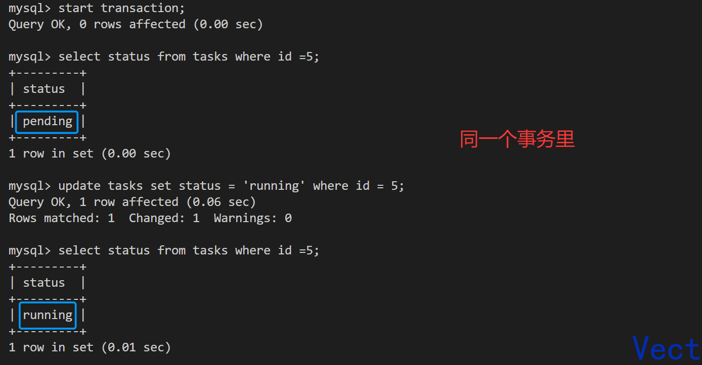

**当前读：我要看当前现场，还要可能上锁**

这些语句通常属于当前读或写操作：

```sql
select ... for update;
select ... for share;
update ...;
delete ...;
```

它们关心的是当前最新数据，而不是历史快照。

为什么？**因为它们通常要基于读到的数据继续修改。**

比如 dispatcher 抢 outbox：

```sql
start transaction;

select id, task_id, status
from outbox
where status = 'pending'
order by id
limit 1
for update;

update outbox
set status = 'sending'
where id = 101;

commit;
```

如果普通 `select` 不加锁，两个 dispatcher 可能同时看到同一条 pending 记录，然后都去投递。

`for update` 的意思是：**我要读这行，并且准备改它。别人不要同时拿到冲突的锁。**

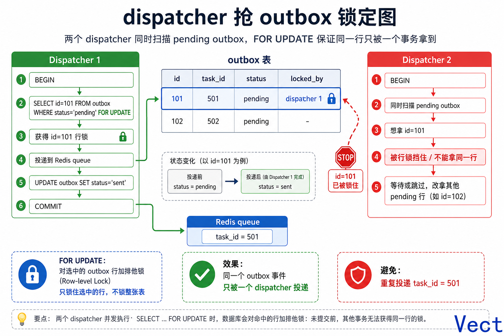

**for update 和 for share**

`select ... for update` 获取的是更强的更新意图锁，适合接下来要更新或删除的场景。

```sql
select id, status
from outbox
where id = 101
for update;
```

`select ... for share` 适合“我要确认这行存在，并且在我事务结束前不希望别人改掉它”的场景。

```sql
select id
from tasks
where id = 10
for share;
```

粗略记：

```text
for update：我要改，别人与我冲突的读写都要谨慎。
for share：我要稳定地看，别人别改坏我依赖的这行。
```

**nowait 和 skip locked**

默认遇到锁冲突时，事务会等待。但是有时候你不想等。

```sql
select id, task_id
from outbox
where status = 'pending'
order by id
limit 1
for update nowait;
```

`nowait` 的意思是：锁不到就立刻报错，不要傻等。

队列场景更常用 `skip locked`：

```sql
start transaction;

select id, task_id
from outbox
where status = 'pending'
order by id
limit 10
for update skip locked;

update outbox
set status = 'sending'
where id in (101, 102, 103);

commit;
```

`skip locked` 的意思是：遇到已经被其他事务锁住的行，就跳过，继续找后面的。

这很适合多个 dispatcher 抢任务：

- 窗口 1 正在办理 101 号。
- 窗口 2 不要站着等 101 号，直接叫 102、103、104。

但它不适合普通业务查询，因为它返回的不是完整一致的全局结果，而是主动跳过了被锁住的数据。

**幻读：为什么“查出来的行数变了”**

幻读说的是：**同一个事务里，两次执行同一个范围查询，第二次出现了第一次没有的行，或者少了第一次有的行。**

例如事务 A：

```sql
set transaction isolation level read committed;
start transaction;

select id from tasks where status = 'pending';

-- 事务 B 插入一条 pending 任务并提交

select id from tasks where status = 'pending';

commit;
```

第二次多出一条记录，这就是幻读。

举个例子：

```text
老师点名，第一次数到 30 个学生。
刚数完，门口又进来一个学生。
老师再数一次变成 31 个。
这个新出现的学生，就像幻影一样。
```

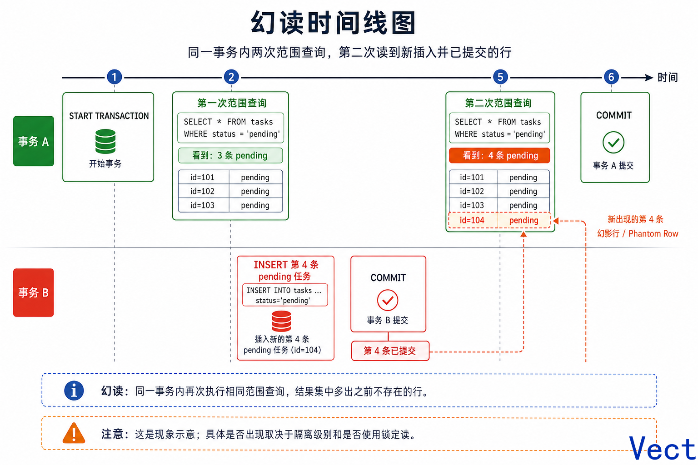

**InnoDB RR 如何避免大多数幻读**

在 InnoDB 的 `repeatable read` 下，幻读分两种情况看。

**快照读：用 MVCC 避免**

普通 `select` 是快照读。

```sql
set transaction isolation level repeatable read;
start transaction;

select id from tasks where status = 'pending';

-- 事务 B 插入一条 pending 任务并提交

select id from tasks where status = 'pending';

commit;
```

第二次普通 `select` 复用第一次 Read View，通常看不到事务 B 新插入的行。

所以快照读下，MVCC 很好地避免了幻读。

**当前读：用 next-key lock 避免**

当前读要看当前最新数据，还可能要防止别人往范围里插入。

```sql
set transaction isolation level repeatable read;
start transaction;

select id
from outbox
where status = 'pending'
order by id
limit 10
for update;

-- 事务 B 想插入新的 pending outbox，可能被阻塞

commit;
```

InnoDB 在 RR 下为了防止范围当前读出现幻读，可能使用 next-key lock。

```text
next-key lock = 记录锁 + 间隙锁
```

记录锁锁住已有记录。

间隙锁锁住记录之间的范围，防止别人往范围里插入新记录。

就像排队买票：

```text
你不只是按住当前队伍里的人。
还要守住他们之间的空位，避免别人插队。
```

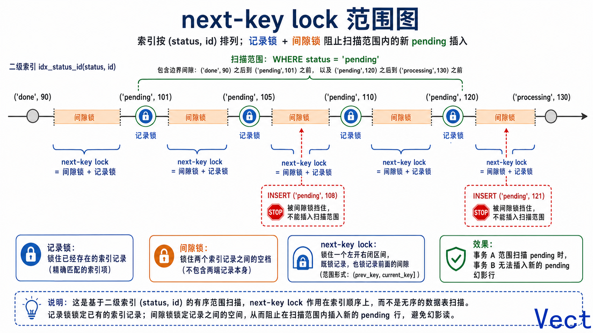

**RR 真的完全解决幻读了吗**

结论先说：**InnoDB 的 repeatable read 很大程度避免幻读，但不要理解成所有情况下绝对不会出现任何“像幻读”的结果。**

最容易困惑的是：快照读和当前读混用。

事务 A：

```sql
set transaction isolation level repeatable read;
start transaction;

select id, status
from tasks
where id = 88;

-- Empty set
```

事务 B：

```sql
start transaction;

insert into tasks (id, title, status, priority)
values (88, 'new task', 'pending', 1);

commit;
```

事务 A 继续：

```sql
update tasks
set status = 'running'
where id = 5;

select id, status
from tasks
where id = 88;
```
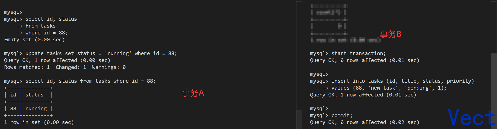

很奇怪：

```text
事务 A 第一次明明查不到 id = 88。
为什么后面 update 能更新到？
为什么再 select 又能看到？
```

原因是：

```text
第一次 select 是快照读，看的是旧快照。
update 是当前读，面向当前最新数据，可以更新事务 B 已提交的新行。
update 后，这行的 trx_id 变成事务 A 自己。
事务 A 后续普通 select 能看到自己修改过的版本。
```

所以不要把 RR 简化成“事务开始后数据库就被冻结了”。

更准确的说法是：

```text
RR 下，普通快照读稳定。
但当前读仍然面向当前最新可锁定的数据。
自己修改过的数据，对自己可见。
```

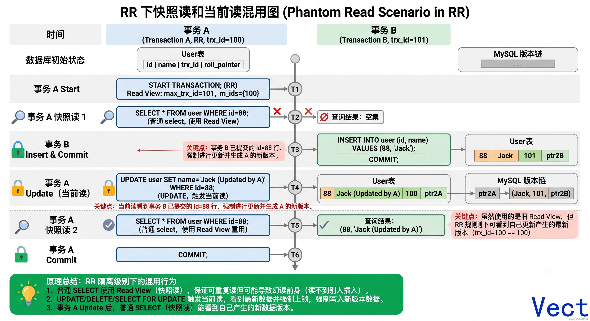

## 7. 锁、死锁和事务边界

InnoDB 加锁跟索引扫描范围强相关。

- update、delete、锁定读通常会对扫描到的索引记录或范围加锁。
- InnoDB 不会记住完整 where 条件，只知道自己扫描过哪些索引记录和范围。


所以索引在事务篇里仍然绕不开。

不是为了讲查询优化，而是为了讲：扫描越多，潜在锁越多。锁越多，并发越差。

**主键等值更新：锁范围小**

```sql
update tasks
set status = 'running'
where id = 10;
```

如果 `id` 是主键，InnoDB 通常只需要锁住这一条记录。

**范围更新：可能使用 next-key lock**

```sql
update outbox
set status = 'sending'
where status = 'pending'
  and id between 100 and 200;
```

在 `repeatable read` 下，这类范围当前读或范围更新可能使用 next-key lock。

像老师点名时，不只是按住已经进教室的人，还要看住门口，防止点名过程中有人插队进来。

**没有合适索引：可能扩大锁范围**

```sql
update outbox
set status = 'sending'
where event_type = 'task_created';
```

如果 `event_type` 没有合适索引，MySQL 可能扫描大量记录。

扫描越多，加锁范围越可能变大。

所以在事务里写 `update/delete/select ... for update` 时，一定要问自己：

```text
where 条件是否走索引？
扫描范围是否可控？
事务会持有锁多久？
能不能分批？
```

索引在这里不是单纯的性能问题，而是并发问题。

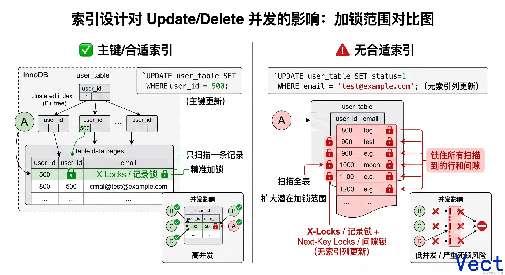

**死锁：不是 bug，是并发系统的正常风险**

死锁就是两个事务互相等对方释放锁。

举个例子：

```text
两个人过独木桥。
A 从左往右走，占住左半边。
B 从右往左走，占住右半边。
两个人都不退，就卡住了。
```

数据库里也一样。

事务 A：

```sql
start transaction;

update tasks
set status = 'running'
where id = 1;

-- 等一会儿

update outbox
set status = 'sending'
where task_id = 2;
```

事务 B：

```sql
start transaction;

update outbox
set status = 'sending'
where task_id = 2;

-- 等一会儿

update tasks
set status = 'running'
where id = 1;
```

事务 A 拿着 `tasks(id=1)` 的锁，等 `outbox(task_id=2)`。

事务 B 拿着 `outbox(task_id=2)` 的锁，等 `tasks(id=1)`。

这就是死锁。

InnoDB 会检测死锁，并回滚其中一个事务，让另一个事务继续。

所以应用层必须把死锁当成可重试错误处理：

```text
捕获死锁错误。
回滚当前事务。
短暂等待。
重新执行整个事务。
```

降低死锁概率的做法：

- 事务尽量短。
- 多个事务访问表和行的顺序尽量固定。
- where 条件走合适索引，减少扫描和锁范围。
- 不要在事务中调用慢 HTTP、Redis、消息队列。
- 批量更新拆小批。

重点：死锁不是“数据库坏了”，而是并发写入下正常可能发生的情况。正确姿势是减少概率，并且做好重试。

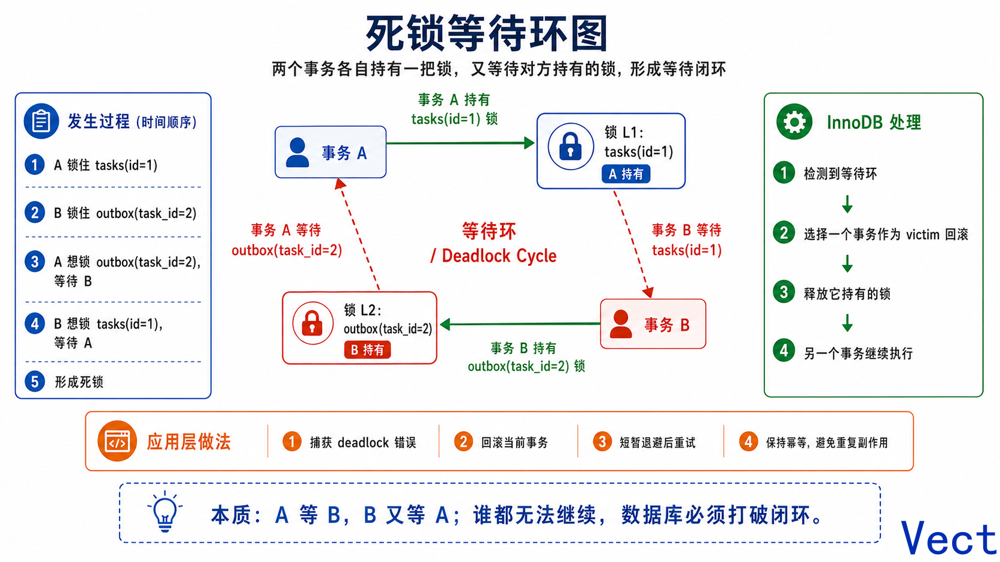

**事务越大越好吗**

不是。事务越大，问题越多：

- 持有锁时间更长。
- undo log 压力更大。
- 死锁概率更高。
- 锁等待更多。
- 崩溃恢复和回滚成本更高。

举个例子：
你去银行窗口办理业务。如果你一边占着窗口，一边打电话问家人要不要顺便办别的业务，后面排队的人都会等你。

数据库事务也是窗口。**事务应该只包住必须原子化的数据库操作。**

`tasks / outbox` 更推荐这样：

1. 事务内写 tasks 和 outbox。
2. 提交事务。
3. dispatcher 扫描 outbox。
4. 投递 Redis。
5. 投递成功后，再用短事务更新 outbox 状态。

不要这样：

1. start transaction。
2. 写 tasks。
3. 写 outbox。
4. 调 Redis。
5. 调第三方接口。
6. 发短信。
7. commit。

外部调用慢、不可控、不能随数据库回滚。把它们放在事务里，会把数据库锁长期占住。


## 8. outbox 实战

`tasks / outbox` 的核心思想是：

```text
数据库事务只保证“任务”和“投递事件”同时落库。
真正投递 Redis 由后续 dispatcher 完成。
```

创建任务：

```sql
start transaction;

insert into tasks (title, status, priority)
values ('learn transaction deeply', 'pending', 10);

set @task_id = last_insert_id();

insert into outbox (task_id, event_type, status)
values (@task_id, 'task_created', 'pending');

commit;
```

dispatcher 抢任务：

```sql
start transaction;

select id, task_id
from outbox
where status = 'pending'
order by id
limit 10
for update skip locked;

update outbox
set status = 'sending'
where id in (101, 102, 103);

commit;
```

投递成功：

```sql
update outbox
set status = 'sent'
where id = 101
  and status = 'sending';
```

投递失败：

```sql
update outbox
set status = 'pending',
    retry_count = retry_count + 1
where id = 101
  and status = 'sending';
```

这里要注意幂等：

```text
dispatcher 可能重试。
Redis 消息可能重复。
worker 处理 task 时要能识别重复。
状态更新最好带上旧状态条件。
```

事务能保证数据库内部的一致性，但不能自动保证外部系统“刚好一次”。

**外键要不要用**

看团队规范和业务场景。

使用外键的好处：

```text
数据库强制保证引用关系。
outbox.task_id 不会指向不存在的 tasks.id。
```

不使用外键的好处：

```text
跨服务、分库分表、批量导入、复杂发布流程更灵活。
```

无论是否使用外键，事务边界都不能省。

创建任务和创建 outbox 仍然应该在同一个事务里完成。

## 10. 总结

可以把 InnoDB 事务理解成四层：

```text
第一层：事务语法
start transaction / commit / rollback / savepoint / autocommit

第二层：可靠性
undo log 保证能回滚
redo log 保证提交后能恢复
约束和业务规则保证一致性

第三层：并发读取
MVCC
Read View
undo log 版本链
快照读

第四层：并发写入
当前读
行锁
间隙锁
next-key lock
死锁检测和重试
```

最后回到 `tasks / outbox`：

```text
事务保证 tasks 和 outbox 不会半截成功。
MVCC 保证普通查询不用总是挡住写入。
锁保证多个 dispatcher 不会抢到同一批任务。
next-key lock 帮助范围当前读避免插队插入。
死锁重试保证并发冲突时业务能恢复。
短事务和幂等保证系统能长期稳定跑。
```

所以，事务不是只会写：

```sql
begin;
commit;
```

而是要能回答：

```text
这组 SQL 为什么必须放一起？
它们失败时怎么撤销？
并发时读到谁的数据？
写入时锁住哪些范围？
出现死锁怎么恢复？
哪些副作用不能放进事务？
```

能把这些问题讲清楚，才算真正吃透 MySQL 事务。

**核心要点**

- 事务的第一层价值是原子性：多条 SQL 要么一起成功，要么一起失败，不能让业务停在半截状态。
- ACID 不是背概念：原子性主要靠 undo log，持久性主要靠 redo log，隔离性靠 MVCC 和锁，一致性靠约束、业务规则和前三者共同兜住。
- 隔离级别解决的是并发可见性问题；InnoDB 默认 RR 下，普通快照读通常稳定，但当前读仍然面向最新数据。
- MVCC 的核心是版本链和 Read View：普通 select 不一定读最新版本，而是读对当前事务可见的版本。
- 快照读、当前读、锁定读必须分清；很多 RR、幻读、可见性疑问，本质都是把它们混在一起了。
- 锁范围和索引扫描范围强相关，写 SQL 时不仅要看查得快不快，还要看会不会锁住太多记录。
- 死锁不是 MySQL 出 bug，而是并发写入的正常风险；正确做法是缩短事务、固定访问顺序、走合适索引，并在应用层重试。
- 事务里不要放 Redis、HTTP、短信这类外部副作用；数据库内用短事务保证一致性，外部投递用 outbox、幂等和重试解决。

## 11. 参考资料

- MySQL 8.4 Reference Manual: InnoDB Transaction Model
- MySQL 8.4 Reference Manual: Transaction Isolation Levels
- MySQL 8.4 Reference Manual: Consistent Nonlocking Reads
- MySQL 8.4 Reference Manual: Locking Reads
- MySQL 8.4 Reference Manual: autocommit, Commit, and Rollback
- MySQL 8.4 Reference Manual: SAVEPOINT, ROLLBACK TO SAVEPOINT, and RELEASE SAVEPOINT
- MySQL 8.4 Reference Manual: Statements That Cause an Implicit Commit
- MySQL 8.4 Reference Manual: Deadlocks in InnoDB
- 小林 coding：《事务隔离级别是怎么实现的？》
- 小林 coding：《MySQL 可重复读隔离级别，完全解决幻读了吗？》
- relph1119 MySQL 学习笔记：《事务简介》《事务的隔离级别与 MVCC》
