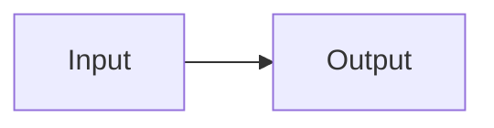

## Formula and image

Inline formula $O(1)$ and display formula:

$$
\sum_{i=1}^{n} i = \frac{n(n+1)}{2}
$$


## Table and code

| Column | Value |
| --- | --- |
| state | ready |

```sql
select class_name, avg(score)
from student_scores
group by class_name
having avg(score) > 80;
```

## Diagram


